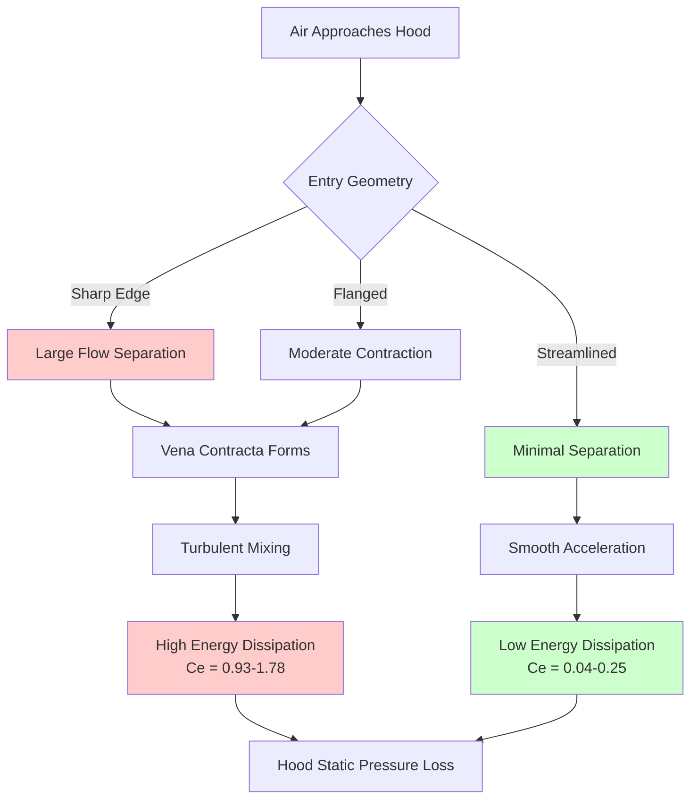

## Physical Basis of Hood Entry Losses

Hood entry losses represent the static pressure required to accelerate air from rest into the hood inlet. This acceleration loss is fundamentally an application of Bernoulli's equation, where kinetic energy gained by the air must be supplied by static pressure reduction. The magnitude of this loss depends critically on the geometry of the hood entrance, which determines the flow field and associated irreversible losses.

When air enters a hood opening, it cannot make a sharp 90-degree turn. The streamlines contract inward, forming a region of minimum flow area downstream of the entrance called the vena contracta. This contraction creates separation zones, vortices, and turbulent mixing that dissipate energy irreversibly. The entry loss coefficient quantifies these losses as a multiple of the velocity pressure at the hood face.

## Entry Loss Coefficient Fundamentals

The static pressure loss at hood entry is expressed as:

$$\Delta P_{entry} = C_e \times VP_{face}$$

where:
- $\Delta P_{entry}$ = hood entry loss (inches w.g. or Pa)
- $C_e$ = dimensionless entry loss coefficient
- $VP_{face}$ = velocity pressure at hood face opening (inches w.g. or Pa)

The velocity pressure is calculated from the face velocity:

$$VP_{face} = \left(\frac{V_{face}}{4005}\right)^2$$

for velocity in feet per minute and pressure in inches w.g., or:

$$VP_{face} = \frac{\rho V_{face}^2}{2}$$

in SI units (Pa, kg/m³, m/s).

The total hood static pressure combines entry loss with duct velocity pressure:

$$SP_{hood} = VP_{duct}\left(1 + C_e \frac{A_{duct}^2}{A_{face}^2}\right)$$

For hoods where duct area equals face area, this simplifies to:

$$SP_{hood} = VP_{duct}(1 + C_e)$$

## ACGIH Hood Entry Loss Coefficients

The American Conference of Governmental Industrial Hygienists (ACGIH) provides standardized entry loss coefficients based on extensive empirical testing. These values account for both the vena contracta effect and the hood geometry.

| Hood Type | Entry Description | Entry Loss Coefficient (Ce) | Application Notes |
|-----------|------------------|----------------------------|-------------------|
| Plain opening | Sharp edge, no flange | 0.93 | Worst case, maximum turbulence |
| Plain opening | Flanged (flange width ≥ hood diameter) | 0.49 | 47% reduction from unflanged |
| Tapered entry | 45° taper, length = 0.5D | 0.25 | Gradual acceleration reduces loss |
| Bell mouth | Radius = 0.2D or greater | 0.04 | Optimal design, minimal separation |
| Slot hood | Sharp edge, no flange, L/W > 2 | 1.78 | Highest loss due to aspect ratio |
| Slot hood | Flanged on three sides | 0.82 | Significant improvement |
| Conical entry | 60° included angle | 0.50 | Moderate streamlining |
| Streamlined plenum | Gradual contraction to duct | 0.08 | Near-optimal for large hoods |

## Vena Contracta Effect

The vena contracta forms because air streamlines have inertia and cannot instantaneously change direction. At a sharp-edged opening, the flow separates from the edge, creating a contracted jet with area approximately 0.61 to 0.65 times the geometric opening area.

The contraction coefficient is defined as:

$$C_c = \frac{A_{vena contracta}}{A_{opening}}$$

After the vena contracta, the flow must re-expand to fill the duct, creating additional turbulent mixing. The total pressure loss from contraction and re-expansion is:

$$\Delta P_{total} = \left(\frac{1}{C_c^2} - 1\right) VP_{opening}$$

For a sharp-edged circular opening with $C_c \approx 0.62$:

$$\Delta P_{total} = \left(\frac{1}{0.62^2} - 1\right) VP = 1.60 \times VP$$

This theoretical value aligns well with measured ACGIH coefficients of 0.93 to 1.78 for sharp-edged entries.

## Streamlined Entry Design Principles

Streamlined entries minimize separation by providing a gradual transition that allows streamlines to follow the hood surface. The key design parameters are:

**Bell Mouth Radius:** The optimal radius is 0.2 times the duct diameter or greater. This creates attached flow with minimal boundary layer separation. The entry coefficient drops to 0.04, representing only skin friction losses.

**Taper Angle:** For conical entries, the included angle should not exceed 60 degrees. Steeper tapers cause flow separation. A 45-degree taper with length equal to 0.5 times the diameter achieves $C_e = 0.25$.

**Flanges:** Adding a flange to a plain opening effectively increases the flow area approaching the hood, reducing the approach velocity and associated momentum change. A flange width equal to the hood diameter reduces $C_e$ from 0.93 to 0.49.

## Practical Calculation Example

Consider a 12-inch diameter hood with 2000 fpm face velocity:

**Sharp edge, no flange:**

$$VP_{face} = \left(\frac{2000}{4005}\right)^2 = 0.250 \text{ inches w.g.}$$

$$\Delta P_{entry} = 0.93 \times 0.250 = 0.233 \text{ inches w.g.}$$

**Bell mouth entry (r = 0.2D):**

$$\Delta P_{entry} = 0.04 \times 0.250 = 0.010 \text{ inches w.g.}$$

The streamlined entry reduces pressure loss by 95%, demonstrating the significant energy savings achievable through proper hood design. For a 10,000 cfm system operating continuously, this 0.223 inches w.g. reduction saves approximately 250 watts of fan power.

## Design Recommendations

Select hood entry geometry based on space constraints, cost, and energy efficiency requirements. Bell mouth entries provide optimal performance but require more fabrication. Flanged plain openings offer a cost-effective compromise with 47% loss reduction compared to unflanged sharp edges.

For slot hoods, always provide flanges on at least three sides to reduce the entry coefficient from 1.78 to 0.82. Consider tapered plenums for large capturing hoods where bell mouths are impractical.

Account for entry losses in total system static pressure calculations to ensure proper fan selection and avoid inadequate capture velocities that compromise contaminant control.
