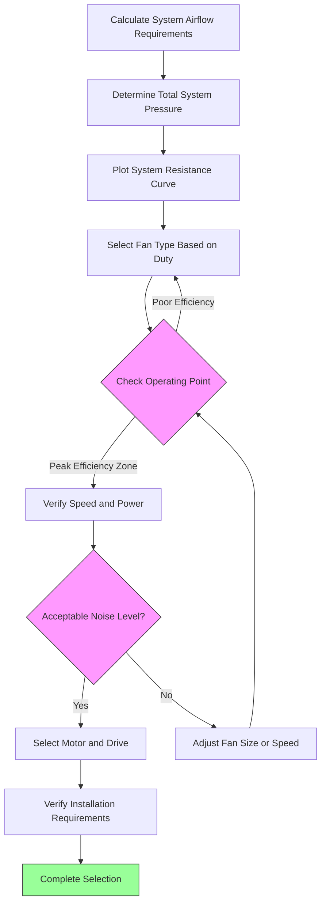

# Fan Selection for Industrial Exhaust Systems

Selecting the appropriate fan for an industrial local exhaust system requires matching fan performance characteristics to system requirements while optimizing for efficiency, noise, and operational costs. The selection process fundamentally involves finding the intersection between the system resistance curve and fan performance curve.

## System Pressure Requirements

The total system pressure that the fan must overcome consists of static and velocity pressure components throughout the entire exhaust path:

$$P_{fan} = P_{hood} + P_{duct} + P_{fittings} + P_{outlet} + P_{device}$$

where:
- $P_{hood}$ = hood entry losses
- $P_{duct}$ = friction losses in straight duct sections
- $P_{fittings}$ = losses through elbows, transitions, and branches
- $P_{outlet}$ = discharge losses
- $P_{device}$ = pressure drop across air cleaning devices

The system resistance curve follows the relationship:

$$P_{system} = K \cdot Q^2$$

where $K$ represents the system resistance coefficient and $Q$ is the volumetric flow rate. This quadratic relationship means that doubling airflow requires four times the pressure.

## Fan Performance Fundamentals

Fan performance is characterized by the relationship between static pressure developed and volumetric flow delivered. The fan operating point occurs where the fan curve intersects the system curve:

$$P_{fan}(Q) = P_{system}(Q)$$

Fan efficiency at this operating point determines power consumption:

$$\eta_{fan} = \frac{Q \cdot P_{total}}{6356 \cdot BHP}$$

where efficiency $\eta$ is expressed as a decimal, $Q$ in CFM, $P_{total}$ in inches water column, and $BHP$ is brake horsepower.

The motor power required accounts for both fan and motor efficiencies:

$$P_{motor} = \frac{Q \cdot P_{total}}{6356 \cdot \eta_{fan} \cdot \eta_{motor}}$$

## Fan Selection Process

## Fan Type Selection Criteria

Different fan configurations offer distinct advantages for industrial exhaust applications:

| Fan Type | Pressure Range | Efficiency | Particulate Handling | Space Requirements | Typical Applications |
|----------|---------------|------------|---------------------|-------------------|---------------------|
| **Backward Inclined Centrifugal** | 4-15 in. wc | 75-85% | Light dust only | Large | Clean air, high efficiency required |
| **Radial Blade Centrifugal** | 6-20 in. wc | 60-70% | Excellent | Medium | Heavy dust, abrasive materials |
| **Forward Curved Centrifugal** | 2-8 in. wc | 55-65% | Poor | Compact | Low pressure, clean air |
| **Tube Axial** | 1-6 in. wc | 65-75% | Light only | Minimal | In-line mounting, space constrained |
| **Vane Axial** | 2-10 in. wc | 70-80% | Light only | Minimal | Higher pressure inline applications |
| **Plug Fan** | 3-12 in. wc | 70-82% | Moderate | Very compact | Rooftop, limited space |

## AMCA Standards Application

AMCA Standard 210 defines standardized testing procedures for fan performance rating. Key considerations include:

**System Effect Factors**: Installation conditions that deviate from ideal test conditions create additional resistance. AMCA 201 provides system effect curves that must be added to calculated system pressure:

$$P_{design} = P_{calculated} + SEF$$

where $SEF$ is the system effect factor accounting for inlet/outlet restrictions, poor flow distribution, and swirl.

**Fan Operating Range**: Select fans to operate between 50-80% of wide-open flow for stability. Operation near shutoff or free delivery results in unstable performance and excessive noise.

**Temperature Correction**: Fan performance ratings assume standard air (70°F, 0.075 lb/ft³). For elevated temperatures common in industrial exhaust:

$$P_{actual} = P_{standard} \cdot \frac{\rho_{actual}}{\rho_{standard}}$$

$$BHP_{actual} = BHP_{standard} \cdot \frac{\rho_{actual}}{\rho_{standard}}$$

## Efficiency Optimization

Peak fan efficiency typically occurs at 75-85% of maximum airflow. Operating at this point minimizes energy consumption:

$$Energy_{annual} = BHP \cdot 0.746 \cdot hours_{operation} \cdot cost_{kWh}$$

A 5% improvement in fan efficiency on a 50 HP fan operating 4,000 hours annually at $0.12/kWh saves approximately $900/year.

## Particulate Loading Considerations

Industrial exhaust containing particulates requires specific fan configurations:

- **Radial blade fans**: Self-cleaning action prevents buildup
- **Open impellers**: Easier maintenance and cleaning access
- **Abrasion-resistant construction**: Hardened coatings or replaceable wear liners
- **Explosion-proof construction**: Required for combustible dust per NFPA 652

Material buildup on fan blades creates imbalance and shifts the operating point. Design for periodic inspection and cleaning based on contaminant concentration.

## Selection Safety Factors

Apply appropriate safety factors to account for system uncertainties:

- **Airflow**: 10-15% above calculated requirement
- **Pressure**: 15-20% above calculated system resistance
- **Motor**: Next standard size above calculated horsepower

These factors prevent under-sizing but should not be excessive, as over-sized fans operate inefficiently and generate unnecessary noise.

The fan selection process requires balancing competing priorities: initial cost, operating efficiency, maintenance requirements, noise generation, and physical constraints. Proper selection based on rigorous system analysis ensures reliable, efficient operation throughout the system lifecycle.
