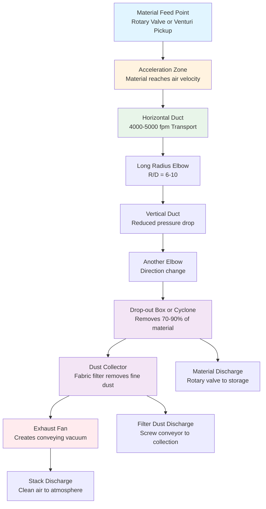

# Pneumatic Material Conveying Systems

Pneumatic conveying systems transport bulk solid materials through closed ducts using air as the conveying medium. These systems combine material handling with dust containment, providing crucial industrial exhaust functionality while moving materials from process to process. Transport velocity must exceed the critical saltation velocity to prevent particle settling in horizontal runs, typically requiring 3500-5500 fpm depending on material density and particle characteristics. System design involves balancing air-to-material loading ratios, managing pressure drop through acceleration zones and friction losses, and integrating dust collection equipment to separate conveyed material from transport air.

## Pneumatic Conveying Fundamentals

### Transport Mechanisms

Material transport in pneumatic systems depends on maintaining sufficient air velocity to suspend and convey particles. The physics involves drag force overcoming gravitational settling and particle-wall interactions.

**Particle drag force in turbulent flow:**

$$F_D = \frac{1}{2} \times C_D \times \rho_a \times A_p \times (V_{air} - V_{particle})^2$$

Where:
- $F_D$ = Drag force (lbf)
- $C_D$ = Drag coefficient (dimensionless, 0.4-0.5 for spheres in turbulent flow)
- $\rho_a$ = Air density (lb/ft³, standard = 0.075 lb/ft³)
- $A_p$ = Particle projected area (ft²)
- $V_{air}$ = Air velocity (ft/s)
- $V_{particle}$ = Particle velocity (ft/s)

**Gravitational force on particle:**

$$F_G = m_p \times g = \frac{\pi \times d_p^3}{6} \times \rho_p \times g$$

Where:
- $m_p$ = Particle mass (lb)
- $g$ = Gravitational acceleration (32.2 ft/s²)
- $d_p$ = Particle diameter (ft)
- $\rho_p$ = Particle density (lb/ft³)

At equilibrium (terminal velocity), drag force equals gravitational force. For vertical transport, air velocity must exceed particle terminal velocity. For horizontal transport, saltation velocity accounts for additional particle-wall interactions.

### Terminal Velocity Calculation

Terminal velocity represents the falling speed at which drag force equals gravitational force for a particle in still air.

$$V_t = \sqrt{\frac{4 \times g \times d_p \times (\rho_p - \rho_a)}{3 \times C_D \times \rho_a}}$$

Where:
- $V_t$ = Terminal velocity (ft/s)
- $g$ = 32.2 ft/s²
- $d_p$ = Particle diameter (ft)
- $\rho_p$ = Particle density (lb/ft³)
- $\rho_a$ = Air density (0.075 lb/ft³ at standard conditions)
- $C_D$ = Drag coefficient (0.44 for spheres at Re > 1000)

**Practical terminal velocities:**

| Material | Particle Density (lb/ft³) | Particle Size (μm) | Terminal Velocity (fpm) |
|----------|---------------------------|-------------------|-------------------------|
| Flour dust | 45 | 50 | 180 |
| Wood dust | 40 | 100 | 320 |
| Cement dust | 94 | 50 | 280 |
| Sand | 165 | 200 | 1400 |
| Metal chips (steel) | 490 | 1000 | 3800 |
| Grain (wheat) | 48 | 3000 | 2200 |

Terminal velocity determines minimum air velocity for vertical transport. Horizontal transport requires significantly higher velocities due to saltation phenomenon.

### Conveying Modes

**Dilute Phase Conveying:**
- Velocity: 3500-6000 fpm
- Solid loading: 0.1-15 lb material per lb air
- Material fully suspended throughout transport
- Continuous, uniform flow
- Application: Most dry bulk materials, dusty operations
- Advantages: Simple equipment, multiple pickup points, self-cleaning
- Disadvantages: Higher air consumption, particle degradation at high velocity

**Dense Phase Conveying:**
- Velocity: 800-3000 fpm
- Solid loading: 15-200 lb material per lb air
- Material forms moving slugs, plugs, or dunes
- Intermittent or pulsed flow
- Application: Fragile materials, abrasive materials, high tonnage over short distance
- Advantages: Reduced air volume, lower particle degradation, reduced elbow wear
- Disadvantages: Specialized equipment, limited to free-flowing materials, complex controls

ACGIH Industrial Ventilation Manual emphasizes dilute phase systems for industrial dust control applications where material transport coincides with exhaust ventilation requirements.

## Saltation Velocity

### Definition and Critical Importance

Saltation velocity ($V_{salt}$) represents the minimum air velocity in horizontal ducts required to prevent particle settling and deposition. Below saltation velocity, particles drop from suspension, accumulating in the duct bottom. This accumulation reduces effective flow area, increases pressure drop, and can lead to complete blockage.

**Saltation characteristics:**
- Occurs primarily in horizontal and slightly inclined ducts
- Velocity 3-15 times higher than terminal velocity
- Depends on particle density, size distribution, shape, and duct diameter
- Material-specific based on flow characteristics and cohesiveness

### Saltation Velocity Calculations

**Rizk empirical correlation (widely used for industrial applications):**

$$V_{salt} = FL \times \sqrt{2 \times g \times D} \times \left(\frac{\rho_p}{\rho_a}\right)^{0.35}$$

Where:
- $V_{salt}$ = Saltation velocity (ft/s)
- $FL$ = Froude-loading factor (dimensionless, 1.0-3.5)
- $g$ = 32.2 ft/s²
- $D$ = Duct diameter (ft)
- $\rho_p$ = Particle material density (lb/ft³)
- $\rho_a$ = Air density (0.075 lb/ft³)

**Alternative correlation (Rabinovich-Kalman) for finer materials:**

$$V_{salt} = 7.0 \times \sqrt{g \times D} \times \left(\frac{\rho_p}{\rho_a}\right)^{0.25} \times \left(\frac{d_{50}}{D}\right)^{0.15}$$

Where:
- $d_{50}$ = Median particle diameter (ft)
- Other terms as previously defined

**Froude-loading factor selection:**

| Material Category | FL Factor | Characteristics | Examples |
|-------------------|-----------|-----------------|----------|
| Very light, fluffy | 1.0-1.5 | Low density, high surface area, cohesive | Flour, starch, plastic powder, cotton lint |
| Light granular | 1.5-2.0 | Low density, free-flowing | Grain, sugar, salt, wood pellets |
| Medium density | 2.0-2.5 | Moderate density, angular particles | Sand, cement, fly ash, ground limestone |
| Heavy, abrasive | 2.5-3.5 | High density, hard particles | Metal chips, foundry sand, mineral ore |

### ACGIH Recommended Transport Velocities

ACGIH Industrial Ventilation Manual (Table 5-2) provides minimum transport velocities incorporating safety factors above saltation for various material categories:

| Material Description | Minimum Velocity (fpm) | Typical Applications |
|---------------------|------------------------|----------------------|
| Gases, vapors, smoke | 1000-2000 | Welding fume, thermal processes |
| Fine light dust | 3000-3500 | Fabric lint, paper dust, light plastic dust |
| Dry dust and powders | 3500-4000 | Flour, cement, grain dust, wood sanding dust |
| Average industrial dust | 4000-4500 | Grinding dust, buffing dust, machining operations |
| Heavy dust, small chips | 4500-5000 | Metal turnings, heavy grinding, silica dust |
| Heavy or moist dust | 5000-5500 | Lead dust, moist cement, foundry operations |

**Design approach:** Use ACGIH recommended velocities as initial values, verify against calculated saltation velocity, and apply 10-20% safety margin for critical applications or materials with wide particle size distributions.

### Pickup Velocity

Pickup velocity represents the minimum air velocity required to entrain stationary particles from a surface or hopper into the air stream. This occurs at material feed points and is distinct from transport velocity.

**Pickup velocity calculation (empirical):**

$$V_{pickup} = K_{pickup} \times \sqrt{\frac{\rho_p}{\rho_a}} \times \sqrt{g \times d_p}$$

Where:
- $V_{pickup}$ = Pickup velocity (ft/s)
- $K_{pickup}$ = Pickup coefficient (1.5-3.0, higher for cohesive materials)
- $\rho_p$ = Particle density (lb/ft³)
- $\rho_a$ = Air density (0.075 lb/ft³)
- $g$ = 32.2 ft/s²
- $d_p$ = Characteristic particle diameter (ft)

**Pickup velocity typically 150-200% of saltation velocity.**

**Pickup hood design velocities:**

| Material Type | Pickup Velocity (fpm) | Hood Face Velocity (fpm) |
|---------------|----------------------|--------------------------|
| Fine dust (stationary) | 3500-4500 | 150-250 |
| Loose dust in motion | 4000-5000 | 200-350 |
| Heavy dust, chips | 5000-6000 | 300-500 |
| Moving bulk material | 5500-7000 | 400-600 |

Pickup hoods transition from low capture velocity at the hood face to full transport velocity in the duct, requiring acceleration length of 10-20 duct diameters.

## Dilute Phase vs. Dense Phase Design

### Dilute Phase Characteristics

**Operating parameters:**
- Air velocity: 3500-6000 fpm
- Solids loading ratio: 0.1-15 lb material/lb air
- Phase ratio (by weight): typically 1:1 to 15:1
- Pressure drop: 2-15 in wg per 100 ft equivalent
- Material velocity: 70-85% of air velocity

**Advantages:**
- Simple system design and control
- Multiple pickup and discharge points easily accommodated
- Self-cleaning operation prevents material buildup
- Suitable for wide range of materials
- Vertical and horizontal runs without limitation
- Standard industrial components

**Disadvantages:**
- High air consumption (large duct, fan, and dust collector)
- Particle degradation from high velocity impacts
- Elbow wear in abrasive service
- Higher operating costs (fan power)

**Typical applications:**
- Wood dust collection and conveying
- Grain handling facilities
- Plastic pellet transfer
- Powder coating operations
- Cement and fly ash handling
- General industrial dust control

### Dense Phase Characteristics

**Operating parameters:**
- Air velocity: 800-3000 fpm (sub-saltation in horizontal runs)
- Solids loading ratio: 15-200 lb material/lb air
- Phase ratio: 15:1 to 200:1
- Pressure drop: 15-50 psi (very high)
- Material velocity: 10-50% of air velocity
- Transport mode: Slug flow, plug flow, or dune flow

**Advantages:**
- Reduced air consumption (smaller fan and dust collector)
- Minimal particle degradation
- Reduced elbow and duct wear
- Lower noise levels
- Reduced product contamination

**Disadvantages:**
- Complex control systems (pressure sensing, pulsing)
- Limited to free-flowing, non-cohesive materials
- Specialized equipment (high-pressure blowers, blow tanks)
- Single pickup and discharge (batch operation)
- Requires extensive testing for each material
- Higher capital cost

**Typical applications:**
- Fragile food products (crackers, cereals)
- Pharmaceutical powders
- Plastic pellets and resins
- Abrasive materials (alumina, silica)
- High-tonnage cement transfer

## Pressure Drop Estimation

### Total System Pressure Drop

Total pressure drop through pneumatic conveying system includes multiple components:

$$\Delta P_{total} = \Delta P_{accel} + \Delta P_{air} + \Delta P_{material} + \Delta P_{fittings} + \Delta P_{collector}$$

Each component contributes to the overall static pressure requirement for fan selection.

### Acceleration Pressure Drop

Material entering the air stream must be accelerated from rest (or low velocity) to transport velocity. This acceleration consumes energy and creates pressure drop.

$$\Delta P_{accel} = \frac{\rho_a \times V^2}{2 \times g_c} \times \left(1 + \frac{\dot{m}_{material}}{\dot{m}_{air}}\right)$$

Where:
- $\Delta P_{accel}$ = Acceleration pressure drop (in wg)
- $\rho_a$ = Air density (0.075 lb/ft³)
- $V$ = Transport velocity (ft/s)
- $g_c$ = Gravitational constant (32.2 lbm·ft/lbf·s²)
- $\dot{m}_{material}$ = Material mass flow rate (lb/hr)
- $\dot{m}_{air}$ = Air mass flow rate (lb/hr)

**Typical acceleration pressure drop: 0.5-2.5 in wg**

Higher loading ratios increase acceleration pressure proportionally.

### Air Friction Pressure Drop

Empty duct air friction calculated using Darcy-Weisbach equation:

$$\Delta P_{air} = f \times \frac{L}{D} \times \frac{\rho_a \times V^2}{2 \times g_c} \times \frac{1}{12}$$

Where:
- $\Delta P_{air}$ = Air friction loss (in wg)
- $f$ = Darcy friction factor (dimensionless)
- $L$ = Duct length (ft)
- $D$ = Duct diameter (ft)
- $V$ = Air velocity (ft/s)
- Factor of 12 converts from in H₂O to in wg

**Friction factor for turbulent flow (Re > 4000):**

$$f = \frac{0.25}{\left[\log_{10}\left(\frac{\varepsilon}{3.7D} + \frac{5.74}{Re^{0.9}}\right)\right]^2}$$

For commercial steel duct with $\varepsilon$ = 0.00015 ft and high Reynolds number, $f \approx 0.022$

**Simplified for conveying air at 4000 fpm in steel duct:**

| Duct Diameter (inches) | Pressure Drop (in wg per 100 ft) |
|------------------------|----------------------------------|
| 4 | 3.2 |
| 6 | 1.8 |
| 8 | 1.1 |
| 10 | 0.75 |
| 12 | 0.55 |

### Material Friction Pressure Drop

Particles in the air stream increase friction through particle-wall collisions and increased turbulence. Material friction is empirically estimated as multiplier on air friction:

$$\Delta P_{material} = \phi \times \Delta P_{air}$$

Where:
- $\phi$ = Material friction multiplier (dimensionless)

**Material friction multipliers:**

| Loading Ratio (material:air by weight) | Friction Multiplier (φ) |
|----------------------------------------|-------------------------|
| 0.5:1 (very dilute) | 1.2 |
| 1:1 (light loading) | 1.5 |
| 3:1 (medium loading) | 2.0 |
| 5:1 (medium-heavy loading) | 2.5 |
| 10:1 (heavy loading) | 3.5 |
| 15:1 (very heavy loading) | 5.0 |

**Combined air and material horizontal duct pressure drop (empirical):**

| Material Type | Velocity (fpm) | Pressure Drop (in wg per 100 ft) |
|---------------|----------------|----------------------------------|
| Light dust (flour, starch) | 3500 | 2-3 |
| Wood dust and chips | 4000 | 3-5 |
| Grain, plastics | 4000 | 4-6 |
| Sand, cement | 4500 | 5-8 |
| Heavy minerals | 5000 | 8-12 |
| Metal chips, dense materials | 5500 | 10-15 |

Vertical duct pressure drop is 60-75% of horizontal values due to reduced particle-wall interaction.

### Fitting Pressure Drop

Elbows, tees, and reducers create additional pressure drop through turbulence and direction change.

**Elbow pressure drop:**

$$\Delta P_{elbow} = K_{elbow} \times \frac{\rho_a \times V^2}{2 \times g_c} \times \frac{1}{12}$$

Where:
- $K_{elbow}$ = Elbow loss coefficient (dimensionless)

**Elbow loss coefficients:**

| Elbow Type | R/D Ratio | Clean Air K | Material-Laden K |
|------------|-----------|-------------|------------------|
| Short radius | 1.5 | 0.5 | 1.5-3.0 |
| Standard radius | 3.0 | 0.4 | 1.2-2.5 |
| Long radius | 6.0 | 0.25 | 0.8-1.5 |
| Extra-long radius | 10.0 | 0.15 | 0.5-1.0 |

At 4000 fpm, single short-radius elbow creates 0.8-1.5 in wg pressure drop in material-laden flow.

**Design practice:** Use long-radius elbows (R/D ≥ 6) to minimize both pressure drop and abrasive wear. Each elbow doubles as maintenance concern for abrasive materials.

### Total System Pressure Drop Example

**System configuration:**
- 80 ft horizontal duct, 8-inch diameter
- 30 ft vertical duct, 8-inch diameter
- 4 long-radius elbows (R/D = 6)
- Transport velocity: 4500 fpm
- Material: Sand at 800 lb/hr
- Air flow: 1700 cfm (air mass = 7650 lb/hr)
- Loading ratio: 800/7650 = 0.104 (light loading)

**Calculations:**

1. Acceleration: 1.2 in wg
2. Horizontal duct: 80 ft × 0.06 in wg/ft = 4.8 in wg
3. Vertical duct: 30 ft × 0.04 in wg/ft = 1.2 in wg
4. Elbows: 4 × 1.0 in wg = 4.0 in wg
5. Dust collector: 5.5 in wg (assumed)

**Total: 16.7 in wg**

Add 15% safety factor: 19.2 in wg design pressure

## Heavy vs. Light Material Transport

### Material Classification

**Light materials:**
- Particle density: <100 lb/ft³
- Bulk density: <30 lb/ft³
- Examples: Wood dust, flour, plastic powder, grain dust
- Terminal velocity: 200-800 fpm
- Transport velocity: 3500-4000 fpm
- Pressure drop: 2-5 in wg per 100 ft

**Medium materials:**
- Particle density: 100-200 lb/ft³
- Bulk density: 30-80 lb/ft³
- Examples: Sand, cement, grain kernels, plastic pellets
- Terminal velocity: 500-1500 fpm
- Transport velocity: 4000-4500 fpm
- Pressure drop: 4-8 in wg per 100 ft

**Heavy materials:**
- Particle density: >200 lb/ft³
- Bulk density: >80 lb/ft³
- Examples: Metal chips, mineral ore, foundry sand
- Terminal velocity: 1000-2500 fpm
- Transport velocity: 4500-5500 fpm
- Pressure drop: 7-15 in wg per 100 ft

### Transport Velocity by Material Type

| Material | Density (lb/ft³) | ACGIH Min Velocity (fpm) | Design Velocity (fpm) |
|----------|------------------|--------------------------|----------------------|
| Aluminum dust | 168 | 4500 | 5000 |
| Asbestos dust | 94 | 4000 | 4500 |
| Cement dust | 94 | 3500 | 4000 |
| Coal dust | 75 | 4000 | 4500 |
| Cotton lint | 25 | 3000 | 3500 |
| Flour | 45 | 3500 | 4000 |
| Grain dust | 48 | 3500 | 4000 |
| Granite dust | 166 | 4500 | 5000 |
| Iron ore dust | 250 | 5000 | 5500 |
| Lead dust | 710 | 5500 | 6000 |
| Limestone dust | 168 | 4000 | 4500 |
| Metal chips (steel) | 490 | 5000 | 5500 |
| Plastic dust (PVC) | 87 | 3500 | 4000 |
| Sand | 165 | 4500 | 5000 |
| Sawdust (wood) | 22 | 3500 | 4000 |
| Silica dust | 165 | 4500 | 5000 |
| Starch | 50 | 3500 | 4000 |
| Sugar | 94 | 3500 | 4000 |

Design velocities include 10-15% safety factor above minimum ACGIH recommendations.

### Abrasive Material Considerations

Heavy, abrasive materials cause severe wear on duct and fittings, particularly at elbows.

**Elbow wear rate relationship:**

$$\text{Wear rate} \propto V^3$$

Doubling velocity increases wear by factor of 8. This creates design conflict: higher velocity needed for transport, but causes exponentially increased wear.

**Wear mitigation strategies:**

1. **Long-radius elbows:** R/D = 6-10 reduces impact velocity
2. **Wear-back elbows:** Extended outlet allows material cushion to form, protecting elbow
3. **Tangential entry:** Material enters elbow tangentially, reducing impact
4. **Abrasion-resistant materials:**
   - AR400 or AR500 steel (400-500 Brinell hardness)
   - Ceramic tile lining in critical areas
   - Rubber lining (flexible, absorbs impact)
   - Replaceable wear plates at impact zones
5. **Reduced velocity:** Use largest practical duct diameter to minimize velocity while maintaining saltation

**Elbow life expectancy:**

| Material | Velocity (fpm) | Standard Elbow Life | Long-Radius Elbow Life |
|----------|----------------|---------------------|------------------------|
| Wood dust | 4000 | 10+ years | 20+ years |
| Sand | 4500 | 6-18 months | 2-4 years |
| Steel shot | 5000 | 1-6 months | 6-12 months |
| Mineral ore | 5500 | 1-3 months | 3-9 months |

## Integration with Dust Collection

### System Configuration Options

**Negative pressure (vacuum) systems:**
- Fan downstream of dust collector
- Material pickup under negative pressure (vacuum)
- Multiple pickup points readily accommodated
- Contained operation—no fugitive dust from leaks
- Dirty air through dust collector, clean air through fan
- Most common configuration for industrial applications

**Positive pressure (pressure) systems:**
- Fan upstream of material entry
- Material and air pressurized throughout
- Simple fan selection (handles clean air only)
- Single pickup point applications
- Risk of fugitive dust emissions from any leak
- Less common except for specialized applications

**Combined systems:**
- Negative pressure pickup and conveying
- Positive pressure discharge from dust collector
- Optimizes fan placement and dust control

### Air-to-Cloth Ratio Selection

Fabric filter (baghouse or cartridge collector) sizing depends on air-to-cloth ratio, which determines required filter area for given airflow.

$$A_{filter} = \frac{Q}{V_{AC}}$$

Where:
- $A_{filter}$ = Required filter cloth area (ft²)
- $Q$ = Airflow rate (cfm)
- $V_{AC}$ = Air-to-cloth ratio (fpm)

**Air-to-cloth ratios by material:**

| Dust Characteristics | Air-to-Cloth Ratio (fpm) | Filter Type | Cleaning Method |
|----------------------|--------------------------|-------------|-----------------|
| Light, non-abrasive (flour, starch) | 10-12 | Polyester felt | Pulse-jet |
| Wood dust, general | 8-10 | Polyester felt | Pulse-jet |
| Fine, high-loading (cement) | 6-8 | Pleated cartridge | Pulse-jet |
| Abrasive dust (sand, silica) | 5-7 | Polyester felt | Pulse-jet |
| Very fine, sticky | 4-6 | PTFE membrane | Pulse-jet |
| Heavy loading (foundry) | 3-5 | Heavy-duty woven | Reverse-air |

Lower air-to-cloth ratios increase filter area (higher cost) but reduce filter differential pressure and extend filter life.

**Filter differential pressure:** Typically 4-6 in wg when clean, increases to 6-8 in wg when dirty. Automatic cleaning triggered at high differential setpoint.

### Cyclone Pre-separation

Installing cyclone ahead of fabric filter provides benefits for heavy-loading applications:

**Cyclone efficiency (particles > 10 μm):**
- Standard cyclone: 70-85% collection
- High-efficiency cyclone: 85-95% collection

**Benefits:**
- Reduces filter dust loading by 70-90%
- Extends filter cleaning intervals
- Reduces filter wear from abrasive particles
- Separates bulk material from fine dust for separate collection
- Reduces overall system pressure drop (lower filter loading)

**Cyclone pressure drop:** 3-6 in wg depending on inlet velocity (3000-4000 fpm)

**System pressure balance with cyclone:**

Material → Cyclone (3-5 in wg) → Bulk discharge
↓
Fine dust → Filter (4-6 in wg) → Fine dust discharge
↓
Clean air → Fan → Stack

Total collector pressure: 7-11 in wg versus 8-12 in wg for filter alone, but with significantly reduced filter loading.

## Design Procedure

### Step-by-Step Design Process

**1. Define material properties:**
- Particle density (ρₚ)
- Particle size distribution (d₁₀, d₅₀, d₉₀)
- Bulk density
- Moisture content
- Abrasiveness index
- Flowability characteristics
- Dust explosion characteristics (if combustible)

**2. Determine material flow rate:**
- Production rate (lb/hr or tons/hr)
- Peak vs. average flow
- Continuous or batch operation
- Required capacity factor

**3. Select transport velocity:**
- Reference ACGIH Table 5-2 for material category
- Calculate saltation velocity using Rizk equation
- Select higher of: ACGIH recommendation or 1.2 × saltation velocity
- Add 10-15% safety factor for critical applications

**4. Calculate required duct diameter:**

$$D = \sqrt{\frac{4 \times Q}{\pi \times V \times 60}}$$

Where Q is airflow (cfm), V is velocity (ft/s)

Round to next standard duct size.

**5. Verify air-to-material loading ratio:**

$$\text{Loading ratio} = \frac{\dot{m}_{material}}{\dot{m}_{air}} = \frac{\dot{m}_{material}}{Q \times \rho_a \times 60}$$

Confirm ratio falls within acceptable range (0.1-15 for dilute phase).

**6. Calculate system pressure drop:**
- Acceleration: 0.5-2.5 in wg
- Horizontal duct: 3-12 in wg per 100 ft × length
- Vertical duct: 2-8 in wg per 100 ft × length
- Elbows: 0.5-1.5 in wg each
- Cyclone (if used): 3-6 in wg
- Dust collector: 5-8 in wg
- Discharge duct: 1-2 in wg

**7. Select fan:**
- Type: Backward-inclined or pressure blower
- Flow rate: Calculated cfm + 5-10% margin
- Pressure: Total system SP + 15% margin
- Material: Abrasion-resistant if handling dirty air
- Drive: VFD for system balancing and energy management

**8. Design controls and safety systems:**
- Airflow monitoring and low-flow alarm
- Material flow detection
- Filter differential pressure monitoring
- Emergency shutdown interlocks
- Explosion protection (if combustible dust)

## Standards and References

**ACGIH Industrial Ventilation Manual:**
- Chapter 5: Local Exhaust Ventilation
- Table 5-2: Minimum Duct Velocities for Industrial Materials
- Duct design procedures for particulate-laden flows

**NFPA 654: Standard for the Prevention of Fire and Dust Explosions from the Manufacturing, Processing, and Handling of Combustible Particulate Solids:**
- Requirements for conveying combustible dusts
- Explosion protection and prevention
- Housekeeping and system maintenance

**Pneumatic Conveying Design Guide (David Mills):**
- Detailed phase diagrams and design procedures
- Material characterization methods
- Pressure drop correlations

**SMACNA HVAC Systems Duct Design:**
- Duct construction standards
- Support and bracing requirements
- Sealing and leak testing

**ASHRAE Handbook - HVAC Applications:**
- Chapter on industrial exhaust systems
- Material handling fundamentals

## Safety and Operational Considerations

**Combustible dust hazards:**
- Materials with Kst > 0 can deflagrate
- Requires explosion venting, suppression, or isolation
- Minimum ignition energy and temperature determine controls
- Grounding and bonding prevents static ignition
- Nitrogen inerting for extreme hazards

**Operational monitoring:**
- Continuous airflow measurement verifies adequate transport velocity
- Differential pressure across system segments detects plugging
- Material flow switches confirm product movement
- Filter differential pressure triggers cleaning cycles
- Vibration monitoring on fans and rotary valves

**Maintenance requirements:**
- Inspect elbows monthly for wear in abrasive service
- Replace filters on schedule or when pressure exceeds limits
- Verify rotary valve operation and seal integrity
- Clean dropout boxes and cyclone discharge regularly
- Inspect duct interior annually for buildup or damage

Properly designed pneumatic conveying systems provide reliable, contained material transport integrated with effective dust collection, ensuring both production efficiency and worker safety.
