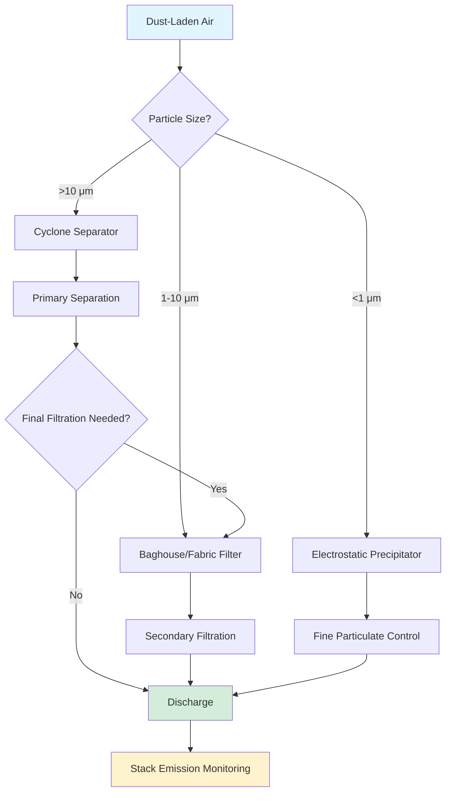

## Fundamental Principles of Dust Collection

Dust collection systems remove airborne particulate matter through mechanical separation, leveraging particle inertia, gravitational settling, filtration, or electrostatic attraction. The effectiveness of separation depends on particle size distribution, gas velocity, collection mechanism, and system pressure drop characteristics.

### Physical Mechanisms

Four primary separation mechanisms govern dust collection:

**Inertial separation** occurs when particle mass prevents trajectory changes with the carrier gas stream. Effectiveness increases with particle size and gas velocity changes. Cyclones exploit this principle through centrifugal acceleration.

**Gravitational settling** separates particles based on terminal velocity. The Stokes settling velocity for spherical particles in the laminar regime:

$$V_s = \frac{d_p^2(\rho_p - \rho_g)g}{18\mu}$$

Where:
- $V_s$ = settling velocity (m/s)
- $d_p$ = particle diameter (m)
- $\rho_p$ = particle density (kg/m³)
- $\rho_g$ = gas density (kg/m³)
- $g$ = gravitational acceleration (9.81 m/s²)
- $\mu$ = gas dynamic viscosity (Pa·s)

**Filtration** captures particles through interception, impaction, and diffusion as gas passes through fibrous media. Submicron particles exhibit Brownian motion, enhancing capture through diffusion.

**Electrostatic precipitation** charges particles and attracts them to grounded collection plates. This mechanism excels for fine particulate with high resistivity.

## System Sizing and Performance

### Airflow Requirements

Calculate required airflow from hood capture velocity and open area:

$$Q = V_c \times A_{hood} \times 60$$

Where:
- $Q$ = volumetric flow rate (CFM)
- $V_c$ = capture velocity (ft/min, per ACGIH tables)
- $A_{hood}$ = hood face area (ft²)

ACGIH Industrial Ventilation Manual specifies capture velocities:
- Low toxicity, low generation rate: 50-100 ft/min
- Moderate toxicity, moderate generation: 100-200 ft/min
- High toxicity, high generation: 200-500 ft/min

### Pressure Drop Calculation

Total system pressure drop determines fan power requirements:

$$\Delta P_{total} = \Delta P_{hood} + \Delta P_{duct} + \Delta P_{collector} + \Delta P_{discharge}$$

Duct pressure drop for circular ducts:

$$\Delta P_{duct} = f \times \frac{L}{D} \times \frac{\rho V^2}{2}$$

Where:
- $f$ = friction factor (from Moody diagram or Colebrook equation)
- $L$ = duct length (ft)
- $D$ = duct diameter (ft)
- $\rho$ = air density (lb/ft³)
- $V$ = velocity (ft/s)

### Collector Sizing

**Fabric filter area** based on air-to-cloth ratio:

$$A_{cloth} = \frac{Q}{A/C}$$

Where $A/C$ = air-to-cloth ratio (CFM/ft²), typically 2-6 for standard baghouses, 6-12 for pulse-jet collectors.

**Cyclone diameter** from Lapple design method for 50% cut diameter:

$$d_{50} = \sqrt{\frac{9\mu W}{2\pi N_e V_i (\rho_p - \rho_g)}}$$

Where:
- $d_{50}$ = particle diameter collected at 50% efficiency (m)
- $W$ = inlet width (m)
- $N_e$ = effective turns (typically 5)
- $V_i$ = inlet velocity (m/s)

## Collector Type Selection

### Comparative Performance

| Collector Type | Particle Range | Efficiency | Pressure Drop | Capital Cost | Operating Cost |
|----------------|----------------|------------|---------------|--------------|----------------|
| Gravity Settler | >50 μm | 40-60% | 0.1-0.5 "WC | Low | Very Low |
| Cyclone | >10 μm | 70-90% | 2-6 "WC | Low | Low |
| Multiple Cyclone | >5 μm | 80-95% | 3-8 "WC | Moderate | Low |
| Baghouse (Shaker) | >1 μm | 99-99.9% | 4-8 "WC | Moderate | Moderate |
| Baghouse (Pulse-Jet) | >0.5 μm | 99.9%+ | 5-10 "WC | High | Moderate |
| Cartridge Collector | >0.3 μm | 99.9%+ | 4-8 "WC | Moderate-High | Moderate |
| Electrostatic Precipitator | >0.1 μm | 95-99.9% | 0.2-1 "WC | Very High | Low-Moderate |
| Wet Scrubber | >1 μm | 90-99% | 4-12 "WC | High | High |

### Selection Criteria

**Cyclones** provide economical primary separation for coarse particulate. Use as pre-collectors upstream of final filters to reduce filter loading. Efficiency degrades rapidly below 10 μm.

**Baghouses** offer high efficiency across broad particle ranges. Fabric selection depends on temperature (maximum 260°C for fiberglass, 200°C for polyester), chemical compatibility, and moisture content. Pulse-jet designs provide continuous operation with on-line cleaning.

**Cartridge collectors** suit moderate dust loads with space constraints. Pleated media increases surface area per unit volume compared to bags.

**Electrostatic precipitators** handle high temperatures and large volumes economically but require significant installation space and electrical infrastructure.

## Code Compliance and Safety

### NFPA Standards

**NFPA 654: Standard for Prevention of Fire and Dust Explosions** mandates:
- Explosion venting or suppression for collectors handling combustible dust
- Maximum surface dust accumulation <1/32" in occupied areas
- Bonding and grounding of metallic components
- Spark detection and extinguishing for high-risk operations

Minimum explosion vent area from empirical formula:

$$A_v = C \times V^{2/3}$$

Where:
- $A_v$ = vent area (ft²)
- $C$ = vent coefficient (0.1-0.2 depending on dust)
- $V$ = vessel volume (ft³)

### ACGIH Guidelines

Industrial Ventilation Manual Chapter 5 provides hood design, minimum duct velocities to prevent settling, and system balancing procedures. Minimum transport velocities for common materials:
- Light dust (flour, wood): 3,500-4,000 ft/min
- Dry, fine dust (cement, plastic): 4,000-4,500 ft/min
- Heavy or moist dust (metal, lead): 4,500-5,000 ft/min

Transport velocity below these thresholds causes material saltation and duct blockage.

### Design Pressure for Explosion Protection

Collectors handling combustible dust require structural design pressure rating. Typical explosion pressures:
- Agricultural dust: 80-120 psig
- Metal dust: 100-150 psig
- Coal dust: 90-110 psig

Design pressure typically set at 1.5× maximum expected explosion pressure or minimum 15 psig per NFPA 68.

## Performance Optimization

**Filter cleaning frequency** affects pressure drop and efficiency. Excessive cleaning damages media and wastes compressed air. Optimize cleaning based on pressure differential setpoints (typically 4-6 "WC for pulse-jet systems).

**Hopper design** prevents bridging and ratholing. Minimum hopper angle:

$$\theta_{min} = \phi + 10°$$

Where $\phi$ = angle of repose for the dust (typically 30-50° for powders).

**Inlet design** distributes flow uniformly across filter elements. Poor distribution causes localized overloading and premature filter failure. Perforated plates or turning vanes achieve velocity uniformity within ±15%.

Proper dust collection system design requires integrated analysis of particle characteristics, collection mechanism selection, structural safety considerations, and regulatory compliance to achieve reliable, efficient particulate control.
