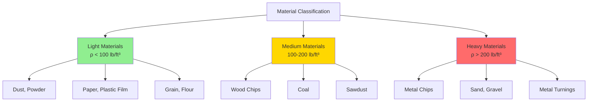

## Physical Principles of Material Classification

Material classification in pneumatic conveying systems depends fundamentally on particle density, size distribution, and aerodynamic behavior. The distinction between heavy and light materials determines transport velocity requirements, system pressure drop, and equipment selection.

**Particle density** governs the gravitational force that opposes pneumatic transport. Heavy materials (metal chips, sand, gravel) require higher air velocities to maintain suspension, while light materials (dust, paper fibers, plastic film) remain airborne at lower velocities. The critical parameter is the ratio of gravitational settling force to aerodynamic drag force.

### Material Density Classification

## Transport Velocity Calculations

The minimum transport velocity prevents particle settling (saltation) in horizontal ducts. This velocity must overcome gravitational settling while providing sufficient drag force to maintain particle suspension.

### Minimum Transport Velocity by Material Density

For horizontal pneumatic conveying, the minimum transport velocity follows:

$$V_{min} = K \sqrt{\frac{2 g d_p (\rho_p - \rho_a)}{\rho_a C_D}}$$

Where:
- $V_{min}$ = minimum transport velocity (ft/min)
- $K$ = safety factor (1.5-2.0 typical)
- $g$ = gravitational acceleration (32.2 ft/s²)
- $d_p$ = particle diameter (ft)
- $\rho_p$ = particle density (lb/ft³)
- $\rho_a$ = air density (0.075 lb/ft³ at STP)
- $C_D$ = particle drag coefficient (dimensionless)

### Simplified Transport Velocity Estimation

For practical engineering, ACGIH Industrial Ventilation Manual provides density-based correlations:

$$V_{transport} = V_{base} \left(\frac{\rho_p}{\rho_{ref}}\right)^{0.5}$$

Where:
- $V_{base}$ = reference velocity for standard material (3500-4500 ft/min)
- $\rho_{ref}$ = reference density (typically 100 lb/ft³)
- Exponent = 0.5 for turbulent flow regime

### Pressure Drop Relationship

Total system pressure drop includes acceleration, friction, and lifting components:

$$\Delta P_{total} = \Delta P_{acc} + \Delta P_{friction} + \Delta P_{gravity}$$

For heavy materials, the gravitational component dominates vertical runs:

$$\Delta P_{gravity} = \frac{\rho_p \cdot m_{ratio} \cdot H}{5.2}$$

Where:
- $H$ = vertical lift height (ft)
- $m_{ratio}$ = material-to-air mass ratio (dimensionless)

## System Design Comparison

| Parameter | Light Materials | Heavy Materials |
|-----------|-----------------|-----------------|
| **Particle Density** | < 100 lb/ft³ | > 200 lb/ft³ |
| **Transport Velocity** | 3,000-4,000 ft/min | 4,500-6,000 ft/min |
| **Material Loading** | 5-15 lb material/lb air | 1-5 lb material/lb air |
| **Pressure Drop** | 4-8 in. w.g. per 100 ft | 8-15 in. w.g. per 100 ft |
| **Bend Radius** | 2-3 duct diameters | 5-8 duct diameters |
| **Wear Considerations** | Minimal abrasion | Severe abrasion potential |
| **Pickup Velocity** | 3,500-4,500 ft/min | 4,500-5,500 ft/min |
| **Blower Type** | Centrifugal fan adequate | High-pressure blower required |
| **Power Consumption** | 0.5-1.5 HP per 1000 cfm | 2-4 HP per 1000 cfm |

## Engineering Considerations

**Heavy Material Systems** require robust construction to withstand abrasive wear. Duct velocities must remain above saltation velocity throughout the system to prevent material deposition and plugging. Vertical sections require velocity increases of 1000-1500 ft/min above horizontal transport velocity to maintain material suspension against gravity.

**Light Material Systems** operate efficiently at lower velocities, reducing energy consumption and wear. However, electrostatic charging becomes problematic with very fine, dry materials. Grounding and humidity control may be necessary to prevent material adhesion to duct walls.

### Material-to-Air Ratio Selection

The material loading significantly affects system performance. Heavy materials transport best in dilute phase (low loading ratio) to maintain adequate air velocity for suspension. Light materials can operate in dense phase (high loading ratio) at reduced velocities, improving energy efficiency.

$$m_{ratio} = \frac{W_{material}}{W_{air}} = \frac{\text{lb material/min}}{\text{lb air/min}}$$

Typical ranges:
- Light materials: 5-15 (dense phase possible)
- Heavy materials: 1-5 (dilute phase required)

## Standards and Guidelines

Industrial pneumatic conveying system design follows established standards:

- **ACGIH Industrial Ventilation Manual**: Provides minimum transport velocities for various materials
- **NFPA 654**: Combustible dust handling requirements for light organic materials
- **ASME B31.9**: Piping standards for pneumatic conveying systems
- **ASHRAE Fundamentals**: Duct design friction loss calculations

The Air Movement and Control Association (AMCA) provides fan selection guidelines for material handling applications, emphasizing the relationship between system resistance and material loading ratio.

## System Optimization

Achieving optimal performance requires balancing transport velocity, material loading, and energy consumption. Excessive velocity increases wear and operating cost without improving material handling capacity. Insufficient velocity causes saltation, system plugging, and reduced throughput.

**Pickup hood velocity** must exceed minimum transport velocity by 500-1000 ft/min to ensure complete material capture at the source. Heavy materials require higher pickup velocities due to greater inertia and reduced response to airflow direction changes.

Monitoring system performance through pressure drop measurement and material flow rate verification ensures operation within design parameters. Deviations indicate potential wear, leakage, or material characteristic changes requiring system adjustment.
