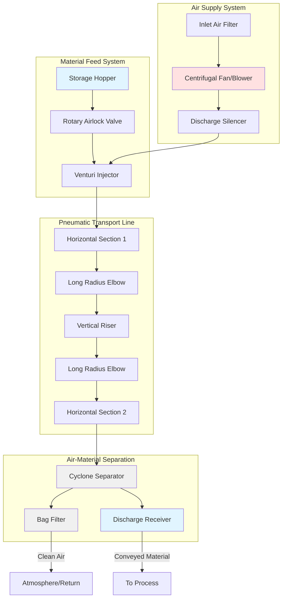

# Pneumatic Conveying Systems

Pneumatic conveying uses air velocity and differential pressure to transport bulk solid materials through ductwork. This method integrates material handling with local exhaust ventilation, providing simultaneous particle capture and transport while maintaining process hygiene and worker safety.

## Fundamental Transport Mechanisms

Pneumatic conveying operates through momentum transfer from air to solid particles. The carrier air must provide sufficient drag force to overcome particle weight, friction against duct walls, and internal particle collisions. Two distinct regimes exist based on solids loading ratio and transport velocity.

### Dilute Phase Conveying

Dilute phase systems suspend particles fully in the airstream, maintaining velocities well above saltation. The solid-to-air mass ratio (loading ratio) typically ranges from 0 to 15 kg solid per kg air. High velocities (15-30 m/s) ensure particles remain airborne throughout the transport line.

The minimum transport velocity prevents particle settling. For horizontal runs, the saltation velocity represents the critical threshold below which particles begin to settle and form dunes on the duct bottom:

$$V_{salt} = F_p \sqrt{\frac{2gD(\rho_p - \rho_a)}{\rho_a C_D}}$$

Where:
- $V_{salt}$ = saltation velocity (m/s)
- $F_p$ = particle shape factor (1.0-1.5)
- $g$ = gravitational acceleration (9.81 m/s²)
- $D$ = particle diameter (m)
- $\rho_p$ = particle density (kg/m³)
- $\rho_a$ = air density (kg/m³)
- $C_D$ = drag coefficient (dimensionless)

Operating velocity must exceed saltation velocity by 25-50% to prevent deposition during flow variations.

### Dense Phase Conveying

Dense phase systems transport materials at velocities below suspension velocity, moving material as a series of plugs or sliding beds. Loading ratios reach 15-100 kg solid per kg air, dramatically reducing air consumption and particle degradation. This regime suits friable materials and long transport distances but requires specialized equipment and careful system design.

## Pressure Drop Analysis

Total system pressure drop includes acceleration losses, friction losses, and gravitational lift components:

$$\Delta P_{total} = \Delta P_{acc} + \Delta P_{fric} + \Delta P_{elev}$$

**Acceleration Pressure Drop:**

$$\Delta P_{acc} = \frac{\dot{m}_s V_s}{A}$$

Where $\dot{m}_s$ is solids mass flow rate (kg/s), $V_s$ is particle velocity (m/s), and $A$ is duct cross-sectional area (m²).

**Friction Pressure Drop (horizontal sections):**

$$\Delta P_{fric} = \frac{f L}{D} \cdot \frac{\rho_a V^2}{2} \left(1 + \mu \phi \frac{\rho_p}{\rho_a}\right)$$

Where:
- $f$ = Darcy friction factor
- $L$ = duct length (m)
- $D$ = duct diameter (m)
- $\mu$ = particle-wall friction coefficient
- $\phi$ = solids loading ratio (kg solid/kg air)

**Vertical Lift Pressure Drop:**

$$\Delta P_{elev} = g H \left(\rho_a + \phi \rho_p\right)$$

Where $H$ is vertical lift height (m).

The total pressure requirement determines blower selection. System curves must account for variations in material properties, humidity, and temperature effects on air density.

## System Configuration Comparison

| Parameter | Dilute Phase | Dense Phase |
|-----------|--------------|-------------|
| Air velocity | 15-30 m/s | 3-10 m/s |
| Loading ratio | 0-15 kg/kg | 15-100 kg/kg |
| Pressure range | 15-70 kPa | 100-700 kPa |
| Air consumption | High | Low |
| Particle degradation | Moderate-High | Low |
| Equipment complexity | Simple | Complex |
| Material suitability | Most materials | Friable, abrasive |
| Transport distance | Short-Medium | Medium-Long |
| Power consumption | 0.8-1.5 kW per t/h | 0.3-0.8 kW per t/h |

## Design Procedure

**1. Material Characterization**

Measure particle size distribution, bulk density, angle of repose, moisture content, and abrasiveness. These properties govern system configuration and operating parameters.

**2. Transport Requirements**

Establish mass flow rate (kg/h), transport distance (horizontal and vertical), number of bends, and feed/discharge elevations.

**3. Conveying Mode Selection**

Select dilute phase for general applications with non-friable materials and moderate distances. Choose dense phase for fragile materials, abrasive materials, or long transport runs where reduced air velocity minimizes degradation and wear.

**4. Velocity Determination**

Calculate saltation velocity using material properties. Set design velocity at 1.3-1.5 times saltation velocity for horizontal sections. Vertical sections require higher velocities (minimum 13-16 m/s for fine materials, 18-25 m/s for coarse materials).

**5. Duct Sizing**

$$A = \frac{\dot{m}_a}{\rho_a V}$$

Where $\dot{m}_a$ is air mass flow rate. Select standard pipe sizes, preferring schedule 40 or heavier for abrasive materials.

**6. Pressure Drop Calculation**

Sum acceleration, friction, and elevation components for each system section. Add fitting losses using equivalent length method or loss coefficients.

**7. Blower Selection**

Size rotary positive displacement blowers for dense phase or centrifugal fans for dilute phase based on total pressure requirement and volumetric flow rate. Include 10-15% safety margin.

## Design Standards and Guidelines

**ASHRAE Industrial Ventilation Manual** provides velocity guidelines for various materials. **NFPA 654** addresses combustible dust hazards in pneumatic systems, requiring explosion venting, inerting, or suppression for explosive dusts.

**ASME MH16.1** establishes pneumatic conveying terminology and classifications. System designers must also consult **HI Standards** for blower selection and **SMACNA HVAC Duct Construction Standards** for ductwork fabrication requirements.

Minimize bends to reduce pressure drop and wear. Use long-radius elbows with centerline radius of at least 5 diameters. Vertical-to-horizontal elbows experience the highest wear rates and may require replaceable wear backs or ceramic linings.

## Material-Specific Considerations

**Fine powders** (< 100 μm) exhibit cohesive behavior and may bridge in feed hoppers. Aeration or mechanical agitation prevents flow interruption.

**Hygroscopic materials** require dehumidified transport air to prevent moisture absorption and plugging.

**Abrasive materials** necessitate wear-resistant elbows, increased wall thickness, and lower conveying velocities when feasible.

**Explosive dusts** demand comprehensive explosion protection including bonding, grounding, explosion venting, and possible inerting with nitrogen.

## Operational Optimization

Monitor pressure differential across transport sections to detect incipient plugging. Sudden pressure increases indicate partial blockage requiring immediate shutdown and clearing. Gradual pressure increases over time signal duct wear or material property changes.

Maintain consistent feed rate using gravimetric or volumetric feeders. Flow variations cause velocity fluctuations that may drop below saltation threshold, initiating deposition cascades.

Regularly inspect elbows, especially at directional changes, for wear patterns indicating excessive velocity or improper material flow. Replace worn sections before perforation occurs.

---

*This content reflects pneumatic conveying engineering practices and design methodologies current through January 2025.*
