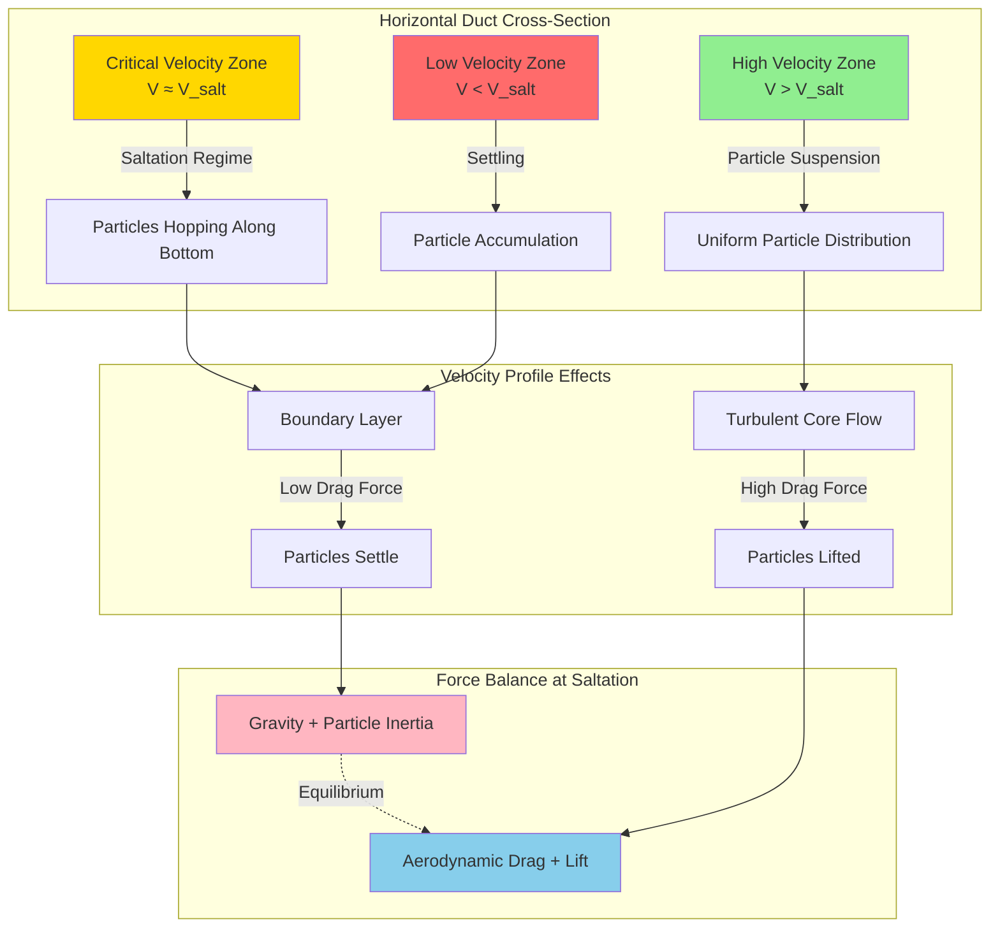

## Physical Principles of Saltation Velocity

Saltation velocity represents the minimum air velocity required to maintain solid particles in suspension within a horizontal duct. Below this critical velocity, particles settle and accumulate on the duct bottom, leading to blockages, increased pressure drop, and potential system failure. The term "saltation" derives from the Latin *saltare* (to jump), describing the characteristic hopping motion particles exhibit at velocities near the transport threshold.

The phenomenon involves a dynamic balance between gravitational settling forces and aerodynamic lift and drag forces. Three distinct flow regimes characterize particle transport:

1. **Suspension flow** - Particles fully suspended in the airstream at velocities above saltation velocity
2. **Saltation flow** - Particles intermittently contact the duct bottom, hopping along in a discontinuous pattern
3. **Settled flow** - Particles accumulate as a stationary bed, eventually blocking the duct

Understanding saltation velocity is fundamental to industrial local exhaust ventilation (LEV) design for material handling applications, including dust collection, chip removal, and bulk material transport.

## Force Balance and Theoretical Development

The saltation velocity depends on the balance between particle drag force, gravitational force, and turbulent lift. For a spherical particle in horizontal flow, the critical condition occurs when the vertical component of turbulent fluctuations equals the particle settling velocity.

The drag force on a particle is:

$$F_D = C_D \frac{\pi d_p^2}{4} \frac{\rho_a V^2}{2}$$

Where:
- $C_D$ = drag coefficient (dimensionless)
- $d_p$ = particle diameter (m)
- $\rho_a$ = air density (kg/m³)
- $V$ = air velocity (m/s)

The gravitational force is:

$$F_g = \frac{\pi d_p^3}{6} (\rho_p - \rho_a) g$$

Where:
- $\rho_p$ = particle density (kg/m³)
- $g$ = gravitational acceleration (9.81 m/s²)

The terminal settling velocity in still air is derived from force equilibrium:

$$V_t = \sqrt{\frac{4 g d_p (\rho_p - \rho_a)}{3 C_D \rho_a}}$$

## Saltation Velocity Correlations

Multiple empirical correlations exist for predicting saltation velocity. The most widely used relationship, derived from experimental data, is:

$$V_{salt} = K \sqrt{\frac{g D (\rho_p - \rho_a)}{\rho_a}}$$

Where:
- $V_{salt}$ = saltation velocity (m/s)
- $K$ = empirical constant (typically 1.3-2.5 depending on particle characteristics)
- $D$ = duct diameter (m)
- $\rho_p$ = particle density (kg/m³)
- $\rho_a$ = air density (kg/m³)

For engineering design, the ACGIH Industrial Ventilation Manual provides a modified form accounting for particle size:

$$V_{salt} = 1.3 \sqrt{2 g d_p \frac{\rho_p}{\rho_a}} + C$$

Where $C$ is a correction factor ranging from 0.3 to 0.6 m/s based on particle sphericity and surface roughness.

A more sophisticated approach incorporates the Froude number:

$$Fr = \frac{V^2}{g D}$$

Saltation occurs when:

$$Fr \approx 1.5 \sqrt{\frac{\rho_p}{\rho_a}}$$

## Material-Specific Saltation Velocities

Design velocities must exceed saltation velocity by a safety margin of 20-50% to ensure reliable transport under varying conditions.

| Material | Particle Density (kg/m³) | Particle Size (μm) | Saltation Velocity (m/s) | Design Velocity (m/s) |
|----------|--------------------------|--------------------|--------------------------|-----------------------|
| Sawdust | 200-400 | 500-2000 | 12-15 | 15-20 |
| Wood chips | 400-600 | 5000-15000 | 18-23 | 23-28 |
| Coal dust | 1200-1500 | 50-500 | 15-18 | 20-23 |
| Metal chips (steel) | 7850 | 1000-5000 | 25-30 | 30-38 |
| Plastic pellets | 900-1100 | 3000-6000 | 18-22 | 23-28 |
| Sand | 2650 | 100-1000 | 20-25 | 25-30 |
| Grain dust | 600-800 | 50-200 | 15-18 | 18-23 |
| Aluminum chips | 2700 | 1000-3000 | 20-25 | 25-30 |

*Reference: ACGIH Industrial Ventilation Manual, 30th Edition*

## Particle Transport Mechanics in Ducts

## Design Considerations and Safety Factors

Several factors influence the required design velocity beyond theoretical saltation calculations:

**Particle characteristics:**
- **Shape** - Angular particles require 10-15% higher velocities than spherical particles
- **Size distribution** - Presence of fine particles reduces required velocity; large particles increase it
- **Moisture content** - Wet materials exhibit particle cohesion, requiring 20-30% higher velocities
- **Abrasiveness** - Higher velocities increase wear; balance transport reliability with equipment longevity

**System geometry:**
- **Duct orientation** - Vertical ducts require lower velocities due to gravity assistance
- **Bend radius** - Sharp bends cause particle dropout; maintain R/D > 2.5
- **Duct diameter changes** - Avoid abrupt expansions that reduce velocity below saltation threshold

**Operating conditions:**
- **Temperature** - Affects air density and viscosity; correct calculations for non-standard conditions
- **Altitude** - Reduced air density at elevation requires higher velocities
- **Humidity** - Minimal effect on gas-phase properties but affects particle behavior

**Safety margins:**
- Light, fluffy materials: 20-30% above calculated saltation velocity
- Dense, angular materials: 40-50% above calculated saltation velocity
- Systems with long horizontal runs: 50% margin to accommodate pressure variations

The ACGIH Industrial Ventilation Manual (Section 5: Exhaust System Design) provides detailed guidance on minimum transport velocities and recommends field verification through observation during commissioning.

## Practical Verification Methods

Confirm adequate transport velocity through:

1. **Visual inspection** - Transparent duct sections or observation ports to verify particle suspension
2. **Pressure monitoring** - Gradual pressure increase indicates particle accumulation
3. **Acoustic monitoring** - Rattling sounds suggest intermittent particle contact with duct walls
4. **Cleanout frequency** - Reduced maintenance intervals indicate marginal transport velocity

Properly designed systems operate in the stable suspension regime, eliminating the operational issues associated with saltation flow or settled material accumulation.
