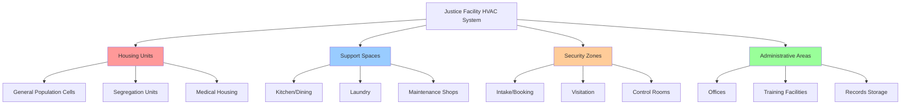
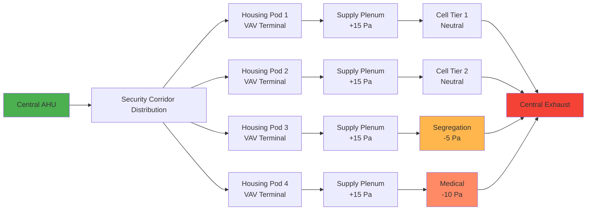

Justice facilities present unique HVAC challenges that combine security requirements, life safety considerations, and occupant welfare in highly controlled environments. These installations demand specialized design approaches that integrate mechanical systems with security protocols while maintaining code compliance and operational efficiency.

## Facility Classification and HVAC Requirements

Justice facilities span multiple security levels and operational types, each with distinct environmental control requirements. Understanding these classifications drives system selection and design parameters.

### Facility Type Comparison

| Facility Type | Security Level | Population Density | Ventilation Rate (CFM/person) | Key HVAC Challenges |
|--------------|----------------|-------------------|-------------------------------|---------------------|
| Minimum Security | Low | 40-60 ft²/occupant | 15-20 | Standard comfort, energy efficiency |
| Medium Security | Moderate | 60-80 ft²/occupant | 20-25 | Tamper resistance, access control |
| Maximum Security | High | 80-120 ft²/occupant | 25-30 | Complete security integration, redundancy |
| Administrative Segregation | Maximum | 100-150 ft²/occupant | 30-35 | Individual cell control, monitoring |
| Courthouses | Variable | Per code | 15-20 (public), 20-25 (holding) | Zone separation, security screening |
| Juvenile Facilities | Low-Moderate | 80-100 ft²/occupant | 20-25 | Educational areas, recreation spaces |

## Design Principles for Secure Environments

HVAC systems in justice facilities must address security imperatives while providing code-compliant environmental conditions. Three fundamental principles govern system design:

**1. Tamper-Resistant Construction**

All accessible components require hardened construction. Grilles, registers, and diffusers in occupied areas utilize security-rated assemblies tested to prevent removal or weaponization. Equipment located in secure zones demands anchored installation with anti-ligature features where applicable.

**2. Air Distribution Control**

Maintaining proper air pressure relationships prevents contaminant migration between zones. Negative pressure in high-risk areas (booking, medical isolation) contains airborne hazards, while positive pressure in control rooms and administrative spaces protects staff.

**3. System Redundancy and Reliability**

Critical areas require N+1 redundancy for ventilation and cooling. Loss of environmental control creates life safety hazards and operational disruptions. Backup systems and emergency ventilation modes ensure continuous operation during equipment failures or maintenance activities.

## Ventilation System Sizing

Housing unit ventilation design follows ASHRAE Standard 62.1 with modifications for security and density. Total airflow calculation incorporates outdoor air requirements, occupancy loads, and exhaust demands.

### Cell Block Ventilation Calculation

For a general population housing unit:

$$Q_{\text{total}} = \max(Q_{\text{OA}}, Q_{\text{thermal}})$$

Where outdoor air requirement:

$$Q_{\text{OA}} = N \times V_{\text{rate}} + A \times V_{\text{area}}$$

Variables:
- $N$ = Number of occupants
- $V_{\text{rate}}$ = Ventilation rate per person (CFM/person)
- $A$ = Floor area (ft²)
- $V_{\text{area}}$ = Area-based ventilation rate (CFM/ft²)

For a 48-bed housing unit with 20 CFM/person requirement:

$$Q_{\text{OA}} = 48 \times 20 = 960 \text{ CFM}$$

Thermal load calculation for cooling:

$$Q_{\text{thermal}} = \frac{Q_{\text{sensible}} + Q_{\text{latent}}}{1.08 \times \Delta T}$$

Where:
- $Q_{\text{sensible}}$ = Sensible heat load (BTU/hr)
- $Q_{\text{latent}}$ = Latent heat load (BTU/hr)
- $\Delta T$ = Supply-to-room temperature difference (°F)

## Air Handling System Architecture

Justice facilities typically employ centralized air handling with distributed terminal units to balance security access requirements and zone control.

## Security Integration Requirements

HVAC systems integrate with facility security infrastructure through multiple interfaces:

**Access Control Integration**
- Equipment room access logged through security management system
- Remote shutdown capabilities from control center
- Tamper alarms on critical components
- Secure conduit routing avoiding compromised pathways

**Smoke and Fire Management**
- Pressurization systems for smoke control in vertical shafts
- Fire damper installation coordinating with security barriers
- Emergency ventilation modes activated by fire alarm panel
- Smoke evacuation from enclosed spaces without exterior access

**Contraband Prevention**
- Ductwork sizing preventing human passage (<120 in² area)
- Grille and register openings <½ inch dimension
- Welded duct construction in high-security areas
- Inspection access outside occupied zones

## Code Compliance and Standards

Justice facility HVAC design references multiple regulatory frameworks:

- **ASHRAE Standard 62.1**: Ventilation for Acceptable Indoor Air Quality
- **ASHRAE Standard 55**: Thermal Environmental Conditions for Human Occupancy
- **IMC Chapter 4**: Ventilation requirements for assembly and residential occupancies
- **ACA Standards for Adult Correctional Institutions**: Environmental conditions and monitoring
- **NFPA 101**: Life Safety Code provisions for detention and correctional occupancies
- **State DOC Regulations**: Jurisdiction-specific requirements for temperature ranges and air changes

Temperature control ranges per ACA standards:
- Housing areas: 68-78°F
- Medical/infirmary: 70-78°F
- Kitchen: Per health code
- Administrative: 68-76°F

Relative humidity maintained between 30-60% to prevent mold growth and maintain occupant comfort.

## Operational Considerations

Maintenance access presents ongoing challenges in secure environments. Design strategies that minimize occupied-area access reduce operational costs and security concerns. Locating equipment in mechanical rooms accessible from non-secure corridors, using high-efficiency filtration to extend service intervals, and implementing remote monitoring for filter status and equipment performance optimize long-term operations.

Energy recovery systems require careful application. Enthalpy wheels and heat recovery devices offer significant utility savings but demand regular maintenance. Plate heat exchangers provide simpler operation with reduced cross-contamination risk between exhaust and outdoor air streams.

Justice facility HVAC systems represent specialized engineering requiring coordination between mechanical design, security operations, and life safety systems. Proper integration of these elements creates safe, code-compliant environments that support facility missions while protecting occupants and staff.
