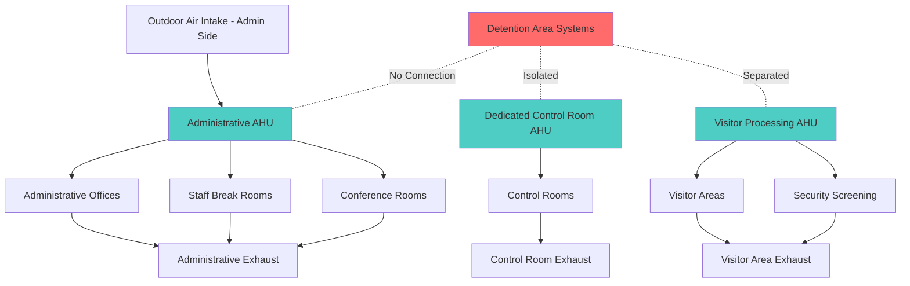
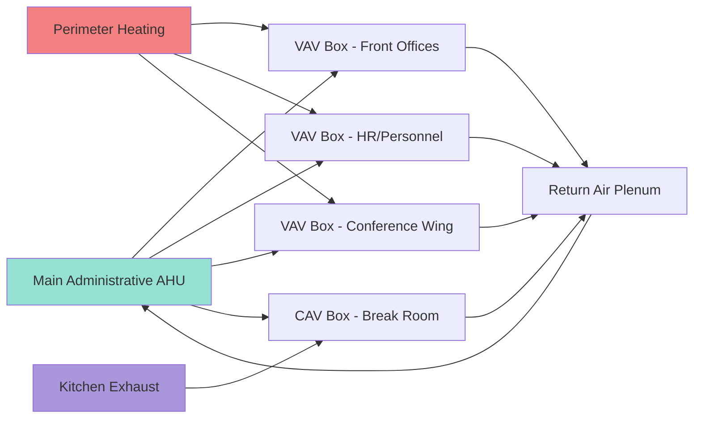

## Overview

Administrative areas in correctional facilities require HVAC systems that balance staff comfort, visitor accommodation, and critical security separation from inmate-occupied zones. These spaces include front offices, staff break rooms, conference facilities, control rooms, visitor processing areas, and security screening zones. The primary design challenge involves maintaining independent air handling systems that prevent airflow migration between administrative and secure detention areas while managing high internal loads from electronic security equipment.

## Space Type Classification

Administrative zones in correctional facilities exhibit distinct thermal and ventilation characteristics requiring tailored HVAC approaches:

| Space Type | Outdoor Air (cfm/person) | Design Temperature (°F) | Relative Humidity (%) | Internal Load Density (W/ft²) |
|-----------|-------------------------|------------------------|---------------------|------------------------------|
| Administrative Offices | 17-20 | 68-76 | 30-60 | 8-12 |
| Control Rooms | 20 | 70-74 | 40-55 | 25-40 |
| Visitor Processing | 17 | 68-76 | 30-60 | 10-15 |
| Conference Rooms | 17-20 | 68-76 | 30-60 | 12-18 |
| Staff Break Rooms | 20 | 68-76 | 30-60 | 15-25 |
| Security Screening | 20 | 68-76 | 30-60 | 18-30 |

*Reference: ASHRAE Standard 62.1-2022 and ASHRAE Handbook - HVAC Applications*

## System Separation Requirements

Administrative HVAC systems must maintain complete isolation from detention area systems. This separation prevents contaminant transfer, maintains security compartmentalization, and allows independent temperature control for staff comfort without compromising secure area environmental management.

Design requirements include:

- **Dedicated air handling units** serving only administrative zones
- **Pressure relationships** maintaining administrative areas at neutral or slight negative pressure relative to exterior but isolated from detention zones
- **No shared ductwork** between administrative and secure areas
- **Independent control systems** preventing cross-zone interference
- **Separate exhaust systems** with no interconnection to detention exhausts

## Control Room Cooling Load Calculations

Control rooms present the highest cooling loads in administrative areas due to concentrated electronic security equipment including video surveillance systems, communication panels, access control servers, and monitoring workstations.

### Total Cooling Load Equation

The total cooling load for control rooms combines structural heat gain, occupant loads, lighting, and critical electronic equipment loads:

$$Q_{total} = Q_{walls} + Q_{roof} + Q_{windows} + Q_{infiltration} + Q_{occupants} + Q_{lighting} + Q_{equipment}$$

### Equipment Load Calculation

Electronic equipment load typically dominates control room cooling requirements:

$$Q_{equipment} = \sum_{i=1}^{n} (P_i \times DF_i \times 3.412)$$

Where:
- $Q_{equipment}$ = Equipment sensible heat gain (Btu/hr)
- $P_i$ = Nameplate power of device $i$ (watts)
- $DF_i$ = Diversity factor for device $i$ (typically 0.7-1.0 for security equipment)
- $3.412$ = Conversion factor (Btu/hr per watt)

### Design Example

For a 400 ft² control room with typical security equipment loads:

$$Q_{equipment} = [(8 \times 250W) + (2 \times 1500W) + (4 \times 150W)] \times 0.85 \times 3.412$$

$$Q_{equipment} = [2000 + 3000 + 600] \times 0.85 \times 3.412 = 16,237 \text{ Btu/hr}$$

Combined with structural loads (estimated 3,500 Btu/hr), occupant loads (4 persons × 450 Btu/hr = 1,800 Btu/hr), and lighting (1.2 W/ft² × 400 ft² × 3.412 = 1,638 Btu/hr), the total cooling load reaches approximately 23,200 Btu/hr, requiring a dedicated 2-ton cooling unit with redundancy considerations.

## Visitor Area HVAC Design

Visitor processing and waiting areas experience variable occupancy with peak loads during scheduled visitation periods. HVAC systems must accommodate rapid occupancy fluctuations while maintaining security screening equipment performance.

### Outdoor Air Requirements

Calculate outdoor air using the ventilation rate procedure per ASHRAE Standard 62.1:

$$V_{oz} = R_p \times P_z + R_a \times A_z$$

Where:
- $V_{oz}$ = Breathing zone outdoor airflow (cfm)
- $R_p$ = People outdoor air rate (17 cfm/person for public assembly spaces)
- $P_z$ = Zone population (peak occupancy)
- $R_a$ = Area outdoor air rate (0.06 cfm/ft² for public assembly)
- $A_z$ = Zone floor area (ft²)

For a 1,200 ft² visitor waiting area with 30-person peak capacity:

$$V_{oz} = (17 \times 30) + (0.06 \times 1200) = 510 + 72 = 582 \text{ cfm}$$

## Administrative Office Zoning Strategy

Administrative office areas benefit from VAV systems with perimeter heating to address varying solar and occupancy loads while maintaining energy efficiency. Variable air volume terminal units provide individual zone control for offices, conference rooms, and open administrative areas.

## Security Screening Area Requirements

Security screening zones require enhanced ventilation to manage x-ray equipment heat rejection and maintain operator comfort during continuous screening operations. Design considerations include:

- **Minimum 20 cfm/person outdoor air** for security staff
- **Spot cooling** for x-ray equipment operator positions
- **Supplemental exhaust** to remove localized heat from detection equipment
- **Temperature control** maintaining 68-72°F for equipment accuracy and operator alertness

X-ray screening equipment heat rejection ranges from 1,500 to 3,000 Btu/hr per unit depending on size and throughput capacity.

## Staff Break Room Ventilation

Break rooms with cooking appliances require dedicated exhaust systems independent of general HVAC returns:

$$Q_{exhaust} = CFM_{hood} + CFM_{general}$$

For a microwave and coffee station setup without commercial cooking, provide 100-150 cfm intermittent exhaust with makeup air integrated into the HVAC supply to maintain space pressure balance.

## Conclusion

Administrative area HVAC in correctional facilities demands rigorous system separation, accommodation of high electronic equipment loads in control rooms, flexible design for variable visitor area occupancy, and coordination with security operations. Proper application of ASHRAE standards ensures staff comfort, visitor accommodation, and operational reliability while maintaining the critical security envelope that defines correctional facility environmental design.

## References

- ASHRAE Standard 62.1-2022: Ventilation for Acceptable Indoor Air Quality
- ASHRAE Handbook - HVAC Applications, Chapter 9: Justice Facilities
- ASHRAE Standard 55-2020: Thermal Environmental Conditions for Human Occupancy
- ASHRAE Handbook - Fundamentals: Heat Gain Calculations