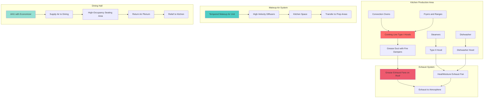
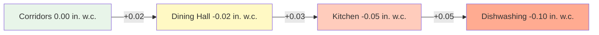

## Overview

Correctional dining facilities present unique HVAC challenges combining commercial kitchen ventilation requirements with security protocols, high-occupancy demands, and institutional durability standards. These spaces must manage extreme heat loads from cooking equipment, control odors and grease-laden vapors, provide adequate ventilation for 200-1000+ occupants during meal periods, and integrate with security systems while preventing contraband concealment or escape routes.

The HVAC design must address three distinct zones: commercial kitchen production areas with Type I and Type II hoods, dishwashing and pot-washing areas with high moisture loads, and inmate dining halls with concentrated occupancy during scheduled meal times. Each zone requires specialized ventilation strategies while maintaining pressure relationships that prevent odor migration to adjacent housing units.

## Kitchen Exhaust Hood Design

### Type I Hood Exhaust Rates

Commercial kitchen hoods in correctional facilities follow ASHRAE 154 and NFPA 96 requirements with enhanced security considerations. Exhaust flow rates depend on appliance duty and hood type:

| Appliance Type | Light Duty | Medium Duty | Heavy Duty | Extra-Heavy Duty |
|----------------|------------|-------------|------------|------------------|
| Wall-mounted canopy (cfm/ft) | 200 | 300 | 400 | 550 |
| Single island canopy (cfm/ft) | 300 | 400 | 500 | 700 |
| Double island canopy (cfm/ft) | 400 | 500 | 600 | 800 |
| Eyebrow/proximity (cfm/ft) | 150 | 250 | 350 | 500 |

The total exhaust flow rate for a Type I hood is calculated as:

$$Q_{exhaust} = L \cdot R_{duty} \cdot F_{overlap}$$

Where:
- $Q_{exhaust}$ = total exhaust flow rate (cfm)
- $L$ = hood length (ft)
- $R_{duty}$ = duty-specific exhaust rate (cfm/ft)
- $F_{overlap}$ = overlap factor for multiple hoods (typically 0.9)

### Hood Capture Velocity and Makeup Air

The capture velocity at the hood face must maintain adequate containment:

$$V_{capture} = \frac{Q_{exhaust}}{A_{face}}$$

Where:
- $V_{capture}$ = face velocity (fpm), typically 100-150 fpm for wall canopy
- $A_{face}$ = hood face area (ft²)

Makeup air must be provided to prevent excessive negative pressure in the kitchen:

$$Q_{makeup} = Q_{exhaust} - Q_{infiltration}$$

For correctional kitchens, makeup air should be 85-90% of exhaust to maintain slight negative pressure (-0.02 to -0.05 in. w.c.) preventing odor migration to adjacent areas.

## Kitchen Ventilation System Architecture

## Dining Hall Ventilation

### High-Occupancy Design Parameters

Correctional dining halls experience peak occupancy during scheduled meal periods with rapid turnover. Design parameters:

| Parameter | Value | Basis |
|-----------|-------|-------|
| Occupancy | 1 person per 12-15 ft² | Institutional density |
| Outside air per person | 7.5 cfm | ASHRAE 62.1 Table 6-1 |
| Total air changes | 6-10 ACH | During occupied periods |
| Supply air temperature | 55-58°F | High sensible loads |
| Space temperature setpoint | 70-74°F | IMC requirements |

Total ventilation rate:

$$Q_{ventilation} = \max(N \cdot OA_{person}, A \cdot ACH / 60)$$

Where:
- $N$ = peak occupancy (persons)
- $OA_{person}$ = outside air per person (7.5 cfm)
- $A$ = room volume (ft³)
- $ACH$ = air changes per hour

### Pressure Cascade and Odor Control

Pressure relationships prevent odor migration from kitchen to dining and from dining to adjacent corridors:

## Security and Safety Integration

### Secure Equipment Specifications

All HVAC equipment in inmate-accessible areas requires security enhancements:

- **Grilles and Diffusers**: 12-gauge stainless steel with tamper-resistant fasteners, no removable parts
- **Ductwork**: 16-gauge minimum in accessible areas, continuous welds, seismic bracing prevents use as handholds
- **Controls**: Recessed thermostats with lexan covers, no exposed sensors or wiring
- **Access Panels**: Eliminated in occupied spaces or secured with non-removable hinges and institutional locks

### Fire Suppression Integration

Type I hood systems integrate with wet chemical suppression:

$$T_{linkage} = T_{cooking} + 50°F$$

Fusible links rated 50°F above maximum anticipated cooking temperature trigger suppression and simultaneously:
1. Shut down exhaust fans (after 30-60 second purge delay)
2. Close makeup air dampers
3. Shut off fuel/electrical supply to appliances
4. Activate alarm notification to control room

## System Performance and Efficiency

### Exhaust Heat Recovery

Kitchen exhaust represents significant energy loss. Heat recovery options compatible with grease-laden exhaust:

| Technology | Effectiveness | Application |
|------------|---------------|-------------|
| Runaround loop (glycol) | 50-60% | Preheat makeup air |
| Heat pipe | 45-55% | Makeup air or domestic hot water |
| Direct-fired makeup air | 80-90% efficiency | Gas-fired, offsets exhaust heat loss |

Energy recovered from exhaust:

$$Q_{recovered} = Q_{exhaust} \cdot \rho \cdot c_p \cdot \Delta T \cdot \eta$$

Where:
- $\rho$ = air density (0.075 lb/ft³)
- $c_p$ = specific heat (0.24 Btu/lb·°F)
- $\Delta T$ = temperature difference between exhaust and outdoor air (°F)
- $\eta$ = heat recovery effectiveness (0.50-0.60)

### Demand-Based Kitchen Ventilation

Variable exhaust flow based on cooking activity reduces energy consumption by 30-50% during non-peak periods:

$$Q_{variable} = Q_{design} \cdot \left(\frac{T_{hood} - T_{ambient}}{T_{design} - T_{ambient}}\right)^{0.5}$$

Temperature sensors in the hood plenum modulate exhaust fan speed via VFD, with makeup air tracking exhaust flow to maintain pressure relationships.

## Code Requirements and Standards

- **ASHRAE 154**: Ventilation for Commercial Cooking Operations
- **NFPA 96**: Standard for Ventilation Control and Fire Protection of Commercial Cooking Operations
- **IMC Chapter 5**: Exhaust systems for institutional kitchens
- **ASHRAE 62.1**: Ventilation for dining spaces (Table 6-1)
- **UMC 510**: Commercial kitchen makeup air requirements
- **Local Health Department**: Food service facility ventilation approvals

## Operational Considerations

Correctional kitchen HVAC systems operate 12-16 hours daily with minimal downtime. Maintenance access must be designed for security protocols including tool control and escort requirements. All service requiring kitchen access should be schedulable during non-meal periods. Redundancy in exhaust fans prevents meal service disruption during equipment failure. Grease duct cleaning access must be provided per NFPA 96 while preventing security vulnerabilities. Control system interfaces should provide remote monitoring of critical parameters including exhaust fan status, makeup air flow, space temperatures, and fire suppression system condition.
