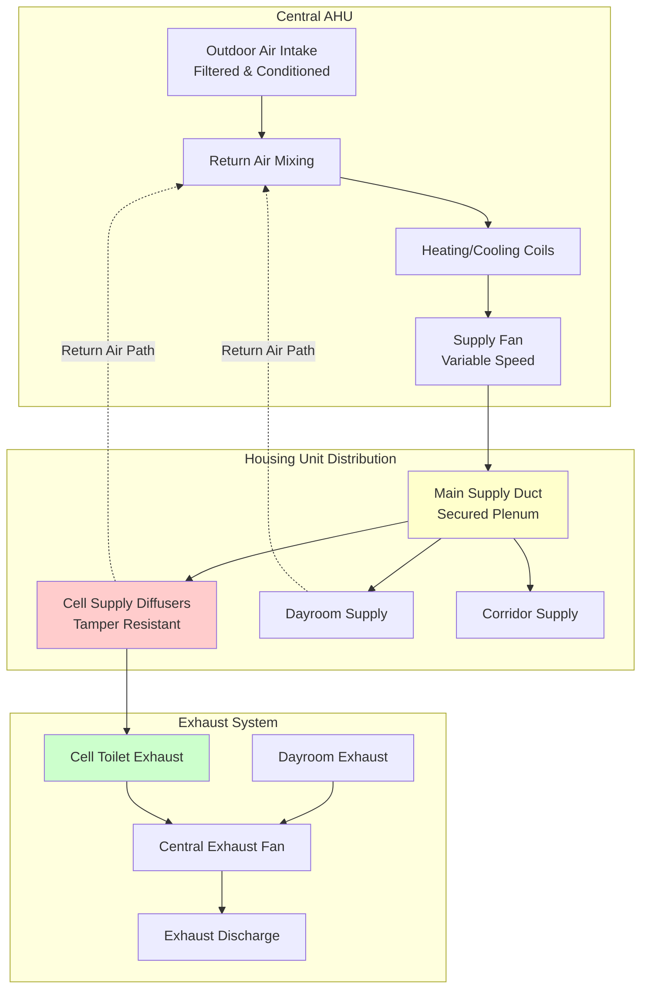
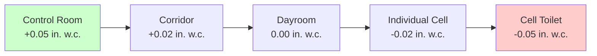

## Overview

Housing unit HVAC systems in correctional facilities must balance thermal comfort, indoor air quality, security requirements, and 24/7 operational reliability. Unlike conventional residential or commercial applications, housing units present unique challenges including tamper-resistant equipment, constant occupancy, limited maintenance access, and potential for air system exploitation.

Housing units encompass individual cells, dayrooms, corridors, and associated sanitary facilities. Each space type demands specific ventilation rates, temperature control strategies, and security-compliant equipment configurations.

## Ventilation Requirements

### Individual Cell Ventilation

ASHRAE Standard 62.1 and ACA standards establish minimum ventilation rates for occupied cells based on continuous occupancy scenarios.

**Minimum Outdoor Air Requirements:**

| Space Type | Occupancy | Ventilation Rate | Standard |
|------------|-----------|------------------|----------|
| Single Cell | 1 person | 15 cfm/person | ASHRAE 62.1 |
| Double Cell | 2 persons | 15 cfm/person | ASHRAE 62.1 |
| ACA Standard Cell | 1-2 persons | 10-15 cfm/person | ACA 4-ALDF-4C-16 |
| Dayroom | Variable | 10 cfm/person + 0.06 cfm/ft² | ASHRAE 62.1 |
| Toilet/Shower (in-cell) | - | 50 cfm continuous | IMC |

The total outdoor air requirement for a housing unit is calculated using:

$$Q_{oa} = \sum_{i=1}^{n} (R_p \cdot P_i + R_a \cdot A_i)$$

Where:
- $Q_{oa}$ = outdoor air flow rate (cfm)
- $R_p$ = outdoor air rate per person (cfm/person)
- $P_i$ = number of occupants in zone i
- $R_a$ = outdoor air rate per unit area (cfm/ft²)
- $A_i$ = zone floor area (ft²)

For a typical 80 ft² single-occupancy cell:

$$Q_{cell} = (15 \text{ cfm/person} \times 1) + (0.06 \text{ cfm/ft}^2 \times 80 \text{ ft}^2) = 19.8 \text{ cfm}$$

### Air Change Rates

Housing units require higher air change rates than conventional occupied spaces due to continuous occupancy and limited operable openings.

**Recommended Air Change Rates:**

| Space | Air Changes per Hour (ACH) | Basis |
|-------|----------------------------|-------|
| Individual Cell | 10-15 ACH | ACA/ASHRAE |
| Dayroom | 8-12 ACH | ACA |
| Corridor | 6-8 ACH | Ventilation |
| Toilet Room (separate) | 15-20 ACH | Odor control |

Cell air change rate verification:

$$\text{ACH} = \frac{Q_{cell} \times 60}{V_{cell}}$$

For an 80 ft² cell with 10 ft ceiling height (800 ft³ volume) and 20 cfm supply:

$$\text{ACH} = \frac{20 \times 60}{800} = 1.5 \text{ ACH}$$

This indicates that achieving code-minimum outdoor air does not necessarily satisfy recommended air change rates. Total supply air must be increased through recirculation.

## System Configuration

### Typical Housing Unit Air Distribution

### Pressure Relationships

Housing units typically operate under slight negative pressure relative to adjacent administrative areas to prevent odor migration and maintain airflow directionality during door openings.

**Pressure Cascade Strategy:**

Pressure differential calculation across cell door:

$$\Delta P = \frac{\rho \cdot v^2}{2 \times 1097}$$

Where:
- $\Delta P$ = pressure differential (in. w.c.)
- $\rho$ = air density (lb/ft³)
- $v$ = air velocity through opening (fpm)

For 50 fpm undercut velocity with standard air density (0.075 lb/ft³):

$$\Delta P = \frac{0.075 \times 50^2}{2 \times 1097} = 0.00009 \text{ in. w.c.}$$

## Security Considerations

### Tamper-Resistant Equipment

All accessible HVAC components within housing units must be tamper-resistant and non-weaponizable:

- **Diffusers:** Flush-mounted, screw-less installation, narrow slot design
- **Grilles:** Heavy-gauge steel, continuous weld construction, security fasteners
- **Controls:** Recessed thermostats in polycarbonate enclosures or staff-controlled only
- **Ductwork:** Concealed in rated construction, no exposed flexible duct connections

### Air System Security

Ventilation systems present potential security vulnerabilities:

1. **Sound Transmission:** Ductwork can transmit conversations between cells. Install duct silencers with baffled construction at strategic locations.

2. **Contraband Passage:** Prevent item transfer through ducts using:
   - Maximum 4-inch duct connections to cells
   - Security bars at larger duct penetrations
   - Non-linear duct routing

3. **Fire/Smoke Dampers:** Install fire dampers at rated barriers but avoid in-cell access. Use corridor-accessible locations.

## Temperature and Humidity Control

ACA standards mandate specific temperature ranges for housing units:

**Temperature Requirements:**

| Season | Dry-Bulb Temperature | Relative Humidity |
|--------|---------------------|-------------------|
| Winter | 68-74°F | 25-50% |
| Summer | 72-78°F | 30-60% |

Individual cell temperature control is typically limited to central zone control due to security and maintenance concerns. Some facilities provide two-position (heat/cool) inmate control, but most use staff override from central control.

Humidity control is critical in housing units due to:
- Showering activities
- Laundry drying
- High occupant density
- Limited air circulation

Design supply air to maintain 40-50% RH during winter heating to prevent excessive dryness while avoiding condensation during summer cooling.

## Continuous Operation Requirements

Housing unit HVAC operates 24/7 without shutdowns. Design considerations include:

- **Redundancy:** Dual air handling units or N+1 configuration for critical housing units
- **Hot Gas Bypass or VFD:** Maintain minimum airflow during low-load conditions
- **Filter Accessibility:** Corridor-side or mechanical room access for filter changes without cell entry
- **Controls:** BAS integration with alarming for temperature excursions, fan failures, and filter pressure drop

## Toilet Exhaust Design

Each cell toilet requires dedicated exhaust to control odors and moisture. Unlike residential bathrooms, cells are continuously occupied, requiring constant exhaust operation.

**Toilet Exhaust Calculation:**

$$Q_{toilet} = \max(50 \text{ cfm}, 1.0 \text{ cfm/ft}^2 \times A_{toilet})$$

For typical 25 ft² toilet area in cell:

$$Q_{toilet} = \max(50, 25) = 50 \text{ cfm}$$

Exhaust grilles must be tamper-resistant with corrosion-resistant materials (stainless steel or powder-coated steel). Locate high on wall to capture rising odors and moisture.

## System Commissioning

Verify the following during housing unit HVAC commissioning:

1. **Airflow Verification:** Measure and balance each cell to design cfm ±10%
2. **Pressure Testing:** Confirm negative pressure in cells relative to corridors
3. **Temperature Uniformity:** Verify all cells achieve setpoint within ±2°F
4. **Acoustics:** Measure noise levels at cell supply diffusers (<45 dBA recommended)
5. **Continuous Operation:** 72-hour run test with full occupancy simulation

## Standards and References

- ASHRAE Standard 62.1: Ventilation for Acceptable Indoor Air Quality
- ACA Standard 4-ALDF-4C-16: Environmental Conditions (Adult Local Detention Facilities)
- International Mechanical Code: Exhaust requirements
- ASHRAE Handbook - HVAC Applications, Chapter 9: Justice Facilities
