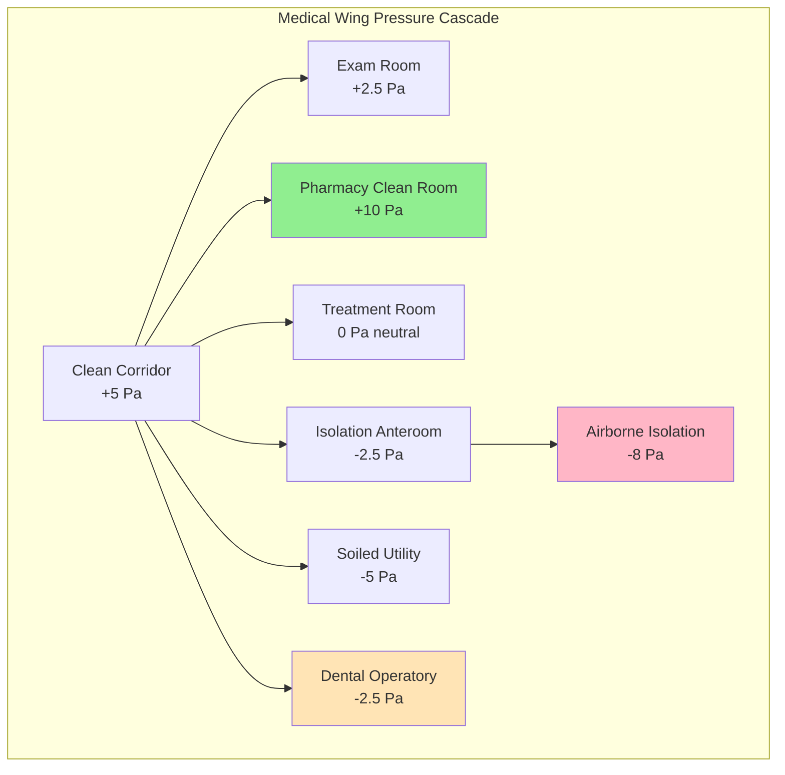
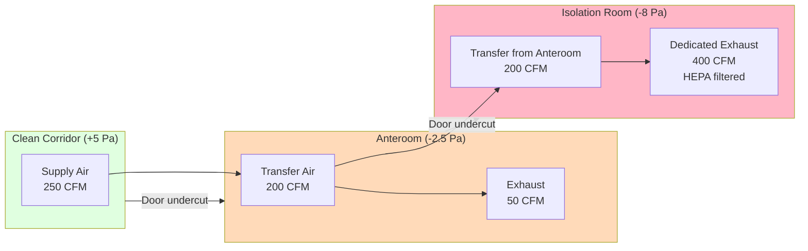
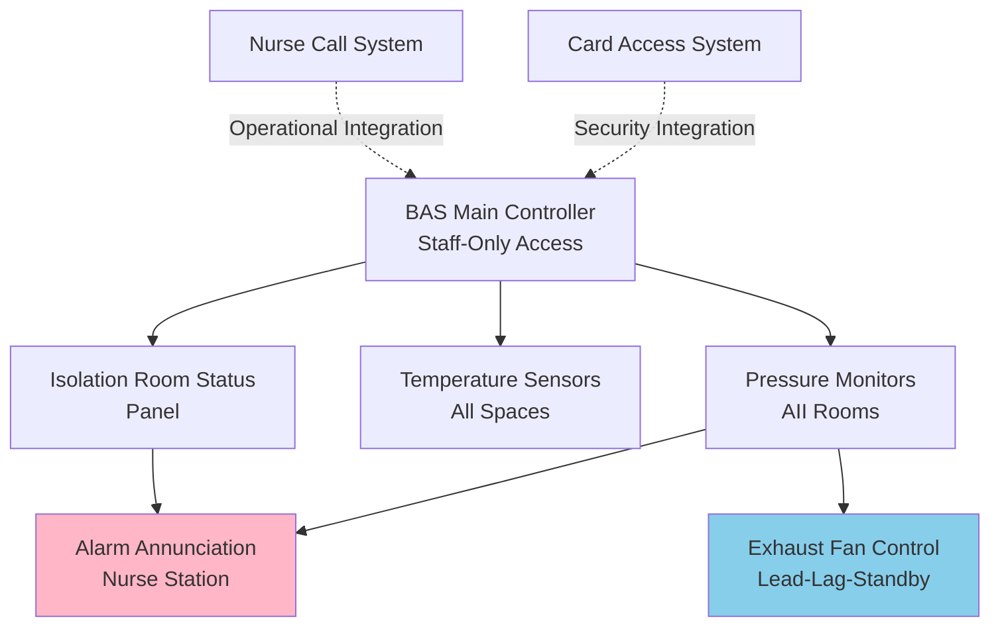

Correctional medical facilities present unique HVAC engineering challenges that combine healthcare infection control requirements with security constraints. These spaces must meet ASHRAE 170 and Facility Guidelines Institute (FGI) standards while accommodating custody protocols, limited access for maintenance, and enhanced durability requirements.

## Pressure Relationships and Cascade Design

Medical spaces within correctional facilities require precise pressure hierarchies to prevent cross-contamination while maintaining security corridor integrity. The pressure cascade follows infection control principles adapted for detention environments.

**Differential Pressure Calculation:**

$$\Delta P = \frac{\rho v^2}{2} + \rho g h + \Delta P_{friction}$$

Where:
- $\Delta P$ = total pressure differential (Pa)
- $\rho$ = air density (kg/m³)
- $v$ = air velocity at openings (m/s)
- $g$ = gravitational acceleration (9.81 m/s²)
- $h$ = vertical distance (m)
- $\Delta P_{friction}$ = pressure loss through path restrictions

**Minimum Pressure Differential for Containment:**

$$\Delta P_{min} = 2.5 \text{ Pa} + (n \times 0.5 \text{ Pa})$$

Where $n$ = number of door openings per hour above baseline.

## Ventilation Requirements by Space Type

| Space Type | Air Changes/Hour | Pressure | Filtration | Temperature | Humidity | Outdoor Air |
|-----------|------------------|----------|------------|-------------|----------|-------------|
| Exam Room | 6 ACH minimum | +2.5 Pa | MERV 14 | 70-75°F | 30-60% | 2 ACH |
| Airborne Isolation (AII) | 12 ACH | -8 Pa min | MERV 14 + HEPA exhaust | 70-75°F | 30-60% | 2 ACH |
| Protective Environment (PE) | 12 ACH | +8 Pa | HEPA supply | 70-75°F | 40-60% | 2 ACH |
| Dental Operatory | 12 ACH | -2.5 Pa | MERV 14 | 70-75°F | 30-60% | 3 ACH |
| Pharmacy (USP 797) | 30 ACH | +10 Pa | HEPA supply | 68-72°F | 30-60% | 4 ACH |
| Medication Room | 6 ACH | +2.5 Pa | MERV 14 | 68-75°F | 30-60% | 2 ACH |
| Soiled Utility | 10 ACH | -5 Pa | MERV 14 | 68-75°F | Max 70% | 2 ACH |
| Mental Health | 6 ACH | Neutral | MERV 13 | 70-75°F | 30-60% | 2 ACH |

## Isolation Room Design

Airborne infection isolation (AII) rooms in correctional settings require fail-safe pressure control with security-rated components.

**Air Balance for Negative Pressure:**

$$Q_{exhaust} = Q_{supply} + Q_{infiltration} + Q_{offset}$$

Typical offset flow: 150-200 CFM to maintain -8 Pa differential.

**Isolation Room Airflow Diagram:**

## Dental Clinic Exhaust Requirements

Dental operatories generate aerosols requiring high air change rates and dedicated exhaust at the source.

**Capture Velocity Calculation:**

$$V_{capture} = \frac{Q}{A} = \frac{Q}{\pi (X + 0.2D)^2}$$

Where:
- $V_{capture}$ = capture velocity (m/s)
- $Q$ = exhaust flow rate (m³/s)
- $X$ = distance from hood face to source (m)
- $D$ = hood diameter (m)

**Requirements:**
- Minimum 12 ACH with at least 3 ACH outdoor air
- High-volume evacuation (HVE) systems: 100+ CFM per chair
- Room maintained at -2.5 Pa relative to corridor
- Exhaust discharge 10 ft above roof or 25 ft from air intakes
- Security-rated grilles preventing ligature or tool insertion

## Pharmacy Environmental Control

Correctional pharmacy spaces follow USP 797/800 standards with security enhancements for controlled substance storage.

**ISO Class 7 Buffer Room Requirements:**
- 30 ACH minimum, HEPA-filtered supply
- +10 Pa relative to corridor
- Temperature: 68-72°F (tighter tolerance than general medical)
- Relative humidity: 30-60%
- Particle count: ≤352,000 particles ≥0.5 μm per m³

**Hazardous Drug Compounding (USP 800):**
- Externally vented biological safety cabinets (BSC)
- Negative pressure room (-5 Pa) with anteroom buffer
- 12 ACH minimum with HEPA exhaust filtration
- No recirculation of exhaust air

## Security and Durability Considerations

HVAC components in correctional medical facilities require modifications beyond healthcare standards.

**Design Features:**
- Tamper-resistant diffusers and grilles (security-rated, ligature-resistant)
- Recessed or ceiling-mounted equipment (no protruding controls)
- Sealed ductwork penetrations (prevent contraband passage)
- Pressure monitoring systems with remote alarms
- Redundant exhaust fans for isolation rooms (N+1 configuration)
- Vibration-isolated equipment (prevent sound transmission between cells)
- Stainless steel or heavy-gauge materials resisting damage

**Control System Architecture:**

## Infection Control and Filtration Strategy

Correctional populations exhibit higher rates of tuberculosis, hepatitis, and other communicable diseases requiring enhanced environmental controls.

**Filtration Hierarchy:**
1. **Pre-filter**: MERV 8 (30-35% ASHRAE 52.2 efficiency)
2. **Final filter**: MERV 14 (85-90% efficiency, minimum for medical)
3. **HEPA terminal**: 99.97% @ 0.3 μm for PE rooms and pharmacy
4. **Exhaust HEPA**: Required for AII rooms, dental, and hazardous drug areas

**Air Change Effectiveness:**

$$\varepsilon = \frac{\tau_n}{\tau} = \frac{t_{63\%}}{3 \times ACH^{-1}}$$

Where $\varepsilon$ = ventilation effectiveness factor (target ≥ 0.95 for isolation rooms).

## Commissioning and Validation

FGI Guidelines require performance testing before occupancy and annually thereafter.

**Critical Tests:**
- Pressure differential verification (all medical rooms)
- Airflow volume measurement (TSI or equivalent)
- HEPA filter integrity (DOP or PAO aerosol scan)
- Door swing direction test (isolation rooms)
- Alarm function verification (pressure loss, filter status)
- Recovery time testing (time to restore pressure after door opening)
- Temperature and humidity spot checks (all zones)
- Sound level verification (sleeping quarters <45 dBA)

Correctional medical HVAC systems demand rigorous engineering integrating healthcare standards with custodial facility constraints. Successful designs prioritize infection control, maintainability with restricted access, and component durability while meeting ASHRAE 170 and FGI Guidelines performance criteria.
