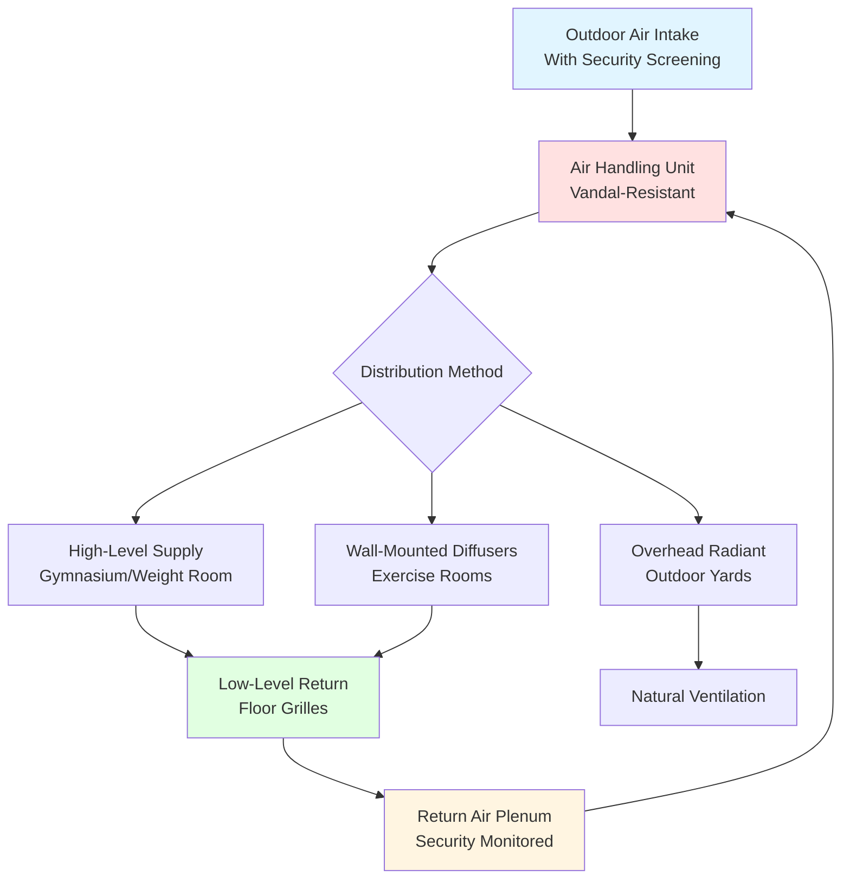
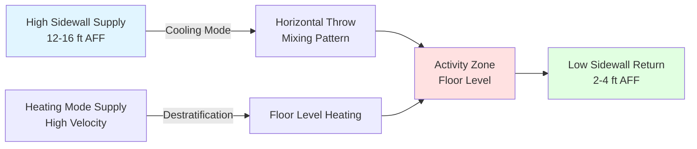

## Overview

Recreation areas in correctional facilities present unique HVAC challenges that combine high metabolic loads, security requirements, vandal-resistant equipment, and outdoor/indoor environmental transitions. Proper design ensures occupant safety, maintains acceptable air quality during peak activity, and integrates seamlessly with facility security systems.

## Metabolic Load Calculations

Recreation spaces generate significantly higher heat and moisture loads than typical correctional areas due to elevated physical activity levels.

### Activity-Based Load Table

| Activity Type | Metabolic Rate (W/person) | Sensible Heat (W) | Latent Heat (W) | Total Load (W) |
|---------------|---------------------------|-------------------|-----------------|----------------|
| Light Exercise (Walking) | 200-250 | 80-100 | 120-150 | 200-250 |
| Moderate Exercise (Basketball) | 350-450 | 100-130 | 250-320 | 350-450 |
| Heavy Exercise (Weightlifting) | 400-500 | 110-140 | 290-360 | 400-500 |
| Intense Activity (Circuit Training) | 500-650 | 130-170 | 370-480 | 500-650 |

### Total Cooling Load Formula

The total cooling load for a recreation area combines sensible and latent components:

$$Q_{total} = Q_{sensible} + Q_{latent}$$

Where:

$$Q_{sensible} = (n \times q_s) + (UA \times \Delta T) + Q_{equipment} + Q_{lights}$$

$$Q_{latent} = n \times q_l \times h_{fg}$$

Variables:
- $n$ = number of occupants
- $q_s$ = sensible heat per person (W)
- $q_l$ = latent heat per person (W)
- $h_{fg}$ = latent heat of vaporization (2,257 kJ/kg)
- $UA$ = building envelope conductance (W/K)
- $\Delta T$ = indoor-outdoor temperature difference (K)

## Ventilation Requirements

ASHRAE Standard 62.1 specifies minimum outdoor air requirements, but correctional recreation areas typically require enhanced ventilation.

### Outdoor Air Calculation

$$\dot{V}_{oa} = n \times V_{person} + A \times V_{area}$$

For gymnasiums and exercise rooms:

$$\dot{V}_{oa} = n \times 20 \text{ cfm/person} + A \times 0.06 \text{ cfm/ft}^2$$

During high activity periods, increase ventilation by 50-100%:

$$\dot{V}_{peak} = \dot{V}_{oa} \times (1.5 \text{ to } 2.0)$$

### Air Change Rate Requirements

| Space Type | Minimum ACH | Recommended ACH | Peak Activity ACH |
|------------|-------------|-----------------|-------------------|
| Indoor Gymnasium | 6-8 | 8-12 | 12-15 |
| Weight Room | 8-10 | 10-15 | 15-20 |
| Exercise Room | 8-10 | 10-15 | 15-20 |
| Multi-Purpose Room | 6-8 | 8-10 | 10-12 |
| Outdoor Covered Yard | 4-6 | 6-8 | N/A |

## System Design Considerations

### Temperature and Humidity Control

Recreation areas require lower setpoints than standard occupied spaces due to elevated metabolic activity:

- **Temperature Setpoint**: 65-70°F (18-21°C) during activity periods
- **Relative Humidity**: 40-55% maximum to prevent moisture accumulation
- **Outdoor Yard**: Ambient conditions with localized cooling/heating zones

### Air Distribution Strategy

### Security Integration Requirements

All HVAC equipment in recreation areas must comply with correctional facility security standards:

1. **Tamper-Resistant Construction**: All accessible components utilize security-grade fasteners (non-standard heads, recessed installation)
2. **Concealed Ductwork**: Minimum 16 feet above finished floor or within secure ceiling plenums
3. **Grille Protection**: Return and exhaust grilles rated for impact resistance, secured with tamper-proof hardware
4. **Equipment Access**: Service access from secure corridors only, never from occupied recreation spaces
5. **Camera Integration**: HVAC equipment rooms monitored by facility security systems

## Indoor Gymnasium HVAC Design

### Airflow Pattern

### Load Calculation Example

For a 2,400 ft² gymnasium with 30 occupants during basketball:

$$Q_{occupants} = 30 \times 400 \text{ W} = 12,000 \text{ W} = 40,900 \text{ BTU/hr}$$

$$Q_{lights} = 2,400 \text{ ft}^2 \times 1.5 \text{ W/ft}^2 = 3,600 \text{ W} = 12,300 \text{ BTU/hr}$$

$$Q_{envelope} = UA \times \Delta T = (2,400 \times 0.5) \times (95-70) = 30,000 \text{ BTU/hr}$$

$$Q_{total} \approx 83,200 \text{ BTU/hr} \text{ (7 tons minimum)}$$

## Weight Room and Exercise Area Design

Weight rooms generate concentrated heat loads with minimal air movement requirements to prevent discomfort.

### Design Parameters

- **Supply Air Temperature**: 55-60°F to offset high sensible loads
- **Air Velocity at Occupied Zone**: <50 fpm to minimize draft sensation
- **Dedicated Outdoor Air**: 25-30 cfm/person minimum
- **Dehumidification Capacity**: Design for 60% sensible heat ratio

### Equipment Considerations

Free weights and resistance equipment require:
- Floor-mounted returns positioned away from lifting zones
- Supply diffusers with adjustable pattern controllers
- Epoxy-coated metal ductwork resistant to humidity corrosion

## Outdoor Recreation Yard Climate Control

Outdoor yards benefit from localized conditioning rather than full enclosure HVAC:

### Covered Area Strategies

1. **Radiant Heating Panels**: Ceiling-mounted infrared heaters for winter use (48,000-60,000 BTU/hr per 1,000 ft²)
2. **Evaporative Cooling Misters**: Summer cooling in dry climates (avoid in humid regions)
3. **High-Velocity Fans**: Large-diameter ceiling fans (8-12 ft) for air circulation
4. **Perimeter Heating**: Floor-level radiant systems in temperate zones

### Psychrometric Considerations

Outdoor yard design targets effective temperature reduction rather than specific setpoints:

$$ET^* = T_{db} - \frac{(1-RH) \times (T_{db}-T_{wb})}{3}$$

Where $ET^*$ is effective temperature, $T_{db}$ is dry-bulb temperature, $T_{wb}$ is wet-bulb temperature, and $RH$ is relative humidity.

## Energy Efficiency and Controls

### Demand-Controlled Ventilation

Implement CO₂-based demand control ventilation with override capabilities:

$$\dot{V}_{DCV} = \dot{V}_{min} + \left(\frac{CO_2_{space} - CO_2_{outdoor}}{CO_2_{design} - CO_2_{outdoor}}\right) \times (\dot{V}_{max} - \dot{V}_{min})$$

Target: $CO_2_{design} = 1,000$ ppm during peak activity

### Scheduling Integration

Recreation HVAC systems must interface with facility scheduling software:
- Pre-occupancy purge cycles (2 hours before scheduled activity)
- Setback during unoccupied periods (nights, lockdowns)
- Override capability for security operations
- Manual emergency shutdown accessible to control room

## Maintenance and Operational Considerations

Recreation area HVAC systems require enhanced maintenance protocols:

1. **Filter Replacement**: Every 1-2 months due to high particle loading
2. **Coil Inspection**: Quarterly checks for biological growth in high-humidity environments
3. **Humidifier Maintenance**: Weekly cleaning during heating season
4. **Ductwork Inspection**: Annual visual inspection for unauthorized modifications
5. **Security Hardware Verification**: Monthly checks of tamper-resistant fasteners

## References

- ASHRAE Standard 62.1: Ventilation for Acceptable Indoor Air Quality
- ASHRAE Standard 55: Thermal Environmental Conditions for Human Occupancy
- ASHRAE Handbook - HVAC Applications, Chapter 9: Justice Facilities
- National Institute of Corrections: Correctional Facility Design and Detailing (2020)

---

**File**: `/Users/evgenygantman/Documents/github/gantmane/hvac/content/specialty-applications-testing/specialty-hvac-applications/justice-facilities/correctional-facilities/recreation-areas/_index.md`
