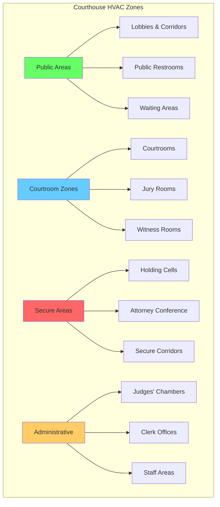

# Courthouse HVAC Systems

Courthouse HVAC systems require specialized design approaches that balance public access areas with secure zones, provide exceptional acoustic performance in courtrooms, and maintain strict environmental separation between detainee holding areas and public spaces. The design must address varying occupancy patterns, security integration requirements, and the unique acoustic demands of judicial proceedings.

## Zone Separation Strategy

Courthouse facilities require distinct HVAC zones based on security levels, occupancy patterns, and functional requirements. The fundamental principle is complete air separation between secure and non-secure areas to prevent cross-contamination and maintain security protocols.

### Security-Based Zoning Requirements

**Detainee Holding Areas:**
- 100% outdoor air with no recirculation
- Minimum 10 air changes per hour per ASHRAE Standard 62.1
- Negative pressure relative to adjacent corridors (-0.02 to -0.05 in. w.g.)
- Dedicated exhaust systems with no connection to public areas
- Tamper-resistant grilles and controls

**Courtrooms:**
- Independent air handlers for acoustic isolation
- Positive pressure relative to holding areas (+0.02 in. w.g.)
- Variable air volume systems for load flexibility
- Minimum 15 cfm/person outdoor air ventilation

**Public Areas:**
- Neutral pressure balance
- Standard commercial occupancy ventilation rates
- Allowed recirculation with appropriate filtration

## Courtroom HVAC Design Criteria

Courtrooms present unique challenges requiring simultaneous achievement of low background noise, uniform temperature distribution, and high ventilation rates during occupied periods.

### Space Type Design Parameters

| Space Type | Design Temp (°F) | Occupancy (ft²/person) | OA Rate (cfm/person) | NC Level | ACH |
|-----------|------------------|------------------------|----------------------|----------|-----|
| Courtroom | 72-74 | 15-20 | 15 | NC 25-30 | 4-6 |
| Jury Room | 72-74 | 25 | 15 | NC 30-35 | 4-6 |
| Holding Cell | 70-75 | 50-80 | 20 | NC 35-40 | 10-12 |
| Judge's Chamber | 72-74 | 150-200 | 15 | NC 30-35 | 4-6 |
| Public Lobby | 72-76 | 10-15 | 7.5 | NC 35-40 | 4-6 |
| Attorney Conference | 72-74 | 20-30 | 15 | NC 30-35 | 4-6 |

### Courtroom Ventilation Calculation

Total supply air for a courtroom must satisfy both thermal load and ventilation requirements, with the larger value governing system sizing.

**Ventilation Air Required:**

$$Q_{vent} = N \times V_{OA}$$

where:
- $Q_{vent}$ = total ventilation airflow (cfm)
- $N$ = number of occupants
- $V_{OA}$ = outdoor air per person (cfm/person)

**Thermal Load Air Required:**

$$Q_{thermal} = \frac{q_{sensible}}{1.08 \times \Delta T}$$

where:
- $Q_{thermal}$ = airflow for sensible cooling (cfm)
- $q_{sensible}$ = sensible heat gain (Btu/hr)
- $\Delta T$ = supply air temperature difference (°F)
- 1.08 = constant for standard air (0.24 Btu/lb·°F × 60 min/hr × 0.075 lb/ft³)

**Design Airflow:**

$$Q_{design} = \max(Q_{vent}, Q_{thermal})$$

For a 2,500 ft² courtroom with 125 occupants:

$$Q_{vent} = 125 \times 15 = 1,875 \text{ cfm}$$

If sensible load is 87,500 Btu/hr with 18°F ΔT:

$$Q_{thermal} = \frac{87,500}{1.08 \times 18} = 4,513 \text{ cfm}$$

Therefore, $Q_{design} = 4,513$ cfm (thermal load governs).

## Acoustic Performance Requirements

Courtrooms demand exceptionally low background noise to ensure intelligible speech and accurate court recording. HVAC systems are typically the dominant noise source.

### Acoustic Design Strategies

**Supply Air Velocity Limits:**
- Main ducts: 1,200-1,500 fpm maximum
- Branch ducts: 800-1,000 fpm maximum
- Terminal devices: 400-600 fpm maximum
- Diffuser neck velocity: 300-500 fpm maximum

**Equipment Selection:**
- Dedicated air handlers with 2-inch insulated casings
- Fan speeds limited to 1,200 rpm maximum
- Sound traps in supply and return ducts
- Flexible duct connections at all equipment
- Vibration isolation for all rotating equipment

**Duct Attenuation:**

Required sound attenuation can be estimated using:

$$L_{required} = L_{source} - NC_{target} - L_{natural}$$

where:
- $L_{required}$ = required insertion loss (dB)
- $L_{source}$ = source sound power level (dB)
- $NC_{target}$ = target noise criterion (typically NC 25-30)
- $L_{natural}$ = natural duct attenuation (dB)

## Security Integration

HVAC systems must integrate with building security protocols to prevent unauthorized access and maintain controlled environments.

### Security System Interfaces

**Access Control Integration:**
- Duct smoke detectors with automatic damper closure
- Penetration seals rated for security partition requirements
- Lockable access panels in secure areas
- Tamper switches on grilles in holding cells

**Pressure Relationship Control:**

Pressure differential between zones:

$$\Delta P = \frac{Q_{leak}}{C_{flow} \times A_{leak}}$$

where:
- $\Delta P$ = pressure differential (in. w.g.)
- $Q_{leak}$ = leakage airflow (cfm)
- $C_{flow}$ = flow coefficient
- $A_{leak}$ = effective leakage area (in²)

Maintain negative pressure in holding cells relative to secure corridors by exhausting 10-15% more air than supplied.

**Fire/Smoke Control:**
- Separate smoke control zones for public and secure areas
- Automatic shutdown of recirculation during fire alarm
- Pressurization systems for egress stairs
- Compartmentalization aligned with fire-rated partitions

## System Type Selection

**Recommended Systems:**
- Variable air volume (VAV) with reheat for courtrooms and chambers
- Dedicated outdoor air systems (DOAS) with local fan coils for perimeter zones
- 100% outdoor air constant volume for holding cells
- Energy recovery ventilation where codes permit (not on holding cell exhaust)

**Control Strategies:**
- Occupancy-based ventilation control for varying courtroom schedules
- Demand control ventilation in public assembly areas
- Night setback with morning warm-up sequences
- Integration with security access systems for zone activation

## References

- ASHRAE Standard 62.1: Ventilation for Acceptable Indoor Air Quality
- ASHRAE Applications Handbook, Chapter 8: Justice Facilities
- ASHRAE Standard 55: Thermal Environmental Conditions for Human Occupancy
- AHRI Standard 885: Procedure for Estimating Occupied Space Sound Levels

---

*Design courthouse HVAC systems with security-first zoning, exceptional acoustic performance, and strict environmental separation to support judicial proceedings effectively.*
