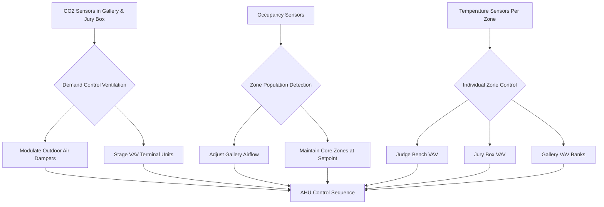
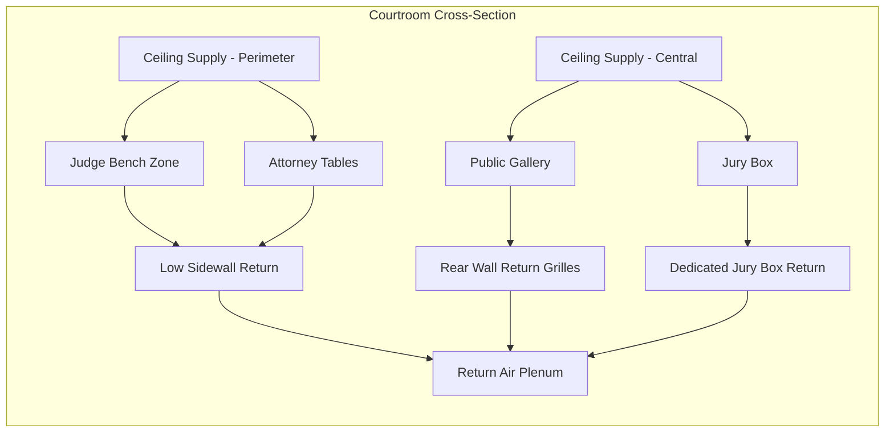
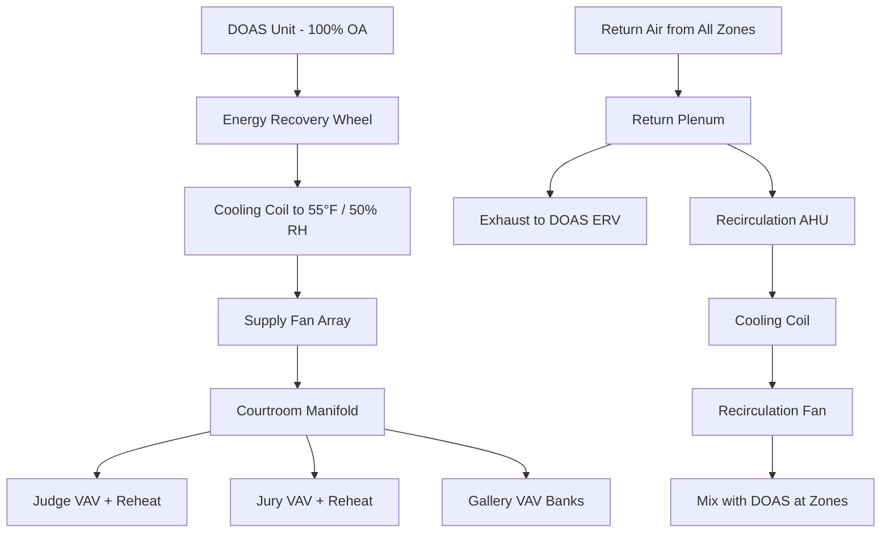

## Overview

Courtroom HVAC systems present unique challenges requiring simultaneous achievement of stringent acoustic performance (NC-25 to NC-30), variable occupancy conditioning, and zone-specific comfort control. The functional separation of courtroom areas—judge bench, jury box, witness stand, attorney tables, and public gallery—demands precise airflow distribution and thermal stratification management while maintaining speech intelligibility.

## Design Parameters

### Occupancy and Load Characteristics

| Zone | Design Occupancy | Sensible Heat (W/person) | Latent Heat (W/person) | Outdoor Air (cfm/person) |
|------|------------------|--------------------------|------------------------|--------------------------|
| Judge Bench | 1-3 | 75 | 55 | 15 |
| Jury Box | 12-14 | 75 | 55 | 15 |
| Witness Stand | 1 | 85 | 65 | 15 |
| Attorney Tables | 4-8 | 75 | 55 | 15 |
| Public Gallery | 30-60 | 75 | 55 | 15 |
| Total Courtroom | 48-86 | - | - | - |

### Environmental Criteria

| Parameter | Requirement | Notes |
|-----------|-------------|-------|
| Temperature (Occupied) | 72°F ± 2°F | Per ASHRAE 55 |
| Relative Humidity | 40-55% | Speech intelligibility range |
| Noise Criteria | NC-25 to NC-30 | Critical for recording |
| Air Changes | 6-8 ACH minimum | Variable with occupancy |
| Outdoor Air | 15 cfm/person | ASHRAE 62.1 minimum |
| Vertical Temperature Gradient | < 3°F per 6 ft | Prevent stratification |

## Acoustic Performance Requirements

### Noise Criteria Calculation

The effective noise level from HVAC systems must not exceed NC-25 to NC-30 to ensure speech intelligibility and recording quality:

$$NC = 10 \log_{10} \left( \sum_{i=1}^{8} 10^{L_i/10} \right) - C$$

Where:
- $L_i$ = sound pressure level in octave band $i$ (dB)
- $C$ = correction factor for room acoustics (typically 5-10 dB)

### Terminal Device Selection

Maximum discharge velocity for diffusers to maintain NC-25:

$$v_{max} = \sqrt{\frac{2 \Delta P}{\rho}} \leq 400 \text{ fpm}$$

Where:
- $\Delta P$ = pressure drop across diffuser (in. w.g.)
- $\rho$ = air density (0.075 lb/ft³ at standard conditions)

For NC-25 compliance, terminal devices should operate at:
- Linear diffusers: 300-400 fpm
- Perforated diffusers: 200-300 fpm
- Displacement outlets: 50-100 fpm

## Variable Occupancy Load Management

Courtroom occupancy varies from minimal (judge, clerk, security) to full capacity during trials. The cooling load swing requires dynamic response:

$$Q_{total} = Q_{sensible} + Q_{latent} = \sum (n \cdot q_s) + \sum (n \cdot q_l)$$

Peak occupancy load differential:

$$\Delta Q = (n_{peak} - n_{min}) \cdot (q_s + q_l)$$

For a typical courtroom with 48 minimum to 86 peak occupancy:

$$\Delta Q = (86 - 48) \times (75 + 55) = 4,940 \text{ W} \approx 1.4 \text{ tons}$$

### Control Strategy

## Airflow Distribution Architecture

### Stratification Prevention

Courtrooms with high ceilings (14-20 ft typical) require careful supply air placement to prevent thermal stratification:

$$\Delta T_{vertical} = \frac{Q_{room} \cdot H}{k \cdot A \cdot ACH} \leq 3°F$$

Where:
- $Q_{room}$ = total room heat gain (Btu/hr)
- $H$ = ceiling height (ft)
- $k$ = thermal mixing coefficient (0.7-0.9 for well-mixed)
- $A$ = floor area (ft²)
- $ACH$ = air changes per hour

### Supply Air Distribution Pattern

### Zone-Specific Requirements

**Judge Bench Area:**
- Dedicated VAV terminal with reheat
- Supply air from ceiling-mounted linear diffusers
- Target throw: 8-12 ft to avoid drafts
- Personal control override: ±2°F from setpoint

**Jury Box:**
- Separate VAV zone for 12-14 occupants
- Low-velocity displacement ventilation preferred
- Return air at high sidewall to remove heat plume
- Acoustic lining in all ductwork

**Witness Stand:**
- Often conditioned by general courtroom supply
- Avoid direct air impingement on witness
- Consider microphone pickup of air noise

**Public Gallery:**
- Multiple VAV terminals based on seating capacity
- 15 cfm/person minimum outdoor air
- CO2-based demand control ventilation
- Perforated ceiling diffusers for even distribution

## System Configuration

### Dedicated Outdoor Air System (DOAS) Integration

Benefits of DOAS for courtrooms:
- Decouples ventilation from zone temperature control
- Ensures consistent outdoor air delivery at all loads
- Reduces reheat energy during partial occupancy
- Simplifies humidity control for recording equipment

### Ductwork Acoustic Treatment

All ductwork serving courtrooms requires:

| Component | Treatment | Performance Target |
|-----------|-----------|-------------------|
| Main Supply Ducts | 1-2 in. internal liner | 10-15 dB attenuation |
| Terminal Runouts | Full length liner | NC-25 at diffuser |
| Return Air Ducts | Acoustic liner | Prevent crosstalk |
| AHU Discharge | Silencer (5-10 ft) | 20-25 dB insertion loss |
| Fan Section | Vibration isolation | < 0.1 in. deflection |

Sound power attenuation through lined duct:

$$L_{out} = L_{in} - (P \cdot L / S)$$

Where:
- $L_{out}$ = sound power level exiting duct (dB)
- $L_{in}$ = sound power level entering duct (dB)
- $P$ = perimeter of duct with liner (ft)
- $L$ = length of lined section (ft)
- $S$ = cross-sectional area of duct (ft²)

## Humidity Control for Recording Equipment

Modern courtrooms contain extensive audio/video recording systems requiring humidity control:

$$W_{室内} = W_{OA} \cdot \frac{cfm_{OA}}{cfm_{total}} + W_{generated}$$

Target humidity ratio: 0.0060-0.0075 lb moisture/lb dry air (40-55% RH at 72°F)

Dehumidification may require:
- DOAS cooling coil to 50-52°F dewpoint
- Desiccant wheel for low-dewpoint applications
- Reheat to avoid overcooling during dehumidification

## Maintenance and Operational Considerations

**Filter Selection:**
- Minimum MERV 13 per ASHRAE 62.1
- MERV 14-15 preferred for IAQ and acoustic performance
- Low pressure drop filters reduce fan noise

**Balancing Requirements:**
- Verify NC levels with calibrated sound meter
- Test at minimum and maximum airflow conditions
- Document background noise with HVAC on/off

**Emergency Ventilation:**
- Maintain minimum ventilation during security lockdown
- Consider separate security zone pressurization
- Ensure life safety systems override comfort controls

## References

- ASHRAE Standard 62.1-2022: Ventilation for Acceptable Indoor Air Quality
- ASHRAE Standard 55-2020: Thermal Environmental Conditions for Human Occupancy
- ASHRAE Applications Handbook Chapter on Justice Facilities
- GSA Sound and Vibration Design Guidelines (P100)
- ANSI S12.60: Acoustical Performance Criteria for Courtrooms