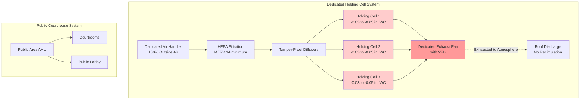
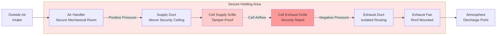

## Overview

Courthouse holding cells require specialized HVAC systems that balance security, occupant health, and operational reliability. These temporary detention spaces demand ventilation rates exceeding standard occupancy requirements while incorporating tamper-resistant components and complete separation from public building systems.

## Ventilation Requirements

### Air Change Rates

ASHRAE Standard 62.1 and American Correctional Association (ACA) standards establish minimum ventilation requirements for holding cells. The ventilation rate must account for high occupancy density and limited egress.

**Required ventilation rate:**

$$Q = \max(n \cdot V, P \cdot R_p)$$

where:
- $Q$ = required airflow (CFM)
- $n$ = air changes per hour (ACH)
- $V$ = cell volume (ft³)
- $P$ = number of occupants
- $R_p$ = per-person ventilation rate (CFM/person)

For courthouse holding cells:

$$Q_{cell} = \max\left(12 \cdot \frac{V}{60}, P \cdot 20\right)$$

Standard design parameters specify 12-15 ACH or 20 CFM per occupant, whichever is greater.

### Ventilation Rate Table

| Space Type | Minimum ACH | CFM/Person | Pressure Relationship |
|------------|-------------|------------|----------------------|
| Single holding cell | 12 | 20 | Negative |
| Multiple occupancy cell | 15 | 20 | Negative |
| Cell corridor | 10 | 15 | Negative |
| Attorney-client room | 8 | 15 | Neutral |
| Transport sally port | 12 | N/A | Negative |

## System Design Principles

### Air Distribution Separation

Holding cell HVAC systems must operate independently from public courthouse areas to prevent:

1. **Contaminant migration** from detention spaces to public areas
2. **Security breaches** through shared ductwork
3. **Cross-contamination** between cells

### Pressure Control Strategy

Maintain negative pressure in all holding areas relative to adjacent spaces:

$$\Delta P = P_{adjacent} - P_{cell} = 0.03 \text{ to } 0.05 \text{ in. WC}$$

This pressure differential prevents odor migration and maintains directional airflow into detention spaces.

### Odor Control Methods

**Multi-stage approach:**

1. **High ventilation rates** (12-15 ACH minimum)
2. **100% outside air** supply (no recirculation)
3. **Negative pressure** maintenance
4. **Activated carbon filtration** in exhaust stream
5. **Direct exhaust** to atmosphere above roof level

Activated carbon bed sizing:

$$M_{carbon} = \frac{Q \cdot C \cdot t}{1000 \cdot \eta}$$

where:
- $M_{carbon}$ = carbon mass required (lbs)
- $Q$ = exhaust airflow (CFM)
- $C$ = contaminant concentration (ppm)
- $t$ = service life (hours)
- $\eta$ = removal efficiency (fraction)

## Security Requirements

### Tamper-Proof Component Specifications

| Component | Security Feature | Material Specification |
|-----------|------------------|------------------------|
| Supply diffusers | Security grille, flush mount | 14-gauge stainless steel |
| Return grilles | Welded frame, tamper-proof screws | 12-gauge stainless steel |
| Thermostats | Recessed, polycarbonate cover | Vandal-resistant housing |
| Ductwork | Concealed above security ceiling | 22-gauge galvanized steel minimum |
| Access panels | Keyed, reinforced | 16-gauge steel with security locks |

### Ductwork Routing

**Critical design considerations:**

1. **No shared ductwork** between holding cells and public spaces
2. **Duct penetrations** through security barriers require steel sleeves
3. **Minimum duct gauge** of 22 for concealed areas
4. **Inspection access** from secure corridors only
5. **Grille bar spacing** not to exceed 4 inches

## Temperature Control

Maintain temperature within ranges specified by ACA standards:

**Winter:** 68-72°F
**Summer:** 72-78°F

Temperature control must be:
- **Non-adjustable** by occupants
- **Monitored remotely** by facility staff
- **Alarmed** for out-of-range conditions

Control strategy equation:

$$T_{supply} = T_{setpoint} - \frac{Q_{sensible}}{1.08 \cdot CFM}$$

## System Monitoring

Implement continuous monitoring for:

1. **Supply airflow** to each cell (±10% alarm threshold)
2. **Exhaust fan status** (failure alarm)
3. **Pressure differential** (loss of negative pressure alarm)
4. **Temperature** in each cell (out-of-range alarm)
5. **Filter differential pressure** (replacement indicator)

## Design Checklist

- [ ] Dedicated air handler for holding cell zone
- [ ] 100% outside air supply (no recirculation)
- [ ] 12-15 ACH minimum ventilation rate
- [ ] Negative pressure maintained in all cells
- [ ] Tamper-proof grilles and components specified
- [ ] No ductwork shared with public areas
- [ ] Exhaust discharged to atmosphere
- [ ] Remote temperature monitoring installed
- [ ] Pressure monitoring with alarms
- [ ] Security grille bar spacing ≤ 4 inches
- [ ] All components accessible only from secure areas

## References

- ASHRAE Standard 62.1: Ventilation for Acceptable Indoor Air Quality
- American Correctional Association (ACA): Performance-Based Standards for Adult Local Detention Facilities
- International Mechanical Code (IMC): Special occupancy requirements
- ASHRAE Handbook - HVAC Applications: Chapter on Justice Facilities
