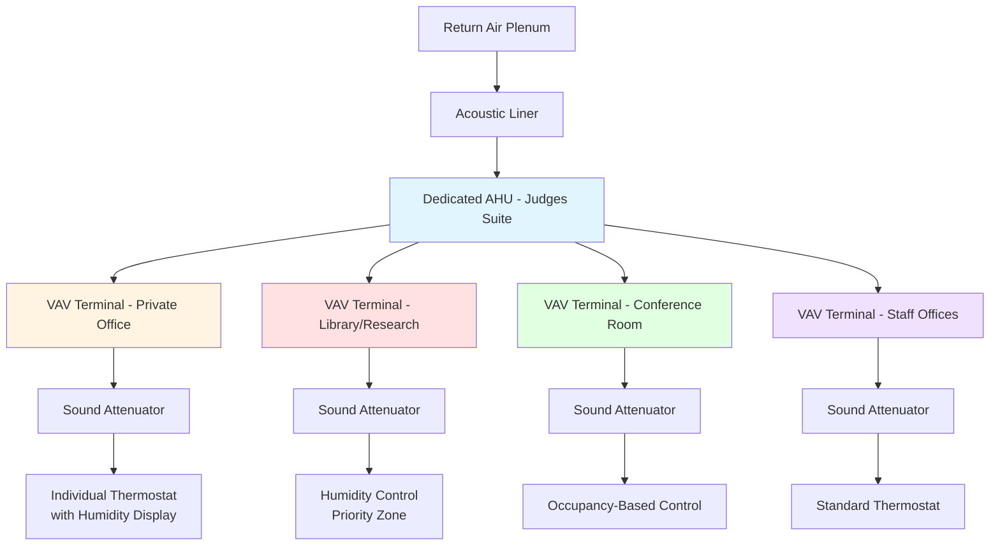
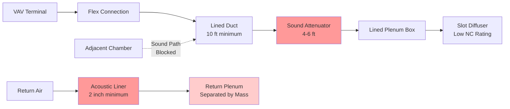

## Overview

Judges' chambers represent a critical private zone within courthouse facilities requiring specialized HVAC design considerations. These spaces demand individual environmental control, acoustic isolation from courtroom and public areas, security-driven air system separation, and precise humidity control for legal document and book storage. The HVAC design must balance judicial comfort requirements per ASHRAE Standard 55 with operational security and maintain appropriate separation from public circulation zones.

## Design Parameters

### Environmental Conditions

| Parameter | Summer | Winter | Notes |
|-----------|--------|--------|-------|
| Dry Bulb Temperature | 74°F ± 2°F | 72°F ± 2°F | Per ASHRAE 55 Category II |
| Relative Humidity | 45-55% | 40-50% | Critical for document preservation |
| Air Changes per Hour | 6-8 ACH | 6-8 ACH | Higher than standard office |
| Outside Air | 20 cfm/person | 20 cfm/person | Per ASHRAE 62.1 office space |
| Sound Level (NC) | NC 30-35 | NC 30-35 | Acoustic privacy requirement |
| Pressure Relationship | Neutral to positive | Neutral to positive | Relative to corridors |

### Book Storage and Library Areas

| Parameter | Requirement | Tolerance |
|-----------|-------------|-----------|
| Temperature | 68-72°F | ± 1°F |
| Relative Humidity | 45-55% | ± 3% |
| Temperature Rate of Change | < 5°F/hour | Maximum |
| RH Rate of Change | < 5%/hour | Maximum |
| Filtration | MERV 13 minimum | Higher for rare documents |

## System Architecture

### Zone Separation Strategy

Judges' chambers require dedicated HVAC zones physically and operationally separated from public areas. This separation provides:

1. **Security isolation** preventing unauthorized air pathway access
2. **Individual control** for judicial preference accommodation
3. **Acoustic privacy** through proper duct design and sound attenuation
4. **After-hours operation** independent of courtroom scheduling

## Individual Temperature Control

Each judge's private office requires dedicated temperature control with expanded adjustment range to accommodate individual thermal preferences. The control system implements a constrained setpoint range to prevent energy waste while providing perceived autonomy.

### Setpoint Control Algorithm

The effective cooling load with individual control adjustment is:

$$Q_{cooling} = Q_{sensible} + Q_{latent} + Q_{offset}$$

Where the offset load accounts for deviation from baseline setpoint:

$$Q_{offset} = \dot{m} \cdot c_p \cdot (T_{setpoint} - T_{baseline})$$

For a typical judge's office (200 ft²) with airflow of 120 cfm:

$$Q_{offset} = (120 \frac{ft^3}{min} \cdot 0.075 \frac{lbm}{ft^3}) \cdot 0.24 \frac{BTU}{lbm \cdot °F} \cdot \Delta T$$

$$Q_{offset} = 2.16 \frac{BTU}{min \cdot °F} \cdot \Delta T = 130 \frac{BTU}{hr \cdot °F} \cdot \Delta T$$

A 3°F setpoint range represents approximately 390 BTU/hr additional capacity requirement per zone.

## Acoustic Privacy Requirements

### Sound Attenuation Design

HVAC-transmitted sound between chambers and adjacent spaces must meet NC 30-35 criteria. The sound pressure level reduction required through duct systems:

$$IL = 10 \log_{10}\left(\frac{W_{in}}{W_{out}}\right)$$

Where insertion loss (IL) must achieve minimum 20 dB attenuation at speech frequencies (500-2000 Hz). Duct-mounted sound attenuators provide:

- **Reactive attenuation**: 15-25 dB in 500-1000 Hz range
- **Absorptive attenuation**: 10-20 dB in 1000-4000 Hz range
- **Length requirement**: Minimum 4 ft attenuator length for judicial applications

### Duct Design for Acoustic Isolation

## Security Separation

### Air System Isolation

Judges' chambers occupy a secure zone requiring physical separation of air distribution systems from public areas. This prevents:

1. **Unauthorized access** through ductwork pathways
2. **Acoustic transmission** from public spaces
3. **Contamination events** affecting judicial operations
4. **Security breach** via air system compromise

Separation requirements:

- **Dedicated air handling equipment** serving only secure zones
- **Separate ductwork risers** with no crossover to public systems
- **Security-rated duct access panels** in chambers areas
- **Positive pressure** relative to adjacent corridors (0.02-0.03 in. w.g.)

The pressure differential maintains directional airflow:

$$\Delta P = \frac{\rho \cdot v^2}{2} \cdot C$$

For security maintenance, minimum 15 cfm differential airflow per door opening maintains positive pressure with door undercuts.

## Humidity Control for Document Storage

### Preservation Requirements

Legal libraries and document storage within chambers require precise humidity control to prevent:

- Paper degradation from excessive dryness (< 40% RH)
- Mold growth from excessive moisture (> 60% RH)
- Dimensional changes in bound volumes
- Adhesive failure in bindings

### Humidity Control Implementation

Dedicated humidity control in library zones uses:

$$\dot{m}_{steam} = \frac{Q_{latent}}{h_{fg}}$$

Where latent load includes:

$$Q_{latent} = \dot{V} \cdot \rho \cdot (W_{supply} - W_{room}) \cdot h_{fg}$$

For a 400 ft² judicial library with 6 ACH and target 50% RH at 70°F, maintaining conditions requires approximately 2-4 lbs/hr steam capacity during winter operation.

## System Configuration Recommendations

### Equipment Selection

**Air Handling Units:**
- Dedicated unit serving only judicial suite
- Variable speed drives for quiet operation
- MERV 13 filtration minimum
- Hydronic heating and cooling (avoids refrigerant in secure areas)
- Supply fan speed: 1800-2200 fpm maximum for low sound generation

**Terminal Units:**
- Pressure-independent VAV boxes with hot water reheat
- Minimum airflow: 30% of peak for ventilation maintenance
- Direct digital controls with individual room sensors
- Humidity sensors in private offices and libraries

**Diffusers and Grilles:**
- Slot diffusers with NC 25-30 rating at design airflow
- Return grilles: 400-500 fpm face velocity maximum
- Architectural integration for professional appearance

### Control Sequences

1. **Individual Office Control:**
   - Occupancy-based setback (unoccupied: 78°F cooling, 68°F heating)
   - User setpoint adjustment: ±3°F from baseline
   - Humidity monitoring with alerts at 40% and 60% RH
   - After-hours operation capability via wall switch override

2. **Library/Storage Control:**
   - Continuous operation during building occupied hours
   - Humidity priority control: tight deadband (48-52% RH)
   - Temperature setpoint: 70°F with ±1°F tolerance
   - Alarming on humidity excursions

## Conclusion

Judges' chambers represent a specialized HVAC design challenge requiring integration of individual comfort control, acoustic isolation, security separation, and preservation-grade environmental control. Success requires dedicated air handling systems, robust sound attenuation, precise humidity control for document storage, and individual zone control that balances judicial preference with energy management. Proper implementation ensures judicial productivity, document preservation, acoustic privacy, and operational security throughout the building lifecycle.
