## Overview

Courthouse public areas present unique HVAC challenges due to extreme occupancy variability, security screening thermal loads, atmospheric contamination from high foot traffic, and the need to maintain dignified environmental conditions under diverse operational scenarios. These spaces require responsive ventilation systems capable of handling morning surges exceeding 200 occupants per hour while maintaining acceptable indoor air quality during low-occupancy periods.

## Design Criteria

### Space Classification and Thermal Parameters

| Space Type | Design Temperature | Relative Humidity | Minimum Outdoor Air | Air Changes per Hour |
|------------|-------------------|-------------------|---------------------|---------------------|
| Main Lobby | 72°F ± 2°F | 40-60% | 0.06 cfm/ft² + 5 cfm/person | 4-6 ACH |
| Security Screening | 70°F ± 2°F | 35-55% | 7.5 cfm/person | 6-8 ACH |
| Public Corridors | 72°F ± 3°F | 40-60% | 0.06 cfm/ft² | 3-4 ACH |
| Waiting Areas | 72°F ± 2°F | 40-60% | 5 cfm/person | 4-5 ACH |
| Public Restrooms | 70°F ± 4°F | Maximum 60% | 100% exhaust | 10-15 ACH |
| Public Cafeteria | 72°F ± 2°F | 40-55% | 7.5 cfm/person | 8-12 ACH |

Reference: ASHRAE Standard 62.1-2022 for ventilation rates; ASHRAE Standard 55-2020 for thermal comfort parameters.

## Load Calculation Methodology

### Sensible Cooling Load for Variable Occupancy Spaces

The total sensible heat gain for courthouse lobbies and public areas:

$$Q_{sensible} = Q_{lights} + Q_{equip} + Q_{people} + Q_{solar} + Q_{transmission}$$

Where occupant load dominates during peak hours:

$$Q_{people} = N_{occ} \times q_{sensible} \times CLF$$

For security screening areas with X-ray equipment:

$$Q_{screening} = \sum_{i=1}^{n} P_{equip,i} \times F_{usage} \times F_{radiation} + N_{occ} \times 250 \text{ Btu/hr}$$

Where:
- $N_{occ}$ = peak occupancy (persons)
- $q_{sensible}$ = sensible heat per person (250 Btu/hr seated, 350 Btu/hr standing/walking)
- $CLF$ = cooling load factor (0.85-0.95 for high-traffic areas)
- $P_{equip,i}$ = connected electrical load of screening equipment (W)
- $F_{usage}$ = usage factor (0.7-0.9 for security equipment)
- $F_{radiation}$ = radiation factor (0.6-0.8 for enclosed electronics)

### Ventilation Airflow Calculation

Per ASHRAE 62.1, the breathing zone outdoor airflow:

$$V_{bz} = R_p \times P_z + R_a \times A_z$$

For dynamic occupancy control:

$$V_{oa,dynamic} = V_{oa,min} + K_{resp} \times (CO_2 - CO_{2,baseline})$$

Where:
- $R_p$ = outdoor air rate per person (cfm/person)
- $P_z$ = zone population (persons)
- $R_a$ = outdoor air rate per unit area (cfm/ft²)
- $A_z$ = zone floor area (ft²)
- $K_{resp}$ = response coefficient for CO₂-based demand control
- $CO_{2,baseline}$ = outdoor CO₂ concentration (typically 400 ppm)

## System Zoning Strategy

```mermaid
graph TD
    A[Courthouse Public HVAC System] --> B[Main Lobby Zone]
    A --> C[Security Screening Zone]
    A --> D[Public Corridor Zone]
    A --> E[Waiting Area Zone]
    A --> F[Restroom Exhaust Zone]
    A --> G[Cafeteria Zone]

    B --> B1[VAV with CO2 Control]
    B --> B2[Vestibule Heating]
    B --> B3[High Ceiling Destratification]

    C --> C1[Constant Volume Supply]
    C --> C2[Equipment Heat Removal]
    C --> C3[Queue Area Comfort]

    D --> D1[VAV Minimal Setback]
    D --> D2[Perimeter Compensation]

    E --> E1[VAV with Occupancy Sensing]
    E --> E2[Individual Zone Control]

    F --> F1[Constant Exhaust]
    F --> F2[Negative Pressure Maintenance]

    G --> G1[Dedicated OA System]
    G --> G2[Kitchen Exhaust Coordination]
    G --> G3[Odor Control]

    style C fill:#ffcccc
    style B fill:#cce5ff
    style F fill:#ffffcc
```

## Control Strategies for Variable Occupancy

### Demand-Controlled Ventilation

Implement CO₂-based DCV in lobbies and waiting areas to optimize energy consumption during low-occupancy periods while ensuring adequate ventilation during peak hours. CO₂ setpoint: 1000 ppm maximum, with outdoor air modulation between minimum code ventilation and design maximum.

### Occupancy-Based Reset

Configure DDC sequences to adjust supply air temperature and airflow based on real-time occupancy data from security logs or infrared sensor arrays:

- **Morning surge mode** (0700-0900): Preheat/precool to setpoint minus 1°F, ramp to 100% airflow capacity
- **Peak operation** (0900-1600): Standard temperature control, full ventilation air
- **Evening reduction** (1600-1800): Gradual setback to 70°F heating/76°F cooling
- **Night setback** (1800-0700): Minimum ventilation, 60°F heating/85°F cooling

### Security Screening Zone Requirements

Maintain constant airflow to security checkpoints regardless of occupancy to remove heat from continuously operating X-ray machines and metal detectors. Equipment loads typically range from 2-5 kW per screening lane. Provide localized cooling to prevent operator discomfort in enclosed screening stations.

## Pressurization and Airflow Relationships

Maintain slight positive pressure (+0.02 to +0.05 in. w.c.) in public lobbies relative to outdoors to minimize infiltration. Security screening areas should operate at neutral to slightly positive pressure relative to lobbies. Ensure restrooms maintain negative pressure (-0.05 to -0.10 in. w.c.) relative to adjacent public spaces with 100% exhaust and no recirculation.

## Acoustic Considerations

Public areas require stringent acoustic performance to maintain decorum:

- **Lobby and waiting areas**: NC 35-40
- **Security screening**: NC 40-45
- **Corridors**: NC 40
- **Restrooms**: NC 45

Specify low-velocity duct design (maximum 1500 fpm in occupied spaces), acoustic duct liner in terminal sections, and sound traps at major branch takeoffs. Locate mechanical equipment rooms remote from public waiting areas.

## Energy Recovery and Sustainability

High outdoor air requirements in public areas make energy recovery economically favorable. Rotary enthalpy wheels or plate heat exchangers can recover 60-75% of exhaust energy. Size recovery systems for design outdoor air quantities, not peak airflow, to optimize first cost and efficiency.

## Special Considerations

**Vestibule Design**: Provide heated vestibules at main entrances with minimum 100 fpm air velocity air curtains or positively pressurized vestibules to minimize winter infiltration during high-traffic periods.

**High Ceiling Spaces**: Lobbies with ceiling heights exceeding 20 feet require destratification fans to prevent thermal stratification and maintain occupant comfort at floor level.

**Emergency Operation**: Design systems to maintain minimum ventilation and temperature control during emergency scenarios when public areas may serve as assembly points. Provide emergency generator backup for primary lobby air handling units.

**Filtration**: Minimum MERV 13 filtration for all public area systems per ASHRAE Standard 62.1. Consider MERV 14 or higher in high-traffic areas to address particulate matter from foot traffic and outdoor contamination.
