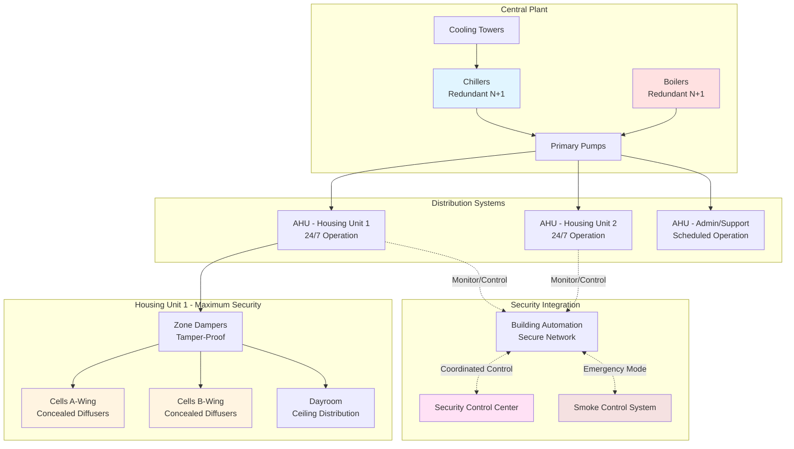
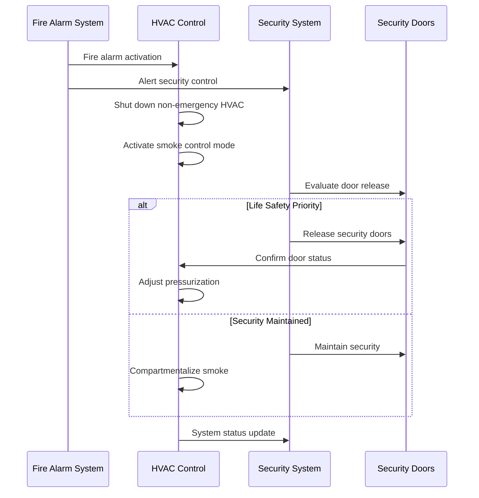

Prison and jail HVAC systems present unique challenges that merge conventional climate control with critical security requirements. These systems must provide code-compliant ventilation and thermal comfort while preventing tampering, eliminating contraband concealment opportunities, and maintaining operational continuity in high-risk environments.

## Unique HVAC Requirements for Correctional Facilities

Correctional facility HVAC design diverges significantly from commercial applications due to security imperatives, operational constraints, and regulatory oversight.

**Security-Driven Design Constraints:**
- All accessible components must be tamper-resistant or inaccessible to inmates
- Ductwork and grilles designed to prevent contraband passage or concealment
- Equipment locations must not create climbing opportunities or hiding spaces
- No removable parts that could be weaponized
- Fire dampers and access panels secured against unauthorized manipulation

**Operational Requirements:**
- 24/7/365 operation with no scheduled downtime windows
- Redundancy for critical areas (segregation, medical, intake)
- Independent zone control for lockdown scenarios
- Smoke control integrated with security protocols
- Rapid response to environmental emergencies without compromising security

**Regulatory Framework:**
- ASHRAE Standard 62.1 for ventilation rates
- American Correctional Association (ACA) standards for environmental conditions
- National Institute of Corrections (NIC) design guidelines
- State and local corrections regulations
- Building and mechanical codes with correctional amendments

## Facility Type Classification and HVAC Impacts

Different correctional facility types impose distinct HVAC design requirements based on security level, occupancy density, and operational characteristics.

| Facility Type | Security Level | Typical Housing | HVAC Design Priority |
|---------------|----------------|-----------------|----------------------|
| Maximum Security Prison | Level 5 | Single cells, 23-hour lockdown | Total equipment inaccessibility, redundancy |
| Medium Security Prison | Level 3-4 | Double cells, dormitories | Tamper resistance, zoning flexibility |
| Minimum Security Prison | Level 1-2 | Dormitory, barracks | Standard commercial with security enhancements |
| County Jail | Variable | Pods, dormitories, cells | Flexible control, quick response |
| Juvenile Detention | Low-Medium | Single rooms, group housing | Accessible controls with supervision, comfort focus |
| Detention Center | Low-Medium | Dormitory, temporary housing | Scalable capacity, rapid setup |

## Ventilation Requirements and Calculations

Correctional facilities require elevated ventilation rates compared to commercial buildings due to high occupant density and limited operable windows.

**ASHRAE 62.1 Minimum Ventilation Rates:**

$$Q_{total} = \sum_{i=1}^{n} \left( R_p \cdot P_i + R_a \cdot A_i \right)$$

Where:
- $Q_{total}$ = total outdoor air requirement (CFM)
- $R_p$ = people outdoor air rate (CFM/person)
- $P_i$ = zone population
- $R_a$ = area outdoor air rate (CFM/ft²)
- $A_i$ = zone floor area (ft²)

**Correctional Facility Specific Rates:**

| Space Type | $R_p$ (CFM/person) | $R_a$ (CFM/ft²) | Air Changes/Hour |
|------------|---------------------|-----------------|------------------|
| Cells (single/double) | 5 | 0.12 | 10-15 ACH |
| Dormitories | 5 | 0.12 | 12-18 ACH |
| Dayrooms | 7.5 | 0.06 | 8-12 ACH |
| Kitchens | 7.5 | 0.18 | 15-20 ACH |
| Intake/Booking | 7.5 | 0.06 | 10-15 ACH |
| Medical/Infirmary | 25 | 0.12 | 6-12 ACH |
| Visitation | 7.5 | 0.06 | 8-10 ACH |

**Example Calculation for 48-Bed Dormitory:**

Given: 48 inmates, 4,800 ft² floor area

$$Q_{total} = (5 \text{ CFM/person} \times 48) + (0.12 \text{ CFM/ft}^2 \times 4800)$$

$$Q_{total} = 240 + 576 = 816 \text{ CFM minimum outdoor air}$$

For 15 ACH in this space:

$$Q_{supply} = \frac{4800 \text{ ft}^2 \times 12 \text{ ft ceiling} \times 15 \text{ ACH}}{60 \text{ min/hr}} = 14,400 \text{ CFM}$$

## System Architecture and Configurations

## HVAC System Types for Correctional Applications

**Central Air Handling Systems with Terminal Distribution:**
- Most common for medium to large facilities
- Central AHUs located in secured mechanical rooms
- Supply and return ductwork concealed above security ceilings or in chases
- Terminal devices (diffusers, grilles) flush-mounted and tamper-resistant
- Provides excellent control and filtration

**Rooftop Units with Ducted Distribution:**
- Equipment physically inaccessible on roof
- Suitable for single-story or low-rise facilities
- Reduced mechanical room space requirements
- Individual zone control through VAV or zone dampers
- Limited redundancy compared to central systems

**Dedicated Outdoor Air Systems (DOAS) with Local Conditioning:**
- DOAS provides code-required ventilation air
- Supplemental heating/cooling via radiant panels or fan coil units
- Enhanced energy efficiency
- Requires careful integration of security concerns with distributed equipment

**Water-Source Heat Pump Systems:**
- Individual heat pumps serve zones or housing units
- Equipment located in secure areas or above ceilings
- Provides heating and cooling with single system
- Limited outdoor air capability requires supplemental ventilation system

## Security Integration Considerations

**Physical Security Measures:**
- Ductwork sized to prevent human passage (typically maximum 6-inch dimension)
- Security bars or expanded metal in large ducts near access points
- Continuous welded duct connections in maximum security areas
- No lay-in ceiling tiles in inmate-accessible areas
- Diffusers and grilles with tamper-resistant fasteners (one-way screws, welded)

**Control System Security:**
- Building automation on isolated network segment
- No inmate access to thermostats or controls
- Override capability from security control center
- Lockdown mode programming for emergency scenarios
- Audit logging of all control changes

**Fire and Smoke Control:**
- Smoke dampers coordinated with security door releases
- Fire alarm integration with HVAC shutdown sequences
- Pressurization systems for exit corridors and stairs
- Emergency power for critical ventilation systems

## Design Best Practices

**Equipment Selection and Placement:**
- Locate all mechanical equipment outside inmate-accessible areas
- Use heavy-gauge materials for exposed ductwork and components
- Select equipment with long service intervals to reduce maintenance intrusions
- Provide redundancy for critical systems (N+1 minimum for housing units)

**Ductwork and Distribution:**
- Conceal all ductwork in walls, structural chases, or above security ceilings
- Use welded or riveted seams in maximum security areas
- Install ductwork cleanout access in secure corridors or mechanical spaces only
- Design for acoustical privacy between cells and housing units

**Controls and Monitoring:**
- Centralized control with no local occupant override
- Temperature monitoring in all occupied spaces
- Alarm integration for out-of-range conditions
- Manual override capability from security control center
- Trend logging for operational verification and forensic analysis

**Maintenance Access:**
- All maintenance access points in secure areas only
- Coordinate access procedures with security operations
- Design for filter changes and routine maintenance without inmate area entry
- Provide adequate space for equipment removal and replacement

## Operational Considerations

Correctional facility HVAC systems require specialized operational protocols that balance mechanical performance with security requirements. Maintenance activities must be scheduled during lockdown periods or with enhanced security presence. System redundancy allows for maintenance without service interruption to occupied housing units.

Energy efficiency in correctional facilities must be achieved through central plant optimization, heat recovery systems, and efficient equipment selection rather than setback strategies common in commercial buildings. The 24/7 occupancy profile demands continuous operation with minimal temperature variance.

Temperature control represents a balance between humane conditions and operational control. ACA standards typically require maintenance of space temperatures between 68°F and 85°F. Precise control can be challenging in high-density housing with variable occupancy and heat loads from lighting, occupants, and equipment.
