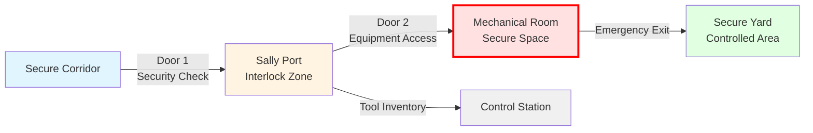
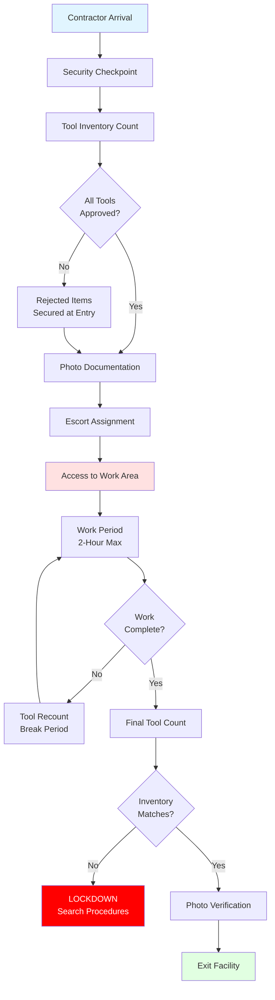

## Overview

HVAC access control in correctional facilities requires coordinated integration of mechanical system accessibility with institutional security protocols. Access to mechanical equipment, control panels, and distribution systems must balance operational maintenance requirements against security imperatives that prevent escape routes, weapon fabrication, and system sabotage.

The fundamental design challenge involves creating maintenance access pathways that satisfy ASHRAE Standard 15 clearance requirements while maintaining security classification boundaries established by the American Correctional Association (ACA) and National Institute of Corrections (NIC).

## Security Classification Zones

HVAC access control protocols vary by institutional security level and zone classification:

| Security Level | Access Protocol | Escort Requirement | Tool Control | Response Time |
|----------------|-----------------|-------------------|--------------|---------------|
| Maximum Security | Dual verification + armed escort | 2 officers minimum | Individual inventory log | <15 minutes |
| Medium Security | Single verification + escort | 1 officer minimum | Group inventory sheet | <30 minutes |
| Minimum Security | Badge access + notification | As available | Sign-out procedure | <60 minutes |
| Administrative | Badge access only | None required | No formal control | Immediate |
| Perimeter Support | Supervised access | As available | Standard procedures | <45 minutes |

## Mechanical Room Security Design

### Physical Access Control

Mechanical rooms in correctional facilities require hardened construction that exceeds commercial building standards. Wall assemblies must achieve security ratings that prevent breaching:

**Minimum Construction Standards:**
- Walls: 8-inch reinforced concrete or CMU with #5 rebar at 12 inches on center
- Doors: 16-gauge steel with continuous piano hinge, rated for 3-hour fire resistance
- Locks: Abloy Protec2 or equivalent high-security cylinder with restricted keyway
- Vision panels: Polycarbonate glazing minimum 0.75 inches thick with wire mesh reinforcement
- Ceiling: Hardened to same standard as walls to prevent overhead access

### Sally Port Integration

Large mechanical equipment requiring periodic replacement necessitates sally port access design:

**Interlock Requirements:**
- Doors 1 and 2 cannot simultaneously open (electrical interlock + mechanical override)
- Minimum 6-foot clear distance between doors
- CCTV coverage with recording at control station
- Two-way communication system
- Duress alarm accessible from both doors

### Equipment Cage Enclosures

Within mechanical rooms serving inmate areas, individual equipment items require secondary containment:

**Caging Standards:**
- Welded wire mesh: 9-gauge minimum, 2×2 inch maximum opening
- Frame: 2-inch square tube steel, anchored to structure
- Access door: Padlock hasp with tamper-evident seal
- Clearance: Maintain ASHRAE 15 minimum 36-inch service access on equipment sides requiring maintenance

This secondary barrier prevents access to:
- Refrigerant service ports (R-410A cylinders potential weapons)
- Electrical disconnect switches (shock hazard creation)
- Belt guards and rotating equipment (injury potential)
- Control wiring and pneumatic tubing (system sabotage)

## Airflow and Pressurization Control

Access control zones require pressure differential maintenance to prevent airborne contaminant migration and smoke infiltration during emergency conditions.

### Pressure Differential Requirements

The required supply airflow to maintain pressure differential across access barriers follows:

$$Q = \frac{A \cdot \sqrt{2 \cdot \Delta P \cdot \rho}}{\rho} \cdot C_d$$

Where:
- $Q$ = Required airflow (CFM)
- $A$ = Door leakage area (ft²), typically 0.5-1.5 ft² for security doors
- $\Delta P$ = Pressure differential (inches w.g.), minimum 0.05 inches w.g.
- $\rho$ = Air density (0.075 lb/ft³ at standard conditions)
- $C_d$ = Discharge coefficient (0.65 for door gaps)

For mechanical rooms relative to adjacent secure corridors:

$$Q_{mech} = 1.5 \cdot V \cdot ACH$$

Where:
- $V$ = Room volume (ft³)
- $ACH$ = Air changes per hour (minimum 6 per ASHRAE 62.1 for mechanical spaces)
- Factor 1.5 accounts for infiltration through security construction gaps

**Target Pressure Relationships:**
- Mechanical room: +0.03 to +0.05 inches w.g. relative to corridor (prevent corridor air entry)
- Sally port: Neutral pressure (prevents door opening force issues)
- Control room: +0.08 to +0.10 inches w.g. relative to all adjacent spaces

## Escort and Access Protocols

### Contractor Access Procedures

External contractors performing HVAC maintenance in secure areas follow structured protocols:

1. **Pre-Access Clearance** (24-48 hours advance)
   - Background verification through institutional security
   - Tool inventory submission and approval
   - Prohibited items briefing
   - Assignment of escort officer(s)

2. **Entry Procedure**
   - Metal detector screening
   - Tool inventory verification against submitted list
   - Photographic documentation of tools and equipment
   - Issue of temporary badge with zone restrictions

3. **Work Period Controls**
   - Continuous escort presence (line of sight maintained)
   - Periodic tool inventory counts (minimum every 2 hours)
   - Communication device for escort (radio to control)
   - Time limit enforcement per security policy

4. **Exit Procedure**
   - Final tool inventory verification
   - Metal detector re-screening
   - Photographic documentation of tools leaving
   - Badge surrender and log-out
   - Escort officer incident report (any deviations noted)

### Tool Control Procedures

Tool accountability prevents weapon creation and escape implement provision:

**Prohibited Items:**
- Files and rasps (can create sharp weapons)
- Wire cutters exceeding 6-inch length
- Portable grinders and cutting wheels
- Saws with blades longer than 4 inches
- Glass thermometers containing mercury

**Controlled Items Requiring Special Approval:**
- Cordless power tools (battery removal between uses)
- Extension cords and temporary wiring (counted in/out)
- Refrigerant cylinders (secured and inventoried)
- Brazing equipment and fuel cylinders (special custody protocols)
- Ladders exceeding 6-foot height (escape concern)

## Remote Monitoring Integration

Access control effectiveness increases through integration of HVAC building automation systems (BAS) with institutional security infrastructure.

### Critical Monitoring Points

**Door Position Sensors:**
- Mechanical room access doors (hard-wired to security control)
- Equipment cage access gates
- Sally port doors (interlock verification)
- Status transmission: immediate alarm on unauthorized opening

**Environmental Sensors Indicating Access:**
- Occupancy sensors in mechanical rooms (PIR or ultrasonic)
- Light switch status (unexpected illumination)
- Temperature deviation (doors left open)
- Carbon dioxide elevation (personnel presence)

**Equipment Status Monitoring:**
- Disconnect switch position (unexpected shutdown)
- VFD fault codes (tampering indication)
- Filter pressure drop (access panel removal)
- Refrigerant pressure (service port access)

### BAS-Security System Integration

Integration architecture connects mechanical monitoring to centralized security control:

- DDC controller outputs hardwired to security panel inputs (dry contact)
- Alarm priority classification: immediate response vs. maintenance notification
- Access correlation: compare badge swipe time with door sensor activation
- Video management system integration: mechanical alarm triggers camera recording
- Automated lockdown response: HVAC system transitions to emergency mode on facility-wide alert

## Panel Access Restrictions

Electrical panels and control interfaces within secure areas require restricted access independent of mechanical room security:

**Panel Security Measures:**
- Enclosure locks: cam locks with restricted key control
- Tamper-evident seals on door edges (monthly inspection)
- Panel schedule posted inside door only (external label shows panel number only)
- Circuit breaker lockout capability for critical circuits
- Access log maintained for all panel openings

**Critical Circuits Requiring Additional Protection:**
- Life safety systems (smoke control, emergency lighting)
- Security systems (cameras, access control, alarms)
- Communication systems (intercoms, public address)
- Control room HVAC (maintains operator environment)

## Maintenance Access Planning

HVAC system design must accommodate maintenance requirements within security constraints:

**Design Considerations:**
- Equipment selection favoring reliability over complexity (reduces access frequency)
- Redundancy allowing maintenance during facility operation (no access during counts)
- Filter access from non-secure corridors where possible (avoid escort requirements)
- Remote-mount compressors and condensers (locate in less secure zones)
- Modular component design (minimize time in secure areas)

**Scheduled Maintenance Windows:**
- Coordinate with facility operations schedule
- Avoid shift changes, meals, counts (maximum inmate movement periods)
- Preferred times: mid-morning (0900-1100) or mid-afternoon (1400-1600)
- Advanced scheduling: minimum 72 hours notice for secure zone access
- Backup dates: anticipate security incidents preventing access

## Conclusion

HVAC access control in correctional facilities requires physical security measures, procedural protocols, and monitoring integration that exceed commercial building standards. Successful implementation balances maintenance accessibility against security imperatives through layered control systems, structured access procedures, and technology integration linking mechanical and security operations. Design decisions must prioritize security without compromising HVAC system reliability that maintains habitable conditions required by constitutional standards.

## References

- ASHRAE Standard 15: Safety Standard for Refrigeration Systems
- ASHRAE Standard 62.1: Ventilation for Acceptable Indoor Air Quality
- American Correctional Association: Standards for Adult Correctional Institutions
- National Institute of Corrections: Planning and Design Guide for Secure Adult and Juvenile Facilities
- International Mechanical Code: Chapter 3, General Regulations
