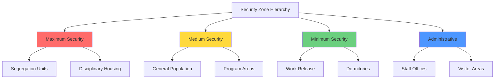
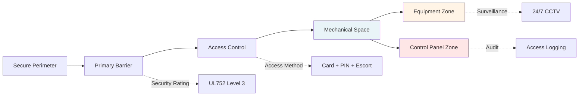

## Physical Security Requirements

HVAC systems in correctional facilities operate under fundamentally different design constraints than conventional buildings. Security requirements dictate equipment placement, accessibility, component selection, and system architecture. Every air handling unit, ductwork penetration, and control device represents a potential security vulnerability requiring engineered mitigation.

### Security Zone Classification

Correctional HVAC design begins with security zone mapping. Each area demands specific security levels that directly influence mechanical system design:

## Tamper-Resistant Design Principles

### Equipment Hardening Requirements

All HVAC components accessible to or visible by inmates require security hardening. Design specifications must address material selection, mounting methods, and fail-safe operation.

| Component | Security Requirement | Design Solution |
|-----------|---------------------|-----------------|
| Diffusers/Grilles | Tamper-proof fasteners | Stainless steel, security screws, welded frames |
| Thermostats | Sealed enclosures | Vandal-resistant covers, remote sensing |
| Ductwork | Penetration resistance | 16-gauge minimum, welded seams, secure hangers |
| Dampers | Manual override prevention | Locked actuators, enclosed linkages |
| Piping | Cutting/breakage resistance | Schedule 80, protective boxing, concealed routing |
| Controls | Unauthorized access prevention | Locked panels, encrypted protocols, audit logging |

### Contraband Prevention Through Design

HVAC systems present contraband transfer risks through ductwork, pipe chases, and equipment access panels. The design must eliminate or severely restrict these pathways.

**Duct sizing contraband analysis:**

Maximum permissible duct dimension for contraband prevention:

$$D_{max} = \min(D_{flow}, D_{security})$$

Where:
- $D_{flow}$ = hydraulically required duct dimension (inches)
- $D_{security}$ = maximum security-allowable dimension (typically 6-8 inches)

For airflow requirements exceeding security dimensions:

$$n = \left\lceil \frac{Q_{total}}{V \cdot A_{max}} \right\rceil$$

Where:
- $n$ = number of parallel ducts required
- $Q_{total}$ = total airflow requirement (CFM)
- $V$ = design velocity (FPM)
- $A_{max}$ = maximum allowable duct area (ft²)

### Security Grille Design Specifications

Grilles and diffusers in high-security areas require specific construction parameters:

**Perforation sizing requirements:**

$$d_{perf} \leq 0.25 \text{ inches (6.4 mm)}$$

$$t_{screen} \geq 0.109 \text{ inches (10 gauge)}$$

**Mounting security factor:**

$$SF = \frac{F_{fastener} \cdot n_{fasteners}}{F_{removal}}$$

Where:
- $SF$ = security factor (minimum 3.0 required)
- $F_{fastener}$ = individual fastener shear strength (lbf)
- $n_{fasteners}$ = number of fasteners
- $F_{removal}$ = estimated removal force (lbf)

## Mechanical Room Security Architecture

### Equipment Room Access Control Matrix

| Space Type | Access Level | Entry Requirements | Monitoring |
|------------|-------------|-------------------|------------|
| Primary mechanical rooms | Level 1 (Restricted) | Card + PIN + escort | CCTV + motion + access log |
| Secondary equipment spaces | Level 2 (Controlled) | Card + escort | CCTV + access log |
| Roof-mounted equipment | Level 1 (Restricted) | Supervised maintenance only | Perimeter detection + CCTV |
| Control rooms | Level 1 (Restricted) | Card + PIN + biometric | CCTV + access log + audit trail |

### Roof Access Prevention Strategies

Rooftop HVAC equipment creates escape risks and contraband introduction opportunities. Design must incorporate multiple security layers:

1. **Physical barriers**: 12-foot minimum fence height with razor wire or anti-climb extensions
2. **Detection systems**: Motion sensors, vibration detectors, pressure-sensitive surfaces
3. **Visual monitoring**: 360-degree CCTV coverage with infrared capability
4. **Access restriction**: Single controlled entry point, escort requirements
5. **Equipment hardening**: Welded panels, security fasteners, locked disconnects

**Minimum barrier height calculation:**

$$H_{barrier} = H_{equip} + H_{climb} + H_{det}$$

Where:
- $H_{barrier}$ = required barrier height
- $H_{equip}$ = equipment height above roof deck
- $H_{climb}$ = additional climbing potential (typically 4-6 feet)
- $H_{det}$ = detection deterrent height (minimum 2 feet above climbable surface)

## Zone Isolation and Pressurization Control

Security zoning requires precise pressure relationships to prevent cross-contamination and maintain controlled environments.

### Pressure Cascade Design

Maximum security areas operate under negative pressure relative to adjacent spaces:

$$\Delta P_{cascade} = -0.02 \text{ to } -0.05 \text{ in. w.g. per boundary}$$

**Multi-zone pressure relationship:**

$$P_{admin} > P_{min-sec} > P_{med-sec} > P_{max-sec} > P_{isolation}$$

Minimum pressure differential between zones:

$$\Delta P_{min} = 0.02 \text{ in. w.g.}$$

Control tolerance:

$$\Delta P_{tolerance} = \pm 0.005 \text{ in. w.g.}$$

## Standards and Compliance Framework

### American Correctional Association (ACA) Requirements

ACA performance-based standards mandate:
- Minimum 10 air changes per hour in housing units
- Temperature range: 68-85°F
- Relative humidity: 30-60%
- Outdoor air: 15 CFM per person minimum

### ASHRAE Application Guidelines

ASHRAE Standard 62.1 provisions apply with security modifications:
- Ventilation effectiveness adjustments for security grilles (typically 0.8-0.9 factor)
- Exhaust requirements for special-use areas (intake/processing, medical, kitchens)
- Air quality monitoring in isolation and segregation units

### Key Control and Lockout/Tagout Integration

All mechanical spaces require comprehensive key control procedures integrated with facility security protocols. Access to HVAC systems must follow documented procedures with dual authorization for critical equipment areas. Maintenance activities require security coordination with advance notification, escort assignment, and tool accountability procedures.

## Fail-Safe System Design

HVAC controls must default to safe operational modes during power loss or system failure:
- Smoke dampers fail closed
- Fire dampers close automatically
- Ventilation maintains minimum code requirements on emergency power
- Critical area pressurization maintained through UPS-backed controls
- Manual override capability locked behind security enclosures

Security-driven HVAC design balances operational efficiency with institutional safety requirements. Every design decision considers security implications while maintaining code-compliant environmental conditions for occupants and staff.
