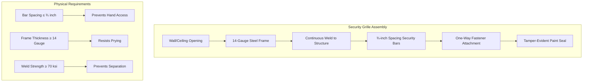
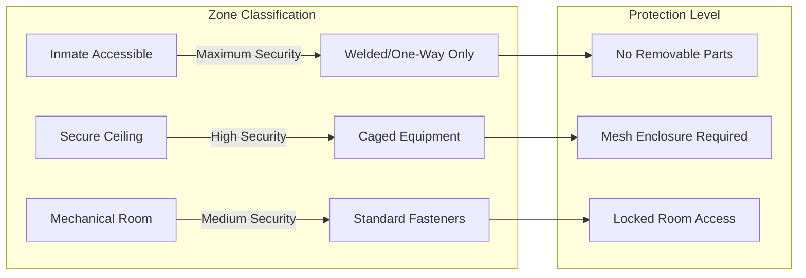

## Physical Security Principles

Tamper-proof HVAC design in correctional facilities addresses three fundamental security objectives: prevention of unauthorized equipment access, elimination of potential weapons or contraband concealment, and protection of environmental control integrity. All accessible HVAC components in inmate-occupied zones require detention-grade hardening that resists tampering, vandalism, and weaponization.

The primary failure mode in correctional HVAC systems involves component disassembly to extract fasteners, create sharp edges, or disable environmental controls. Security engineering focuses on eliminating removable parts, using one-way fastening methods, and designing components that cannot be damaged without specialized tools unavailable to inmates.

## Detention-Grade Equipment Specifications

### Tamper-Resistant Fastener Requirements

| Fastener Type | Security Level | Application | Torque Resistance |
|---------------|----------------|-------------|-------------------|
| One-Way Screws | Maximum Security | All accessible panels | Removal impossible without destruction |
| Security Torx (T5-Pin) | High Security | Equipment covers | 15-20 ft-lbs tamper torque |
| Shear Nuts | Maximum Security | Grille attachment | Heads shear at 12 ft-lbs |
| Welded Construction | Absolute Security | Diffusers, terminal units | N/A (permanent assembly) |
| Tamper-Proof Hex | Medium Security | Non-critical access | 10-15 ft-lbs tamper torque |

All fasteners in direct supervision housing, maximum security cells, and holding areas must be either one-way (installation only) or require specialized tools not available through standard maintenance equipment. Thread engagement depth must prevent backing out the fastener before stripping occurs.

### Grille and Diffuser Hardening

Security grilles must prevent insertion of hands or tools into ductwork while maintaining required airflow. Bar spacing shall not exceed ¾-inch (19 mm) in any dimension. Frame construction uses minimum 14-gauge steel with continuous welds to structural elements rather than mechanical fasteners.

The critical geometric constraint for bar spacing derives from hand anthropometry:

$$w_{\text{max}} = d_{\text{hand}} - 2t_{\text{compression}} \leq 19 \text{ mm}$$

where $w_{\text{max}}$ is maximum opening width, $d_{\text{hand}}$ is compressed hand diameter (typically 25 mm), and $t_{\text{compression}}$ accounts for tissue compression limits.

### Terminal Unit Protection

Fan-powered and variable air volume (VAV) terminal units in accessible ceiling spaces require steel mesh caging with ½-inch maximum opening dimension. The protective enclosure must:

- Enclose all accessible surfaces with 12-gauge welded wire mesh
- Provide tamper-resistant access panels for maintenance (keyed access)
- Prevent contact with moving components (minimum 2-inch clearance)
- Maintain required service clearances outside the security cage

Control wiring and pneumatic tubing must run through rigid conduit rather than exposed installation. All conduit terminations require compression fittings that cannot be disassembled without specialized tools.

## Access Control and Equipment Placement

### Equipment Zoning Strategy

**Zone 1 - Direct Inmate Contact**: All components within 10 feet of floor level or accessible from bunks/furniture require absolute tamper-proof construction. This includes supply/return grilles, thermostats, light fixtures with HVAC integration, and any visible fasteners.

**Zone 2 - Secure Ceiling Plenum**: Equipment in non-accessible ceiling spaces (above security-rated ceiling systems) requires intermediate protection consisting of locked access panels and caged mechanical components.

**Zone 3 - Mechanical Spaces**: HVAC equipment in locked mechanical rooms with controlled access follows standard commercial security protocols with keyed access and intrusion detection.

## Control System Hardening

Thermostat and control device specifications for detention applications:

| Component | Standard Construction | Detention-Grade Requirement |
|-----------|----------------------|----------------------------|
| Thermostat Housing | Plastic snap-fit | Polycarbonate welded case |
| Setpoint Adjustment | Exposed dial | Flush-mounted tool adjustment |
| Cover Fasteners | Phillips screws | One-way security screws |
| Wiring Access | Removable backplate | Sealed junction box |
| Override Controls | Accessible buttons | Key-switch or BMS only |

Setpoint adjustment must require specialized tools or be locked behind panels accessible only to staff. The physical relationship between cover removal force and inmate capability:

$$F_{\text{required}} > 3 \cdot F_{\text{manual}} \approx 450 \text{ lbf}$$

where $F_{\text{manual}}$ represents maximum sustained manual force (approximately 150 lbf) and the safety factor of 3 accounts for improvised leverage tools.

## Ductwork Protection Standards

Exposed ductwork in inmate-accessible areas requires internal bar reinforcement to prevent collapse or crushing that could compromise airflow. Rectangular ducts larger than 8×8 inches require:

- Internal cross-bracing at 24-inch maximum spacing
- Minimum 16-gauge galvanized steel construction (22-gauge inadequate)
- Welded seams rather than snap-lock or Pittsburgh joints
- External protective caging where ducts run below 10 feet AFF

The structural requirement for duct gauge selection under impact loading:

$$t_{\text{min}} = \frac{F_{\text{impact}} \cdot L^2}{4 \sigma_{\text{yield}} \cdot w}$$

where $t_{\text{min}}$ is minimum duct thickness, $F_{\text{impact}}$ is anticipated impact force (typically 500 lbf), $L$ is unsupported span length, $\sigma_{\text{yield}}$ is material yield strength, and $w$ is duct width.

## Compliance and Inspection

The American Correctional Association (ACA) standards require documentation of tamper-proof features during design review and periodic verification during facility inspections. All security-rated HVAC components must maintain their integrity without degradation for the facility's operational lifetime, typically specified as 20 years minimum.

Installation verification includes destructive testing of sample assemblies to confirm fastener security, weld strength validation per AWS D1.1, and documentation of bar spacing measurements across all grille installations. Maintenance procedures must preserve tamper-proof features during routine service operations.
