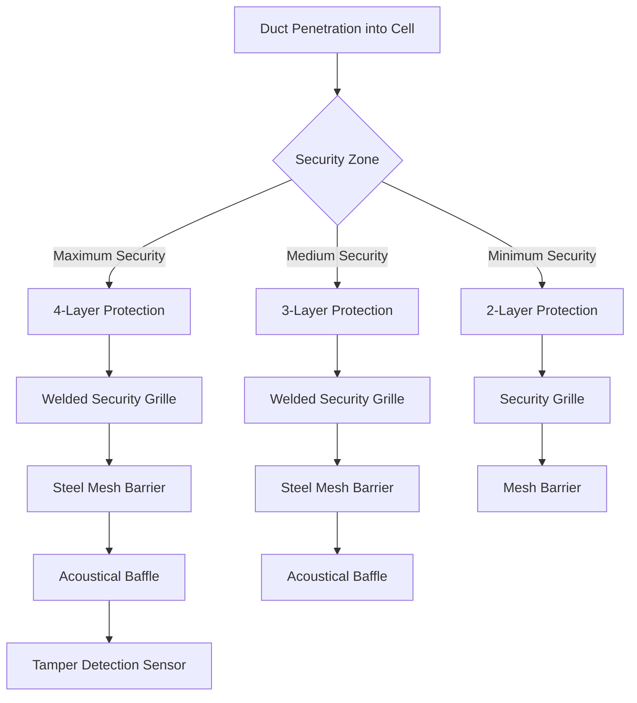
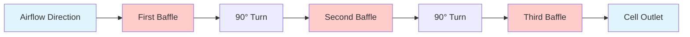
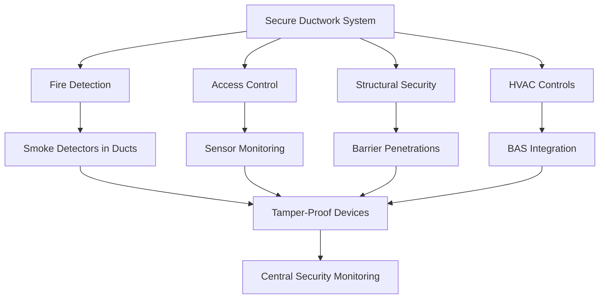

# Secure Ductwork for Correctional Facilities

Ductwork in justice facilities requires specialized design to prevent unauthorized access, escape attempts, and contraband concealment while maintaining code-compliant ventilation. Security considerations override conventional HVAC design priorities.

## Construction Requirements

### Duct Wall Thickness

Secure ductwork uses heavier gauge material than commercial standards to resist physical attack:

| Location | Minimum Gauge | Wall Thickness | Security Level |
|----------|---------------|----------------|----------------|
| Maximum Security Cells | 14 ga | 0.075" | High |
| General Population Housing | 16 ga | 0.060" | Medium |
| Administrative Areas | 18 ga | 0.048" | Standard |
| Perimeter Zones | 14 ga | 0.075" | High |
| Intake/Transfer Areas | 14 ga | 0.075" | High |

### Duct Sizing with Security Constraints

Standard friction loss calculations apply, but security constraints limit maximum duct dimensions. Velocity must remain within acceptable ranges despite restricted sizing:

$$Q = VA$$

Where:
- $Q$ = airflow rate (CFM)
- $V$ = velocity (FPM)
- $A$ = cross-sectional area (ft²)

For secure ducts with dimension restrictions:

$$A_{max} = \frac{w_{max} \times h_{max}}{144}$$

Where:
- $w_{max}$ = maximum allowable width (inches)
- $h_{max}$ = maximum allowable height (inches)

Maximum velocity check:

$$V = \frac{Q}{A_{max}}$$

Velocity should not exceed 2,000 FPM in occupied spaces to control noise. If exceeded, multiple smaller ducts or increased static pressure must be employed.

### Pressure Drop Compensation

Security features increase pressure drop. Total system pressure accounts for standard friction plus security components:

$$\Delta P_{total} = \Delta P_{friction} + \Delta P_{grilles} + \Delta P_{baffles}$$

Typical security component pressure drops:
- Security grilles: 0.15-0.25 in. w.g.
- Anti-ligature louvers: 0.10-0.18 in. w.g.
- Tamper-proof dampers: 0.08-0.12 in. w.g.

## Security Features

### Access Prevention Systems

### Grille Specifications

Security grilles prevent access while maintaining airflow:

| Feature | Specification | Purpose |
|---------|--------------|---------|
| Bar Spacing | Max 0.5" clear opening | Prevent tool insertion |
| Bar Diameter | Min 0.375" diameter | Resist cutting/bending |
| Attachment | Continuous weld to duct | Prevent removal |
| Material | 304 stainless steel | Corrosion resistance |
| Frame Thickness | Min 0.125" | Structural integrity |
| Tamper Resistance | No exposed fasteners | Prevent disassembly |

### Baffle Systems

Baffles prevent visual access and object passage while allowing airflow:

Baffle configuration parameters:
- Minimum 3 turns of 90° each
- Baffle overlap: minimum 6 inches
- Maximum 4-inch spacing between baffles
- Total depth: 18-24 inches typical

## Jointing and Sealing

### Weld Requirements

High-security ductwork requires welded joints:

$$L_{weld} = 2(w + h)$$

Where:
- $L_{weld}$ = total weld length per joint (inches)
- $w$ = duct width (inches)
- $h$ = duct height (inches)

**Welding specifications:**
- Continuous welds on all longitudinal seams
- Full perimeter welds at connections
- Grind smooth to eliminate sharp edges
- 100% visual inspection
- Radiographic testing for critical runs

### Duct Penetrations

Wall and ceiling penetrations require special detailing:

| Component | Requirement | Standard Reference |
|-----------|-------------|-------------------|
| Fire Rating | Match barrier rating | IBC Chapter 7 |
| Security Seal | Welded sleeve both sides | Facility-specific |
| Clearance | Zero-clearance installation | SMACNA HVAC Security |
| Inspection Access | Outside secure perimeter | ACA Standards |
| Smoke Damper | Tamper-proof actuator | NFPA 90A |

## Testing and Verification

### Structural Testing

Physical security testing verifies construction integrity:

1. **Impact Testing**: Apply 200 ft-lb impact force to exposed sections
2. **Tool Resistance**: 30-minute attack resistance using standard tools
3. **Fastener Inspection**: Verify all welded connections
4. **Visual Examination**: Check for manufacturing defects

### Airflow Verification

Standard HVAC testing applies with security constraints:

$$Q_{actual} = K \times A \times \sqrt{\Delta P_{v}}$$

Where:
- $K$ = correction factor (0.85-0.95 for security grilles)
- $A$ = effective free area (ft²)
- $\Delta P_{v}$ = velocity pressure (in. w.g.)

**Test procedure:**
1. Measure total airflow at air handling unit
2. Measure airflow at each cell outlet
3. Verify minimum ventilation rates per occupant
4. Document velocity pressure across security grilles
5. Check for unauthorized access points

### Leakage Testing

Security ductwork requires tighter leakage standards:

$$CL_{max} = \frac{Q_{leak}}{100 \times A_{duct}} \times P^{0.65}$$

Maximum leakage class:
- Maximum security zones: CL 3
- General population: CL 6
- Administrative: CL 12

## Installation Oversight

Security ductwork installation demands continuous inspection:

- Facility security staff present during installation
- Verify no contraband concealment opportunities
- Document all penetrations with as-built drawings
- Photograph weld quality and security features
- Test access prevention before facility activation
- Coordinate with perimeter security systems

## Integration with Building Systems

Secure ductwork interfaces with multiple building systems:

Secure ductwork represents the intersection of HVAC engineering and correctional security. Every design decision balances ventilation requirements with escape prevention, requiring close coordination between mechanical engineers, security consultants, and facility operators. Proper execution of these systems protects both occupants and staff while maintaining code-compliant environmental conditions.
