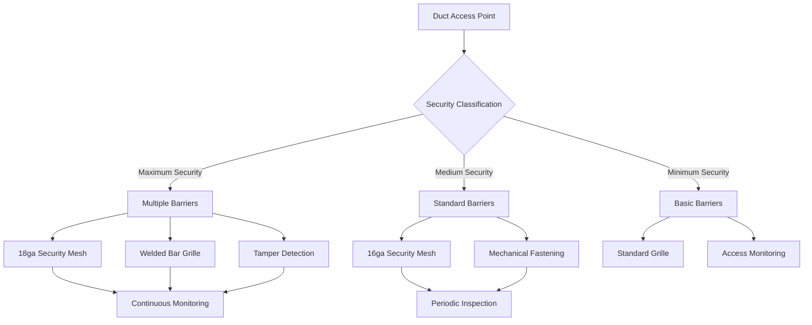
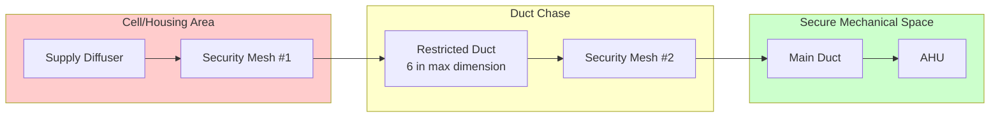

## Overview

Access prevention in justice facility ductwork requires engineered physical barriers and dimensional restrictions that prevent unauthorized entry while maintaining required airflow. The primary objective is eliminating ductwork as a potential escape route or contraband pathway without compromising ventilation performance.

## Duct Size Restriction Requirements

Correctional standards limit duct dimensions to prevent human passage. The maximum allowable duct dimension depends on security classification.

### Critical Dimension Calculations

Maximum duct cross-sectional area for access prevention:

$$A_{max} = 96 \text{ in}^2 \text{ (maximum security)}$$

$$A_{max} = 120 \text{ in}^2 \text{ (medium security)}$$

For rectangular ducts, the limiting dimension is:

$$D_{limit} = \min(w, h) \leq 6 \text{ in (maximum security)}$$

$$D_{limit} = \min(w, h) \leq 8 \text{ in (medium security)}$$

Where:
- $w$ = duct width
- $h$ = duct height
- $A_{max}$ = maximum cross-sectional area

### Velocity Compensation

When size restrictions limit duct area, velocity must increase to maintain airflow:

$$V_2 = V_1 \times \frac{A_1}{A_2}$$

$$\Delta P_{friction} = \left(\frac{f \cdot L \cdot \rho \cdot V^2}{2 \cdot D_h}\right)$$

Where:
- $V$ = air velocity (fpm)
- $A$ = cross-sectional area (ft²)
- $f$ = friction factor
- $L$ = duct length (ft)
- $\rho$ = air density (lb/ft³)
- $D_h$ = hydraulic diameter (ft)

## Physical Barrier Systems

## Security Mesh Specifications

| Security Level | Material | Gauge | Opening Size | Bar Spacing | Fastening Method | Testing Standard |
|----------------|----------|-------|--------------|-------------|------------------|------------------|
| Maximum | Stainless Steel 304 | 18 ga | 0.5 in × 0.5 in | 0.5 in o.c. | Welded frame, security bolts | ASTM F1915 |
| High | Galvanized Steel | 16 ga | 0.75 in × 0.75 in | 0.75 in o.c. | Welded frame, tamper-resistant fasteners | ASTM A653 |
| Medium | Galvanized Steel | 14 ga | 1.0 in × 1.0 in | 1.0 in o.c. | Mechanical fastening | ASTM A653 |
| Minimum | Carbon Steel | 12 ga | 1.5 in × 1.5 in | 1.5 in o.c. | Standard fastening | ASTM A1008 |

## Barrier Placement Strategy

## Access Door Elimination

Standard ductwork access doors create security vulnerabilities. Elimination strategies include:

**Segmented Duct Approach:**
- Duct sections ≤ 10 ft between flanges
- Full section removal for maintenance
- No access panels within secure zones
- Flanged connections at secure mechanical spaces only

**Cleanout Access Location:**
$$L_{max} = 25 \times D_h$$

Maximum distance between cleanout points located in secure areas, where $D_h$ is hydraulic diameter in feet.

## Penetration Sealing Requirements

All duct penetrations through security barriers require non-removable sealing:

| Penetration Type | Sealing Method | Material | Testing Requirement |
|------------------|----------------|----------|---------------------|
| Wall penetration | Grouted annular space | Non-shrink cementitious grout | 2000 psi compressive strength |
| Floor penetration | Grouted with rebar blocking | Structural grout + #4 rebar grid | 3000 psi compressive strength |
| Ceiling penetration | Welded security plate | 12 ga steel plate welded to structure | Visual weld inspection |
| Roof penetration | Grouted with security collar | Grout + welded steel collar | 2500 psi + weld inspection |

## Ceiling Plenum Security

Return air plenums above secure spaces require continuous barriers:

$$h_{barrier} \geq h_{ceiling} + 24 \text{ in}$$

Barrier construction requirements:
- Minimum 20-gauge steel deck
- Continuous welded seams
- Penetrations limited to $A_{max}$ requirements
- All openings fitted with security mesh

## Duct Routing Principles

**Secure Zone Routing:**
1. Minimize duct length within inmate-accessible areas
2. Route vertically through structure rather than horizontally through chases
3. Consolidate penetrations at monitored locations
4. Avoid routing through crawl spaces or accessible ceiling plenums
5. Maintain continuous sightlines for duct inspection where possible

## Grille and Diffuser Security

Terminal devices require tamper-resistant installation:

**Fastening Force Requirements:**
$$F_{removal} \geq 500 \text{ lbf (maximum security)}$$

**Installation Methods:**
- Security head screws (non-standard drive)
- Welded mounting frames
- Grout-filled anchor points
- Continuous perimeter attachment at ≤ 4 in o.c.

## Inspection and Testing

**Initial Verification:**
- Physical attempt to remove barriers (500 lbf pull test)
- Visual inspection of all welds and fasteners
- Dimensional verification of all duct cross-sections
- Penetration seal strength testing (core samples)

**Ongoing Monitoring:**
- Monthly visual inspection of accessible barriers
- Quarterly detailed inspection with mirrors/cameras
- Annual physical testing of barrier integrity
- Continuous electronic monitoring where specified

## Design Coordination

Effective access prevention requires integration with security operations:

1. **Security Classification Review:** Confirm facility security levels with correctional authority
2. **Duct Layout Approval:** Submit routing plans to security staff for operational review
3. **Barrier Specification:** Provide detailed barrier schedules tied to room security classifications
4. **Installation Oversight:** Security staff present during barrier installation and penetration sealing
5. **Acceptance Testing:** Document physical testing witnessed by facility security

## Regulatory References

- **ASHRAE Applications Handbook, Chapter 9:** Justice Facilities
- **ACA Standards for Adult Correctional Institutions:** 4th Edition
- **National Institute of Corrections:** HVAC Security Guidelines
- **ICC International Mechanical Code:** Section 403.3 (Duct Construction)
- **ASTM F1915:** Standard Specification for Welded Wire Security Mesh

Proper implementation of access prevention measures ensures that HVAC systems provide required environmental control without compromising facility security objectives.
