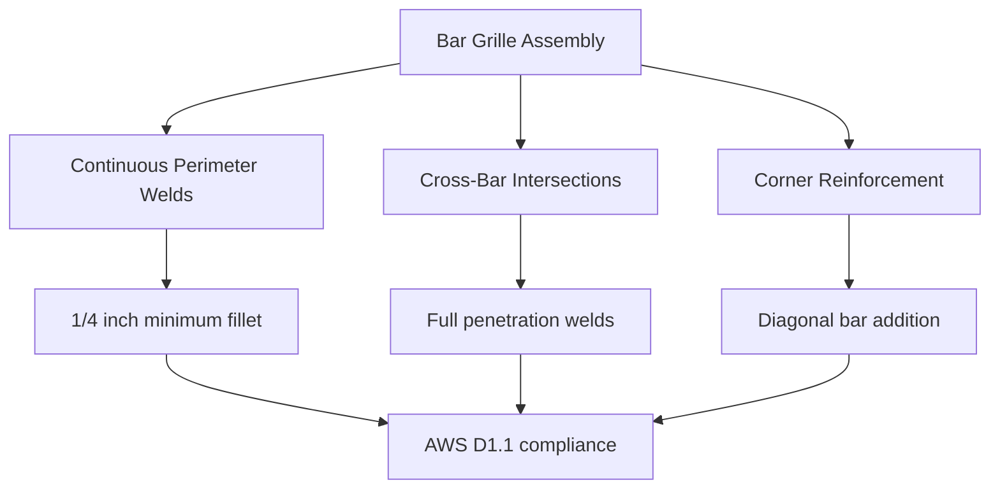
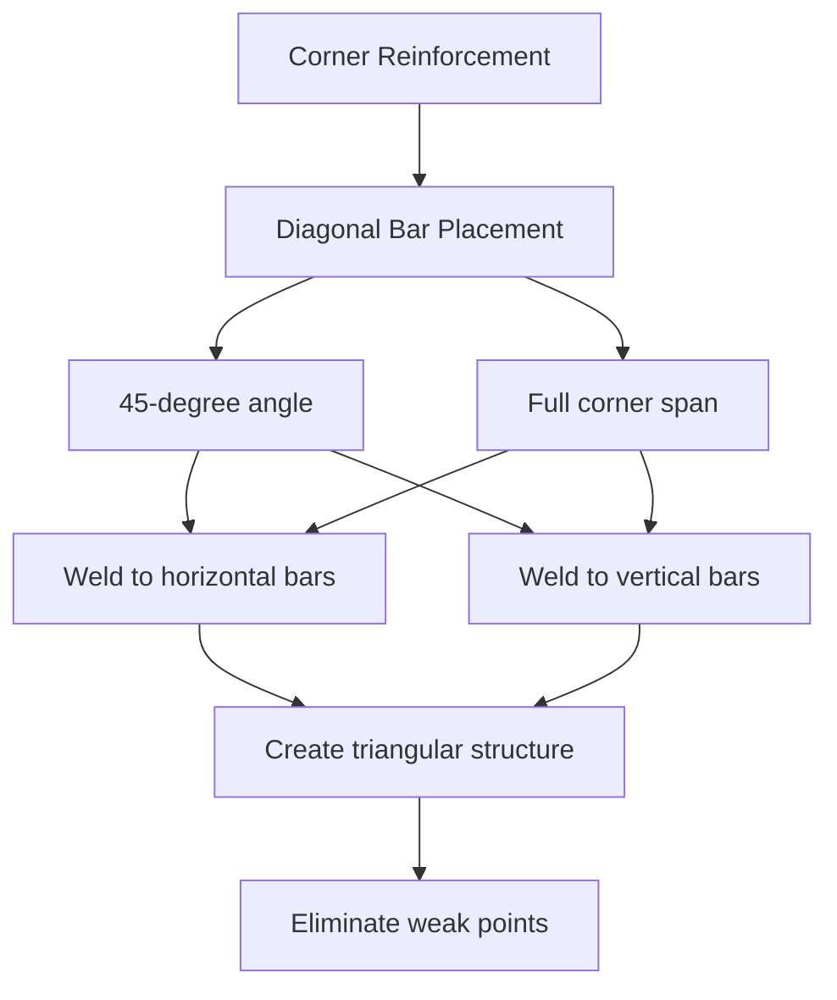

## Overview

Steel bar reinforcement constitutes the primary mechanical barrier preventing unauthorized egress through HVAC ductwork in justice facilities. Properly designed bar systems resist cutting, prying, and removal attempts while maintaining required airflow capacity. The reinforcement must integrate structurally with ductwork to prevent displacement under sustained attack.

## Bar Configuration Requirements

### Material Specifications

Bar reinforcement systems require specific steel grades and dimensions to achieve penetration resistance.

| Component | Specification | Standard |
|-----------|--------------|----------|
| Bar material | ASTM A36 structural steel | Minimum yield 36 ksi |
| Minimum bar diameter | 1/2 inch (12.7 mm) | Round or square profile |
| Maximum bar spacing | 4 inches (102 mm) on center | Clear space ≤ 3.5 inches |
| Weld material | E70XX electrode | Per AWS D1.1 |
| Surface finish | Hot-dip galvanized | ASTM A123 |
| Corner reinforcement | Additional diagonal bars | 45-degree orientation |

### Bar Spacing Analysis

The maximum 4-inch spacing prevents passage of objects and body parts while minimizing airflow restriction. The pressure drop through bar grilles follows:

$$\Delta P = \frac{1}{2} \rho V^2 \left( K_c + K_e + K_f \right)$$

Where:
- $\Delta P$ = pressure drop across bar grille (Pa)
- $\rho$ = air density (kg/m³)
- $V$ = face velocity (m/s)
- $K_c$ = contraction coefficient (typically 0.4-0.5)
- $K_e$ = expansion coefficient (typically 0.5-0.6)
- $K_f$ = friction coefficient based on bar arrangement

The effective free area ratio for bar grilles:

$$\beta = \frac{A_{free}}{A_{gross}} = 1 - \frac{n \cdot d}{W}$$

Where:
- $\beta$ = free area ratio (dimensionless)
- $n$ = number of bars
- $d$ = bar diameter (inches)
- $W$ = duct width (inches)

For 1/2-inch bars at 4-inch spacing: $\beta \approx 0.875$ (87.5% free area).

## Installation Methods

### Welded Bar Attachment

Full-penetration welds provide the required attachment strength to resist bar removal.



### Structural Load Capacity

Bar reinforcement must withstand concentrated loads applied during escape attempts. The bending moment capacity:

$$M_{max} = \frac{\sigma_y \cdot \pi d^3}{32}$$

Where:
- $M_{max}$ = maximum bending moment (lb-in)
- $\sigma_y$ = yield strength (psi)
- $d$ = bar diameter (inches)

For 1/2-inch diameter ASTM A36 bars:
$$M_{max} = \frac{36000 \times \pi \times (0.5)^3}{32} = 442 \text{ lb-in}$$

The deflection under concentrated load at bar center:

$$\delta = \frac{P \cdot L^3}{48 \cdot E \cdot I}$$

Where:
- $\delta$ = deflection (inches)
- $P$ = concentrated load (lb)
- $L$ = span between supports (inches)
- $E$ = modulus of elasticity (29 × 10⁶ psi for steel)
- $I$ = moment of inertia (in⁴)

## Bar Grille Design Configurations

```mermaid
flowchart LR
    A[Duct Opening] --> B{Dimension Check}
    B -->|Width > 12"| C[Bi-directional bars]
    B -->|Width ≤ 12"| D[Single-direction bars]
    C --> E[Horizontal + Vertical]
    D --> F[Horizontal only]
    E --> G[Corner diagonal bars]
    F --> G
    G --> H[Perimeter frame weld]
    H --> I[Inspection access]
```

### Corner Reinforcement Details

Corners represent structural weak points requiring additional reinforcement. Install diagonal bars at 45-degree angles across all four corners for duct openings exceeding 12 inches in any dimension.



## Penetration Resistance Testing

Testing protocols verify bar system integrity against cutting and prying attacks per ASTM F1450 security glazing standards, adapted for metalwork.

| Test Method | Tool Type | Pass Criteria |
|-------------|-----------|---------------|
| Cutting resistance | Hacksaw, 5 minutes | No bar severage |
| Prying resistance | 18-inch prybar, 200 lb force | No bar displacement |
| Impact resistance | 5 lb hammer, 10 strikes | No weld failure |
| Torch resistance | Oxy-acetylene, 2 minutes | Penetration < 1/4 diameter |

## Installation Specifications

### Welding Requirements

- Weld all bar intersections with minimum 1/4-inch fillet welds
- Use continuous perimeter welds connecting grille frame to duct wall
- Grind all weld surfaces smooth to eliminate climbing points
- Perform visual inspection of 100% of welds
- Conduct dye penetrant testing on 10% of welds (random selection)

### Inspection Checkpoints

1. Verify bar spacing does not exceed 4 inches at any location
2. Confirm minimum 1/2-inch bar diameter throughout
3. Check weld quality and penetration depth
4. Verify corner diagonal bars installed on openings > 12 inches
5. Ensure galvanization or protective coating complete
6. Document installation with photographs and dimensional verification

## Correctional Standards Compliance

Bar reinforcement systems must meet requirements from:

- **ACA Standards for Adult Correctional Institutions**: 4th Edition, Standard 4-ALDF-4C-06
- **ASTM F1450**: Security performance testing methodology
- **AWS D1.1**: Structural welding code - steel
- **NFPA 90A**: Installation of air-conditioning and ventilating systems (fire rating compatibility)

## Integration with Duct Construction

Bar grilles integrate with 16-gauge minimum galvanized steel ductwork. The combined assembly provides structural rigidity preventing duct wall deformation during bar attack. Secure the bar grille frame to duct flanges with continuous welds before final duct installation to prevent removal of the entire assembly.

## Maintenance and Inspection

Inspect bar reinforcement quarterly for:
- Weld crack development
- Bar corrosion or coating degradation
- Structural deformation or displacement
- Evidence of cutting or prying attempts
- Proper bar spacing maintenance

Replace any grille showing evidence of compromise or structural degradation immediately.

---

**File**: `/Users/evgenygantman/Documents/github/gantmane/hvac/content/specialty-applications-testing/specialty-hvac-applications/justice-facilities/secure-ductwork/bar-reinforcement/_index.md`
