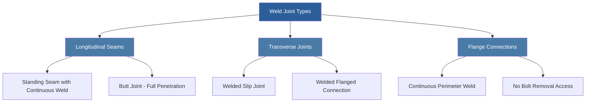
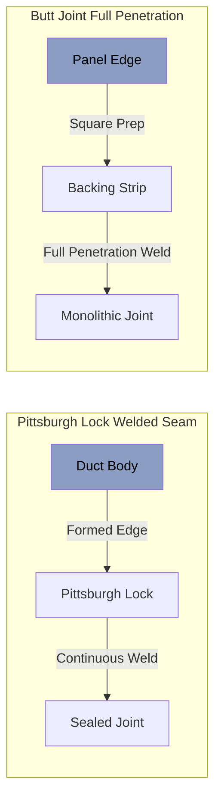

## Welded Construction Standards

Welded ductwork construction in justice facilities eliminates mechanical fasteners that could be manipulated or removed by inmates. Continuous welding creates monolithic assemblies resistant to tampering, tool insertion, and unauthorized access attempts.

### Material Gauge Requirements

Welded secure ductwork requires heavier gauge materials than standard commercial systems to prevent deformation, cutting, or breaching. Minimum gauge specifications vary with duct dimension and security classification.

| Duct Dimension | Standard Security | Maximum Security | Material |
|----------------|-------------------|------------------|----------|
| ≤12" diameter | 16 gauge (0.060") | 14 gauge (0.075") | Galvanized steel |
| 13-24" diameter | 14 gauge (0.075") | 12 gauge (0.105") | Galvanized steel |
| 25-36" diameter | 12 gauge (0.105") | 11 gauge (0.120") | Galvanized steel |
| >36" diameter | 11 gauge (0.120") | 10 gauge (0.135") | Galvanized steel |
| High-corrosion areas | 14 gauge (0.075") | 12 gauge (0.105") | Type 304 stainless |

### Continuous Weld Specifications

All longitudinal and transverse seams require continuous welding per SMACNA security ductwork standards. Tack welds, spot welds, and intermittent welding are prohibited in secure areas.

**Weld Joint Design:**

### Weld Detail Construction

**Longitudinal Seam Configuration:**

**Transverse Joint Types:**

1. **Welded Slip Joint:** Male end slides into female section, continuous fillet weld around perimeter
2. **Welded Flange Connection:** 1.5" minimum flange width, continuous weld both sides of angle
3. **Butt-Welded Section:** Full penetration weld with backing ring or consumable insert

### Weld Pressure Rating

Secure ductwork welds must withstand test pressures without leakage or joint separation. Pressure testing verifies weld integrity and system security.

The required weld strength for pressure containment:

$$\sigma_w = \frac{P \cdot D}{2t \cdot \eta}$$

Where:
- $\sigma_w$ = weld stress (psi)
- $P$ = internal test pressure (inches w.g. × 0.0361)
- $D$ = duct diameter (inches)
- $t$ = material thickness (inches)
- $\eta$ = weld joint efficiency (0.85-1.0)

For leak class verification:

$$CL_{max} = \frac{F \cdot P^{0.65}}{100}$$

Where:
- $CL_{max}$ = maximum leakage (cfm per 100 sq ft)
- $F$ = seal class factor (3 for welded secure duct)
- $P$ = test pressure (inches w.g.)

### Weld Inspection Requirements

All welds in maximum security areas require 100% visual inspection. Random sampling applies to standard security installations.

| Security Level | Visual Inspection | Dye Penetrant | Radiographic | Pressure Test |
|----------------|-------------------|---------------|--------------|---------------|
| Maximum | 100% of welds | 25% of joints | Critical penetrations | All sections |
| High | 100% of welds | 10% random | Barrier penetrations | All sections |
| Standard | 50% random | 5% random | Not required | Branch sections |

**Visual Inspection Criteria:**

- Complete fusion along entire weld length
- No cracks, porosity, or undercut exceeding 1/32"
- Uniform bead appearance without excessive spatter
- No burn-through or edge melt on thin materials
- Weld reinforcement height 1/16" to 3/32"

### Access Prevention Design

Welded construction eliminates common security vulnerabilities in mechanical ductwork systems.

**Prohibited Features in Secure Zones:**

- Slip-and-drive connections with sheet metal screws
- Bolted flange assemblies with removable fasteners
- Duct access doors or panels
- TDC/TDF flanged connections
- Standing seams without continuous welding
- Riveted construction

**Required Security Features:**

- Continuous longitudinal weld on all seams
- Welded transverse joints (no mechanical fasteners)
- Welded flange connections (bolts captive if required)
- Reinforced penetrations at wall/ceiling interfaces
- Tamper-evident weld appearance throughout system

### Galvanized vs. Stainless Steel

**Galvanized Steel Applications:**

- General population housing areas
- Administrative corridors
- Visiting rooms
- Lower corrosion environments
- Cost-sensitive installations

**Stainless Steel Requirements:**

- Food service and kitchen exhaust
- Laundry exhaust systems
- Shower and bathroom exhaust
- Chemical storage ventilation
- Coastal or high-humidity facilities

Type 304 stainless steel provides superior corrosion resistance in aggressive environments. Welding stainless requires inert gas shielding (TIG/MIG) to prevent carbide precipitation and maintain corrosion resistance.

### Field Welding Procedures

On-site welding requires qualified welders certified to AWS D9.1 or equivalent sheet metal welding standards.

**Pre-Weld Requirements:**

1. Remove galvanized coating 2" each side of weld zone
2. Clean joint surfaces of oil, dirt, and oxidation
3. Verify material thickness and joint preparation
4. Establish proper electrode/wire selection
5. Set amperage and travel speed parameters

**Post-Weld Treatment:**

1. Remove slag and spatter with wire brush
2. Apply cold galvanizing compound to bare steel
3. Smooth sharp edges that could damage insulation
4. Visual inspection before concealment
5. Pressure test per specification requirements

### SMACNA Compliance

Welded secure ductwork follows SMACNA "HVAC Duct Construction Standards" with enhanced security modifications:

- Increased material gauge per security classification
- Continuous welding replacing mechanical fasteners
- Enhanced reinforcement at penetrations and supports
- Rigid inspection and testing protocols
- Tamper-resistant design throughout

### Specification Language

**Sample Specification Section:**

"Ductwork in maximum security housing units shall be fabricated from 12-gauge galvanized steel with continuous welded seams. All longitudinal joints shall be Pittsburgh lock or butt joint configuration with continuous fillet or full penetration welds. Transverse connections shall be welded slip joints or welded flange assemblies with captive fasteners. Mechanical fasteners, access doors, and removable panels are prohibited. Contractor shall pressure test all ductwork sections at 6 inches w.g. for 15 minutes with less than 1% leakage."

---

**File Location:** /Users/evgenygantman/Documents/github/gantmane/hvac/content/specialty-applications-testing/specialty-hvac-applications/justice-facilities/secure-ductwork/welded-construction/_index.md
