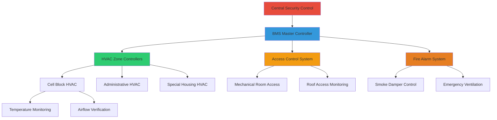
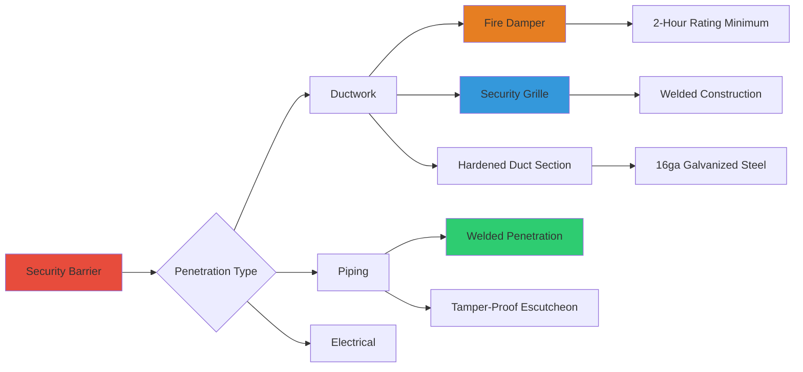

HVAC systems in justice facilities present unique security challenges that require specialized design approaches to prevent system manipulation, unauthorized access, and potential security breaches. These systems must balance operational requirements with stringent security protocols while maintaining code-compliant environmental conditions.

## Security Design Principles

### Physical Access Control

HVAC equipment in justice facilities requires multiple layers of physical protection to prevent tampering, vandalism, or use as escape routes. All equipment accessible to detainees must be hardened or relocated to secure areas.

**Primary security zones:**

- Secure mechanical rooms with controlled access
- Inmate-accessible areas requiring hardened equipment
- Staff-only zones with standard commercial equipment
- Perimeter security zones with additional monitoring

Equipment placement follows a hierarchy based on security risk assessment. High-risk components such as air handlers, dampers, and control systems are located in restricted areas accessible only to authorized maintenance personnel.

### Tamper-Resistant Equipment Design

All HVAC components in detainee-accessible areas must meet stringent anti-ligature and tamper-resistance requirements.

| Component | Security Feature | Standard Application |
|-----------|------------------|---------------------|
| Diffusers | Welded construction, security screws | All inmate areas |
| Grilles | 16-gauge minimum, tamper-proof fasteners | Cells, dayrooms |
| Thermostats | Recessed, polycarbonate covers, limited access | Common areas |
| Ductwork | Reinforced, welded seams, secure mounting | Above ceilings in cells |
| Piping | Schedule 80 steel, welded connections | Exposed locations |
| Access panels | Welded frames, security hardware | All accessible zones |

The mechanical integrity of tamper-resistant equipment must withstand forced entry attempts while maintaining thermal performance. Testing protocols verify both structural strength and HVAC functionality.

## Integration with Security Systems

### Building Management System Security

HVAC control systems in justice facilities integrate with facility-wide security networks while maintaining operational independence. This integration enables coordinated responses to security events without compromising environmental control.

Control system architecture incorporates multiple security layers:

1. **Network segregation** - HVAC controls on separate VLAN from general facility network
2. **Authentication protocols** - Multi-factor authentication for system access
3. **Audit logging** - Complete record of all system changes and access attempts
4. **Redundant controls** - Manual overrides in secure locations for critical systems
5. **Lockout capabilities** - Remote disabling of compromised control points

### Emergency Response Coordination

HVAC systems respond automatically to security events through integration with alarm and communication systems. Smoke control, pressurization, and ventilation modes adjust based on facility status.

**Security event responses:**

| Event Type | HVAC Response | Response Time |
|-----------|---------------|---------------|
| Fire alarm | Smoke control activation, damper positioning | Immediate |
| Lockdown | Zone isolation, maintain minimum ventilation | 30 seconds |
| Chemical incident | 100% exhaust, no recirculation | 60 seconds |
| Power failure | Transfer to emergency systems | 10 seconds |
| Riot condition | Isolation of affected zones | 60 seconds |

The pressurization strategy during security events prevents smoke or contaminant migration between zones. Differential pressure across security barriers is maintained as:

$$\Delta P_{barrier} = \frac{Q \cdot \rho}{2 \cdot A^2 \cdot C_d^2}$$

where:
- $\Delta P_{barrier}$ = pressure differential across barrier (Pa)
- $Q$ = airflow through barrier (m³/s)
- $\rho$ = air density (kg/m³)
- $A$ = effective leakage area (m²)
- $C_d$ = discharge coefficient (typically 0.6-0.7)

Minimum pressure differentials of 12.5 Pa (0.05 in. w.g.) are maintained across security barriers during normal operation, increasing to 25 Pa (0.1 in. w.g.) during emergency modes.

## Ductwork and Piping Security

### Penetration Control

Every duct and pipe penetration through security barriers represents a potential breach point. Design must prevent detainee access while maintaining fire rating integrity.

**Penetration security requirements:**

- Ductwork through barriers: security grilles at both sides
- Maximum opening dimension: 6 inches for any grille opening
- Fire damper access: from non-secure side only
- Sleeve annulus: filled with non-removable fire-rated material
- Inspection panels: located in secure corridors or mechanical spaces

### Duct Sizing for Security

Ductwork in inmate-accessible areas is sized to prevent human passage while maintaining airflow requirements. The maximum hydraulic diameter is limited:

$$D_h = \frac{4A}{P} \leq 200 \text{ mm}$$

where:
- $D_h$ = hydraulic diameter (mm)
- $A$ = duct cross-sectional area (mm²)
- $P$ = duct perimeter (mm)

For rectangular ducts, aspect ratios favor configurations that minimize the smallest dimension, typically maintaining width-to-height ratios between 2:1 and 4:1.

## Access and Maintenance Security

### Mechanical Room Classification

Mechanical equipment rooms are classified by security level to determine access control requirements and equipment specifications.

| Security Level | Access Requirements | Equipment Type | Typical Locations |
|----------------|---------------------|----------------|-------------------|
| Level 1 - Minimum | Key access, sign-in log | Commercial grade | Administrative areas |
| Level 2 - Medium | Card access, escort required | Commercial with monitoring | Support areas |
| Level 3 - High | Dual verification, armed escort | Hardened, redundant | Housing units |
| Level 4 - Maximum | Security clearance, multiple escorts | Maximum security rated | Special housing, segregation |

Mechanical room doors meet security standards with detention-grade hardware, vision panels from secure side only, and door position switches integrated with security monitoring.

### Maintenance Protocol Integration

HVAC maintenance in justice facilities requires coordination with security operations. Work permit systems track all mechanical room access and equipment work.

**Maintenance access procedure:**

1. Submit work order with security clearance verification
2. Tool inventory check-in at security control
3. Escort assignment based on room classification
4. Real-time monitoring during work period
5. Tool inventory check-out with reconciliation
6. Security sweep of work area upon completion

Predictive maintenance strategies minimize access frequency while maintaining system reliability. Remote monitoring systems track equipment performance with alerts for degradation before failure occurs.

## Code Compliance and Standards

HVAC security design for justice facilities must comply with multiple standards:

- **ASHRAE Standard 170**: Ventilation requirements for health care facilities (applicable to detention medical units)
- **IMC Chapter 4**: Ventilation requirements and minimum rates
- **NFPA 101**: Life Safety Code provisions for detention and correctional occupancies
- **ACA Standards**: American Correctional Association environmental requirements
- **PREA Standards**: Prison Rape Elimination Act considerations for design

Temperature and ventilation ranges must meet both code minimums and security operational requirements, maintaining 68-74°F in housing areas with minimum 15 cfm/person outdoor air.

The design heat removal rate for high-density occupancies is calculated:

$$q_{total} = N \cdot (q_{sensible} + q_{latent})$$

where:
- $q_{total}$ = total heat removal (Btu/hr)
- $N$ = maximum occupant count
- $q_{sensible}$ = sensible heat per person (250 Btu/hr at light activity)
- $q_{latent}$ = latent heat per person (200 Btu/hr at light activity)

Security-driven design modifications must not compromise minimum code requirements for habitability and life safety, requiring careful engineering to balance competing objectives.
