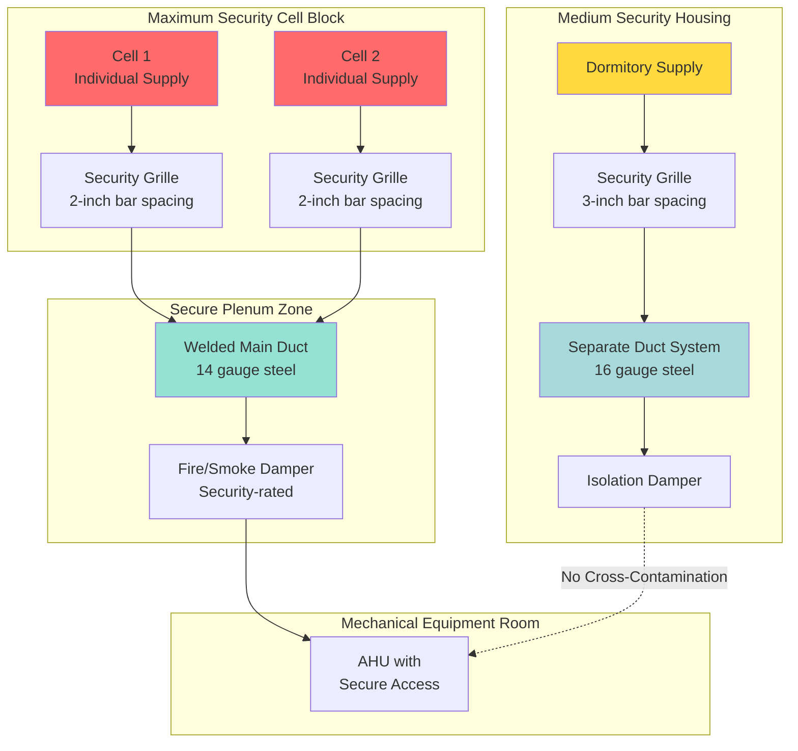

## Overview

Ductwork in correctional facilities presents critical security vulnerabilities that require specialized engineering design beyond standard HVAC practice. Ventilation ducts can serve as pathways for escape attempts, contraband transfer between zones, weapon concealment, and inter-cell communication. Security-rated ductwork design must balance ventilation requirements with physical security imperatives while maintaining code-compliant airflow.

## Security Risk Classification

Ductwork security requirements vary by facility zone and occupant classification. The following table establishes minimum security standards:

| Security Zone | Duct Construction | Bar Spacing | Fastener Type | Inspection Access |
|---------------|-------------------|-------------|---------------|-------------------|
| Maximum Security Cells | Welded steel 14-16 gauge | 2 inches max | Tamper-proof security screws | External only |
| Medium Security Housing | Welded/bolted 16-18 gauge | 3 inches max | Security bolts with breakaway detection | Limited internal |
| Minimum Security Dormitory | Bolted 18-20 gauge | 4 inches max | Vandal-resistant fasteners | Standard access |
| Administrative Areas | Standard construction | N/A | Standard fasteners | Standard access |
| Intake/Processing | Welded steel 16 gauge | 2.5 inches max | Security screws | External only |

## Duct Penetration Prevention

### Bar Reinforcement Design

All ductwork penetrating security barriers requires internal bar reinforcement. The required bar density follows:

$$A_{\text{opening}} = \frac{\pi d^2}{4}$$

where maximum allowable opening diameter $d$ depends on security classification. For maximum security applications:

$$d_{\text{max}} = 2 \text{ inches (50 mm)}$$

Bar reinforcement must achieve:

$$S_{\text{bar}} \leq 2 \text{ inches center-to-center}$$

The minimum bar diameter for steel reinforcement:

$$d_{\text{bar}} = \frac{3}{8} \text{ inch (9.5 mm), Grade 60 steel}$$

### Welded Construction Requirements

High-security ductwork joints must be continuously welded to prevent disassembly. Weld penetration depth:

$$t_{\text{weld}} \geq 0.75 \times t_{\text{duct}}$$

where $t_{\text{duct}}$ represents duct wall thickness. Minimum duct gauge for security zones:

| Zone Classification | Minimum Gauge | Minimum Thickness |
|---------------------|---------------|-------------------|
| Maximum Security | 14 gauge | 0.075 inch (1.9 mm) |
| Medium Security | 16 gauge | 0.060 inch (1.5 mm) |
| Minimum Security | 18 gauge | 0.048 inch (1.2 mm) |

## Security Zone Isolation

The following diagram illustrates proper ductwork security zone separation:

## Grille and Diffuser Security

### Security Fastener Requirements

Standard HVAC grilles use removable screws accessible from occupied spaces. Correctional applications require:

1. **Tamper-proof fasteners:** One-way security screws or pin-in-torx drives
2. **Welded attachment:** Direct welding of grille frames to ductwork
3. **Continuous perimeter attachment:** Fasteners at maximum 4-inch spacing
4. **Breakaway detection:** Electronic monitoring of fastener integrity in maximum security zones

### Maximum Opening Dimensions

Register and grille openings must prevent passage of contraband or tools:

$$A_{\text{free}} = \sum_{i=1}^{n} A_{\text{opening,i}}$$

where individual opening area:

$$A_{\text{opening,i}} \leq \pi \left(\frac{d_{\text{max}}}{2}\right)^2 = 3.14 \text{ in}^2 \text{ (maximum security)}$$

## Vertical Chase Security

Vertical duct chases present the highest escape risk due to vertical travel potential. Security requirements include:

1. **Chase compartmentalization:** Maximum 10-foot vertical sections with steel plates
2. **Welded barriers:** Minimum 14-gauge steel plates welded to chase structure
3. **Bar reinforcement at each floor:** Horizontal bars at 2-inch spacing
4. **Access door security:** External access only with security-rated doors
5. **Inspection provisions:** Video inspection capability without entry

### Pressure Drop Considerations

Security bar reinforcement increases system pressure drop. The additional pressure loss:

$$\Delta P_{\text{bars}} = K_{\text{bars}} \times \frac{\rho V^2}{2}$$

where the loss coefficient for bar grilles:

$$K_{\text{bars}} = 2.5 \text{ to } 4.0 \text{ (depending on bar density)}$$

This requires fan capacity increases of 15-30% compared to standard ductwork systems.

## Fire Damper Security Integration

Fire and smoke dampers in security ductwork require specialized design:

1. **Fail-secure operation:** Dampers must close and remain closed without power
2. **Tamper-resistant actuators:** Actuator access from secure side only
3. **Bar reinforcement:** Internal bars independent of damper mechanism
4. **Welded frames:** Damper sleeve welded to duct and structure
5. **Remote reset:** Manual reset from secure mechanical room only

## Access and Maintenance Protocols

Security-rated ductwork presents maintenance challenges:

**Access Panel Requirements:**
- Located in secure corridors or mechanical spaces only
- Security-rated doors with electronic monitoring
- Minimum 16-gauge steel construction
- Continuous hinge with security fasteners

**Inspection Schedule:**
- Visual inspection: Monthly for maximum security zones
- Structural integrity testing: Quarterly
- Bar reinforcement verification: Semi-annually
- Weld inspection: Annually with certified inspector

## Contraband Transfer Prevention

Ductwork can facilitate contraband movement between cells or zones. Prevention strategies:

1. **Individual cell supplies:** Separate duct runs prevent inter-cell transfer
2. **Supply-only design:** Return air through secure corridors, not cell ductwork
3. **Airflow direction control:** Positive pressure in cells prevents backflow
4. **Acoustic separation:** Insulation and baffles prevent voice communication
5. **Small diameter distribution:** 6-inch maximum duct diameter in cell areas

The acoustic transmission loss required:

$$TL \geq 50 \text{ dB at speech frequencies (500-2000 Hz)}$$

## Standards and Code References

Design of secure ductwork systems must comply with:

- **ACA Standards:** American Correctional Association design standards
- **ASHRAE 15:** Safety standard for mechanical refrigeration
- **NFPA 90A:** Standard for installation of air-conditioning and ventilating systems
- **SMACNA Security Ductwork:** Specialized construction standards
- **State DOC Standards:** Jurisdiction-specific correctional facility requirements

## Conclusion

Ductwork security in correctional facilities requires engineering expertise beyond standard HVAC design. The integration of physical security barriers, welded construction, bar reinforcement, and zone isolation must occur without compromising ventilation effectiveness or code compliance. Successful systems balance security imperatives with occupant health requirements while maintaining long-term structural integrity and inspection accessibility.
