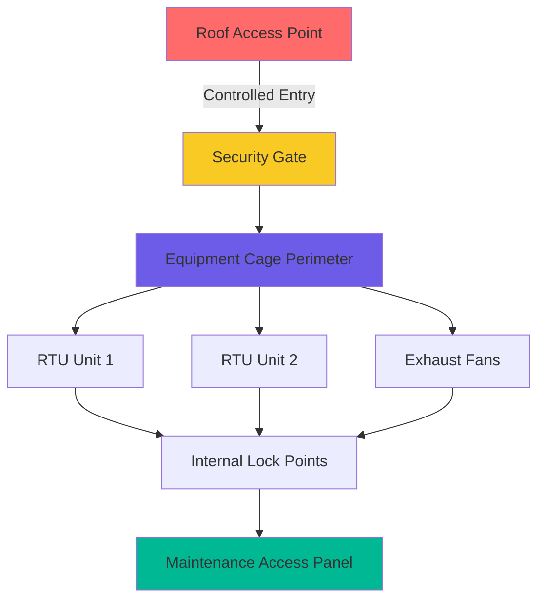
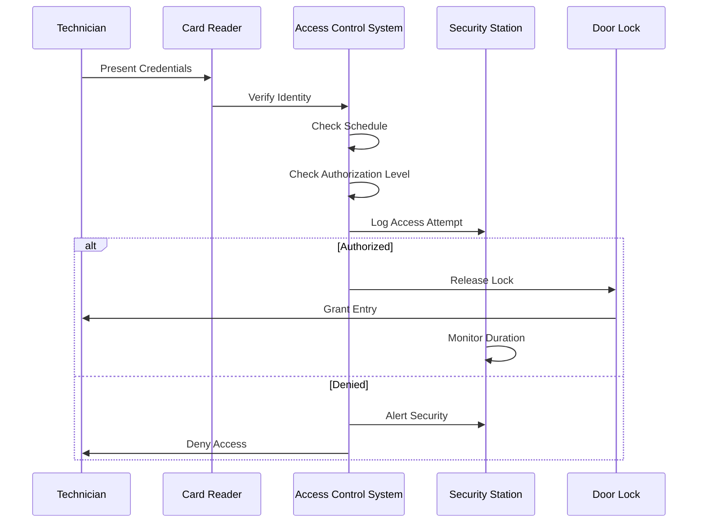

## Overview

HVAC equipment in justice facilities requires stringent access control measures to prevent tampering, escape attempts, and system sabotage. Equipment security encompasses physical barriers, access management protocols, and integrated surveillance systems that balance operational requirements with security imperatives.

The dual mandate of maintaining reliable climate control while preventing unauthorized access creates unique challenges. Security failures can lead to hostage situations, contraband concealment, system manipulation for escape, or compromise of critical infrastructure.

## Physical Security Barriers

### Mechanical Room Construction

Mechanical rooms housing primary HVAC equipment require reinforced construction exceeding standard commercial specifications:

| Security Element | Specification | Purpose |
|------------------|---------------|---------|
| Wall Construction | 8" CMU minimum, reinforced | Prevent breach attempts |
| Door Rating | Security grade, steel frame | Resist forced entry |
| Lock Classification | High security, restricted keyway | Control key duplication |
| Ceiling | Continuous to deck | Eliminate bypass routes |
| Window Prohibition | No windows permitted | Remove visual/physical access |
| Penetration Sealing | All penetrations <96 sq in | Prevent passage |

The critical air volume flow resistance through security barriers follows:

$$\Delta P = \frac{1}{2}\rho v^2 \left(\frac{L}{D}\right)f$$

where restricted openings must maintain pressure differentials while meeting security requirements of less than 96 square inches per ACA standards.

### Roof Equipment Security

Rooftop HVAC equipment presents elevated escape risk and requires comprehensive perimeter protection:

**Security Fencing Specifications:**
- Height: 12 feet minimum above roofing surface
- Mesh: 9-gauge minimum, 2-inch maximum openings
- Top guard: 3-strand barbed wire, 45° outward angle
- Foundation: Secured through roof membrane to structural deck
- Gates: Self-closing, high-security locks, limited quantity

**Equipment Cage Design:**

### Equipment Yard Perimeter

Ground-level equipment yards require multi-layer security:

1. **Outer Perimeter**: Chain-link fence, 12 feet height, barbed wire top guard
2. **Standoff Distance**: 20 feet minimum from building envelope
3. **Clear Zone**: No objects within 15 feet of fence line
4. **Lighting**: Minimum 2 foot-candles throughout yard
5. **Inner Barrier**: Secondary fence for high-security equipment

## Access Control Systems

### Key Control Protocols

High-security mechanical systems require restricted keyway systems preventing unauthorized duplication:

| Control Level | Key Type | Distribution | Documentation |
|---------------|----------|--------------|---------------|
| Level 1 - Primary | Grand Master | Facility Director only | Daily audit log |
| Level 2 - Secondary | Master | Maintenance Supervisor | Weekly inventory |
| Level 3 - Operational | Sub-Master | Certified Technicians | Monthly reconciliation |
| Level 4 - Limited | Change Key | Escorted access only | Per-use checkout |

The probability of unauthorized access with proper key control follows:

$$P_{access} = P_{key} \times P_{schedule} \times P_{detection}^{-1}$$

Reducing $P_{key}$ through restricted keyways is the primary defense layer.

### Electronic Access Control

Modern justice facilities integrate electronic access management:

**System Components:**
- Card readers at all mechanical room entries
- Biometric verification for high-security areas
- Time-based access scheduling
- Anti-passback enforcement
- Duress alarm integration
- Audit trail generation (minimum 7-year retention)

**Access Flow Diagram:**

## Maintenance Access Procedures

### Pre-Approved Work Authorization

All mechanical system access requires security coordination:

1. **Work Order Submission**: Minimum 24-hour advance notice
2. **Security Review**: Background check verification for contractors
3. **Tool Inventory**: Complete list submitted, inspected on entry/exit
4. **Escort Assignment**: Security staff assigned based on location
5. **Search Protocol**: Person and tool search entering/exiting
6. **Communication**: Two-way radio issued to technician

### Confined Space Entry in Secure Zones

Mechanical spaces meeting confined space criteria require enhanced security protocols:

$$V_{space} < 100 \text{ ft}^3 \quad \text{or} \quad \frac{A_{opening}}{A_{person}} < 1.5$$

Additional security measures:
- Continuous security presence during entry
- Video monitoring with recording
- Tool accountability checklist
- Time-in/time-out logging
- Emergency extraction procedures coordinated with security

## Surveillance Integration

### Camera Coverage Requirements

Visual surveillance of HVAC equipment areas follows layered coverage:

| Area Type | Camera Density | Recording Duration | Resolution Minimum |
|-----------|----------------|--------------------|--------------------|
| Mechanical Rooms | 100% coverage | 90 days | 1080p |
| Roof Equipment | All equipment visible | 90 days | 1080p |
| Equipment Yards | Overlapping fields | 180 days | 4K |
| Access Points | Face capture quality | 365 days | 4K |

### Motion Detection Systems

Passive infrared and microwave detection systems alert security to unauthorized equipment area access:

**Detection Zones:**
- Interior mechanical rooms (24/7 monitoring)
- Roof access doors (tamper-resistant mounting)
- Equipment cage gates (dual-technology sensors)
- Critical equipment panels (vibration sensors)

**Response Protocol:**
- Immediate security dispatch
- Video verification
- Facility lockdown assessment
- Incident documentation

## Equipment Panel Security

### Tamper-Resistant Fasteners

All accessible HVAC equipment panels use security fasteners:

- One-way screws for permanent panels
- Pin-in-Torx for semi-permanent access
- Breakaway fasteners indicating tampering
- Welded closures for high-security zones

### Control Access Restrictions

Digital control systems require cybersecurity integration:

1. **Network Segregation**: HVAC controls on isolated VLAN
2. **Authentication**: Multi-factor for system access
3. **Audit Logging**: All parameter changes recorded
4. **Physical Security**: Control panels in secured rooms
5. **Backup Systems**: Protected from tampering

## Correctional Standards Compliance

Justice facility HVAC security must meet:

- **ACA Standards**: Performance-Based Standards for Adult Correctional Institutions (4-ALDF-2A-05)
- **NIC Guidelines**: National Institute of Corrections facility planning requirements
- **State DOC Regulations**: Jurisdiction-specific security mandates
- **ASHRAE 170**: Healthcare ventilation where medical housing exists
- **NFPA 101**: Life Safety Code as modified for detention/correctional occupancies

The thermal load impact of security requirements must be calculated:

$$Q_{security} = Q_{lighting} + Q_{electronics} + Q_{barrier}$$

where security lighting and surveillance equipment add 3-8% to cooling loads in equipment areas.

## Conclusion

HVAC equipment security in justice facilities requires comprehensive integration of physical barriers, access control protocols, and surveillance systems. Proper implementation balances operational maintenance needs with security imperatives, preventing system compromise while ensuring reliable climate control critical to facility operations and occupant safety.

Success depends on multi-disciplinary coordination between facilities management, security operations, and maintenance personnel, with all parties understanding both HVAC operational requirements and security protocols governing equipment access.