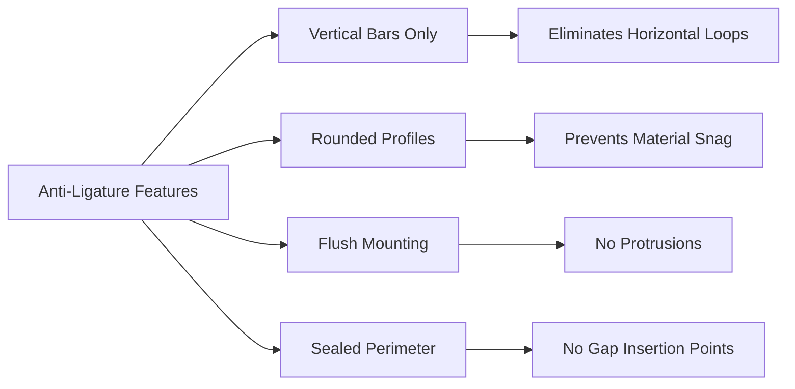

Security grilles in correctional facilities must prevent unauthorized access, weaponization, and self-harm while maintaining required airflow. Detention-grade grilles incorporate reinforced construction, anti-ligature geometry, and tamper-resistant mounting systems that exceed commercial building standards.

## Security Grille Classification

Correctional facility grilles are classified by security level, which determines construction requirements and testing protocols.

```mermaid
graph TD
    A[Security Grille Types] --> B[Maximum Security]
    A --> C[Medium Security]
    A --> D[Minimum Security]

    B --> B1[Welded 1/2" Steel Bars]
    B --> B2[3" Bar Spacing Maximum]
    B --> B3[Recessed Mounting]

    C --> C1[5/16" Steel Bars]
    C --> C2[4" Bar Spacing]
    C --> C3[Surface Mount Option]

    D --> D1[Heavy Gauge Perforated]
    D --> D2[Standard Anti-Ligature]
    D --> D3[Tamper Fasteners Only]
```

### Maximum Security Requirements

Maximum security grilles prevent tool penetration, bar spreading, and component removal through multiple design features:

- **Bar construction**: 1/2" diameter minimum steel bars, ASTM A36 or higher tensile strength
- **Welded frames**: All joints continuously welded, no mechanical fasteners on interior components
- **Bar spacing**: 3 inches maximum center-to-center to prevent limb insertion
- **Frame mounting**: Recessed into masonry or concrete, perimeter welded to embedment plates
- **Finish**: Electrostatically applied epoxy, minimum 3 mil dry film thickness

## Face Velocity and Pressure Drop

Security grille geometry affects airflow characteristics. Face velocity through bar grilles is calculated based on free area:

$$V_f = \frac{Q}{A_{free}}$$

Where:
- $V_f$ = face velocity (ft/min)
- $Q$ = airflow rate (CFM)
- $A_{free}$ = free open area (ft²)

Free area for parallel bar grilles:

$$A_{free} = \frac{(s - d)}{s} \times A_{nominal}$$

Where:
- $s$ = bar spacing center-to-center (inches)
- $d$ = bar diameter (inches)
- $A_{nominal}$ = nominal grille area (ft²)

Pressure drop through detention grilles ranges from 0.08 to 0.25 inches w.c. at 500 FPM face velocity, depending on bar configuration and depth.

## Anti-Ligature Design Principles

Anti-ligature grilles eliminate attachment points for cords, sheets, or clothing through specific geometric requirements:

**Critical design parameters:**
- No horizontal bars or edges where materials can be looped
- Vertical bar orientation only in high-risk areas
- Maximum 1/4" gap between grille perimeter and wall surface
- Rounded bar profiles preferred over rectangular sections
- Flush or recessed mounting, no protruding components



## Detention-Grade Specifications

| Component | Maximum Security | Medium Security | Minimum Security |
|-----------|------------------|-----------------|------------------|
| Bar Material | ASTM A36 Steel | ASTM A36 Steel | 14 ga. Steel |
| Bar Diameter | 1/2" minimum | 5/16" minimum | Perforated sheet |
| Bar Spacing | 3" max c-c | 4" max c-c | N/A (perf pattern) |
| Frame Thickness | 10 gauge minimum | 12 gauge | 14 gauge |
| Mounting Depth | 6" min recess | 4" min recess | Surface acceptable |
| Fasteners | Welded/embedded | Torx security | Torx security |
| Testing Force | 500 lbf impact | 300 lbf impact | 150 lbf impact |

## Tamper-Resistant Fastener Systems

Surface-mounted detention grilles require specialized fasteners that resist removal with improvised tools. Standard options include:

**Pin-in-Torx fasteners:**
- Torx drive with center pin obstruction
- Requires specialized removal tool not available to inmates
- Minimum 1/4-20 thread size for grille mounting
- Stainless steel construction for corrosion resistance

**One-way screws:**
- Slotted head that allows installation but prevents removal
- Used for permanent installations in maximum security
- Must be drilled out for removal during maintenance

**Shear nuts:**
- Hex head that breaks off at specified torque
- Leaves smooth rounded surface
- Irreversible installation method

Fastener spacing: 6 inches on-center maximum around grille perimeter, 12 inches maximum on intermediate supports.

## Strength Testing Requirements

Detention-grade grilles undergo physical testing per correctional standards to verify resistance to forced entry and component removal.

**Standard test protocols:**

1. **Static load test**: 500 pounds-force applied perpendicular to grille face for 60 seconds, no permanent deformation exceeding 1/8"

2. **Impact test**: 100 pound cylindrical mass dropped from 4 feet onto grille center, no component separation or bar bending exceeding 1/4"

3. **Bar spread test**: 500 pounds-force applied laterally between adjacent bars, maximum bar displacement 1/2"

4. **Fastener torque test**: All fasteners tightened to 150% of rated torque, no stripping or component failure

5. **Frame extraction test**: 1000 pounds-force applied to frame perimeter, no loosening of embedment or mounting system

## Installation and Embedment Details

Proper installation is critical to security performance. Recessed grilles require structural embedment before finish trades.

**Embedment sequence:**
1. Core drill or form openings in masonry/concrete substrate
2. Install steel embedment plates or channels around opening perimeter
3. Weld grille frame to embedments using continuous 1/4" minimum fillet welds
4. Grind welds smooth and flush with frame surface
5. Apply finish coating system over welds and frame
6. Caulk perimeter joint between frame and wall with non-removable sealant

**Clearance requirements:**
- Minimum 6" embedment depth for maximum security
- 2" minimum clearance behind grille for airflow distribution
- Plenum access separate from occupied space
- Duct connections behind grille not accessible from room side

## Airflow Performance

Security features reduce free area compared to commercial grilles, requiring larger nominal sizes to achieve equivalent airflow.

**Sizing calculation example:**

For 400 CFM supply at 500 FPM face velocity through 1/2" bars at 3" spacing:

$$A_{free} = \frac{400}{500} = 0.80 \text{ ft}^2$$

Free area ratio:

$$\frac{A_{free}}{A_{nominal}} = \frac{(3 - 0.5)}{3} = 0.833$$

Required nominal area:

$$A_{nominal} = \frac{0.80}{0.833} = 0.96 \text{ ft}^2 \approx 12" \times 12" \text{ grille}$$

Standard commercial 10" × 10" grille would be undersized by 30% for the same airflow performance.

## Maintenance and Inspection

Security grilles require periodic inspection to verify integrity and detect tampering attempts.

**Inspection checklist:**
- Visual examination of welds for cracks or separation
- Fastener integrity check, verify no removal attempts
- Bar straightness verification, measure any deformation
- Frame-to-wall interface seal condition
- Paint or coating condition, repair damage immediately
- Airflow measurement compared to design values

Inspection frequency: monthly for maximum security areas, quarterly for medium security, annually for minimum security zones.

## Applicable Standards

- **ACA Standards for Adult Correctional Institutions**: 4th Edition, Standard 4-ALDF-4A-16 (ventilation in housing units)
- **ASTM F1577**: Standard Test Methods for Detention Locks for Swinging Doors (fastener testing protocols adapted)
- **ICC A117.1**: Accessible and Usable Buildings and Facilities (anti-ligature requirements)
- **ASHRAE Standard 62.1**: Ventilation for Acceptable Indoor Air Quality (airflow minimums)

Coordination with correctional facility design consultants and security systems integrators ensures grille specifications meet operational security requirements while delivering code-compliant ventilation performance.