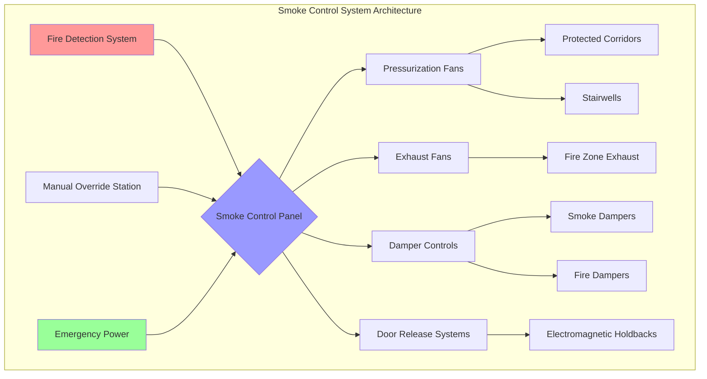
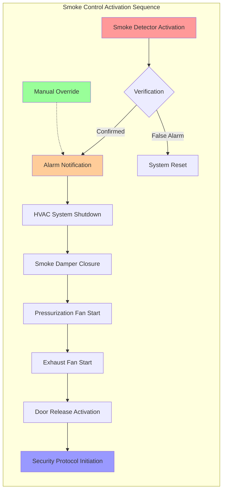

## Overview of Smoke Control in Justice Facilities

Smoke control systems in correctional facilities present unique engineering challenges distinct from conventional buildings. The fundamental principle of defend-in-place rather than evacuation drives design requirements, as rapid egress is incompatible with security protocols. Inmates cannot freely evacuate during fire events, necessitating smoke containment strategies that maintain tenable conditions within occupied zones while security personnel execute controlled movement protocols.

The primary objective is preventing smoke migration from fire zones into non-fire areas, particularly housing units, control rooms, and egress paths used during staged evacuation. NFPA 92 (Standard for Smoke Control Systems) and IBC Section 909 establish the technical framework, but correctional applications require additional considerations for security hardware integration, manual override capabilities, and backup power requirements.

## Defend-in-Place Design Strategy

Justice facilities employ defend-in-place strategies where occupants remain in secure compartments away from the fire origin until controlled relocation is feasible. This approach demands:

**Compartmentation Requirements:**
- 2-hour fire-rated barriers separating housing units
- 1.5-hour fire-rated barriers for critical security zones
- Smoke barriers with pressure differentials maintaining minimum 0.05 in. w.g. (12.5 Pa)
- Self-closing fire doors with electromagnetic hold-open devices tied to fire alarm systems

**Tenable Environment Maintenance:**
Smoke control systems must maintain visibility and toxicity levels within tenable limits for the duration required to complete controlled evacuation sequences, typically 30-60 minutes depending on facility population and staffing.

The visibility criterion requires maintaining optical density below critical thresholds:

$$
D = \frac{C \cdot L}{K}
$$

Where:
- **D** = Optical density (dimensionless)
- **C** = Smoke concentration (mg/m³)
- **L** = Path length (m)
- **K** = Visibility threshold constant (typically 8-10 for light-reflecting signs)

For tenable conditions: **D < 0.5** (equivalent to visibility > 10 m in most scenarios)

## Pressurization System Fundamentals

Stairwell and corridor pressurization prevents smoke infiltration into protected egress routes. The required pressure differential across a smoke barrier depends on leakage area and desired airflow direction.

$$
\Delta P = \frac{\rho \cdot v^2}{2} + P_f
$$

Where:
- **ΔP** = Pressure differential (Pa)
- **ρ** = Air density (kg/m³, typically 1.2 at standard conditions)
- **v** = Velocity through opening (m/s)
- **P_f** = Friction losses (Pa)

For door openings, the minimum pressure differential to prevent smoke backflow:

$$
\Delta P_{min} = K \cdot A_{door} \cdot \sqrt{\rho}
$$

Where:
- **K** = Flow coefficient (typically 0.65-0.85 for doors)
- **A_door** = Effective leakage area (m²)

**Typical design values for correctional facilities:**
- Pressurized corridors: 0.10-0.15 in. w.g. (25-37 Pa)
- Stairwells: 0.15-0.20 in. w.g. (37-50 Pa)
- Elevator shafts: 0.15-0.25 in. w.g. (37-62 Pa)

## Smoke Control System Comparison

| System Type | Application | Advantages | Limitations | IBC Reference |
|-------------|-------------|------------|-------------|---------------|
| **Pressurization** | Stairwells, corridors, vestibules | Simple control logic, effective for vertical shafts | Requires tight construction, door opening forces | IBC 909.6 |
| **Zoned Smoke Control** | Large dayrooms, multi-level housing | Limits smoke spread, maintains refuge areas | Complex control sequences, higher cost | IBC 909.8 |
| **Mechanical Exhaust** | Kitchen, laundry, workshop areas | Direct smoke removal from source | Requires makeup air, potential for backdraft | IBC 909.10 |
| **Natural Venting** | Single-story housing pods | No power requirement, simple | Weather-dependent, limited control | IBC 909.11 |
| **Atrium Smoke Exhaust** | Multi-story common areas | Large volume dilution, visibility maintenance | High exhaust rates required | IBC 909.12 |

## Exhaust System Sizing

Smoke exhaust rates depend on fire heat release rate (HRR) and required smoke layer interface height. The mass flow rate required to maintain a smoke layer at height **z** above the fire source:

$$
\dot{m} = 0.071 \cdot Q_c^{1/3} \cdot z^{5/3}
$$

Where:
- **ṁ** = Mass flow rate (kg/s)
- **Q_c** = Convective heat release rate (kW)
- **z** = Height above fire to smoke layer interface (m)

For volumetric flow rate conversion:

$$
\dot{V} = \frac{\dot{m}}{\rho_{smoke}}
$$

**Design heat release rates for correctional spaces:**

| Space Type | Design HRR (kW) | Basis |
|------------|-----------------|-------|
| Cell/housing unit | 500-1,000 | Limited fuel load, concrete construction |
| Dayroom | 1,500-2,500 | Furniture, limited combustibles |
| Storage/supply | 2,500-5,000 | Higher fuel density |
| Industrial/workshop | 5,000-10,000 | Equipment, materials storage |

## Unique Correctional Requirements

**Security Integration:**
Smoke control systems must interface with security systems without compromising lockdown capabilities. Electromagnetic door releases require fail-safe logic that maintains security barriers while allowing emergency egress.

**Manual Override Capability:**
Control room operators need manual smoke control activation independent of automatic fire detection for scenarios where early intervention is warranted or automatic systems malfunction.

**Backup Power Duration:**
NFPA 92 requires emergency power for smoke control systems. Correctional facilities typically extend this to **4 hours minimum** due to extended evacuation timelines and potential for delayed fire service access.

**Tamper Resistance:**
All accessible components (grilles, sensors, manual stations) require vandal-resistant construction and security hardware.

## Makeup Air Considerations

Exhaust systems require makeup air to prevent building depressurization. The makeup air volume must equal or slightly exceed exhaust volume to maintain controlled pressure relationships.

$$
\dot{V}_{MA} = \dot{V}_{exhaust} \times 1.1
$$

Makeup air introduction points must not compromise smoke control objectives. Introduce makeup air:
- Below the neutral pressure plane in pressurized zones
- Remote from exhaust points to prevent short-circuiting
- Through dedicated louvers with motorized dampers, not through existing HVAC systems

## Testing and Commissioning Requirements

NFPA 92 Section 8.6 mandates comprehensive acceptance testing. Correctional facilities add security coordination requirements:

**Pre-functional Testing:**
1. Verify all damper positions under normal and alarm conditions
2. Confirm pressure sensor calibration (±10% accuracy required)
3. Test door opening forces (IBC maximum 30 lbf, or 133 N, under pressurization)
4. Verify emergency power transfer and runtime

**Functional Performance Testing:**
1. Measure pressure differentials across all smoke barriers under design conditions
2. Verify smoke layer maintenance heights using theatrical smoke or tracer gas
3. Test system response to single and multiple zone activation
4. Confirm integration with security lockdown protocols

**Annual Testing:**
- Pressure differential verification
- Fan performance trending
- Control sequence verification
- Door opening force measurements

## Code Compliance Summary

**NFPA 92 Key Requirements:**
- Smoke control systems as part of fire protection strategy (Section 4.2)
- Pressurization design methods (Section 5.3)
- Exhaust system design criteria (Section 5.4)
- Testing and acceptance procedures (Chapter 8)

**IBC Section 909 Requirements:**
- Where required: Buildings >55 ft height, atriums, underground buildings (909.1)
- Design criteria: Analysis per approved method, typically computational or zone models (909.4)
- Smoke barrier construction: Minimum 1-hour rating (909.5)
- Emergency power: Full system operation capability (909.11)

Smoke control system design for justice facilities demands integration of life safety principles with operational security requirements, creating engineered solutions that protect occupants while maintaining institutional control during fire emergencies.
