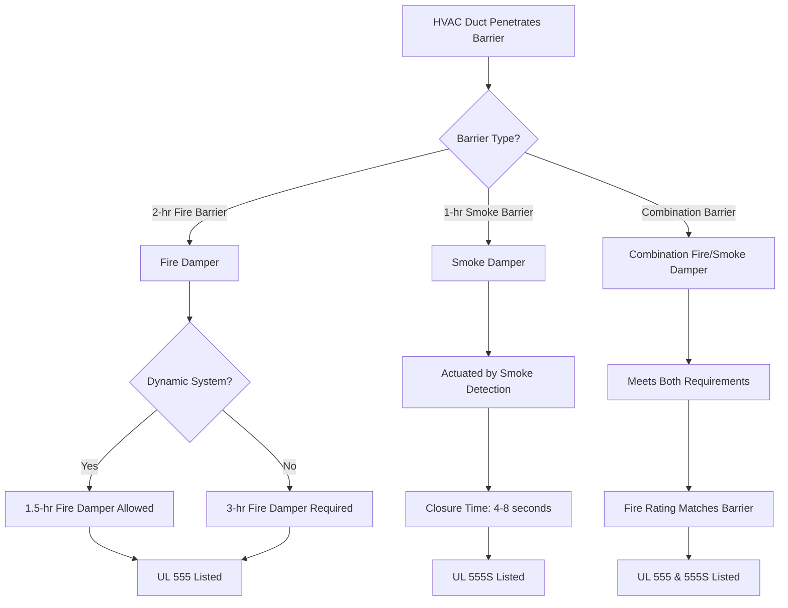
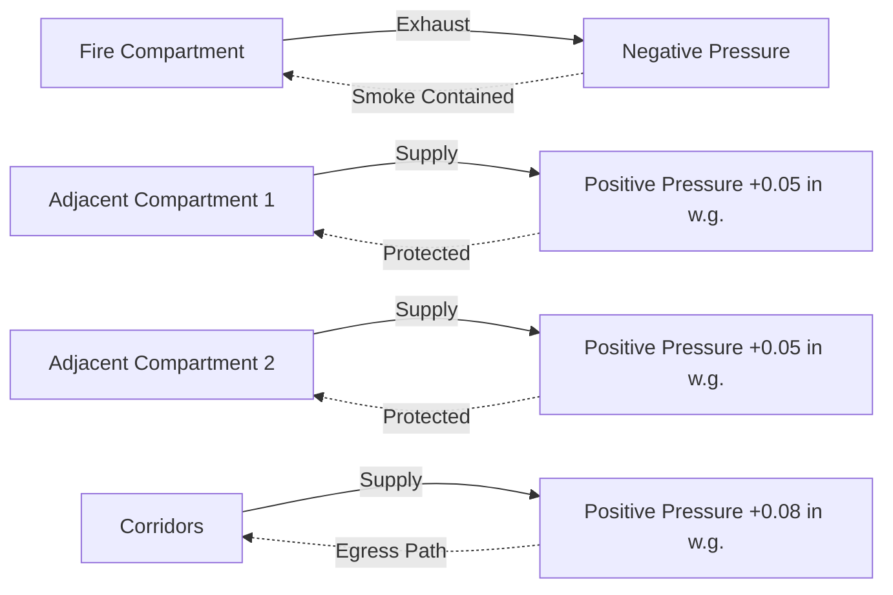

## Overview

Smoke compartmentation in justice facilities implements a defend-in-place strategy that prevents the evacuation of secured populations during fire emergencies. Unlike conventional buildings where occupants evacuate to the exterior, correctional facilities rely on robust fire-rated barriers and smoke control systems to protect inmates within their compartments while fire suppression and rescue operations proceed.

The fundamental principle: contain smoke and fire products within the compartment of origin, maintaining tenable conditions in adjacent spaces for a minimum of 2 hours.

## Design Requirements

### Fire Barrier Construction

IBC Section 408.7 and NFPA 101 Chapter 22 establish minimum requirements for justice facility compartmentation:

**Compartment Fire Resistance:**
- Smoke barriers: minimum 1-hour fire resistance rating
- Fire barriers separating compartments: minimum 2-hour rating
- Floor-ceiling assemblies: minimum 2-hour rating
- All barriers extend slab-to-slab (no soft ceilings within compartments)

**Maximum Compartment Size:**

| Occupancy Classification | Max Area per Compartment | Max Travel Distance |
|-------------------------|--------------------------|---------------------|
| Detention/Correctional | 10,000 sq ft | 200 ft to smoke barrier |
| Housing Units | 7,500 sq ft | 150 ft within unit |
| Medical/Infirmary | 22,500 sq ft | 200 ft (with sprinklers) |
| Administrative Areas | Per IBC Table 508.4 | 250 ft (with sprinklers) |

### Leakage Requirements

Smoke barrier leakage directly impacts compartmentation effectiveness. The pressure differential required across a smoke barrier depends on allowable leakage:

$$Q_L = C_d \cdot A \cdot \sqrt{2\Delta P / \rho}$$

Where:
- $Q_L$ = leakage flow rate (cfm)
- $C_d$ = discharge coefficient (0.65 typical for construction gaps)
- $A$ = total leakage area (sq ft)
- $\Delta P$ = pressure differential (lb/sq ft)
- $\rho$ = air density (0.075 lb/cu ft standard)

**NFPA 92 Leakage Targets:**
- Smoke barriers: maximum 0.10 sq in per sq ft of wall area
- Doors in smoke barriers: maximum 0.5 cfm per sq ft of door area at 0.10 in w.g.

For tighter compartmentation in high-security areas:

$$A_{max} = \frac{Q_{supply} \cdot \rho}{C_d \cdot \sqrt{2\Delta P}}$$

This establishes the maximum allowable construction leakage given available pressurization airflow.

## HVAC Penetration Protection

Every HVAC penetration through a fire or smoke barrier compromises compartment integrity. Protection strategies include:

### Damper Requirements

**Critical Installation Details:**
- Fire dampers installed at barrier location (not offset into duct)
- Minimum 6-inch clearance around damper for inspection access
- Sleeves through rated assemblies maintain barrier fire rating
- Damper size matches duct size (no transitions immediately adjacent)
- Actuator and controls accessible from non-fire side

### Penetration Sealing

Non-ducted penetrations require equal attention:

| Penetration Type | Sealing Method | Fire Rating |
|------------------|----------------|-------------|
| Cable trays | Firestop board + intumescent | Matches barrier |
| Individual cables | Intumescent caulk/putty | Matches barrier |
| Conduit | Intumescent collar or wrap | Matches barrier |
| Pipe (combustible) | Intumescent collar | Matches barrier |
| Pipe (non-combustible) | Firestop caulk | Matches barrier |

All penetration seals tested per ASTM E814 or UL 1479 (through-penetration firestop systems).

## Compartment Pressurization Strategy

Pressurization maintains smoke barrier integrity by counteracting stack effect and preventing smoke infiltration:

$$\Delta P = K \cdot \rho \cdot g \cdot h \cdot \Delta T / T_{abs}$$

Where:
- $\Delta P$ = stack pressure differential (lb/sq ft)
- $K$ = coefficient (0.52 for doors)
- $g$ = gravitational acceleration (32.2 ft/s²)
- $h$ = height of opening (ft)
- $\Delta T$ = temperature difference across barrier (°F)
- $T_{abs}$ = absolute temperature (°R)

**Design Targets:**
- Minimum pressure differential: 0.05 in w.g. (12.5 Pa)
- Maximum pressure differential: 0.35 in w.g. to allow door operation
- Pressurization airflow overcomes stack effect plus construction leakage

### Zoned Pressurization

**Operational Sequence:**
1. Smoke detection activates in fire compartment
2. Supply air to fire compartment shuts down (dampers close)
3. Exhaust activated in fire compartment (if provided)
4. Supply air to adjacent compartments increases 10-15%
5. Corridor supply increases to maintain positive pressure
6. Building automation monitors pressure differentials
7. Makeup air systems modulate to maintain targets

## System Integration

Compartmentation relies on coordinated systems:

- **Fire Detection:** Initiates damper closure and pressurization sequence
- **HVAC Controls:** Modulates airflows to maintain pressure differentials
- **Door Hardware:** Electromagnetic locks release, door closers function under pressure
- **Annunciation:** Fire alarm panel displays compartment status and damper positions
- **Smoke Exhaust:** Extracts smoke from fire compartment (if provided)

**Testing Requirements (NFPA 92):**
- Pressure differential measurements at each smoke barrier
- Damper closure verification at each penetration
- Door opening forces under pressurization (maximum 30 lbf)
- Leakage testing of critical barriers
- Annual functional testing of automatic controls

## Special Considerations for Justice Facilities

### Security Override

Smoke control must not compromise security:
- Dampers fail closed (secure position) on power loss
- Manual override requires two-person authorization
- Life safety systems on emergency power (minimum 2 hours)
- Remote monitoring in control room shows all damper positions

### Defend-in-Place Duration

IBC requires 2-hour compartmentation minimum. Calculate smoke filling time to verify:

$$t_{fill} = \frac{V \cdot (H_{clear} / H_{total})}{Q_{smoke} - Q_{exhaust}}$$

Where:
- $t_{fill}$ = time to smoke interface descent to critical height (minutes)
- $V$ = compartment volume (cu ft)
- $H_{clear}$ = clear height required (typically 6 ft minimum)
- $H_{total}$ = total ceiling height (ft)
- $Q_{smoke}$ = smoke generation rate (cfm)
- $Q_{exhaust}$ = mechanical exhaust rate (cfm)

Design target: maintain $t_{fill}$ greater than 120 minutes assuming 10,000 BTU/s fire.

## Compliance Summary

**Primary Standards:**
- IBC Section 408.7: Compartmentation requirements
- NFPA 101 Chapter 22: Detention and correctional occupancies
- NFPA 92: Smoke control systems
- NFPA 204: Smoke and heat venting
- IMC Section 607: Duct and transfer openings

**Approval Requirements:**
- Smoke control sequence of operations submitted for fire marshal review
- Damper shop drawings reviewed by fire protection engineer
- Pressure test results prior to occupancy
- Annual testing and maintenance documentation

---

**File:** `/Users/evgenygantman/Documents/github/gantmane/hvac/content/specialty-applications-testing/specialty-hvac-applications/justice-facilities/smoke-control-justice/compartmentation/_index.md`

**Word Count:** 891 words