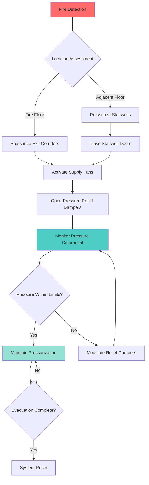
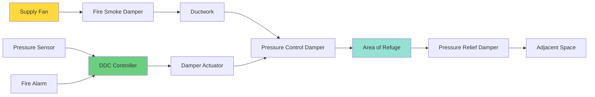

## Overview

Egress protection in justice facilities presents unique challenges due to controlled access, security requirements, and the defend-in-place strategy often employed in detention settings. Unlike conventional occupancies where total evacuation is standard, justice facilities frequently rely on staged evacuation or relocation to designated areas of refuge. The smoke control system must maintain tenable conditions in egress corridors and exit stairwells while accommodating security protocols.

## Defend-in-Place vs. Evacuation Strategies

Justice facilities employ two primary life safety strategies, each requiring distinct smoke control approaches:

**Defend-in-Place Strategy:**
- Occupants remain in cells or designated compartments during initial fire stages
- Smoke control maintains tenable conditions in adjacent corridors
- Relocation occurs only when fire threatens the compartment
- Requires robust compartmentation and corridor pressurization
- Common in high-security facilities where rapid evacuation is impractical

**Staged Evacuation Strategy:**
- Occupants move through sequential protected zones
- Exit corridors must maintain smoke-free conditions throughout evacuation
- Stairwell pressurization prevents smoke infiltration
- Requires coordinated fire alarm and access control override
- Typical in medium and low-security facilities

The smoke control design must align with the facility's emergency action plan and security classification.

## Corridor Pressurization Fundamentals

Corridor pressurization creates a positive pressure differential that prevents smoke migration from adjacent spaces. The pressure difference drives airflow from the protected corridor into fire-affected areas, maintaining a tenable egress path.

### Pressure Differential Requirements

The minimum pressure differential required to prevent smoke infiltration is:

$$\Delta P = \rho g h \Delta T / T_{avg}$$

where:
- $\Delta P$ = pressure differential (Pa)
- $\rho$ = air density (kg/m³)
- $g$ = gravitational acceleration (9.81 m/s²)
- $h$ = vertical height (m)
- $\Delta T$ = temperature difference (K)
- $T_{avg}$ = average absolute temperature (K)

For ambient temperature conditions, NFPA 92 requires minimum pressure differentials:

| Application | Minimum Pressure | Maximum Pressure | Notes |
|-------------|------------------|------------------|-------|
| Egress Corridors | 25 Pa (0.10 in. w.g.) | 75 Pa (0.30 in. w.g.) | Across closed doors |
| Exit Stairwells | 50 Pa (0.20 in. w.g.) | 100 Pa (0.40 in. w.g.) | Single door open |
| Areas of Refuge | 12.5 Pa (0.05 in. w.g.) | 75 Pa (0.30 in. w.g.) | Minimum tenable conditions |
| Elevator Lobbies | 25 Pa (0.10 in. w.g.) | 75 Pa (0.30 in. w.g.) | Smoke-protected lobbies |

Maximum pressure limits prevent excessive door opening forces that would impede egress.

### Supply Airflow Calculation

The required supply airflow to maintain pressure differential accounts for leakage through doors, walls, and penetrations:

$$Q_{supply} = Q_{leakage} + Q_{doors}$$

Door leakage flow rate:

$$Q_{door} = C A \sqrt{2 \Delta P / \rho}$$

where:
- $Q_{door}$ = volumetric flow rate through door gaps (m³/s)
- $C$ = flow coefficient (0.65-0.70 for door gaps)
- $A$ = effective leakage area (m²)
- $\Delta P$ = pressure differential (Pa)
- $\rho$ = air density (kg/m³)

For a standard 914 mm × 2134 mm (36 in. × 84 in.) door with typical gap dimensions, the leakage area is approximately 0.0232 m² (36 in²).

At 25 Pa differential:

$$Q_{door} = 0.65 \times 0.0232 \times \sqrt{2 \times 25 / 1.2} = 0.098 \text{ m}^3\text{/s (208 cfm)}$$

Total supply airflow must account for all leakage paths plus a safety factor of 1.2-1.5.

## Egress Path Protection Sequence

## Code Requirements and Compliance

### NFPA 92 - Smoke Control Systems

Key requirements for egress protection:

- Pressure differential testing with all doors closed
- Single door open scenario testing
- Maximum door opening force verification (≤133 N or 30 lbf)
- Smoke control sequence coordination with fire alarm
- Emergency power supply for smoke control equipment
- Quarterly functional testing of pressurization systems

### IBC Section 909 - Smoke Control Systems

- Smoke control system design documentation required
- Rational analysis or testing to demonstrate effectiveness
- Special inspections during construction
- Acceptance testing prior to occupancy
- System maintenance and testing plan

### NFPA 101 - Life Safety Code

Specific provisions for detention and correctional occupancies:

| Code Section | Requirement | Application |
|--------------|-------------|-------------|
| 22.4.4.12 | Smoke compartments ≤2,787 m² (30,000 ft²) | Maximum compartment size |
| 22.4.4.13 | Automatic smoke detection in corridors | Early warning system |
| 22.7.1 | Emergency lighting in egress paths | Minimum 10.8 lux (1 fc) |
| 22.4.4.5 | 1-hour fire resistance rating for corridors | Smoke barrier integrity |

## Areas of Refuge Pressurization

Justice facilities often designate areas of refuge where occupants await assisted rescue or relocation. These spaces require pressurization to maintain tenable conditions during extended holding periods.

### Design Criteria for Areas of Refuge

- Minimum 12.5 Pa (0.05 in. w.g.) pressure differential
- Two-way communication system with fire command center
- Visual identification signage meeting ADA requirements
- Minimum 0.28 m² (3 ft²) per occupant floor area
- Emergency lighting with 90-minute battery backup

### Pressurization System Components

## Emergency Power Requirements

All smoke control equipment serving egress paths must connect to emergency power systems per NFPA 70 (NEC) Article 700. The emergency power system must support:

- Supply and exhaust fans for pressurization
- Smoke damper actuators
- Control panels and monitoring equipment
- Pressure sensors and differential monitoring
- Fire alarm interface components

Emergency power must activate within 10 seconds of normal power failure and sustain operation for minimum 120 minutes in justice facilities.

## System Integration and Testing

Egress protection systems integrate with multiple building systems:

- Fire alarm initiates smoke control sequences
- Access control overrides security locks on egress doors
- Mass notification alerts occupants and staff
- Building automation monitors system status
- Video surveillance confirms evacuation progress

Quarterly testing verifies pressure differentials, door opening forces, and proper sequencing. Annual commissioning includes full-system smoke control drills coordinated with facility operations.

## Conclusion

Effective egress protection in justice facilities balances life safety requirements with security constraints. Corridor pressurization systems must maintain adequate pressure differentials while limiting door opening forces to facilitate evacuation. The defend-in-place strategy requires robust compartmentation and reliable pressurization to protect occupants unable to self-evacuate. Compliance with NFPA 92, IBC Section 909, and NFPA 101 detention occupancy provisions ensures the smoke control system provides tenable egress conditions throughout the evacuation or relocation process.
