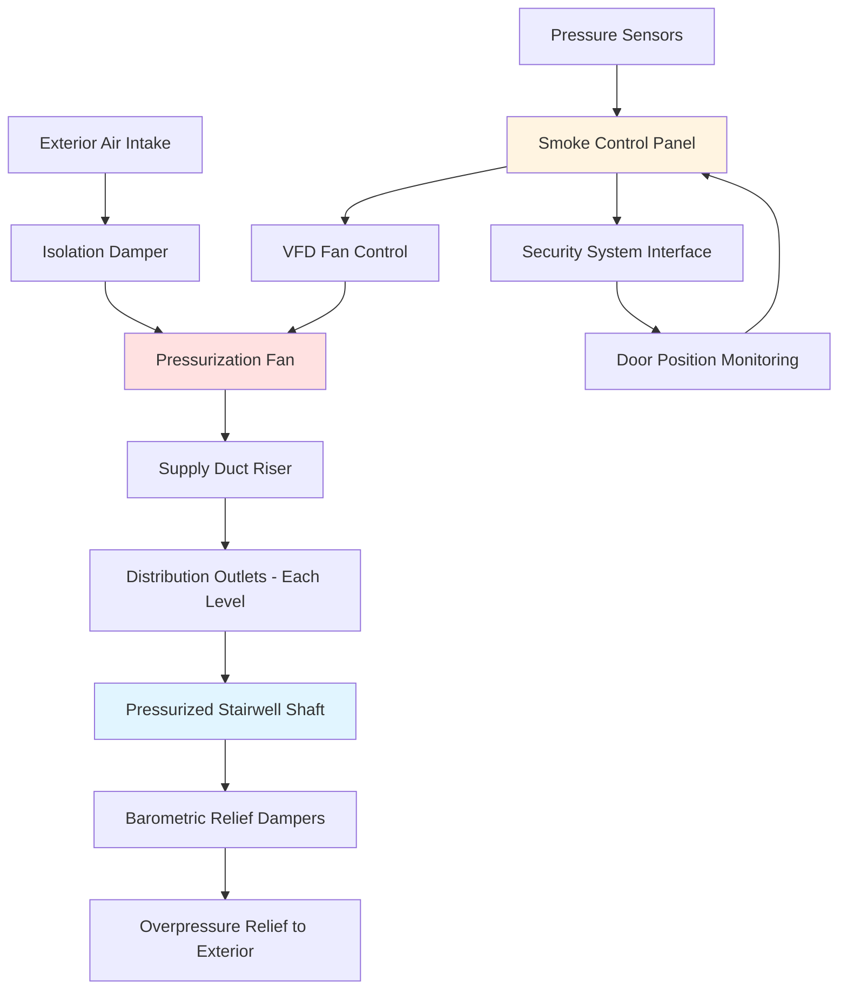
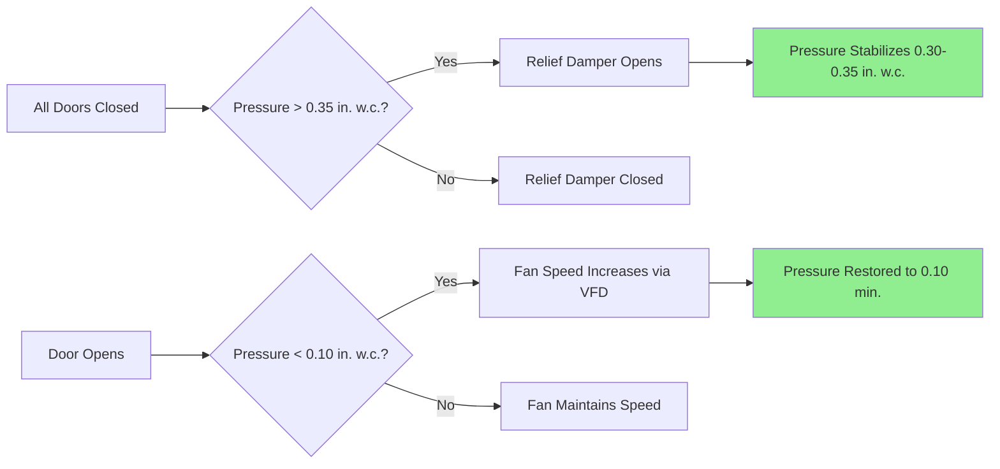

## Overview

Stairwell pressurization in justice facilities presents unique challenges that combine life safety requirements with stringent security protocols. Unlike conventional buildings, correctional stairwells must maintain smoke-free egress paths while accommodating security doors, control systems, and operational constraints that can significantly impact pressure control strategies.

The primary objective is to create a positive pressure differential that prevents smoke infiltration during fire events while ensuring door opening forces remain within code-compliant limits. This balance becomes critical when security hardware adds significant resistance to door operation.

## Design Pressure Differentials

NFPA 92 and IBC Section 909 establish minimum pressure differentials for stairwell pressurization. Justice facilities typically require enhanced performance due to building height and security door configurations.

### Minimum Pressure Requirements

| Condition | Minimum Pressure | Maximum Pressure | Code Reference |
|-----------|------------------|------------------|----------------|
| All doors closed | 0.10 in. w.c. | 0.35 in. w.c. | NFPA 92 (5.2.2.3) |
| Single door open | 0.10 in. w.c. | N/A | NFPA 92 (5.2.2.4) |
| Maximum allowable | N/A | 0.60 in. w.c. | IBC 909.20.5 |
| Door opening force limit | Pressure creating ≤30 lbf | N/A | IBC 1010.1.3 |

### Pressure Differential Calculation

The required pressure differential across the stairwell boundary is calculated considering leakage area and desired air velocity:

$$\Delta P = \left(\frac{Q}{C \cdot A}\right)^2 \cdot \rho$$

Where:
- $\Delta P$ = pressure differential (in. w.c.)
- $Q$ = airflow rate (cfm)
- $C$ = flow coefficient (typically 0.65)
- $A$ = total leakage area (ft²)
- $\rho$ = air density factor

For justice facilities, calculate total leakage area including:

$$A_{total} = A_{doors} + A_{walls} + A_{penetrations}$$

Door leakage typically dominates:

$$A_{doors} = n \cdot P \cdot w \cdot C_L$$

Where:
- $n$ = number of doors
- $P$ = door perimeter (ft)
- $w$ = average gap width (ft, typically 0.0025-0.005)
- $C_L$ = leakage coefficient (0.6-0.8 for security doors)

## Door Opening Force Analysis

Security doors in correctional facilities present substantial challenges for pressurization systems. The maximum door opening force is governed by IBC 1010.1.3, limiting interior door opening force to 30 lbf for accessible routes (5 lbf set force plus 30 lbf opening force).

### Force Calculation

The force required to open a door against pressure differential:

$$F_{pressure} = \Delta P \cdot A_{door} \cdot K$$

Where:
- $F_{pressure}$ = force due to pressure (lbf)
- $\Delta P$ = pressure differential (psf)
- $A_{door}$ = door area (ft²)
- $K$ = application factor (1.0 for hinged doors)

Converting pressure from in. w.c. to psf:

$$P_{psf} = P_{in.w.c.} \cdot 5.20$$

For a standard 3 ft × 7 ft door at 0.30 in. w.c.:

$$F_{pressure} = (0.30 \cdot 5.20) \cdot (3 \cdot 7) \cdot 1.0 = 32.8 \text{ lbf}$$

This exceeds code limits when combined with security hardware friction, requiring pressure relief mechanisms.

## Pressurization Fan Sizing

Fan selection must account for variable system resistance as doors open and close, security vestibule configurations, and worst-case leakage scenarios.

### Airflow Calculation

Base airflow requirement for pressurization:

$$Q = 5,000 \cdot A_{floor} \cdot N$$

Where:
- $Q$ = supply airflow (cfm)
- $A_{floor}$ = stairwell floor area per level (ft²)
- $N$ = number of floors

Alternatively, calculate based on desired pressure and leakage:

$$Q = C_d \cdot A_{leak} \cdot \sqrt{2 \cdot \Delta P \cdot \frac{1}{0.075}}$$

Where:
- $C_d$ = discharge coefficient (0.6-0.65)
- $A_{leak}$ = total leakage area (ft²)
- $\Delta P$ = pressure differential (in. w.c.)

### Fan Pressure Requirements

Total fan static pressure must overcome:

$$P_{fan} = P_{duct} + P_{inlet} + P_{discharge} + \Delta P_{design}$$

Typical values for justice facility stairwells:
- Duct losses: 0.5-1.5 in. w.c.
- Intake losses: 0.2-0.5 in. w.c.
- Discharge losses: 0.1-0.3 in. w.c.
- Design pressure differential: 0.10-0.35 in. w.c.

Select fans for 150% of calculated airflow to accommodate single door open condition.

## System Configuration

## Security Integration Considerations

Justice facilities require coordination between smoke control and security systems:

1. **Door Position Monitoring**: Integrate magnetic door contacts with smoke control panel to modulate fan speed based on door status
2. **Sequential Door Release**: Program smoke control to accommodate security protocols requiring controlled door unlocking sequences
3. **Override Hierarchy**: Establish clear priority between life safety and security systems during emergency events
4. **Vestibule Pressurization**: Design pressure cascades for sally ports and secure vestibules to prevent smoke spread while maintaining security zones

## Relief Damper Strategies

Barometric relief dampers prevent overpressurization when all doors are closed:

### Relief Damper Sizing

$$A_{relief} = \frac{Q_{excess}}{V_{relief} \cdot 60}$$

Where:
- $A_{relief}$ = relief damper free area (ft²)
- $Q_{excess}$ = excess airflow at maximum pressure (cfm)
- $V_{relief}$ = relief air velocity (typically 1,000-2,000 fpm)

Set relief dampers to open at 0.30-0.35 in. w.c. to maintain pressure within acceptable range.

## Testing and Commissioning

Verification testing must demonstrate:

1. Minimum 0.10 in. w.c. pressure differential with all doors closed
2. Minimum 0.10 in. w.c. with worst-case single door open
3. Maximum door opening force ≤30 lbf at any condition
4. Relief damper operation at setpoint
5. System response time ≤30 seconds to achieve design pressure

Document all security door positions, interlock sequences, and override conditions during acceptance testing per NFPA 92 Chapter 8.

## Code References

- **NFPA 92**: Standard for Smoke Control Systems (2021 Edition, Sections 5.2.2, 5.2.3)
- **IBC Section 909**: Smoke Control Systems
- **IBC Section 1010.1.3**: Door Opening Force Limitations
- **NFPA 101**: Life Safety Code, Means of Egress Requirements

---

*Technical content focusing on engineering calculations and security-integrated design for correctional facility stairwell pressurization systems.*
