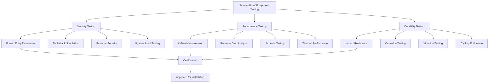
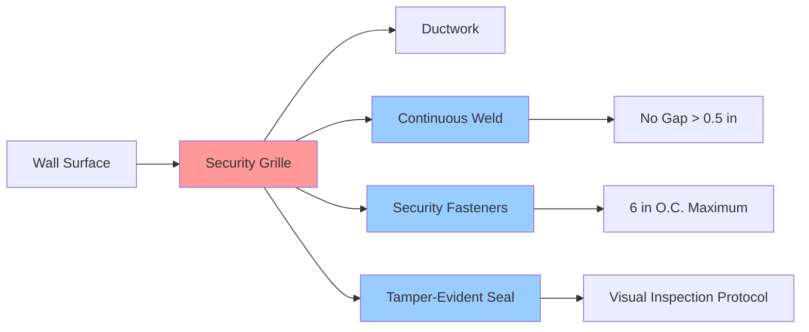

Tamper-proof HVAC equipment represents a critical category of climate control systems designed specifically for correctional facilities, detention centers, and secure psychiatric institutions. These specialized components must maintain thermal comfort while withstanding deliberate attempts at damage, concealment, or weaponization by inmates. The design philosophy centers on eliminating exposed fasteners, vulnerable components, and potential ligature points while ensuring reliable operation and maintainability.

## Security Classification and Equipment Types

Detention-grade HVAC equipment undergoes rigorous design modifications to meet institutional security requirements. Standard commercial components are fundamentally unsuitable for inmate-accessible areas due to exposed controls, removable panels, and components that could be fashioned into weapons or used for concealment.

### Tamper-Proof Equipment Categories

| Equipment Type | Security Features | Typical Applications | Standard Reference |
|----------------|-------------------|----------------------|-------------------|
| Security Grilles | Continuous welded construction, concealed fasteners | Return air, supply air in cells | ASTM F1577 |
| Tamper-Proof Diffusers | One-piece steel construction, security screws | Dayrooms, housing units | ACA Standards |
| Detention Thermostats | Flush-mount, lexan cover, limited range | Housing units, programs areas | NFPA 90A |
| Security HVAC Units | Heavy-gauge enclosure, welded seams | Direct cell ventilation | DOJ Design Guide |
| Ligature-Resistant Grilles | Rounded edges, no protrusions | Mental health units | VA Design Manual |

## Design Principles for Tamper Resistance

The engineering of tamper-proof HVAC equipment balances security requirements with thermal performance. Standard design principles include:

**Material Selection:** Minimum 14-gauge cold-rolled steel for grilles and enclosures, with 16-gauge acceptable only for low-security areas. Stainless steel (304 or 316) provides enhanced corrosion resistance in high-humidity areas and resists chemical damage.

**Fastener Security:** All exposed fasteners must utilize security heads requiring specialized tools (torx, hex-pin, one-way screws). Welded construction eliminates fasteners entirely in high-security areas. Tamper-evident seals provide visual indication of unauthorized access attempts.

**Ligature Prevention:** All surfaces accessible to occupants must eliminate protrusions, gaps, or mounting points capable of supporting ligature attachment. This requires flush mounting with continuous perimeter welds and radiused corners.

## Airflow Performance and Security Trade-offs

Tamper-resistant design inherently restricts airflow patterns and increases system resistance. The relationship between security features and thermal performance requires careful analysis.

### Pressure Drop Considerations

Security grilles exhibit higher pressure drops than standard architectural grilles due to reduced free area. The pressure drop relationship follows:

$$\Delta P = \frac{\rho V^2}{2} \cdot K$$

where $K$ represents the loss coefficient specific to security grille geometry. Typical detention grilles exhibit $K$ values of 2.5-4.0 compared to 0.8-1.5 for standard grilles.

The effective free area calculation becomes critical:

$$\text{Free Area} = \frac{Q}{V \cdot A_{\text{total}}}$$

Detention grilles typically achieve 40-50% free area versus 60-70% for standard grilles. This necessitates oversizing grille face areas by 30-40% to maintain acceptable face velocities below 500 fpm.

### Heat Transfer Impact

Restricted airflow patterns affect local heat transfer coefficients. The convective heat transfer relationship:

$$q = h \cdot A \cdot \Delta T$$

indicates that reduced airflow (lower $h$ values) requires increased surface area or temperature differential to maintain cooling capacity. This manifests as:

- Increased supply air quantities (10-20% above standard calculations)
- Lower supply air temperatures to compensate
- Enhanced mixing requirements to prevent stratification

## Testing and Certification Protocols

Detention-grade HVAC equipment undergoes specialized testing beyond standard HVAC certifications. Testing protocols verify both security integrity and thermal performance.

### Security Testing Standards

**Physical Attack Resistance:** Equipment must withstand 15-minute attack attempts using tools available within the facility. Testing involves impact, prying, and cutting attempts documented per ASTM F1577.

**Fastener Security:** All security fasteners undergo torque testing and removal attempt documentation. One-way screws must demonstrate irreversible installation characteristics.

**Ligature Testing:** Components in mental health units undergo 250-lb static load testing at all potential attachment points with no deflection exceeding 0.25 inches.

## Installation and Maintenance Requirements

Proper installation ensures security features function as designed. Critical installation parameters include:

### Mounting Specifications

Security grilles require continuous perimeter attachment with fasteners spaced maximum 6 inches on center. Wall penetrations must achieve airtight seals using security-rated caulking compounds that harden to prevent removal.

Clearances between HVAC components and structural elements must not exceed 0.5 inches to prevent contraband concealment. This requires field verification and shimming during installation.

### Maintenance Access Protocols

The conflict between security and maintenance access requires institutional protocols:

- All maintenance requiring component removal necessitates security escort
- Service panels located in secure corridors or ceiling spaces
- Predictive maintenance schedules minimize emergency access needs
- Spare component inventory maintained to reduce service duration

### Security Diagram for Installation

## Specification and Procurement Considerations

Specifying detention-grade HVAC equipment requires detailed security language beyond standard HVAC specifications. Key specification elements include:

**Material Requirements:** Specify minimum gauge thickness, steel grade (ASTM A1008 or A653), and corrosion protection (powder coating minimum 3 mil thickness).

**Security Features:** Enumerate required security characteristics including fastener types, weld specifications, and ligature resistance requirements specific to facility security level.

**Testing Documentation:** Require manufacturer submission of third-party testing reports verifying compliance with ASTM F1577, ACA standards, and jurisdiction-specific requirements.

**Warranty Provisions:** Extended warranties (minimum 5 years) account for the specialized nature and limited supplier base for detention-grade equipment.

The thermal performance of correctional facility HVAC systems depends fundamentally on the proper selection and installation of tamper-proof equipment. Security requirements drive design decisions that impact airflow, heat transfer, and system capacity. Successful implementation requires coordination between mechanical engineers, security personnel, and institutional operations staff to balance competing requirements while maintaining code compliance and operational reliability.
