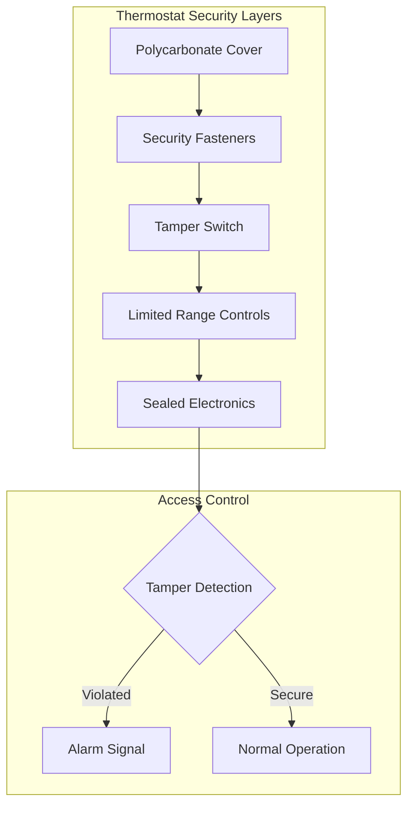
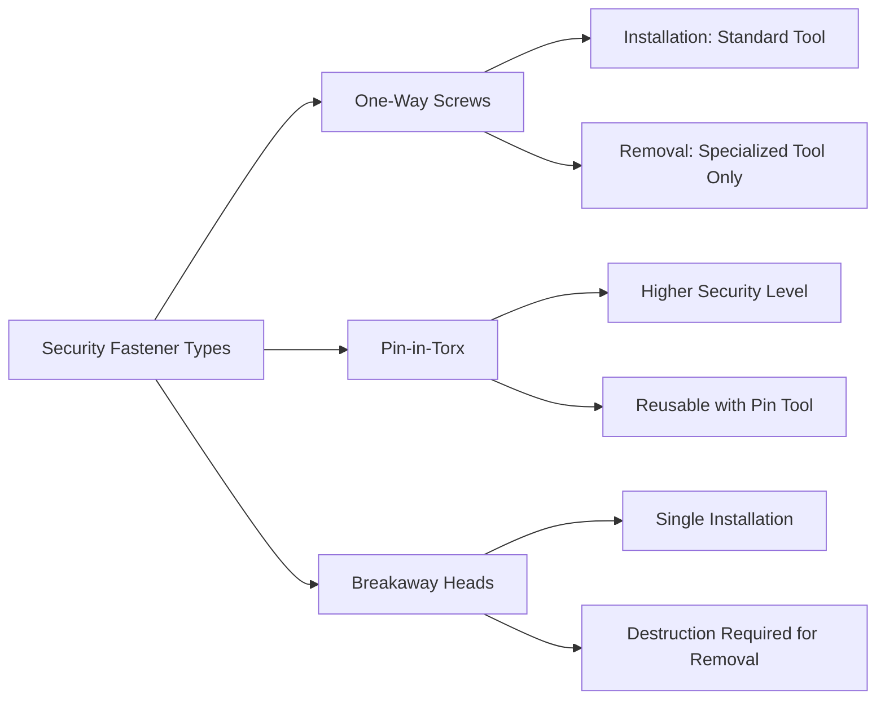
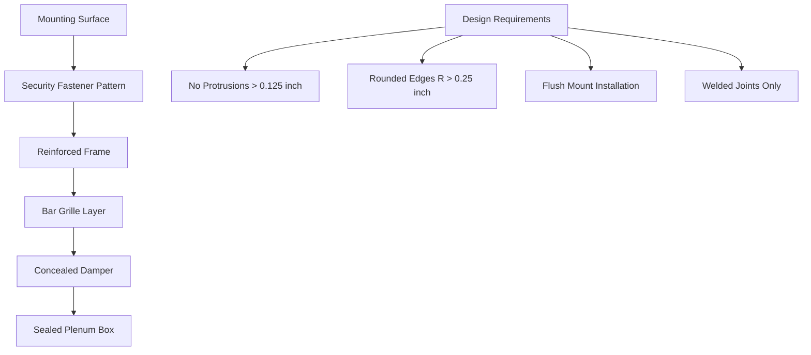

## Overview

Hardened HVAC components for justice facilities must withstand deliberate abuse, prevent weapon fabrication, and maintain functionality under extreme use conditions. Component selection follows detention-grade standards that exceed commercial building requirements by factors of 10-100 in impact resistance and tamper resistance.

## Material Selection Criteria

### Detention-Grade Material Requirements

| Material Property | Commercial Standard | Detention Grade | Test Method |
|-------------------|---------------------|-----------------|-------------|
| Impact Resistance | 50 ft-lb | 500+ ft-lb | ASTM E1966 |
| Tensile Strength | 30,000 psi | 60,000+ psi | ASTM E8 |
| Fastener Torque | 25 in-lb | 150+ in-lb | One-way security |
| Surface Hardness | Rockwell B70 | Rockwell C40+ | ASTM E18 |
| Ligature Resistance | N/A | No protrusions >0.125" | ACA 4-ALDF |

### Material Physics

The fracture toughness requirement for detention-grade components follows:

$$K_{IC} = \sigma \sqrt{\pi a}$$

Where:
- $K_{IC}$ = Critical stress intensity factor (minimum 50 MPa√m for detention grade)
- $\sigma$ = Applied stress
- $a$ = Crack length

For stainless steel 304/316 components, yield strength must exceed:

$$\sigma_y \geq 30 \text{ ksi (207 MPa)}$$

## Component Specifications

### Tamper-Resistant Thermostats

**Specifications:**
- Cover material: 0.25" polycarbonate (Lexan 9034)
- Impact rating: 500 ft-lb minimum
- Fasteners: One-way security screws (#8-32 thread)
- Temperature range limitation: 65-78°F (prevents extreme settings)
- Tamper switch: Normally closed contact, opens on cover removal

### Security Fastener Systems

**Torque Requirements:**

Installation torque for security fasteners:

$$T = K \cdot d \cdot F$$

Where:
- $T$ = Torque (in-lb)
- $K$ = Nut factor (0.20 for lubricated stainless)
- $d$ = Nominal diameter (inches)
- $F$ = Preload force (lb)

For #10-32 stainless steel security screws:

$$T = 0.20 \times 0.1875 \times 800 = 30 \text{ in-lb minimum}$$

### Vandal-Resistant Air Diffusers

| Component | Material | Mounting | Attack Resistance |
|-----------|----------|----------|-------------------|
| Face Plate | 14-gauge 304SS | Through-bolted | 500 ft-lb impact |
| Core Assembly | Welded construction | Recessed fasteners | No removable parts |
| Bar Grille | 0.375" diameter bars | 2" o.c. spacing | Cannot be bent/removed |
| Damper Blade | 16-gauge galvanized | Concealed linkage | No accessible mechanism |

**Air Performance Impact:**

Pressure drop penalty for security bars:

$$\Delta P_{bars} = \frac{\rho V^2}{2} \cdot K_{bars}$$

Where $K_{bars} = 0.8$ for 0.375" bars at 2" spacing.

For 500 CFM through 12"×12" grille:
- Velocity: $V = \frac{500}{144/144} = 500$ fpm (2.54 m/s)
- Additional pressure: $\Delta P = 0.006 \times 1.2 \times 0.8 = 0.006$ in. w.g.

### Detention-Grade Diffuser Construction

## Testing Protocols

### Impact Resistance Testing

Per ASTM E1966 and correctional facility standards:

1. **Drop Ball Test**: 10-lb steel ball from 50 feet onto component face
2. **Repeated Impact**: 100 cycles at 500 ft-lb energy level
3. **Pass Criteria**: No cracks, no loose parts, maintains function

Impact energy calculation:

$$E = mgh = 10 \text{ lb} \times 50 \text{ ft} = 500 \text{ ft-lb}$$

### Tamper Resistance Verification

| Test Method | Procedure | Pass Criteria |
|-------------|-----------|---------------|
| Tool Access | 30-minute attack with common tools | No component removal |
| Fastener Defeat | Attempt removal with improvised tools | Fastener remains secure |
| Material Breach | 60-minute sustained force application | No penetration or fracture |
| Ligature Test | 250-lb force on all protrusions | No attachment points |

### Environmental Durability

Components must maintain security features after exposure to:

$$\Delta T_{cycle} = T_{max} - T_{min} = 150°F - (-20°F) = 170°F$$

Test protocol: 100 thermal cycles, 95% RH exposure, salt spray per ASTM B117.

## Installation Requirements

### Mounting Specifications

1. **Backing Plate**: Minimum 12-gauge steel, welded to structural elements
2. **Fastener Spacing**: Maximum 6 inches on center
3. **Edge Distance**: Minimum 1.5× fastener diameter from component edge
4. **Sealant**: Non-shrinking epoxy or polyurethane rated for ligature resistance

### Pull-Out Strength

Required pull-out resistance:

$$F_{pullout} = n \cdot A_s \cdot \tau_{allow}$$

Where:
- $n$ = Number of fasteners
- $A_s$ = Fastener shear area
- $\tau_{allow}$ = Allowable shear stress (0.4 × yield strength for stainless)

For four #10-32 fasteners in 304SS:

$$F_{pullout} = 4 \times 0.034 \text{ in}^2 \times 12,000 \text{ psi} = 1,632 \text{ lb}$$

## Maintenance and Inspection

### Periodic Verification

- **Monthly**: Visual inspection for damage, tampering evidence
- **Quarterly**: Fastener torque verification using calibrated tools
- **Annually**: Full functional testing, material condition assessment

### Documentation Requirements

Maintain records per ACA standards:
- Installation date and installer certification
- Tamper evidence logs
- Component replacement history
- Test results and compliance verification

## Reference Standards

- **ACA 4-ALDF**: Standards for Adult Local Detention Facilities
- **ASTM E1966**: Standard Test Method for Fire-Resistive Joint Systems
- **ASTM E8**: Standard Test Methods for Tension Testing of Metallic Materials
- **ASTM B117**: Salt Spray (Fog) Testing
- **NIJ 0306.01**: Body Armor Test Standard (material impact criteria)

## Conclusion

Hardened HVAC components represent critical infrastructure in correctional environments where standard commercial products fail within days. Proper specification requires understanding material physics, security testing protocols, and long-term durability requirements unique to detention applications. All components must meet or exceed detention-grade standards while maintaining thermal comfort functionality.
