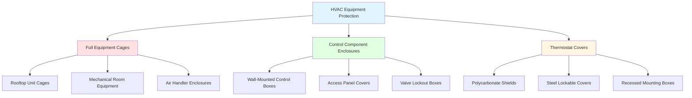
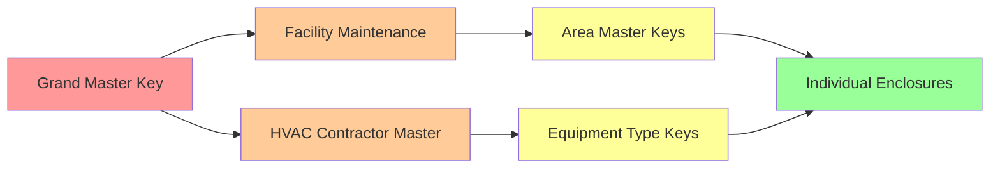

## Overview

Locked enclosures provide essential physical security for HVAC equipment in justice facilities, preventing unauthorized access, tampering, and weaponization of components. These systems must balance security requirements with maintenance accessibility, code compliance, and operational safety while meeting American Correctional Association (ACA) and National Institute of Corrections (NIC) standards.

## Enclosure Design Requirements

### Security-Rated Construction

**Material specifications for detention environments:**

| Component | Material | Specification | Attack Resistance |
|-----------|----------|---------------|-------------------|
| Wire mesh | 9-gauge steel | 2" × 2" or 1" × 1" welded | Cutting: 5+ minutes |
| Expanded metal | 13-gauge steel | 3/4" #13 flattened | Penetration resistant |
| Frame | 1.5" × 1.5" angle | ASTM A36 welded corners | Impact resistant |
| Door hinges | Continuous piano | Stainless steel | Tamper-proof pins |
| Locks | High-security | BHMA Grade 1 | Pick/drill resistant |

### Airflow Considerations

Enclosures must not restrict equipment ventilation. The open area ratio determines thermal performance:

$$\text{Open Area Ratio} = \frac{A_{\text{mesh}}}{A_{\text{total}}} \geq 0.70$$

For welded wire mesh with wire diameter $d$ and opening size $s$:

$$\text{Open Area} = \left(\frac{s}{s + d}\right)^2 \times 100\%$$

**Example:** 2" × 2" mesh with 0.148" wire (9-gauge):
$$\text{Open Area} = \left(\frac{2.0}{2.0 + 0.148}\right)^2 = 0.867 = 86.7\%$$

### Thermal Impact Assessment

Enclosure-induced temperature rise for enclosed equipment:

$$\Delta T = \frac{Q_{\text{equip}}}{0.24 \times Q_{\text{vent}}} \times \left(\frac{1}{OAR}\right)$$

Where:
- $Q_{\text{equip}}$ = Equipment heat output (BTU/hr)
- $Q_{\text{vent}}$ = Ventilation airflow (CFM)
- $OAR$ = Open area ratio (decimal)

Maintain $\Delta T < 10°F$ to prevent equipment overheating.

## Enclosure Types and Applications

### Full Equipment Cages

**Design parameters:**

- Minimum clearance: 36" on service sides, 24" on non-service sides
- Ceiling height: Equipment height + 12" minimum
- Door width: 36" minimum for equipment removal
- Floor anchoring: 1/2" expansion anchors at 24" O.C.

**Construction sequence:**

1. Verify equipment locations and required service clearances
2. Install floor mounting channels with chemical anchors
3. Erect vertical posts and weld corner connections
4. Install mesh panels with continuous welds (6" maximum spacing)
5. Mount security door with continuous hinges
6. Install high-security lock cylinder and strike plate
7. Verify door swing clearance and lock alignment

### Control Component Enclosures

**Thermostat protection systems:**

| Type | Material | Dimensions | Security Level | Application |
|------|----------|------------|----------------|-------------|
| Clear polycarbonate | 1/4" Lexan | 6" × 4" × 2" | Medium | General housing |
| Steel lockbox | 16-gauge | 8" × 6" × 3" | High | Maximum security |
| Recessed mount | 18-gauge steel | Flush to wall | High | New construction |
| Tamper-proof cover | Polycarbonate | Snap-fit | Low-medium | Minimum security |

**Mounting requirements:**

- Wall anchors: Toggle bolts or concrete anchors rated 50 lb minimum
- Screw heads: Tamper-resistant (pin-in-torx, one-way)
- Sealing: Gasket or silicone to prevent debris insertion
- Ventilation: Minimum 1/4" perforations for temperature sensing

## Key Control Protocols

### Master Key Systems

**Hierarchy structure for maintenance access:**

**Key management requirements:**

- Key control log maintained by facility security
- Contractor key checkout with photo ID and signature
- Key return verification at end of service call
- Lock core replacement after contractor termination
- Quarterly key inventory audit

### Lock Cylinder Specifications

**High-security lock requirements per ACA standards:**

- ANSI/BHMA A156.5 Grade 1 certification
- Drill resistance: Hardened steel pins and anti-drill plates
- Pick resistance: 6-pin minimum with security pins
- Key control: Restricted keyway, patent protection
- Keying: Construction core provision for installation phase

## Installation Standards

### Clearance Requirements

**Code-compliant access dimensions:**

$$C_{\text{min}} = \max(W_{\text{equip}} + 36", 30")$$

Where $C_{\text{min}}$ is the minimum working clearance and $W_{\text{equip}}$ is equipment width.

For electrical components rated >150V to ground:

- Depth: 36" minimum (per NEC 110.26)
- Width: 30" minimum or equipment width + 6"
- Height: 78" minimum from floor

### Structural Loading

Cage weight calculation for structural support verification:

$$W_{\text{cage}} = \rho_{\text{steel}} \times (A_{\text{frame}} + A_{\text{mesh}}) \times t$$

Where:
- $\rho_{\text{steel}}$ = 490 lb/ft³
- $A_{\text{frame}}$ = Total frame area (ft²)
- $A_{\text{mesh}}$ = Mesh panel area (ft²)
- $t$ = Material thickness (ft)

Verify roof structural capacity exceeds:

$$L_{\text{total}} = W_{\text{cage}} + W_{\text{equip}} + W_{\text{snow}} + W_{\text{maint}}$$

### Grounding and Bonding

All metal enclosures require electrical grounding:

- Bond enclosure to equipment grounding conductor
- Minimum conductor size: #10 AWG copper
- Connection: Listed grounding lug or exothermic weld
- Torque: Per manufacturer specification (typically 35-45 lb-in)

## Maintenance Accessibility

### Access Panel Design

**Hinged panel requirements:**

- Panel size: Minimum 20" × 20" for filter access
- Hinge type: Continuous piano hinge, stainless steel
- Lock type: Padlock hasp or integral lock cylinder
- Opening angle: 120° minimum for filter removal
- Support: Hold-open arm for panels >24" width

### Service Documentation

**Required labeling on each enclosure:**

- Equipment identification number
- Lock cylinder key code (facility use only)
- Emergency contact information
- "AUTHORIZED PERSONNEL ONLY" warning
- Service clearance zone floor marking

## Inspection and Testing

### Acceptance Testing

**Commissioning verification checklist:**

1. Verify all welds continuous and free of gaps
2. Confirm door alignment with <1/8" gap uniformity
3. Test lock operation with 50 lock/unlock cycles
4. Measure equipment temperature rise after 24-hour operation
5. Verify required service clearances with tape measure
6. Check electrical grounding continuity (<0.1 ohm)
7. Confirm key control documentation complete

### Ongoing Maintenance

**Quarterly inspection items:**

- Lock cylinder lubrication with graphite powder
- Hinge operation and alignment check
- Mesh panel integrity inspection (cuts, deformation)
- Anchor bolt tightness verification
- Paint condition and corrosion assessment
- Key control log audit

## Specification Guide

**CSI MasterFormat section reference:**

- **23 00 00** - HVAC (Division 23)
- **23 05 13** - Common Motor Requirements for HVAC Equipment
- **05 50 00** - Metal Fabrications (for cages)
- **08 71 00** - Door Hardware (for locks)

**Recommended specification language:**

"Provide welded wire mesh security enclosures for all accessible HVAC equipment. Construct from 9-gauge steel wire with 2-inch by 2-inch openings, hot-dip galvanized after fabrication per ASTM A123. Frame from 1.5-inch steel angle with welded corners. Equip with 36-inch wide hinged door, continuous piano hinge, and high-security lock cylinder keyed to facility master key system. Anchor to structure per structural drawings. Minimum working clearances per NEC 110.26."

---

**Related Topics:**
- Tamper-Resistant Hardware
- Vandal-Proof HVAC Components
- Correctional Facility Design Standards
- HVAC Security Risk Assessment