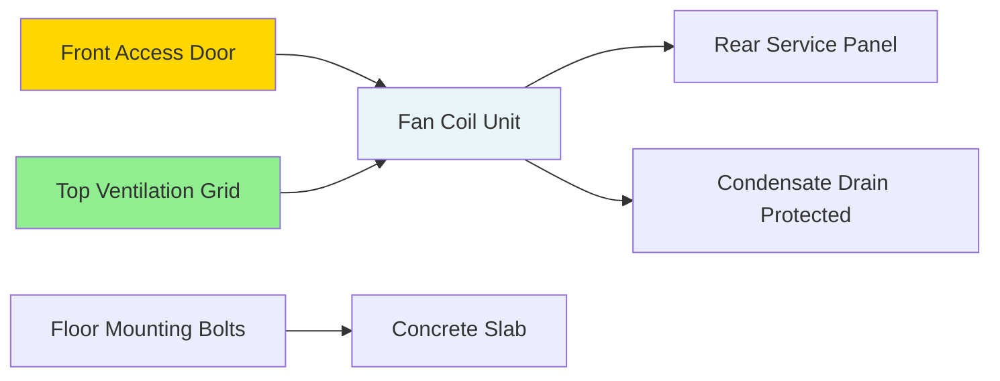

## Overview

Security cages protect HVAC equipment in correctional facilities from tampering, vandalism, and weaponization while maintaining necessary access for maintenance and ensuring adequate ventilation for equipment operation. Proper cage design balances security requirements with thermal management and serviceability.

## Construction Standards

### Material Requirements

Security cages must resist forceful attack and prevent the removal of components that could be fashioned into weapons or tools.

| Component | Material Specification | Minimum Gauge/Thickness | Justification |
|-----------|----------------------|------------------------|---------------|
| Vertical bars | Solid steel round bar | 5/8" diameter | Prevents cutting with improvised tools |
| Horizontal supports | Steel angle or channel | 1/8" × 1.5" | Structural rigidity |
| Mesh panels | Expanded metal or perforated | 9 gauge, 3/4" opening max | Visual inspection, airflow |
| Frame | Steel tube/angle | 1/4" wall, 2" × 2" min | Load-bearing anchor points |
| Fasteners | Security hex or one-way screws | Grade 8 minimum | Tamper resistance |
| Welds | Full penetration | Per AWS D1.1 | Structural integrity |

### Dimensional Design

Cage sizing must accommodate equipment access, airflow requirements, and maintenance clearances per ASHRAE 62.1 and manufacturer specifications.

**Minimum clearances:**

$$C_{total} = C_{mfr} + C_{access} + C_{air}$$

Where:
- $C_{total}$ = Total clearance required (inches)
- $C_{mfr}$ = Manufacturer-specified clearance (inches)
- $C_{access}$ = Access clearance for service (typically 24-36")
- $C_{air}$ = Additional space for airflow (function of equipment heat rejection)

For heat-generating equipment, calculate required ventilation opening area:

$$A_{vent} = \frac{Q_{reject}}{500 \times \rho \times c_p \times \Delta T_{allow}}$$

Where:
- $A_{vent}$ = Net free ventilation area (ft²)
- $Q_{reject}$ = Equipment heat rejection (BTU/hr)
- $\rho$ = Air density (0.075 lb/ft³ at standard conditions)
- $c_p$ = Specific heat of air (0.24 BTU/lb·°F)
- $\Delta T_{allow}$ = Allowable temperature rise (typically 15-20°F)

## Cage Design Configuration

```mermaid
graph TD
    A[Security Cage Design] --> B[Structure]
    A --> C[Ventilation]
    A --> D[Access Control]

    B --> B1[Vertical Bars 5/8" dia.]
    B --> B2[Expanded Metal Panels]
    B --> B3[Welded Frame]
    B --> B4[Floor Anchors]

    C --> C1[Top Ventilation Openings]
    C --> C2[Side Air Intakes]
    C --> C3[Heat Load Calculation]
    C --> C4[Forced Ventilation if Required]

    D --> D1[Lockable Door]
    D --> D2[Security Hinges]
    D --> D3[Access Logging]
    D --> D4[Tool Control]

    style A fill:#2c5aa0
    style B fill:#4a7ba7
    style C fill:#4a7ba7
    style D fill:#4a7ba7
```

## Ventilation Requirements

### Natural Ventilation Design

Position intake openings low and exhaust openings high to promote thermal stratification and natural convection. The effective ventilation rate follows:

$$Q_{vent} = C_d \times A \times \sqrt{2g \times H \times \frac{\Delta T}{T_{avg}}}$$

Where:
- $Q_{vent}$ = Volumetric airflow rate (CFM)
- $C_d$ = Discharge coefficient (0.6-0.65 for sharp-edged openings)
- $A$ = Net free area of openings (ft²)
- $g$ = Gravitational constant (32.2 ft/s²)
- $H$ = Vertical distance between inlet and outlet (ft)
- $\Delta T$ = Temperature difference between inside and outside cage (°F)
- $T_{avg}$ = Average absolute temperature (°R = °F + 460)

### Forced Ventilation

When natural ventilation proves insufficient, install dedicated exhaust fans sized per:

$$CFM_{required} = \frac{Q_{reject}}{1.08 \times \Delta T_{allow}}$$

Fan specifications:
- External rotor motors (no accessible fan blades)
- Flush-mounted behind protective grilles
- Hardwired power (no accessible plugs)
- Minimum 0.25" static pressure capability

## Cage Types and Applications

### Fan Coil Unit Cages



Enclose entire fan coil unit with:
- Front hinged door (180° swing for coil removal)
- Top ventilation at minimum 40% of plan area
- Drain line protection (welded pipe sleeve through cage base)
- Electrical disconnect accessible from outside cage

### Thermostat Protection

Recessed security boxes with:
- 16-gauge steel construction
- Tamper-proof cover fasteners
- Polycarbonate window (impact-resistant)
- Flush mounting (no protruding edges)

Temperature sensor placement considerations:

$$T_{measured} = T_{actual} + \varepsilon (T_{surface} - T_{actual})$$

Where $\varepsilon$ represents the radiative influence coefficient. Mount sensors away from cage walls to minimize conductive and radiative errors.

## Access Control Protocols

### Door Hardware

| Component | Specification | Purpose |
|-----------|--------------|---------|
| Lock | High-security cylinder, restricted keyway | Prevent picking, minimize key proliferation |
| Hinges | Continuous or pinless | Prevent hinge pin removal |
| Latch | Flush-mounted throw bolt | No protruding components |
| Strike | Reinforced box strike | Resist forced entry |

### Maintenance Access

Document all cage entries:
- Two-person rule for occupied areas
- Tool inventory control (check-in/check-out)
- Inspection for damage or tampering after each access
- Security notification before and after entry

## Mounting and Anchoring

Secure cages to building structure using:
- Minimum 1/2" diameter expansion anchors
- Embedment depth of 4" minimum into concrete
- Spacing not to exceed 24" on center
- Pull-out strength testing per ASTM E488 (minimum 1,500 lbf per anchor)

Anchor load calculation for overturning resistance:

$$M_{applied} = F_{lateral} \times h_{cg}$$

$$T_{anchor} = \frac{M_{applied}}{n \times d}$$

Where:
- $M_{applied}$ = Applied moment (lb-ft)
- $F_{lateral}$ = Lateral force from attempted breach (lb)
- $h_{cg}$ = Height to center of gravity (ft)
- $T_{anchor}$ = Tension per anchor (lb)
- $n$ = Number of anchors in tension
- $d$ = Distance from compression edge to tensioned anchor (ft)

## Inspection and Testing

### Installation Verification

- Weld inspection per AWS D1.1 (visual and dye penetrant)
- Anchor pull testing (random sampling, 10% minimum)
- Ventilation airflow measurement (compare to calculated values)
- Sharp edge and protrusion survey (grind smooth all potential hazards)

### Operational Monitoring

- Quarterly visual inspection for damage
- Annual structural integrity assessment
- Temperature monitoring inside cages housing critical equipment
- Lock and door operation testing

## Code and Standards Compliance

Reference standards:
- **ACA Standard 4-ALDF-2A-31**: HVAC system security in adult detention facilities
- **NIC Technical Assistance**: Mechanical system protection guidelines
- **ASHRAE 62.1**: Ventilation requirements for acceptable indoor air quality
- **AWS D1.1**: Structural welding code for steel
- **ASTM F2947**: Standard specification for detention equipment

## Design Checklist

- [ ] Equipment heat rejection calculated and verified
- [ ] Ventilation openings sized per thermal analysis
- [ ] All fasteners specify security-type
- [ ] Access door swings clear of equipment
- [ ] Minimum service clearances maintained
- [ ] Floor anchors specified with pull-out strength
- [ ] Sharp edges eliminated or protected
- [ ] Control wiring and piping protected through cage penetrations
- [ ] Lock hardware meets facility security standards
- [ ] Inspection and testing protocols established

## Conclusion

Security cage design for correctional facility HVAC equipment requires integrated analysis of structural security, thermal management, and maintenance accessibility. Proper material selection, dimensional design, and ventilation provisioning ensure equipment protection without compromising system performance or creating unsafe conditions. Adherence to correctional standards and rigorous installation verification protect both facility security and HVAC system reliability.
