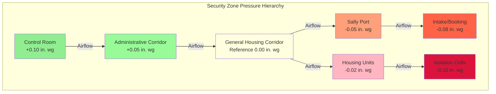
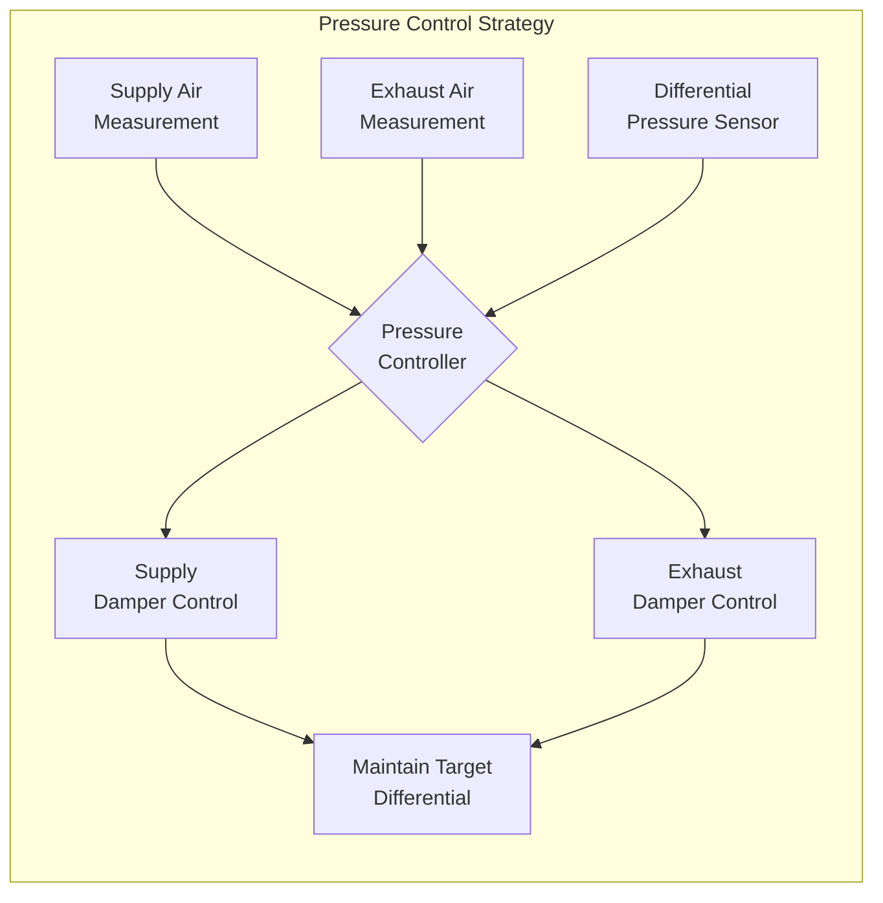
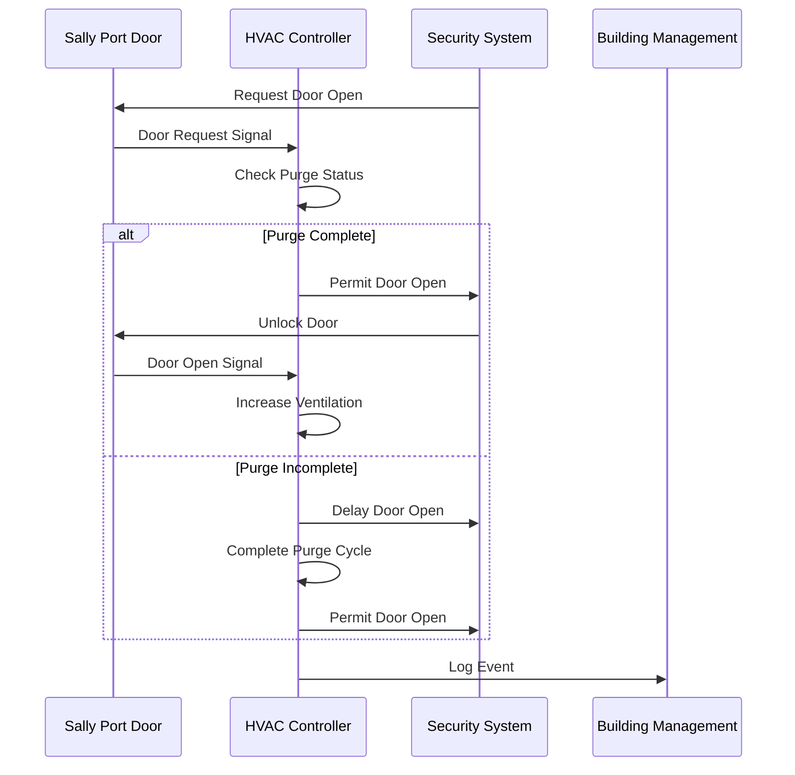

# Ventilation in Security Areas

Security area ventilation in justice facilities requires precise control of airflow patterns, pressure relationships, and air quality while maintaining operational security. The HVAC system must prevent contamination migration, control odor transfer, support security functions, and operate reliably under institutional conditions.

## Security Zone Classification

Justice facilities divide into distinct security zones, each requiring specific ventilation approaches based on occupancy type, security level, and operational requirements.

### Primary Security Zone Types

| Zone Type | Security Level | Pressure Relationship | Air Changes/Hour | Recirculation |
|-----------|----------------|----------------------|------------------|---------------|
| Maximum Security Cells | High | Negative to corridor | 12-15 ACH | Limited |
| General Population Housing | Medium | Negative to corridor | 10-12 ACH | Permitted |
| Intake/Booking | High | Negative to adjacent | 15-20 ACH | Not permitted |
| Visiting Areas | Medium | Neutral to corridor | 10-12 ACH | Permitted |
| Control Rooms | Critical | Positive to all areas | 6-8 ACH | Permitted |
| Sally Ports | High | Negative to both sides | 20-30 ACH | Not permitted |
| Medical/Isolation | High | Negative isolation | 12-15 ACH | Not permitted |
| Administrative | Low | Positive to secure areas | 4-6 ACH | Permitted |

## Ventilation Rate Calculations

Security area ventilation rates depend on occupancy density, contaminant load, and operational requirements. The required outdoor air follows ASHRAE Standard 62.1 with correctional facility modifications.

### Outdoor Air Requirement

$$V_{oa} = R_p \times P + R_a \times A_z$$

Where:
- $V_{oa}$ = outdoor air flow rate (cfm)
- $R_p$ = people outdoor air rate (cfm/person)
- $P$ = zone population (persons)
- $R_a$ = area outdoor air rate (cfm/ft²)
- $A_z$ = zone floor area (ft²)

For correctional housing:
- $R_p$ = 5-10 cfm/person (minimum)
- $R_a$ = 0.06 cfm/ft²

### Air Change Method

$$ACH = \frac{Q \times 60}{V}$$

Where:
- $ACH$ = air changes per hour
- $Q$ = airflow rate (cfm)
- $V$ = room volume (ft³)

Minimum ACH requirements:

$$Q_{min} = \frac{ACH_{required} \times V}{60}$$

### Pressure Differential Control

Pressure relationships between zones maintain contamination control and security integrity.

$$\Delta P = \frac{Q_{net}^2 \times \rho}{2 \times C_d^2 \times A^2}$$

Where:
- $\Delta P$ = pressure differential (in. wg)
- $Q_{net}$ = net airflow through opening (cfm)
- $\rho$ = air density (lb/ft³)
- $C_d$ = discharge coefficient (typically 0.6-0.7)
- $A$ = opening area (ft²)

Target pressure differentials:
- Critical boundaries: 0.05-0.10 in. wg
- Standard boundaries: 0.02-0.05 in. wg

## Sally Port Ventilation

Sally ports serve as secure transition zones between security levels, requiring specialized ventilation to prevent air transfer between zones during door operations.

### Design Requirements

1. **Minimum 20-30 ACH** when unoccupied
2. **100% exhaust** with no recirculation
3. **Negative pressure** relative to both adjacent zones
4. **Interlocked operation** with door controls
5. **Purge cycle** between door operations

### Purge Cycle Calculation

$$t_{purge} = \frac{3 \times V}{Q}$$

Where:
- $t_{purge}$ = purge time (minutes)
- $V$ = sally port volume (ft³)
- $Q$ = exhaust airflow (cfm)
- Factor of 3 represents three complete air changes

Typical purge time: 1-2 minutes minimum

## Integration with Security Systems

HVAC systems in security areas integrate with facility security infrastructure to support operational requirements and emergency response.

### Key Integration Points

**Door Interlock Systems**
- Ventilation mode changes with door status
- Purge cycles before door operation
- Alarm conditions for ventilation failure

**Fire Alarm Systems**
- Smoke control mode activation
- Automatic damper positioning
- Pressurization sequence control

**Security Management Systems**
- Zone status monitoring
- Pressure alarm reporting
- Override capability for emergencies

**Access Control Systems**
- Coordinated door/ventilation operation
- Delayed egress coordination
- Emergency release integration

## Control Room Pressurization

Control rooms require positive pressurization to protect occupants from potential airborne threats and maintain equipment reliability.

### Design Criteria

- **Positive pressure**: +0.05 to +0.10 in. wg relative to all adjacent areas
- **Filtration**: MERV 13 minimum, MERV 14 preferred
- **Redundancy**: Dual supply fans with automatic changeover
- **Sealing**: Room construction to maintain pressure under normal infiltration

Supply air calculation with infiltration:

$$Q_{supply} = Q_{ventilation} + Q_{pressurization} + Q_{infiltration}$$

Where pressurization flow:

$$Q_{pressurization} = \frac{A \times C_d \times \sqrt{2 \times \Delta P \times \rho}}{0.075}$$

## Odor and Contaminant Control

Security areas generate unique contaminant loads requiring dedicated exhaust and filtration strategies.

### Exhaust Priorities

1. **Dedicated exhaust** from toilets and showers
2. **No recirculation** from high-contamination areas
3. **Separate exhaust systems** for different security zones
4. **Chemical/biological filtration** where required

### Minimum Exhaust Rates

- Toilet rooms: 50 cfm per fixture
- Shower areas: 2 cfm/ft² or 50 cfm minimum
- General cells: 50% of supply air minimum
- Booking areas: 100% outdoor air, 100% exhaust

## Standards and References

**ASHRAE Standards:**
- ASHRAE 62.1: Ventilation for Acceptable Indoor Air Quality (Correctional Facilities section)
- ASHRAE 170: Ventilation of Health Care Facilities (for medical areas)

**Correctional Standards:**
- ACA Standards for Adult Correctional Institutions (environmental conditions)
- National Institute of Corrections design guidelines
- State-specific correctional facility standards

**Related Codes:**
- International Mechanical Code (IMC) Chapter 4
- NFPA 90A: Installation of Air-Conditioning and Ventilating Systems
- Local amendments for justice facilities

## Commissioning Considerations

Security area ventilation requires thorough commissioning to verify proper operation under all operational modes.

### Critical Verification Points

- Pressure differential verification under all door positions
- Purge cycle timing verification
- Interlock functionality testing
- Alarm point verification
- Emergency mode operation
- Redundant system changeover
- Balancing with security operations staff present

All testing must occur with security personnel coordination to prevent operational disruptions and maintain facility security during commissioning activities.
