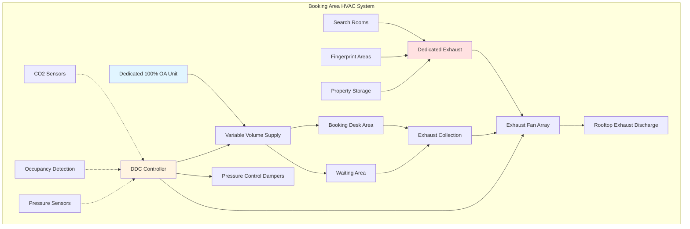
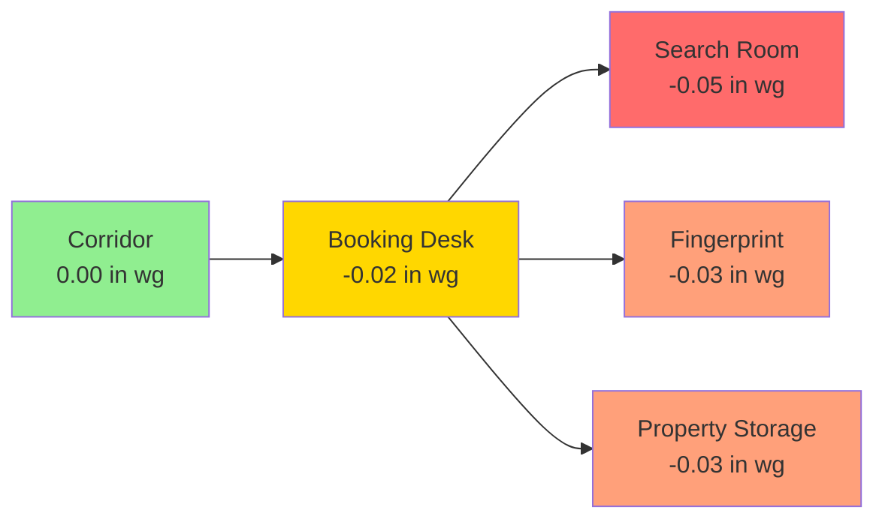

## Overview

Booking areas in justice facilities present unique HVAC challenges due to extreme occupancy variability, odor control requirements, and security constraints. These spaces experience rapid transitions from minimal occupancy to full capacity during mass arrest situations, requiring responsive ventilation systems that maintain air quality while preventing cross-contamination with adjacent secure areas.

## Ventilation Rate Calculations

### Base Ventilation Requirements

Booking areas require significantly higher ventilation rates than standard office spaces due to high occupancy density and odor generation. The total ventilation rate combines occupancy-based and area-based components:

$$Q_{total} = Q_{occupancy} + Q_{area}$$

where:

$$Q_{occupancy} = N \times V_{person} \times \frac{1}{E_v}$$

$$Q_{area} = A \times v_{area}$$

**Parameters:**
- $Q_{total}$ = Total outdoor air requirement (CFM)
- $N$ = Number of occupants (persons)
- $V_{person}$ = Outdoor air per person (CFM/person)
- $E_v$ = Ventilation effectiveness (typically 0.8 for mixing systems)
- $A$ = Floor area (ft²)
- $v_{area}$ = Area-based ventilation rate (CFM/ft²)

### ASHRAE 62.1 Design Values

| Space Type | People/1000 ft² | CFM/person | CFM/ft² | Total Design CFM/person |
|------------|-----------------|------------|---------|------------------------|
| Booking Area | 50 | 7.5 | 0.06 | 10 |
| Search Rooms | 25 | 10 | 0.12 | 15 |
| Fingerprint Areas | 15 | 7.5 | 0.06 | 12 |
| Property Storage | 5 | 5 | 0.12 | 8 |

### Peak Load Ventilation

During mass booking events, peak ventilation demand increases substantially:

$$Q_{peak} = Q_{design} \times F_{surge} \times F_{safety}$$

where:
- $F_{surge}$ = Surge factor (1.5-2.0 for booking areas)
- $F_{safety}$ = Safety factor (1.1-1.2)

For a 2,000 ft² booking area with design occupancy of 100 persons:

$$Q_{peak} = (100 \times 10 + 2000 \times 0.06) \times 1.75 \times 1.15$$

$$Q_{peak} = (1000 + 120) \times 2.01 = 2,251 \text{ CFM}$$

## Air Change Rate Requirements

Booking areas demand elevated air change rates for rapid contaminant removal:

$$ACH = \frac{Q_{total} \times 60}{V_{room}}$$

where:
- $ACH$ = Air changes per hour
- $V_{room}$ = Room volume (ft³)

**Recommended Air Change Rates:**

| Area | Minimum ACH | Design ACH | Notes |
|------|-------------|------------|-------|
| General Booking | 8 | 12 | Variable speed control recommended |
| Search Rooms | 10 | 15 | 100% exhaust, no recirculation |
| Fingerprint Areas | 8 | 10 | Negative pressure relative to corridor |
| Mugshot Areas | 6 | 8 | Standard rates acceptable |
| Property Storage | 6 | 8 | Odor control priority |

## System Architecture

## Occupancy-Based Control Strategy

### Variable Occupancy Scenarios

| Scenario | Typical Occupancy | Duration | Ventilation Mode |
|----------|-------------------|----------|------------------|
| Overnight (00:00-06:00) | 2-5 persons | 6 hours | Minimum (30% design) |
| Normal Operations | 15-30 persons | 14 hours | Standard (60% design) |
| Peak Booking | 60-100 persons | 2-4 hours | Maximum (100% design) |
| Mass Arrest Event | 100-150 persons | 1-3 hours | Emergency (120% design) |

### Demand Control Ventilation

Implement CO₂-based demand control with rapid response characteristics:

$$V_{DCV} = V_{min} + (V_{max} - V_{min}) \times \frac{CO_2_{measured} - CO_2_{outdoor}}{CO_2_{setpoint} - CO_2_{outdoor}}$$

**Control Parameters:**
- $CO_2_{outdoor}$ = 400-450 ppm
- $CO_2_{setpoint}$ = 800 ppm (booking areas)
- $CO_2_{max}$ = 1000 ppm (alarm threshold)
- Response time: < 5 minutes to 90% of target flow

## Pressure Relationships

Booking areas must maintain specific pressure differentials to prevent odor migration:

**Pressure Control Requirements:**
- Corridor to booking: -0.02 to -0.03 in wg
- Booking to search rooms: -0.03 to -0.05 in wg
- Minimum 0.05 in wg between booking and adjacent office areas
- Pressure monitoring at minimum 4 points per zone

## Odor Control Strategies

### Source Control Ventilation

Search rooms and fingerprint areas generate concentrated odors requiring dedicated exhaust:

$$Q_{exhaust} = \frac{G \times K}{C_{acceptable} - C_{outdoor}}$$

where:
- $G$ = Odor generation rate (olf)
- $K$ = Safety factor (2.0-3.0 for security areas)
- $C_{acceptable}$ = Acceptable concentration (typically 0.5 decipol)

### Filtration Requirements

| Filter Location | MERV Rating | Filter Type | Change Frequency |
|-----------------|-------------|-------------|------------------|
| Supply Air | MERV 13-14 | Pleated media | Quarterly |
| Recirculation (if used) | MERV 15 + Carbon | Combined | Monthly |
| Exhaust Air | MERV 8 | Roughing | Semi-annually |

**Note:** 100% outdoor air systems are strongly recommended; recirculation should be avoided in search and fingerprint areas.

## Security Integration

### Tamper-Resistant Design

All HVAC components in booking areas require security-rated construction:
- Grilles: 16-gauge stainless steel, tamper-resistant fasteners
- Ductwork: 20-gauge minimum in accessible areas
- Access panels: Security-rated, keyed locks
- Sensors: Protected enclosures, armored cables

### Emergency Purge Mode

Design systems with emergency purge capability for chemical irritant deployment:

$$Q_{purge} = V_{room} \times \frac{ACH_{purge}}{60}$$

Recommended $ACH_{purge}$ = 20-30 for rapid clearance (5-10 minute clearance time).

## Energy Considerations

Despite security requirements, energy efficiency remains achievable:

1. **Demand-based ventilation:** 20-40% energy savings during low occupancy
2. **Energy recovery:** Sensible wheels acceptable if properly maintained (avoid in exhaust from search areas)
3. **Variable speed drives:** 30-50% fan energy reduction
4. **Economizer operation:** When outdoor air quality permits and security allows

## Design Checklist

- Dedicated 100% outdoor air unit for booking areas
- Variable volume capability: 30-120% of design airflow
- CO₂ monitoring with < 5-minute response time
- Negative pressure relative to all adjacent non-booking spaces
- Minimum 12 ACH in general booking areas
- Minimum 15 ACH in search rooms (100% exhaust)
- Tamper-resistant grilles and ductwork in occupied areas
- Emergency purge mode capability
- Pressure monitoring and alarming
- No recirculation from search or fingerprint areas
- MERV 13 minimum supply filtration
- Independent exhaust systems for high-contamination areas

## Maintenance Considerations

Booking area systems require enhanced maintenance protocols:

- **Filter inspection:** Monthly (high particulate loading)
- **Damper operation verification:** Quarterly
- **Pressure differential testing:** Quarterly
- **CO₂ sensor calibration:** Semi-annually
- **Variable speed drive inspection:** Annually
- **Emergency purge mode testing:** Annually
- **Grille security inspection:** Monthly

## Conclusion

Booking area HVAC design requires balancing security, air quality, and energy efficiency under highly variable occupancy conditions. Proper application of demand-based ventilation, robust pressure control, and dedicated exhaust systems ensures safe, comfortable conditions while maintaining facility security. Systems must respond rapidly to occupancy changes while preventing odor migration to adjacent spaces.
