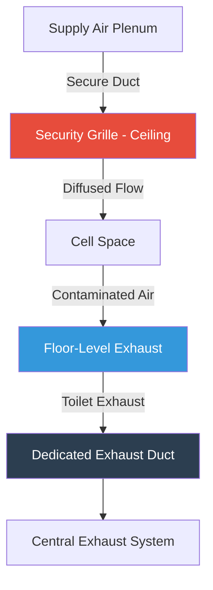
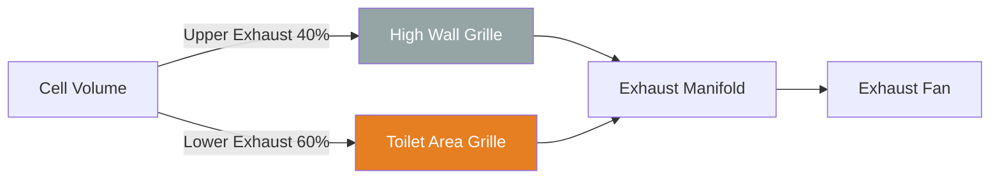
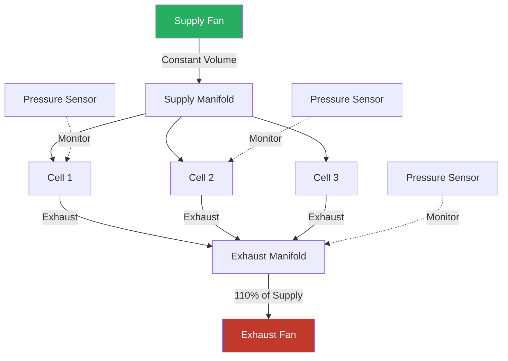

## Overview

Holding cells in justice facilities require specialized HVAC design to address short-term occupancy, odor control, security concerns, and physiological comfort. Unlike long-term housing units, holding cells experience high turnover rates, variable occupancy loads, and must maintain ventilation rates that quickly dilute contaminants while preventing tampering or concealment of contraband.

The ventilation system must balance adequate fresh air delivery with security requirements, using tamper-resistant grilles and continuous operation to maintain acceptable indoor air quality during unpredictable occupancy patterns.

## Ventilation Rate Requirements

### Design Air Change Rates

Holding cells require higher air change rates than typical occupied spaces due to toilet fixtures without privacy partitions, potential for multiple occupants in confined spaces, and odor generation.

| Space Type | Minimum ACH | Recommended ACH | Basis |
|-----------|-------------|-----------------|-------|
| Single Holding Cell | 10 | 12-15 | ACA Standards |
| Multi-Occupant Holding | 12 | 15-18 | ASHRAE 62.1 |
| Holding with Toilet | 15 | 18-20 | Odor Control |
| Drunk Tank | 15 | 20-25 | Contamination Risk |

### Ventilation Calculation

The required airflow for a holding cell combines occupancy-based ventilation with air change rate requirements:

$$Q_{total} = \max(Q_{occupancy}, Q_{ACH})$$

Where occupancy-based ventilation is:

$$Q_{occupancy} = N \cdot (R_p + A_{cell} / N \cdot R_a)$$

- $Q_{total}$ = Total required airflow (CFM)
- $N$ = Design occupancy (persons)
- $R_p$ = Breathing zone outdoor air per person (15-20 CFM)
- $A_{cell}$ = Cell floor area (ft²)
- $R_a$ = Outdoor air per unit area (0.12 CFM/ft²)

Air change rate method:

$$Q_{ACH} = \frac{V_{cell} \cdot ACH}{60}$$

- $V_{cell}$ = Cell volume (ft³)
- $ACH$ = Air changes per hour (10-20)

The system design uses the greater of these two values.

## Airflow Distribution System

### Supply Air Configuration

Supply air must enter the cell through security-rated grilles that prevent weapon fabrication, contraband concealment, or self-harm. The supply location affects thermal comfort and odor control effectiveness.

### Exhaust Air Strategy

Exhaust grilles should be positioned near the toilet fixture to capture odors at the source. A two-point exhaust system provides superior performance:

This configuration creates a vertical air movement pattern that sweeps the breathing zone while providing concentrated extraction at the contamination source.

## Security Grille Requirements

### Grille Design Specifications

| Feature | Requirement | Purpose |
|---------|-------------|---------|
| Material | 14-16 gauge steel | Tamper resistance |
| Bar Spacing | Maximum 1.5 inches | Prevent concealment |
| Mounting | Welded frame, security screws | Anti-removal |
| Free Area | 60-75% | Minimize pressure drop |
| Finish | Powder coat or stainless | Corrosion resistance |
| Edge Treatment | Rounded, deburred | Safety |

### Pressure Drop Considerations

Security grilles introduce higher pressure drops than standard diffusers. Account for this in fan selection:

$$\Delta P_{grille} = \frac{\rho \cdot V^2}{2} \cdot K_{loss}$$

- $\Delta P_{grille}$ = Pressure drop (in. w.g.)
- $\rho$ = Air density (0.075 lbm/ft³)
- $V$ = Face velocity (FPM)
- $K_{loss}$ = Loss coefficient (1.2-2.5 for security grilles)

Typical face velocities of 400-600 FPM through security grilles result in 0.08-0.25 in. w.g. pressure drop.

## Toilet Exhaust Integration

### Dedicated Exhaust Rates

Each holding cell toilet requires continuous exhaust to control odors and maintain negative pressure relative to adjacent spaces.

$$Q_{toilet} = 50-75 \text{ CFM minimum}$$

This exhaust should represent 50-70% of total cell exhaust to create directional airflow toward the fixture. The remaining exhaust comes from upper-level grilles to ensure complete air mixing.

### Odor Control Performance

Effective odor dilution requires sufficient exhaust capture velocity:

$$V_{capture} = \frac{Q_{toilet}}{A_{fixture} \cdot 60}$$

- $V_{capture}$ = Capture velocity (FPM)
- $A_{fixture}$ = Fixture area (ft²)

Target capture velocities of 100-150 FPM at the fixture plane ensure odor containment before dispersion into the cell volume.

## Air Balance and Pressure Control

### Individual Cell Balance

Each cell operates under negative pressure to prevent odor migration to corridors and control rooms:

$$\Delta P_{cell} = -0.02 \text{ to } -0.05 \text{ in. w.g.}$$

Supply airflow should be 5-10% less than exhaust to maintain this differential:

$$Q_{supply} = 0.90 \text{ to } 0.95 \cdot Q_{exhaust}$$

### System Configuration

## Continuous Operation Requirements

Holding cell ventilation systems must operate continuously, 24/7/365, due to unpredictable occupancy. This differs from typical commercial HVAC with occupied/unoccupied schedules.

**Design Implications:**
- No economizer cycles during unoccupied periods
- Constant exhaust flow maintains building pressure balance
- Fan and filter selection for extended operation
- Energy recovery systems to offset continuous outdoor air loads
- Redundant fan systems for maintenance without shutdown

## Standards and Code Compliance

**ASHRAE 62.1 Requirements:**
- Minimum 15 CFM/person breathing zone outdoor air
- Ventilation effectiveness factor consideration
- Exhaust air not recirculated from toilet areas

**ACA Standards for Adult Detention:**
- 10-15 ACH minimum for holding cells
- Individual temperature control where feasible
- Adequate ventilation to control odors
- Fresh air introduction

**IMC Section 403:**
- Mechanical ventilation required for windowless cells
- Exhaust directly to outdoors
- No recirculation from toilet rooms

## Commissioning and Verification

**Critical Testing Points:**
- Verify ACH in each cell using tracer gas or airflow measurement
- Confirm negative pressure differential to corridors
- Measure supply/exhaust airflow at each grille
- Document pressure drop across security grilles
- Test air pattern using smoke visualization
- Verify continuous operation under all conditions

Holding cell ventilation systems protect both occupant health and facility operations through robust design, security-conscious component selection, and continuous performance verification.

---

**File:** `/Users/evgenygantman/Documents/github/gantmane/hvac/content/specialty-applications-testing/specialty-hvac-applications/justice-facilities/ventilation-security-areas/holding-cells/_index.md`