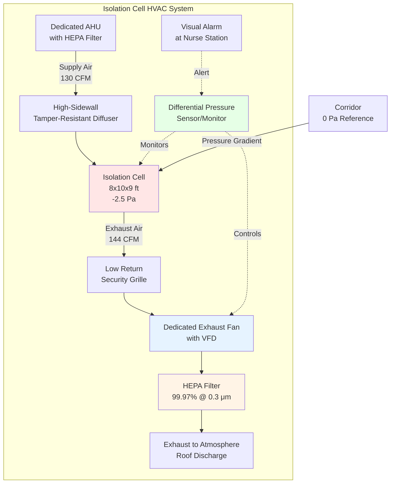
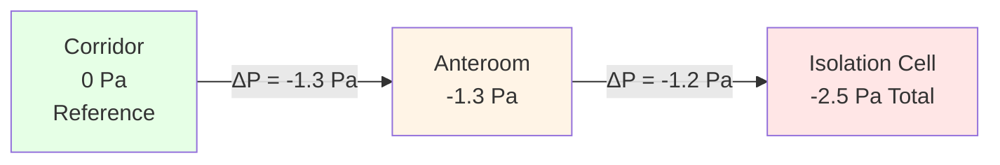

## Overview

Isolation rooms in correctional facilities serve dual critical functions: infection control for airborne disease containment and behavioral health management for inmates requiring separation. These spaces demand specialized HVAC design that balances negative pressure requirements, adequate ventilation rates, tamper-resistant construction, and suicide prevention protocols.

The HVAC system must maintain consistent pressure differentials while accommodating security hardware, preventing ligature points, and ensuring continuous operation under institutional constraints.

## Pressure Differential Requirements

Isolation rooms require negative pressure relative to adjacent corridors to prevent airborne pathogen migration. The pressure differential creates directional airflow from clean to contaminated spaces.

### Pressure Relationship

The pressure differential across the isolation room boundary is governed by:

$$\Delta P = \frac{Q \cdot R}{A}$$

Where:
- $\Delta P$ = pressure differential (Pa)
- $Q$ = airflow rate (m³/s)
- $R$ = resistance of door/wall assembly (Pa·s²/m⁶)
- $A$ = leakage area (m²)

### Required Pressure Differentials

| Space Type | Pressure Relative to Corridor | Minimum Differential |
|------------|-------------------------------|---------------------|
| Airborne Infection Isolation (AII) Cell | Negative | -2.5 Pa (-0.01 in. w.g.) |
| Medical Isolation Room | Negative | -2.5 Pa (-0.01 in. w.g.) |
| Protective Environment (PE) Cell | Positive | +2.5 Pa (+0.01 in. w.g.) |
| Anteroom (if provided) | Negative to corridor | -1.3 Pa (-0.005 in. w.g.) |

For correctional applications, maintain minimum -2.5 Pa (-0.01 in. w.g.) for standard AII rooms. High-security infectious disease isolation requires -5.0 Pa (-0.02 in. w.g.).

## Ventilation Rates

### Air Changes Per Hour

ASHRAE 170 and FGI Guidelines establish minimum ACH rates for healthcare spaces. Correctional isolation rooms follow these requirements when used for medical isolation:

| Room Type | Minimum Total ACH | Minimum Outside Air ACH | Pressure |
|-----------|------------------|------------------------|----------|
| Airborne Infection Isolation | 12 | 2 | Negative |
| Medical Isolation (Standard) | 6 | 2 | Negative |
| Protective Environment | 12 | 2 | Positive |
| Holding Cell with Toilet | 10 | 2 | Negative |

Calculate required airflow:

$$Q = \frac{ACH \cdot V}{60}$$

Where:
- $Q$ = airflow rate (CFM)
- $ACH$ = air changes per hour
- $V$ = room volume (ft³)

### Example Calculation

For an 8 ft × 10 ft × 9 ft isolation cell (720 ft³) requiring 12 ACH:

$$Q = \frac{12 \cdot 720}{60} = 144 \text{ CFM}$$

Supply air: 130 CFM
Exhaust air: 144 CFM
Differential: -14 CFM (creates negative pressure)

## System Configuration

### Key Design Elements

**Supply Air Distribution:**
- Mount diffusers minimum 7 ft above finished floor to prevent tampering
- Use continuous welded security grilles with tamper-resistant fasteners
- Locate supply to create airflow pattern away from door undercut

**Exhaust Air Capture:**
- Position return grilles low on wall opposite supply (promotes top-to-bottom airflow)
- Install security grilles with #10 mesh minimum, welded construction
- Provide individual dedicated exhaust fan per isolation cell (no shared exhaust)

**Pressure Control:**
- Install differential pressure sensors with ±0.5 Pa accuracy
- Connect to DDC system with continuous monitoring and alarming
- Provide audible/visual alarms at security control station

## Anteroom Pressure Cascade

When anterooms are provided (recommended for high-security infectious disease isolation), establish three-tier pressure cascade:

Pressure relationship:

$$P_{\text{cell}} < P_{\text{anteroom}} < P_{\text{corridor}}$$

This cascade ensures directional airflow from least contaminated to most contaminated space regardless of which door opens.

## Filtration Requirements

**Supply Air:**
- MERV 14 minimum on AHU supply (healthcare applications)
- HEPA filtration not required on supply for negative pressure isolation
- Consider MERV 16 for immunocompromised protective environment cells

**Exhaust Air:**
- HEPA filtration (99.97% @ 0.3 μm) mandatory for AII room exhaust
- Install filters downstream of exhaust fan for accessibility
- Provide differential pressure monitoring across HEPA filter bank
- Design for bag-in/bag-out filter change procedures

## Suicide Prevention Integration

Correctional isolation rooms require suicide-resistant design that conflicts with typical HVAC installation practices:

**Ligature Resistance:**
- Eliminate all exposed piping, ductwork, and grilles below 8 ft
- Flush-mount all devices into tamper-resistant enclosures
- Use continuous welded grilles without removable fasteners accessible from room side

**Tamper Prevention:**
- Conceal temperature sensors in security housing
- Locate thermostats outside cell with override capability
- Design for no adjustable controls accessible to occupant

**Fire Safety Coordination:**
- Smoke detection required but must be tamper/ligature-resistant
- Coordinate detector locations with security camera coverage
- Maintain fire damper access from secure corridor side only

## Monitoring and Alarms

Continuous pressure monitoring is mandatory per ASHRAE 170 for AII rooms:

| Parameter | Monitoring Requirement | Alarm Threshold | Response Time |
|-----------|----------------------|-----------------|---------------|
| Pressure Differential | Continuous | ±1.0 Pa from setpoint | 30 seconds |
| Supply Airflow | Continuous | ±10% from setpoint | 60 seconds |
| Exhaust Airflow | Continuous | ±10% from setpoint | 60 seconds |
| HEPA Filter ΔP | Continuous | >500 Pa | 5 minutes |

Alarms must annunciate at:
1. Security control station (visual and audible)
2. Facilities maintenance (visual)
3. Building automation system with event logging

## Design Standards

ASHRAE 170-2021: Ventilation of Health Care Facilities
- Table 6.1: Design parameters for isolation rooms
- Section 6.2.2: Pressure relationships and ventilation rates
- Section 6.3: Air filtration requirements

FGI Guidelines for Design and Construction of Residential Health, Care, and Support Facilities
- Chapter 3.1: General standards for resident rooms
- Table 3.1-2: Ventilation requirements for isolation spaces

## Commissioning Requirements

Verify performance before occupancy:

1. Measure room pressure differential with door closed (all positions)
2. Confirm airflow direction using smoke tubes at door undercuts
3. Verify ACH rates using flow hood measurements
4. Test pressure alarm response at +10% and -10% setpoint deviation
5. Document exhaust HEPA filter installation and baseline pressure drop
6. Perform door-swing test to verify pressure recovery within 30 seconds

Retest annually and after any HVAC system modifications affecting airflow balance.

## Operational Considerations

**Continuous Operation:**
Isolation room HVAC systems must operate 24/7/365. Design for redundancy:
- Provide backup exhaust fan (automatic switchover)
- Size equipment for extended duty cycles
- Specify heavy-duty motors and drives

**Energy Implications:**
12 ACH with 100% outside air imposes significant heating/cooling loads. Consider energy recovery ventilation if security and infection control protocols permit.

**Maintenance Access:**
All HVAC equipment, filters, and sensors must be accessible from secure corridors or mechanical spaces. Never require entry into occupied isolation cells for routine maintenance.