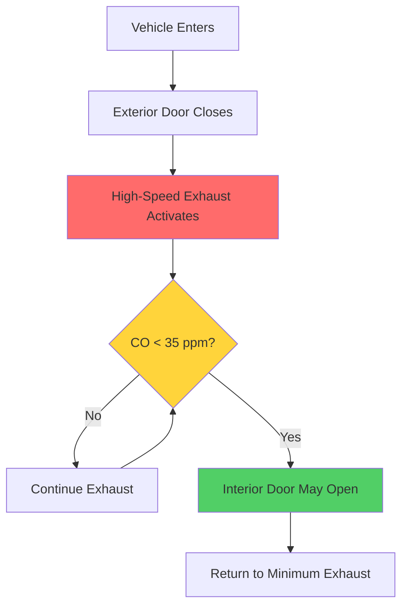
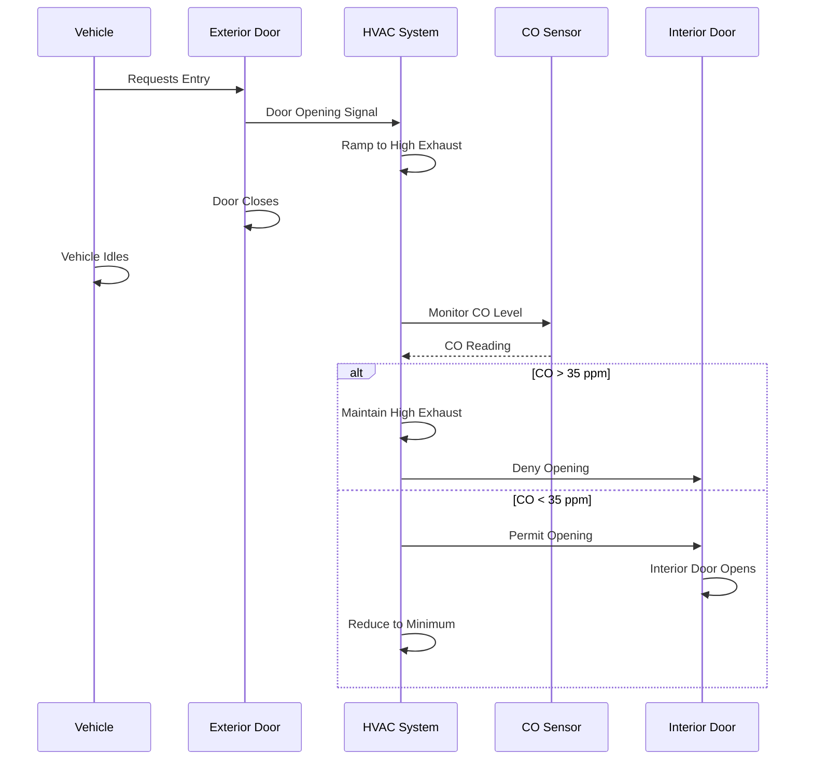

## Sally Port HVAC Systems

Sally ports serve as secure transitional zones in correctional facilities where vehicles and pedestrians pass through interlocked doors. HVAC design for these spaces addresses vehicle exhaust removal, pressure control for containment, and integration with security protocols.

## Pressure Control Requirements

Sally ports must maintain negative pressure relative to adjacent secure areas to prevent contaminant migration during door operation. The pressure differential depends on door interlock status and operational mode.

### Pressure Relationship Equations

The required pressure differential across a sally port boundary follows:

$$\Delta P = \frac{\rho v^2}{2} + \rho g h + \Delta P_{friction}$$

Where:
- $\Delta P$ = total pressure differential (Pa)
- $\rho$ = air density (kg/m³)
- $v$ = air velocity through openings (m/s)
- $g$ = gravitational acceleration (9.81 m/s²)
- $h$ = height differential (m)
- $\Delta P_{friction}$ = frictional losses (Pa)

For containment during single-door breach, the minimum pressure differential is:

$$\Delta P_{min} = -12.5 \text{ Pa}$$

### Airflow Rate for Pressure Control

The exhaust airflow required to maintain pressure differential is:

$$Q_{exhaust} = \frac{A \cdot v}{\eta} + Q_{infiltration}$$

Where:
- $Q_{exhaust}$ = total exhaust airflow (m³/s)
- $A$ = door opening area (m²)
- $v$ = target face velocity (0.5-1.0 m/s)
- $\eta$ = system efficiency factor (0.7-0.85)
- $Q_{infiltration}$ = infiltration through construction gaps (m³/s)

## Pressure Relationships by Operational Mode

| Sally Port Status | Pressure vs. Secure Side | Pressure vs. Exterior | ACH Range | Exhaust Rate |
|-------------------|-------------------------|----------------------|-----------|--------------|
| Both Doors Closed | -12.5 to -15 Pa | -5 to -10 Pa | 6-8 | Minimum |
| Interior Door Open | -15 to -25 Pa | -20 to -30 Pa | 15-20 | Maximum |
| Exterior Door Open | -25 to -35 Pa | 0 to -5 Pa | 20-30 | Maximum |
| Vehicle Idling | -30 to -50 Pa | -10 to -15 Pa | 30-40 | High-speed exhaust |

## Vehicle Exhaust Removal

Vehicle sally ports require dedicated exhaust systems to capture combustion products before they migrate to occupied areas.

### Exhaust System Design

### Exhaust Capture Efficiency

The required exhaust flow rate for vehicle emission control is:

$$Q_{vehicle} = \frac{E_{CO} \cdot f_{duty}}{\left(C_{limit} - C_{ambient}\right) \cdot \rho_{air}}$$

Where:
- $Q_{vehicle}$ = vehicle exhaust ventilation rate (m³/s)
- $E_{CO}$ = CO emission rate from idling vehicle (g/s)
- $f_{duty}$ = duty cycle factor (1.0-1.5)
- $C_{limit}$ = maximum allowable CO concentration (35 ppm)
- $C_{ambient}$ = background CO concentration (< 5 ppm)
- $\rho_{air}$ = air density (1.2 kg/m³)

Typical exhaust rates for standard sally ports:

- Light vehicles: 15-25 ACH minimum, 30-40 ACH during idling
- Heavy vehicles/buses: 25-35 ACH minimum, 40-60 ACH during idling

## Air Change Rate Requirements

Correctional design guidelines specify minimum ventilation rates:

| Sally Port Type | Minimum ACH | Occupied ACH | Vehicle Purge ACH |
|-----------------|-------------|--------------|-------------------|
| Pedestrian Only | 6 | 12-15 | N/A |
| Light Vehicle | 8 | 20-30 | 30-40 |
| Heavy Vehicle | 10 | 25-35 | 40-60 |
| Emergency Vehicle | 12 | 30-40 | 50-75 |

## Interlocked Ventilation Control

HVAC systems integrate with security door controls through Building Management Systems (BMS) to modulate exhaust based on door position.

## System Components

### Exhaust Fan Sizing

Exhaust fans for sally ports require:

1. **Capacity modulation**: Variable speed drives (VFD) to adjust airflow based on operational mode
2. **Redundancy**: N+1 configuration for critical security applications
3. **Pressure monitoring**: Differential pressure sensors at boundaries
4. **CO detection**: Electrochemical sensors with 0-200 ppm range

### Makeup Air Provision

Makeup air enters through:
- Dedicated outside air units with filtration
- Transfer grilles from adjacent conditioned spaces (pedestrian sally ports only)
- Passive louvers with motorized dampers (vehicle sally ports)

The makeup air quantity must balance exhaust to maintain target pressure:

$$Q_{makeup} = Q_{exhaust} - Q_{target\_leakage}$$

Where $Q_{target\_leakage}$ creates the desired negative pressure differential.

## Correctional Standards Compliance

Sally port HVAC design must meet:

- **ACA Standards for Adult Correctional Institutions**: Minimum 6 ACH in sally ports, CO monitoring required for vehicle areas
- **ASHRAE Standard 62.1**: Ventilation rates for vehicle-related areas (7.5 cfm/ft² default, or contaminant-based)
- **International Mechanical Code (IMC)**: Section 403 addresses enclosed parking garage ventilation applicable to vehicle sally ports
- **NFPA 88A**: Standard for parking structures (exhaust rates, CO detection)

## Design Considerations

Critical factors for sally port HVAC:

1. **Interlocked operation**: HVAC system must respond to door position sensors within 5 seconds
2. **Fail-safe mode**: Loss of control signal defaults to maximum exhaust
3. **Sound attenuation**: Exhaust systems generate noise that may compromise security communication (target NC-40)
4. **Temperature control**: Heating required in cold climates to prevent freezing of exhaust condensate
5. **Filtration**: MERV 8 minimum on makeup air to prevent dust infiltration

## Pressure Control Verification

Commission sally port systems by measuring:

- Pressure differential with doors closed: -12.5 Pa minimum
- Pressure recovery time after door operation: < 60 seconds
- CO clearance time after vehicle idling: < 5 minutes to reach < 35 ppm
- Airflow verification at all operational modes

Continuous monitoring through BMS ensures pressure relationships remain within acceptable ranges throughout facility operations.
