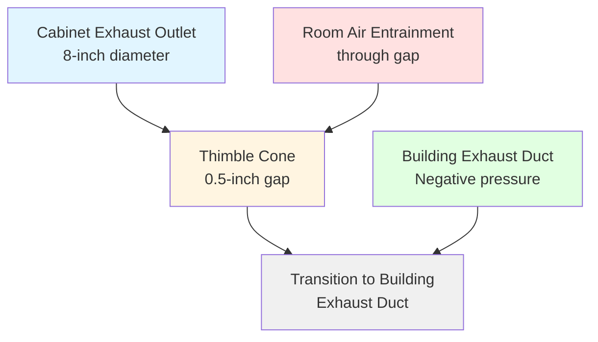
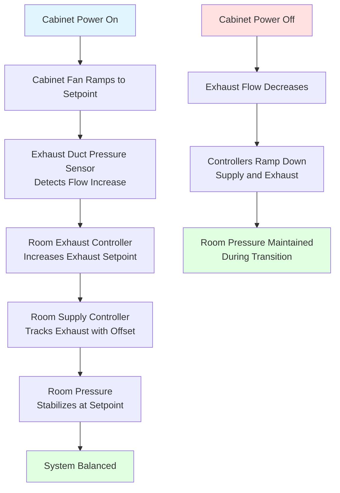

# Biosafety Cabinet Exhaust Connections

Biosafety cabinet (BSC) exhaust connections represent a critical interface between containment equipment and building ventilation systems. The connection method directly affects cabinet performance, room pressure relationships, and facility energy consumption. Type A cabinets recirculate air through integral HEPA filters with optional canopy connections, while Type B cabinets require hard-ducted exhaust systems with dedicated fans. NSF/ANSI 49 establishes rigorous testing protocols to verify containment performance under various exhaust connection configurations, ensuring personnel protection, product protection, and environmental protection during microbiological work.

## Type A vs Type B Cabinet Exhaust Requirements

Biosafety cabinet classification determines exhaust connection methodology based on airflow patterns, filtration approach, and containment objectives.

### Type A Cabinet Characteristics

Type A cabinets (Class II, Type A1 and A2) operate as partial recirculation systems where 70% of airflow recirculates within the cabinet after HEPA filtration, while 30% exhausts through an integral blower and HEPA filter.

**Type A1 specifications:**
- Positive-pressure contaminated plenum
- Single-pass HEPA filtration of exhaust air
- Minimum inflow velocity: 75 fpm at face opening
- Recirculation: 70% through supply HEPA filter
- Exhaust: 30% through exhaust HEPA filter
- Connection: Room discharge or canopy connection

**Type A2 specifications:**
- Negative-pressure contaminated plenum
- Double-pass HEPA filtration (supply and exhaust)
- Minimum inflow velocity: 100 fpm at face opening
- Recirculation: 70% of downflow volume
- Exhaust: 30% of downflow volume
- Connection: Room discharge or thimble connection

**Recirculation physics:**
The downflow velocity $V_d$ in the work zone results from combined recirculated and fresh supply air:

$$V_d = \frac{Q_{recir} + Q_{inflow}}{A_{work}}$$

Where:
- $V_d$ = Downflow velocity (70 fpm nominal)
- $Q_{recir}$ = Recirculated airflow after HEPA filtration (CFM)
- $Q_{inflow}$ = Face opening inflow (CFM)
- $A_{work}$ = Work zone cross-sectional area (ft²)

**Energy implications:**
Type A cabinets minimize facility heating and cooling loads by recirculating conditioned air. A 6-foot Type A2 cabinet exhausts approximately 225 CFM to the room or building exhaust system, reducing makeup air requirements by 70% compared to 100% exhaust configurations.

### Type B Cabinet Characteristics

Type B cabinets (Class II, Type B1 and B2) provide greater containment through higher inflow velocities and connection to dedicated hard-ducted exhaust systems.

**Type B1 specifications:**
- Negative-pressure contaminated plenum
- Minimum inflow velocity: 100 fpm
- Recirculation: 30% through supply HEPA filter (uncontaminated areas only)
- Hard-duct exhaust: 70% of total airflow
- Biologically contaminated air: 100% exhausted through dedicated duct
- Exhaust filtration: HEPA filter before discharge

**Type B2 (total exhaust) specifications:**
- Negative-pressure contaminated plenum
- Minimum inflow velocity: 100 fpm
- No recirculation: 100% exhaust of downflow air
- Hard-duct connection required for entire airflow
- Dual HEPA filtration: supply and exhaust filters
- Typical exhaust volume: 750-1200 CFM (6-foot cabinet)

**Pressure relationships:**
Type B cabinets create substantial negative pressure within contaminated plenums, typically -0.5 to -1.0 inches w.g. relative to room. This negative pressure ensures inward airflow at all openings, preventing contaminant escape during HEPA filter loading or minor breaches.

**Comparison table:**

| Parameter | Type A1 | Type A2 | Type B1 | Type B2 |
|-----------|---------|---------|---------|---------|
| Minimum inflow velocity | 75 fpm | 100 fpm | 100 fpm | 100 fpm |
| Recirculation percentage | 70% | 70% | 30% | 0% |
| Exhaust connection | Optional | Optional | Required | Required |
| Contaminated plenum pressure | Positive | Negative | Negative | Negative |
| Volatile chemical work | No | Limited | Yes | Yes |
| Facility exhaust load (6-ft) | 225 CFM | 225 CFM | 525 CFM | 750 CFM |
| Energy impact | Minimal | Minimal | Moderate | High |

## Thimble Connection Design

Thimble connections provide exhaust attachment for Type A2 and Type B cabinets without creating back-pressure that compromises cabinet performance.

### Thimble Connection Principles

A thimble connection uses a close-fitting collar or cone that captures cabinet exhaust without creating a sealed connection. The gap between cabinet exhaust outlet and thimble inlet (typically 0.25-1.0 inch) allows pressure equalization while maintaining airflow capture.

**Pressure balance equation:**
The thimble gap area $A_g$ must be sufficient to prevent back-pressure on cabinet fan:

$$A_g = \frac{Q_{cabinet}}{\rho \sqrt{\frac{2 \Delta P_{max}}{\rho}}}$$

Where:
- $A_g$ = Gap area around thimble (in²)
- $Q_{cabinet}$ = Cabinet exhaust volume (CFM)
- $\Delta P_{max}$ = Maximum acceptable back-pressure (0.05 in w.g. typical)
- $\rho$ = Air density (0.075 lb/ft³)

For typical Type A2 cabinet exhausting 225 CFM with 0.05 in w.g. back-pressure limit:

$$A_g = \frac{225 \times 144}{60 \times \sqrt{\frac{2 \times 0.05 \times 5.2}{0.075}}} \approx 16 \text{ in}^2$$

This corresponds to 0.5-inch annular gap around 8-inch diameter exhaust outlet.

**Thimble geometry:**

**Critical design parameters:**
- Gap width: 0.25-1.0 inch (larger gaps reduce back-pressure but increase room air entrainment)
- Thimble material: Stainless steel or rigid PVC
- Transition angle: Maximum 30° expansion to building duct
- Sealing: None—gap intentionally left open
- Vertical orientation: Preferred to minimize condensate accumulation

### Room Air Entrainment Effects

The open gap in thimble connections entrains room air, increasing total exhaust volume above cabinet discharge:

$$Q_{total} = Q_{cabinet} + Q_{entrain}$$

Where entrainment volume depends on building exhaust system negative pressure and gap geometry:

$$Q_{entrain} = C_d A_g \sqrt{\frac{2 \Delta P_{duct}}{\rho}}$$

Where:
- $C_d$ = Discharge coefficient (0.60-0.65 typical)
- $\Delta P_{duct}$ = Building exhaust duct negative pressure (in w.g.)

**Example calculation:**
For 225 CFM cabinet with 16 in² gap area and -0.5 in w.g. duct pressure:

$$Q_{entrain} = 0.62 \times 16 \times \sqrt{\frac{2 \times 0.5 \times 5.2}{0.075}} = 0.62 \times 16 \times 8.32 = 82.5 \text{ CFM}$$

Total exhaust: 225 + 82.5 = 307.5 CFM

**Design implications:**
- Room pressurization calculations must account for entrainment
- Excessive entrainment reduces energy efficiency benefits of Type A cabinets
- Variable building exhaust pressure creates fluctuating entrainment rates
- Dedicated constant-volume exhaust branches minimize entrainment variability

## Hard-Ducted Exhaust Systems

Type B cabinets require sealed hard-duct connections with dedicated exhaust systems operating at negative pressure relative to cabinet exhaust plenum.

### Connection Methods

**Direct flange connection:**
Cabinet exhaust outlet connects to building duct via gasketed flange connection:
- Material: Stainless steel or compatible with decontamination agents
- Gasket: Neoprene or silicone, 1/8-inch thickness
- Leak rate: < 1% at -1.0 in w.g. test pressure
- Transition: Concentric reducer from cabinet outlet to duct

**Flexible connection:**
Short flexible section between cabinet and rigid ductwork accommodates movement during decontamination and filter changes:
- Length: 24-36 inches maximum
- Material: Stainless steel corrugated or PVC-coated fabric
- Support: Suspended independently—not supported by cabinet
- Slope: Minimum 0.25 in/ft toward cabinet (condensate drainage)

### Exhaust Fan Requirements

Type B cabinet exhaust systems require dedicated fans providing reliable negative pressure under all operating conditions.

**Fan sizing:**
Total exhaust volume includes cabinet discharge plus duct leakage:

$$Q_{fan} = Q_{cabinet} \times (1 + L_{duct})$$

Where:
- $L_{duct}$ = Duct leakage factor (0.05-0.10 typical for welded construction)

**Static pressure calculation:**
Fan must overcome cabinet resistance plus duct system losses:

$$SP_{fan} = \Delta P_{cabinet} + \Delta P_{duct} + \Delta P_{discharge}$$

Typical values:
- $\Delta P_{cabinet}$ = 0.5-1.0 in w.g. (cabinet internal resistance)
- $\Delta P_{duct}$ = 1.0-2.0 in w.g. (ductwork friction and fittings)
- $\Delta P_{discharge}$ = 0.5-1.0 in w.g. (stack discharge velocity pressure)

Total: 2.0-4.0 in w.g. for typical installations

**Fan type selection:**

| Fan Type | Advantages | Disadvantages | Application |
|----------|-----------|---------------|-------------|
| Backward-inclined centrifugal | Efficient, non-overloading | Larger physical size | Central manifolded systems |
| Inline centrifugal | Compact, duct-mounted | Lower efficiency | Individual cabinet exhaust |
| Direct-drive plenum | Highest efficiency, low maintenance | Higher initial cost | New construction |
| Variable speed | Energy savings, pressure control | Complex controls | VAV laboratory systems |

**Fan location:**
- Roof-mounted: Minimizes contaminated ductwork in building
- Remote mechanical room: Easier maintenance access
- Fan upstream of HEPA filter: Protects fan from biological contamination (requires sealed duct)
- Fan downstream of HEPA filter: Contaminated fan wheel requires decontamination procedures

## Airflow Balance Requirements

Proper airflow balance ensures cabinet containment performance, building pressure relationships, and system stability.

### Cabinet Internal Balance

Cabinet manufacturers design internal airflow relationships for NSF/ANSI 49 certification. Field modifications to exhaust connections must maintain these relationships.

**Critical balance points:**
1. Inflow velocity at face opening: 100 fpm ±10%
2. Downflow velocity in work zone: 65-75 fpm
3. Supply HEPA filter face velocity: 100-150 fpm
4. Exhaust HEPA filter face velocity: 100-150 fpm (Type B2)
5. Pressure differential: Negative in contaminated plenum

**Balance verification:**
After installation or exhaust system modifications, field certification must verify:
- Face velocity uniformity (< 20% variation across grid)
- Downflow velocity uniformity (< 20% variation)
- Inflow/downflow/exhaust volume relationships per manufacturer data

**Mathematical relationship (Type B2):**

$$Q_{downflow} = Q_{inflow} + Q_{supply}$$

$$Q_{exhaust} = Q_{downflow}$$

For 6-foot Type B2 cabinet:
- Work zone area: $A = 6 \text{ ft} \times 2 \text{ ft} = 12 \text{ ft}^2$
- Downflow velocity: 70 fpm
- Downflow volume: $Q_d = 70 \times 12 = 840$ CFM
- Face opening: $10 \text{ inches} \times 72 \text{ inches} = 5 \text{ ft}^2$
- Inflow velocity: 100 fpm
- Inflow volume: $Q_i = 100 \times 5 = 500$ CFM
- Supply volume: $Q_s = 840 - 500 = 340$ CFM (through supply HEPA filter)
- Exhaust volume: 840 CFM

### Room Pressure Coordination

Cabinet exhaust affects laboratory room pressure balance. The supply air tracking strategy depends on cabinet type and connection method.

**Type A cabinets (room discharge):**
No impact on room exhaust—cabinet recirculates air within room. Room supply and exhaust balance unchanged.

**Type A cabinets (thimble connection):**
Total room exhaust increases by cabinet discharge plus entrainment:

$$Q_{room,exhaust} = Q_{base} + Q_{cabinet} + Q_{entrain}$$

Room supply must increase proportionally while maintaining offset for negative pressure:

$$Q_{room,supply} = Q_{room,exhaust} - Q_{offset}$$

Where $Q_{offset}$ = 150-300 CFM for typical laboratory negative pressure.

**Type B cabinets:**
Hard-ducted exhaust removes air from room, requiring equivalent makeup air:

$$Q_{room,supply} = Q_{base} + Q_{cabinet} - Q_{offset}$$

**Control sequence for variable volume:**

## NSF/ANSI 49 Certification Testing

NSF/ANSI 49 Standard establishes comprehensive testing protocols for biosafety cabinet certification, including exhaust connection performance verification.

### Primary Containment Tests

**Personnel protection test (inward airflow):**
Verifies face opening velocity prevents contaminant escape. Biologic test uses *Bacillus atrophaeus* spores or potassium iodide (KI) challenge:
- Internal challenge: Nebulize 10⁸ spores inside cabinet
- External sampling: Collect air samples at face opening
- Pass criteria: < 5 CFU on any plate, no positives on 8 of 10 plates

**Product protection test (downflow):**
Verifies downflow protects work materials from room air contamination:
- External challenge: Room air contains *Bacillus atrophaeus* spores
- Internal sampling: Settle plates in work zone
- Pass criteria: < 5 CFU on any plate

**Cross-contamination test:**
Verifies internal airflow patterns prevent contamination between work areas:
- Challenge: Simultaneous spore generation at two locations
- Sampling: Settle plates at multiple work zone positions
- Pass criteria: < 5 CFU on any plate in non-challenged areas

### Exhaust Connection Testing

**Back-pressure tolerance test:**
Verifies cabinet maintains containment under variable exhaust system conditions.
- Test conditions: Vary building exhaust static pressure ±0.10 in w.g.
- Performance criteria: Face velocity remains within ±10% of setpoint
- Inflow direction: Verified inward at all exhaust pressures

**Thimble connection leak test (Type A):**
Quantifies room air entrainment under operating conditions:
- Method: Tracer gas injection in cabinet exhaust stream
- Measurement: Tracer concentration upstream and downstream of thimble
- Calculation: Entrainment rate from dilution ratio

**Hard-duct connection leak test (Type B):**
Verifies sealed connection integrity:
- Method: Pressurize duct to -1.0 in w.g.
- Measurement: Flow required to maintain pressure
- Pass criteria: Leak rate < 1% of cabinet exhaust volume

### Airflow Alarm Testing

Cabinets must provide automatic alarms for airflow disruption:

| Alarm Condition | Trigger Threshold | Response Time | Type |
|-----------------|-------------------|---------------|------|
| Low inflow velocity | < 80 fpm average | < 5 seconds | Audible + visual |
| High face velocity | > 120 fpm average | < 5 seconds | Audible + visual |
| Downflow failure | < 60 fpm average | < 5 seconds | Audible + visual |
| Window height violation | Sash above 10-inch opening | Immediate | Audible + visual |

**Annual field certification:**
NSF/ANSI 49 requires field performance testing annually, after HEPA filter changes, after relocation, or following exhaust system modifications:
- Face velocity survey (30-point grid minimum)
- Airflow smoke pattern test (qualitative containment verification)
- HEPA filter leak test (DOP or PAO challenge)
- Alarm function verification
- Downflow velocity uniformity measurement

Biosafety cabinet exhaust connections require engineering precision to maintain certified containment performance while integrating with building HVAC systems. Understanding the fundamental differences between Type A and Type B configurations, proper application of thimble versus hard-ducted connections, and rigorous adherence to NSF/ANSI 49 testing protocols ensures personnel safety, product protection, and regulatory compliance in biological research facilities.
