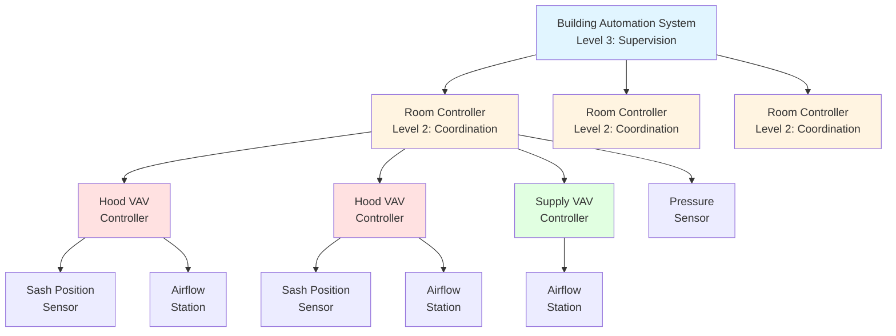
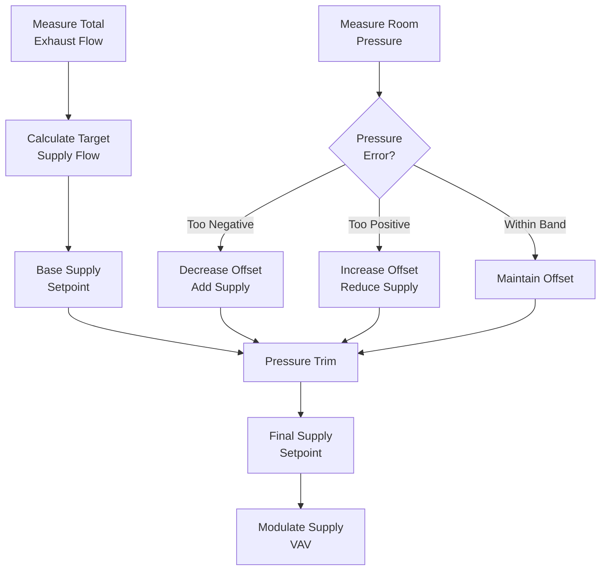

# Laboratory HVAC Control Systems

Laboratory HVAC control systems maintain critical safety parameters through coordinated regulation of fume hood face velocity, room static pressure, and supply-exhaust airflow balance. These systems must respond rapidly to disturbances—sash position changes, door openings, equipment cycling—while maintaining stable pressure relationships and preventing oscillations between interacting control loops. Control architecture complexity increases with variable air volume implementation, requiring sophisticated tracking algorithms that coordinate dozens of exhaust devices with centralized makeup air systems while ensuring containment at each hood. ASHRAE Applications Handbook Chapter 16 and ANSI/AIHA Z9.5 establish control performance requirements for laboratory ventilation safety.

## Control Architecture

### Hierarchical Control Structure

Laboratory HVAC employs three-level control hierarchy to manage system complexity while ensuring safety-critical responses occur at the appropriate speed.

**Level 1: Device-level control (local controllers)**
- Fume hood VAV valve controllers
- Room supply VAV terminal controllers
- Individual exhaust device controllers
- Response time: 0.5-2 seconds
- Direct hardware interlocks for safety

**Level 2: Room-level coordination (room controllers)**
- Supply-exhaust tracking coordination
- Room pressure maintenance
- Diversity factor management
- Response time: 2-5 seconds
- Intermediate safety logic

**Level 3: System-level supervision (building automation system)**
- Global diversity management
- Energy optimization
- Trending and diagnostics
- Response time: 10-60 seconds
- Non-critical functions only

### Control Loop Interaction

Laboratory systems contain multiple interacting control loops requiring careful coordination to prevent instability.

**Primary control loops:**

1. **Hood face velocity loop:** Modulates hood exhaust to maintain 100 FPM ± 10%
2. **Room supply tracking loop:** Adjusts supply air to follow exhaust changes
3. **Room pressure loop:** Trims supply-exhaust offset to maintain negative pressure
4. **Supply air temperature loop:** Maintains thermal comfort (independent)

**Interaction analysis:**

Hood exhaust change → Room pressure disturbance → Supply tracking response → Pressure correction → New equilibrium

**Stability requirements:**

Each loop must operate at different time scales to prevent interaction:
- Hood VAV response: 1-2 seconds
- Supply tracking response: 2-5 seconds
- Pressure trim response: 10-30 seconds
- Temperature control: 60-300 seconds

**Transfer function relationship:**

The room pressure response to hood airflow change follows second-order dynamics:

$$\frac{\Delta P(s)}{Q_{hood}(s)} = \frac{K}{1 + \tau_1 s} \cdot \frac{1}{1 + \tau_2 s}$$

Where:
- $K$ = Pressure gain (Pa/CFM), typically 0.02-0.05
- $\tau_1$ = Hood VAV response time (1-2 seconds)
- $\tau_2$ = Supply tracking response time (2-5 seconds)
- $s$ = Laplace variable

## Fume Hood VAV Control

### Sash Position Sensing

Accurate sash position measurement enables calculation of required exhaust airflow to maintain constant face velocity.

**Sensor technologies:**

| Technology | Principle | Accuracy | Advantages | Limitations |
|------------|-----------|----------|------------|-------------|
| Infrared reflective | Time-of-flight distance | ±0.25 in | Non-contact, reliable | Requires clean optical path |
| Ultrasonic ranging | Sound wave transit time | ±0.5 in | Immune to contamination | Temperature sensitive |
| Cable position | Potentiometer rotation | ±0.125 in | Highest accuracy | Mechanical wear, cable failure |
| Hall effect magnetic | Magnetic field position | ±0.25 in | Solid-state reliability | Requires magnet mounting |

**Airflow calculation from sash position:**

$$Q_{required} = V_{face} \times W_{hood} \times H_{sash}$$

Where:
- $Q_{required}$ = Required exhaust airflow (CFM)
- $V_{face}$ = Face velocity setpoint (100 FPM typical)
- $W_{hood}$ = Hood width (ft)
- $H_{sash}$ = Sash opening height (ft)

**Example for 6 ft hood:**

At full open (28 in = 2.33 ft):
$$Q = 100 \times 6 \times 2.33 = 1,398 \text{ CFM}$$

At half open (14 in = 1.17 ft):
$$Q = 100 \times 6 \times 1.17 = 702 \text{ CFM}$$

At minimum (6 in = 0.5 ft):
$$Q = 100 \times 6 \times 0.5 = 300 \text{ CFM}$$

### VAV Valve Control Sequence

Hood VAV controllers implement cascaded control with airflow measurement feedback to ensure face velocity accuracy despite duct static pressure variations.

**Control sequence:**

1. Measure sash position: $H_{measured}$
2. Calculate airflow setpoint: $Q_{setpoint} = 100 \times W \times H_{measured}$
3. Enforce minimum airflow: $Q_{setpoint} = \max(Q_{setpoint}, Q_{min})$
4. Measure actual airflow: $Q_{actual}$
5. Calculate error: $e = Q_{setpoint} - Q_{actual}$
6. PI controller output: $u = K_p e + K_i \int e \, dt$
7. Position VAV valve actuator

**PI controller tuning:**

Proportional gain:
$$K_p = \frac{\Delta u}{\Delta Q} = \frac{100\%}{Q_{max}} = \frac{1}{Q_{max}}$$

Integral time constant:
$$\tau_i = 3 \times \tau_{valve} = 3 \times 5 = 15 \text{ seconds typical}$$

**Feed-forward enhancement:**

Advanced controllers add feed-forward control from sash position to improve response time:

$$u = K_p e + K_i \int e \, dt + K_{ff} \times Q_{setpoint}$$

Where $K_{ff} = 0.7 - 0.9$ provides 70-90% of required valve position immediately, with feedback correcting the remainder.

### Airflow Measurement

Accurate airflow measurement in hood exhaust ducts enables closed-loop control despite duct static pressure variations.

**Measurement technologies:**

| Method | Principle | Accuracy | Typical Application |
|--------|-----------|----------|---------------------|
| Pitot tube array | Velocity pressure averaging | ±5-10% | Large diameter ducts > 12 in |
| Thermal dispersion | Heat transfer to flow | ±5-8% | Small ducts 6-12 in |
| Venturi/nozzle | Pressure drop vs. flow | ±3-5% | High accuracy applications |
| Ultrasonic transit time | Sound wave propagation | ±2-3% | Research-grade measurement |

**Velocity pressure to airflow conversion:**

For pitot array measurement:

$$Q = A_{duct} \times 4005 \sqrt{\frac{\Delta P_v}{\rho}}$$

Where:
- $Q$ = Airflow (CFM)
- $A_{duct}$ = Duct area (ft²)
- $\Delta P_v$ = Velocity pressure (in w.c.)
- $\rho$ = Air density (lb/ft³), 0.075 at standard conditions

**Simplified form at standard conditions:**

$$Q = 4005 \times A_{duct} \times \sqrt{\Delta P_v}$$

For 12 in diameter duct ($A = 0.785$ ft²):
$$Q = 3145 \sqrt{\Delta P_v}$$

At 1,400 CFM: $\Delta P_v = 0.198$ in w.c.

## Room Pressure Control

### Offset Supply-Exhaust Control

Room pressure results from volumetric imbalance between supply and exhaust airflow, requiring precise offset maintenance.

**Fundamental pressure relationship:**

Airflow through room envelope openings:

$$Q_{leak} = C \times A \times \sqrt{\frac{2 \Delta P}{\rho}}$$

Where:
- $Q_{leak}$ = Leakage airflow (CFM)
- $C$ = Flow coefficient (0.6-0.65 for door undercuts)
- $A$ = Opening area (ft²)
- $\Delta P$ = Pressure differential (lb/ft²)
- $\rho$ = Air density (lb/ft³)

**Conversion to HVAC units:**

$$Q_{leak} = 2610 \times C \times A \times \sqrt{\Delta P_{in}}$$

Where $\Delta P_{in}$ = pressure in inches w.c.

**Typical door undercut (1 in × 36 in = 0.25 ft²):**

At -0.02 in w.c. (-5 Pa):
$$Q_{leak} = 2610 \times 0.65 \times 0.25 \times \sqrt{0.02} = 76 \text{ CFM}$$

At -0.04 in w.c. (-10 Pa):
$$Q_{leak} = 2610 \times 0.65 \times 0.25 \times \sqrt{0.04} = 107 \text{ CFM}$$

**Required offset calculation:**

$$Q_{offset} = Q_{exhaust} - Q_{supply}$$

For single door laboratory at -5 Pa with additional envelope leakage:
$$Q_{offset} = 150 - 200 \text{ CFM typical}$$

### Pressure Tracking Algorithm

Room controllers implement pressure tracking that adjusts supply airflow offset to maintain setpoint during exhaust variations.

**Basic tracking algorithm:**

**Mathematical implementation:**

$$Q_{supply,setpoint} = Q_{exhaust,total} - Q_{offset,base} + Q_{trim}$$

Where pressure trim:

$$Q_{trim} = K_p (\Delta P_{setpoint} - \Delta P_{measured}) + K_i \int (\Delta P_{setpoint} - \Delta P_{measured}) dt$$

**Typical tuning parameters:**

- Proportional gain: $K_p = 500 - 1000$ CFM/in w.c.
- Integral time: $\tau_i = 20 - 40$ seconds
- Deadband: ±0.005 in w.c. (±1.25 Pa)
- Maximum trim: ±100 CFM

**Response time specification:**

ANSI Z9.5 implies pressure must recover within acceptable range within 30 seconds of disturbance. This requires:
- Exhaust measurement update: < 1 second
- Supply setpoint calculation: < 1 second
- Supply VAV response: 3-5 seconds
- Pressure stabilization: 10-20 seconds total

## Diversity Control

### Statistical Diversity Factor

Laboratory facilities rarely operate all fume hoods at full open simultaneously, allowing diversity credit in central supply/exhaust fan sizing.

**Diversity factor definition:**

$$D = \frac{Q_{actual,peak}}{Q_{design,sum}} = \frac{\sum_{i=1}^{n} Q_{i,operating}}{\sum_{i=1}^{n} Q_{i,full}}$$

**Typical diversity factors by facility size:**

| Number of Hoods | Diversity Factor | Design Basis |
|-----------------|------------------|--------------|
| 1-5 hoods | 1.0 | No diversity credit |
| 6-20 hoods | 0.85-0.95 | Limited diversity |
| 21-50 hoods | 0.75-0.85 | Moderate diversity |
| 51-100 hoods | 0.65-0.75 | Significant diversity |
| > 100 hoods | 0.55-0.65 | Maximum diversity |

**Physics basis:**

Diversity occurs because:
1. Not all hoods occupied simultaneously
2. Researchers work at partially open sash positions (12-18 in typical vs. 28 in full)
3. Some hoods used for storage with sash closed
4. Temporal variation in research activity

### Dynamic Diversity Management

Advanced systems implement real-time diversity monitoring to optimize energy while maintaining safety margins.

**Algorithm components:**

1. **Current load calculation:**
$$Q_{current} = \sum_{i=1}^{n} Q_{hood,i,actual}$$

2. **Potential maximum calculation:**
$$Q_{potential,max} = \sum_{i=1}^{n} Q_{hood,i,full}$$

3. **Available margin:**
$$Q_{margin} = Q_{fan,capacity} - Q_{current}$$

4. **Diversity limit check:**
$$\frac{Q_{potential,max}}{Q_{fan,capacity}} < 1.15$$

If potential maximum exceeds fan capacity by > 15%, system restricts additional hood activation or alerts users.

**Safety considerations:**

- Never deny ventilation to operational hood
- Maintain 10-15% reserve capacity minimum
- Alarm when diversity margin falls below 20%
- Provide manual override for emergency conditions

## Safety Interlocks and Alarms

### Critical Interlock Sequences

Laboratory HVAC controls include hardwired and software interlocks to ensure safe operation under all conditions.

**Startup interlock sequence:**

1. Verify supply fan status = OFF
2. Verify exhaust fan status = OFF
3. Start supply fan
4. Confirm supply fan running (airflow proven)
5. Wait 15-30 seconds for supply flow establishment
6. Start exhaust fan
7. Confirm exhaust fan running
8. Enable VAV control sequences
9. Monitor pressure achievement within 60 seconds

**Shutdown interlock sequence:**

1. Disable VAV control (freeze positions)
2. Stop exhaust fan
3. Confirm exhaust fan stopped
4. Wait 15-30 seconds for exhaust decay
5. Stop supply fan
6. Confirm supply fan stopped

**Failure mode interlocks:**

| Failure Condition | Control Action | Time Delay | Safety Rationale |
|-------------------|----------------|------------|------------------|
| Supply fan failure | Stop exhaust fan | 0 seconds | Prevent positive pressure |
| Exhaust fan failure | Continue supply fan | 30-60 seconds | Maintain dilution ventilation |
| Room pressure > -2.5 Pa | Alarm + increase offset | 10 seconds | Loss of containment warning |
| Hood face velocity < 80 FPM | Local and remote alarm | 5 seconds | Containment failure |
| Sash > maximum height | Visual and audible alarm | Immediate | Improper use warning |
| Fire alarm activation | Override to purge mode | Immediate | Smoke removal |

### Alarm Management

Laboratory control systems generate alarms for conditions requiring operator intervention or indicating safety compromise.

**Alarm priority classification:**

**Priority 1 (Critical):** Immediate safety threat
- Loss of exhaust ventilation
- Room positive pressure
- Multiple hood face velocity failures
- Fire alarm integration
- Response required: < 5 minutes

**Priority 2 (Warning):** Degraded safety margin
- Single hood face velocity out of range
- Room pressure approaching positive
- Supply-exhaust fan status mismatch
- Response required: < 30 minutes

**Priority 3 (Advisory):** Non-critical deviation
- Sash position exceeds recommended height
- Filter differential pressure high
- Equipment maintenance reminder
- Response required: < 24 hours

**Alarm notification pathways:**

1. Local annunciation at affected hood (visual indicator)
2. Room status panel display
3. Building automation system graphical interface
4. Email/text to facilities staff (priority 1 and 2)
5. Integration with building emergency systems (priority 1)

## Emergency Operation Modes

### Fire Alarm Integration

Laboratory HVAC systems must respond appropriately to fire alarm activation to support smoke removal while maintaining critical safety functions.

**Smoke purge mode:**

Upon fire alarm in laboratory zone:
1. Override all VAV controls to maximum position
2. Supply fan: 100% capacity
3. Exhaust fan: 100% capacity
4. Maintain slight negative pressure offset
5. Disable automatic shutdown
6. Operate until manual reset by fire department

**Smoke purge rationale:**

Maximum ventilation accelerates smoke removal and maintains tenable conditions. Negative pressure prevents smoke spread to adjacent areas.

### Emergency Power Operation

Life safety codes require minimum ventilation maintenance on emergency power for laboratories with highly toxic materials.

**Emergency power sequence:**

1. Normal power failure detected
2. Emergency generator startup (10-30 seconds)
3. Critical load transfer
4. Restart in minimum ventilation mode:
   - All hoods at minimum flow (200 CFM typical)
   - Supply air at minimum + offset
   - Pressure control active
   - Reduced capacity acceptable

**Load shedding priorities:**

When emergency power capacity limited:
1. Highest priority: High-hazard hood exhaust + makeup air
2. Second priority: General laboratory exhaust + makeup air
3. Third priority: Administrative area HVAC
4. Shed: Comfort cooling, reheat, non-essential loads

Laboratory HVAC control systems achieve safety through redundant measurement, rapid response, conservative setpoints, and comprehensive interlock logic. Proper commissioning validates control sequences under all operating modes including startup, normal operation, disturbances, failures, and emergency conditions. Ongoing monitoring and alarm response ensure continuous safe operation of these critical life safety systems.
