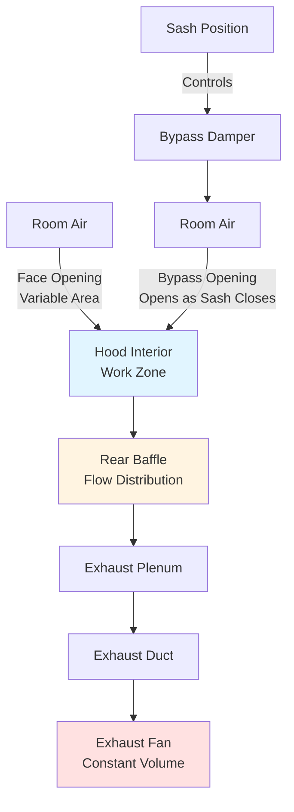

Chemical fume hood systems provide primary containment for hazardous materials handling in research, clinical, and industrial laboratories. These engineered devices capture airborne contaminants at the source through controlled airflow patterns that maintain inward velocity at the hood face opening while establishing downward and rearward air movement within the hood interior. Proper fume hood design balances containment performance, energy consumption, and operational flexibility through careful selection of hood type, face velocity setpoints, control strategies, and exhaust system configuration. ANSI/AIHA Z9.5 establishes minimum design criteria, while ASHRAE 110 provides quantitative containment testing methodology to verify field performance.

## Fundamental Containment Principles

### Face Velocity and Airflow Physics

Face velocity represents the average air velocity entering the hood face opening, measured perpendicular to the plane of the sash. This inward airflow prevents contaminant escape by establishing a capture envelope that overcomes diffusion, thermal convection, and room air currents.

**Face velocity specification:**

ANSI/AIHA Z9.5-2012 recommends face velocity range of 80-120 fpm with 100 fpm as standard design basis. Lower velocities (60-80 fpm for low-flow hoods) require enhanced containment features including aerodynamic sash design, rear baffles, and minimal cross-draft exposure.

**Volumetric airflow relationship:**

The required exhaust volume derives directly from face velocity and opening area:

$$Q = V_f \times A_{opening}$$

where:
- $Q$ = Volumetric airflow (cfm)
- $V_f$ = Face velocity (fpm)
- $A_{opening}$ = Sash opening area (ft²)

For a 6-foot wide hood with 18-inch working height (sash at 18 inches above work surface):

$$A_{opening} = 6 \text{ ft} \times 1.5 \text{ ft} = 9 \text{ ft}^2$$

$$Q = 100 \text{ fpm} \times 9 \text{ ft}^2 = 900 \text{ cfm}$$

At full sash opening (28 inches typical maximum):

$$A_{opening} = 6 \text{ ft} \times 2.33 \text{ ft} = 14 \text{ ft}^2$$

$$Q = 100 \text{ fpm} \times 14 \text{ ft}^2 = 1,400 \text{ cfm}$$

### Internal Airflow Patterns

Effective containment requires proper internal airflow distribution beyond simple face velocity maintenance. Air entering the hood face must sweep the work surface and transport contaminants to the rear baffle and exhaust plenum without creating recirculation zones or turbulent eddies that allow contaminant escape.

**Rear baffle design:**

Most modern hoods incorporate adjustable rear baffles with multiple slots (typically 3-5 slots) to optimize airflow distribution. The baffle creates resistance that equalizes flow across the hood depth, preventing dead zones at the rear and excessive velocity at the front.

**Baffle airflow distribution:**

Recommended baffle slot distribution (percentage of total exhaust through each slot from bottom to top):
- Bottom slot (below work surface): 50-60%
- Middle slots (work zone height): 20-30%
- Top slot (upper hood volume): 10-20%

**Bernoulli's principle application:**

The pressure drop across each baffle slot determines flow distribution. For uniform velocity across hood width, each slot must maintain equal static pressure differential:

$$\Delta P_{slot} = \frac{\rho V_{slot}^2}{2 \times 1097}$$

where:
- $\Delta P_{slot}$ = Pressure drop across slot (in w.g.)
- $\rho$ = Air density (0.075 lb/ft³ standard)
- $V_{slot}$ = Velocity through slot (fpm)
- 1097 = Conversion factor

Typical baffle pressure drops range from 0.05-0.15 in w.g. to establish proper flow distribution.

## Fume Hood Types and Configurations

### Bypass Hood Design

Bypass hoods incorporate auxiliary air openings above or around the sash that open as the sash closes, maintaining relatively constant exhaust volume while preventing excessive face velocity increases.

**Operating principle:**

As sash position decreases, the bypass opening area increases proportionally to maintain approximately constant total opening area (face opening + bypass opening). This configuration prevents face velocity from exceeding 150 fpm at minimum sash positions while maintaining adequate containment.

**Bypass airflow calculation:**

$$Q_{total} = V_f \times A_{face} + V_{bypass} \times A_{bypass}$$

For constant volume operation as sash closes:

$$Q_{total} = \text{constant}$$

**Bypass transition point:**

Bypass openings typically activate when sash reaches 50% of full open position. Below this point, increasing bypass area compensates for decreasing face area.

**Energy implications:**

Bypass hoods operating in constant volume mode exhaust full design airflow continuously, creating substantial energy consumption for makeup air conditioning. This configuration suits high-hazard applications requiring maximum dilution ventilation but proves inefficient for variable-use laboratories.

### Constant Volume Hoods

Constant air volume (CAV) hoods maintain fixed exhaust airflow regardless of sash position. Without bypass openings, face velocity varies inversely with opening area, potentially creating excessive velocities at low sash positions that generate turbulence and compromise containment.

**Face velocity variation:**

For constant exhaust volume $Q$:

$$V_f = \frac{Q}{A_{sash}}$$

As sash height decreases from 18 inches to 6 inches (one-third area):

$$V_f = \frac{Q}{A/3} = 3 \times V_{f,design}$$

Face velocity increases from 100 fpm to 300 fpm, creating turbulent conditions that may exceed containment capability.

**Applications:**

CAV hoods without bypass suit applications requiring continuous maximum dilution regardless of sash position:
- Perchloric acid digestion (requires continuous washdown)
- Radioisotope work (maximum ventilation for airborne contamination control)
- High-toxicity materials (conservative safety approach)

### Variable Air Volume Hoods

VAV hoods modulate exhaust volume in response to sash position, maintaining constant face velocity while reducing energy consumption during periods of reduced sash opening.

**Control strategy:**

Sash position sensors (ultrasonic, infrared, or string potentiometer) continuously measure vertical or horizontal sash position. The controller calculates required airflow to maintain target face velocity and modulates exhaust damper or fan speed accordingly.

**Airflow modulation equation:**

$$Q_{setpoint}(t) = V_{f,target} \times W_{hood} \times H_{sash}(t)$$

where:
- $H_{sash}(t)$ = Measured sash height at time $t$ (ft)
- $W_{hood}$ = Hood width (ft)
- $V_{f,target}$ = Face velocity setpoint (100 fpm typical)

**Minimum airflow limit:**

Even with sash fully closed, minimum exhaust airflow (150-300 cfm for typical 4-6 ft hoods) maintains slight negative pressure within hood and prevents chemical vapor accumulation. This minimum flow represents 10-25% of full-open design flow.

**Energy savings analysis:**

Assuming typical laboratory usage patterns:
- Sash fully open: 10% of operating hours
- Sash at working height (18 in): 30% of operating hours
- Sash at minimum (6 in): 60% of operating hours

Average airflow reduction compared to CAV:

$$\bar{Q}_{VAV} = 0.10(1.0Q) + 0.30(0.65Q) + 0.60(0.21Q) = 0.42Q$$

VAV operation reduces average airflow to 42% of CAV baseline, translating to 58% reduction in makeup air heating, cooling, and fan energy.

### Auxiliary Air Hoods

Auxiliary air hoods introduce conditioned or unconditioned supplemental air directly to the hood face or interior, reducing the makeup air burden on the building HVAC system.

**Type I auxiliary air (supply air hood):**

Tempered outdoor air discharges from a plenum above the hood face, flowing downward across the face opening before entrainment into the hood exhaust. This configuration reduces building makeup air requirement by supplying 60-80% of hood exhaust directly.

**Type II auxiliary air (makeup air collar):**

A perforated collar or plenum surrounds the hood, discharging low-velocity air that flows into the hood opening. This gentler introduction minimizes disturbance compared to face discharge.

**Limitations and concerns:**

- Cross-draft risk: Auxiliary air discharge creates turbulence at hood face that may compromise containment
- ASHRAE 110 testing required: All auxiliary air hoods must undergo containment verification
- Temperature stratification: Unconditioned auxiliary air creates uncomfortable thermal conditions for hood users
- Energy credit uncertainty: Auxiliary air offsetting building makeup air requires verification through airflow measurement
- Declining use: Modern energy codes and VAV technology generally provide better performance than auxiliary air approaches

## Face Velocity Measurement and Control

### Measurement Grid Requirements

ASHRAE 110-2016 specifies detailed procedures for face velocity measurement using a multi-point traverse grid.

**Grid specifications:**

- Measurement points: 6-inch spacing in both horizontal and vertical directions
- Anemometer type: Thermal or vane anemometer, ±3% accuracy minimum
- Measurement duration: 10-second minimum per point
- Acceptable range: 80-120 fpm (±20% of 100 fpm setpoint)
- Uniformity: No single point should vary more than 20% from average

**Statistical analysis:**

Calculate average face velocity:

$$\bar{V}_f = \frac{1}{n}\sum_{i=1}^{n} V_{f,i}$$

Calculate standard deviation:

$$\sigma = \sqrt{\frac{1}{n-1}\sum_{i=1}^{n}(V_{f,i} - \bar{V}_f)^2}$$

Acceptable performance typically requires:
- Average velocity: 80-120 fpm
- Standard deviation: < 15 fpm
- Coefficient of variation: < 15%

### Continuous Monitoring Systems

Modern hoods incorporate continuous face velocity monitoring for real-time performance verification and alarm generation.

**Monitoring technologies:**

| Technology | Principle | Accuracy | Application |
|------------|-----------|----------|-------------|
| Pitot tube array | Differential pressure measurement | ±5-10% | Manifolded exhaust ducts |
| Thermal dispersion | Heat transfer rate to flow | ±5-8% | Individual hood exhaust |
| Pressure-based calculation | Duct static pressure + system curve | ±10-15% | Simple constant volume systems |
| Ultrasonic transit time | Sound wave propagation | ±2-5% | High-accuracy research applications |

**Alarm setpoints:**

- Low velocity alarm: < 80 fpm (indicates inadequate containment)
- High velocity alarm: > 120 fpm (indicates excessive turbulence)
- Airflow failure alarm: Loss of signal or airflow < 50% of setpoint

**Response to alarms:**

Upon low face velocity detection:
1. Audible and visual alarm at hood (horn and strobe light)
2. Notification to building automation system
3. Remote alarm to facilities management
4. Email/text notification to safety personnel (priority alarms)
5. Alarm persists until acknowledged and condition corrected

## Hood Performance Testing

### ASHRAE 110 Containment Test Method

ASHRAE Standard 110-2016 "Method of Testing Performance of Laboratory Fume Hoods" provides quantitative containment assessment using tracer gas challenge.

**Test procedure overview:**

1. **Face velocity measurement:** Conduct multi-point traverse per grid requirements
2. **Airflow visualization:** Introduce theatrical smoke to observe flow patterns and identify turbulence
3. **Tracer gas test:** Release sulfur hexafluoride (SF₆) inside hood while sampling at mannequin breathing zone
4. **Robustness test:** Assess containment during simulated disturbances (person walking past hood)

**Tracer gas test protocol:**

- Tracer gas: Sulfur hexafluoride at 4 liters/minute release rate
- Release location: Center of hood, 6 inches behind sash, 6 inches above work surface
- Sampling locations: Mannequin positioned at hood face with sampling probes at nose and mouth height
- Test duration: 5 minutes per configuration
- Sash positions tested: Fully open, half open, and working height (18 inches typical)

**Performance criteria:**

Measured SF₆ concentration at breathing zone:
- AM 0.10 ppm (as manufactured): Excellent containment, meets strictest criteria
- AM 0.15 ppm: Acceptable containment for most applications
- AM 0.20 ppm: Marginal performance, may require corrective action
- AM > 0.30 ppm: Unacceptable, hood fails containment requirements

where AM = arithmetic mean of all sample measurements

**Pass/fail determination:**

$$\text{Containment Factor} = \frac{C_{measured}}{C_{background}} < 0.10 \text{ for AM 0.10 performance}$$

### Tracer Gas Testing Alternatives

Beyond ASHRAE 110 methodology, alternative tracer approaches provide qualitative and semi-quantitative containment assessment.

**Titanium tetrachloride (TiCl₄) smoke test:**

- Qualitative visual assessment
- Ampule broken inside hood generates dense white smoke
- Observer watches for smoke escape at hood face
- Simple field test for commissioning and troubleshooting
- Does not provide quantitative containment data

**Dry ice fog test:**

- Qualitative assessment using visible fog
- Dry ice in warm water creates carbon dioxide fog
- Heavier-than-air fog tests downdraft and floor-level containment
- Useful for walk-in hoods and floor-mounted configurations

**Computational fluid dynamics (CFD) modeling:**

- Pre-construction containment prediction
- Airflow pattern optimization during design phase
- Validation of baffle configurations
- Parametric studies of room air supply effects
- Does not replace physical testing but guides design decisions

## System Integration Considerations

### Hood Alarm Systems

Comprehensive alarm systems provide multiple layers of notification for containment failures and operational anomalies.

**Alarm hierarchy:**

1. **Local alarm (priority 1 - critical):**
   - Condition: Face velocity < 80 fpm or airflow failure
   - Response: Audible horn (85 dBA minimum) + visual strobe (red)
   - Location: Mounted on hood structure, visible to user
   - Latching: Alarm continues until acknowledged at control panel

2. **Remote alarm (priority 1 - critical):**
   - Transmission: Building automation system network
   - Notification: Facilities control room display
   - Response required: < 15 minutes during business hours
   - After-hours: Automated phone/text notification to on-call personnel

3. **Advisory alarm (priority 2 - warning):**
   - Condition: Sash position exceeds recommended working height
   - Response: Visual indication (yellow light) + optional chime
   - Purpose: Educate users on proper hood operation

**Alarm testing frequency:**

- Monthly: Test alarm activation by simulating low airflow condition
- Annually: Verify alarm transmission to remote monitoring systems
- Post-maintenance: Test after any control system work or hood modification

### Sash Position Sensors

Automated sash position detection enables VAV control, alarm generation, and operational monitoring.

**Sensor technologies comparison:**

| Sensor Type | Operating Principle | Accuracy | Advantages | Limitations |
|-------------|---------------------|----------|------------|-------------|
| Ultrasonic ranging | Time-of-flight measurement | ±0.25 in | Non-contact, reliable | Temperature sensitive |
| Infrared optical | Reflected light intensity | ±0.5 in | Simple, low cost | Requires clean optical path |
| String potentiometer | Cable extension measurement | ±0.1 in | Highest accuracy | Mechanical wear, cable breakage |
| Magnetic reed switches | Discrete position detection | ±1.0 in | Robust, no calibration | Limited resolution |
| Hall effect linear | Magnetic field position | ±0.25 in | Solid-state reliability | Requires magnet mounting |

**Installation requirements:**

- Mounting: Protected location not exposed to chemical splash
- Calibration: Verify reading at fully closed, working height, and fully open positions
- Redundancy: Consider dual sensors for critical applications
- Maintenance access: Position for easy cleaning and replacement

## Specialized Hood Configurations

### Floor-Mounted Hoods

Floor-mounted fume hoods provide containment for tall apparatus, large equipment, and processes requiring low-elevation access.

**Design considerations:**

- Elevated floor section or recessed floor pan to create work surface
- Downdraft exhaust through floor grille with rear baffle
- Higher airflow requirements due to large vertical opening (800-1,200 cfm per linear foot)
- Drainage provisions for spill containment
- Raised threshold to contain liquid spills

**Face velocity challenges:**

Large vertical openings create thermal convection currents that oppose downward exhaust flow. Design face velocities of 125-150 fpm overcome buoyancy from heated processes.

### Walk-In Hoods

Walk-in configurations provide access for human entry during setup and operation of large-scale equipment.

**Airflow calculation:**

$$Q = V_f \times (W_{hood} \times H_{opening})$$

For 8 ft wide × 7 ft high walk-in opening:

$$Q = 100 \text{ fpm} \times (8 \times 7) = 5,600 \text{ cfm}$$

**Safety considerations:**

- Oxygen monitoring: Required for hoods large enough for human entry
- Emergency egress: Second exit or breakaway rear panel
- Audible alarm inside hood: Warns occupants of ventilation failure
- Lighting: Explosion-proof if flammable materials present

### Distillation Hoods

Specialized hoods for tall distillation apparatus with reduced-height sash openings.

**Vertical sash design:**

Two-section sash with:
- Lower section: Standard horizontal sliding sash for access
- Upper section: Fixed or vertical-sliding panel for tall equipment viewing

**Reduced exhaust volume:**

Vertical sash configuration reduces opening area compared to full-height horizontal sash, decreasing airflow requirements by 30-50% while maintaining equipment visibility.

### Benchtop Hoods

Shallow-depth hoods (18-24 inches) for limited-containment applications or space-constrained installations.

**Performance limitations:**

- Reduced containment effectiveness compared to full-depth hoods (28-32 inches)
- More susceptible to room air currents and cross-drafts
- ASHRAE 110 testing essential to verify adequate containment
- Generally limited to low-hazard operations

**Applications:**

- Teaching laboratories with minimal chemical use
- Quality control labs with routine, well-characterized procedures
- Balance enclosures with light solvent use

## Energy Optimization Strategies

### Diversity Factor Application

Large facilities with multiple fume hoods rarely operate all hoods at maximum sash opening simultaneously, allowing diversity credit in central exhaust fan sizing.

**Diversity factor definition:**

$$D = \frac{Q_{actual,peak}}{Q_{design,sum}}$$

where:
- $Q_{actual,peak}$ = Maximum simultaneous exhaust demand observed or predicted
- $Q_{design,sum}$ = Sum of all individual hood design airflows at full open

**Typical diversity factors:**

| Number of Hoods | Research Labs | Teaching Labs | Industrial QC |
|-----------------|---------------|---------------|---------------|
| 1-5 | 1.00 | 1.00 | 1.00 |
| 6-20 | 0.85-0.95 | 0.70-0.85 | 0.90-1.00 |
| 21-50 | 0.75-0.85 | 0.60-0.75 | 0.85-0.95 |
| > 50 | 0.65-0.75 | 0.50-0.65 | 0.80-0.90 |

**Application limitations:**

- Never apply diversity to individual hood sizing
- Verify diversity assumptions through operational monitoring
- Provide 10-15% safety margin above calculated peak demand
- Include alarm system to warn when diversity margin exhausted

### Occupancy-Based Control

Unoccupied laboratory periods (nights, weekends) present energy-saving opportunities through reduced ventilation while maintaining minimum safety thresholds.

**Setback strategies:**

1. **Minimum flow mode:** Reduce all hoods to minimum airflow (150-300 cfm) during unoccupied periods
2. **Automatic sash closers:** Motorized system closes sashes after occupancy sensor timeout (15-30 minutes typical)
3. **Scheduled setback:** Time-based reduction during predictable unoccupied periods

**Safety requirements:**

- Maintain minimum air change rate (2-4 ACH) during setback
- Preserve space negative pressure relationships
- Provide manual override for after-hours access
- Reset to normal operation before occupancy (morning warm-up sequence)

**Energy savings potential:**

Facilities operating VAV hoods with unoccupied setback achieve total energy reductions of 60-75% compared to CAV baseline:
- VAV operation: 50-60% reduction
- Unoccupied setback: Additional 10-15% reduction

Fume hood systems represent the critical interface between laboratory safety and building energy performance. Proper hood selection, precise face velocity control, rigorous containment testing, and intelligent VAV strategies deliver optimal protection with minimized energy consumption. Understanding the fundamental physics of hood containment, applying appropriate technologies, and maintaining systems through comprehensive testing ensures reliable protection for laboratory personnel conducting essential research and analytical work.
