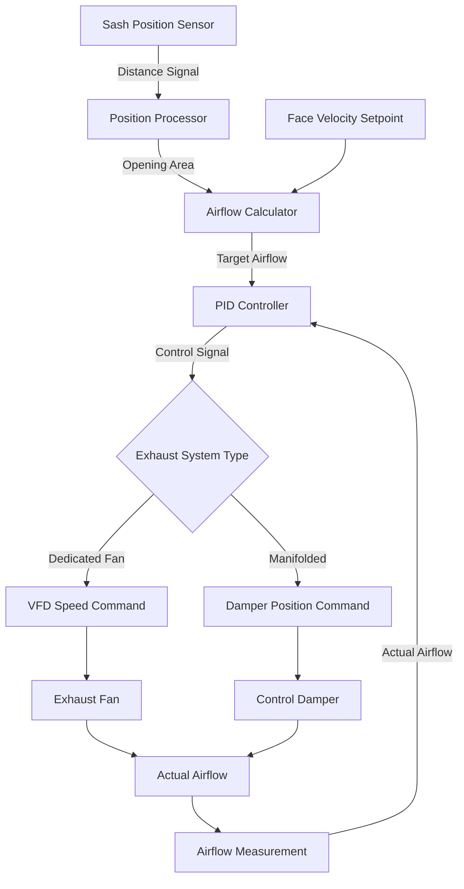
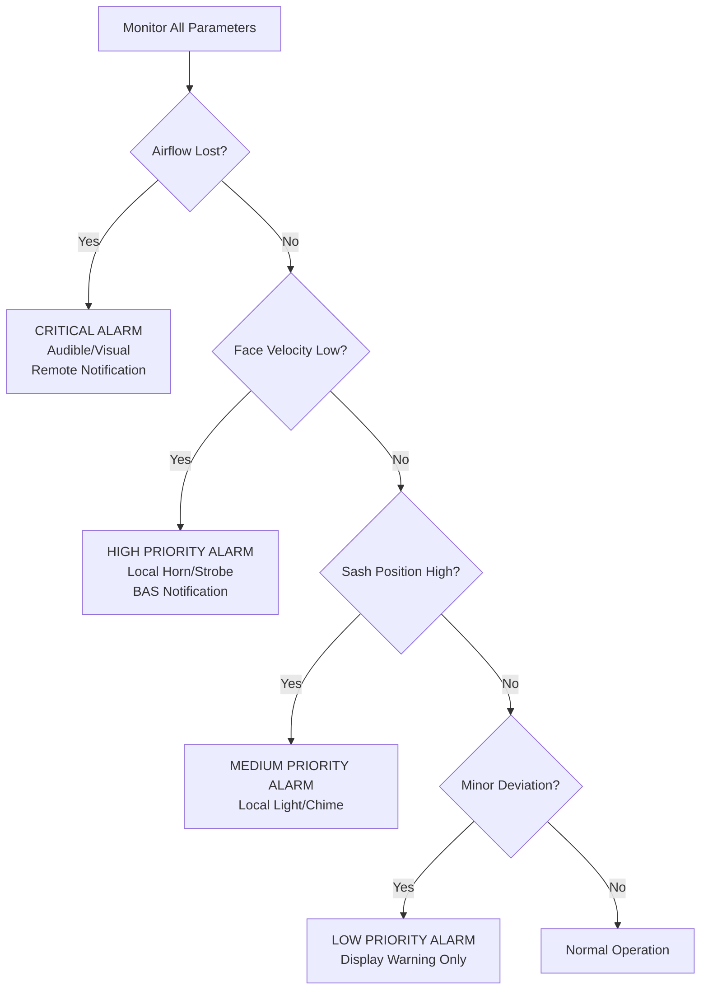

Variable air volume (VAV) fume hoods represent the most energy-efficient approach to laboratory exhaust control, reducing airflow in response to sash position while maintaining the required face velocity for safe containment. These systems achieve energy savings of 50-70% compared to constant air volume (CAV) hoods through dynamic exhaust modulation coupled with sophisticated control algorithms and safety interlocks.

## Operating Principles

VAV hoods operate on the principle that volumetric airflow through the hood opening must decrease proportionally as the sash opening area reduces. The fundamental relationship governing VAV hood operation derives from the continuity equation:

$$Q = V_f \cdot A_{sash}$$

where $Q$ is volumetric airflow (cfm), $V_f$ is face velocity (fpm), and $A_{sash}$ is the sash opening area (ft²). As the sash closes, $A_{sash}$ decreases, allowing $Q$ to decrease while maintaining constant $V_f$ at the reduced opening.

The control system continuously measures sash position and modulates the exhaust airflow to maintain the target face velocity, typically 100 fpm per ANSI/AIHA Z9.5-2012. This dynamic adjustment occurs through variable frequency drives (VFDs) controlling exhaust fan speed or through pressure-independent damper controls in manifolded systems.

## Sash Position Sensing Technologies

Accurate sash position detection forms the foundation of VAV hood control. Multiple sensing technologies provide position feedback:

| Sensing Technology | Accuracy | Response Time | Typical Application |
|-------------------|----------|---------------|---------------------|
| Ultrasonic sensors | ±0.25 in | <0.5 sec | Single vertical sash |
| IR/optical sensors | ±0.5 in | <1 sec | Horizontal or combination sash |
| Magnetic reed switches | ±1 in | <0.1 sec | Discrete position verification |
| String potentiometers | ±0.1 in | <0.2 sec | High-precision applications |
| 3D imaging systems | ±0.25 in | <1 sec | Complex multi-sash configurations |

Ultrasonic sensors represent the most common technology, emitting sound waves that reflect off the sash and calculating distance based on time-of-flight measurements. The sensor-to-sash distance $d$ relates to signal travel time $t$ through:

$$d = \frac{c_{sound} \cdot t}{2}$$

where $c_{sound}$ is the speed of sound in air (approximately 1,125 ft/sec at standard conditions), divided by 2 for round-trip travel. The controller converts this distance to sash opening area based on hood geometry.

## Face Velocity Control Algorithms

The control algorithm must respond to sash position changes while filtering transient movements and preventing hunting behavior. A typical PID control loop processes the error between target and measured face velocity:

$$u(t) = K_p \cdot e(t) + K_i \int e(t)dt + K_d \frac{de(t)}{dt}$$

where $u(t)$ is the control output (VFD speed command or damper position), $e(t)$ is the velocity error, and $K_p$, $K_i$, $K_d$ are proportional, integral, and derivative gains respectively.

For laboratory applications, control parameters typically set:
- $K_p$ = 0.4-0.8 (proportional response to instantaneous error)
- $K_i$ = 0.1-0.3 (eliminates steady-state offset)
- $K_d$ = 0.05-0.15 (dampens overshoot and oscillation)

The algorithm incorporates rate-of-change limiting to prevent excessive fan speed variations during rapid sash movements. Maximum airflow change rates typically limit to 500-1,000 cfm/minute to maintain system stability.

## Energy Savings Analysis

VAV hoods deliver substantial energy savings through reduced exhaust and makeup air volumes. The energy consumption comparison between CAV and VAV operation quantifies these savings.

For a standard 6-foot hood operating at 100 fpm face velocity:
- Fully open (6 ft × 2.5 ft sash): $Q_{max}$ = 100 fpm × 15 ft² = 1,500 cfm
- Half open (6 ft × 1.25 ft sash): $Q_{half}$ = 100 fpm × 7.5 ft² = 750 cfm
- 6-inch open (6 ft × 0.5 ft working height): $Q_{min}$ = 100 fpm × 3 ft² = 300 cfm

The annual energy consumption for exhaust and makeup air heating/cooling follows:

$$E_{annual} = \sum_{i=1}^{n} Q_i \cdot \rho \cdot c_p \cdot \Delta T_i \cdot t_i \cdot \eta^{-1}$$

where $\rho$ is air density (0.075 lb/ft³), $c_p$ is specific heat (0.24 Btu/lb·°F), $\Delta T_i$ is temperature difference between outdoor and supply air for condition $i$, $t_i$ is operating hours at condition $i$, and $\eta$ is heating/cooling system efficiency.

Assuming typical laboratory usage patterns (sash fully open 10% of time, half open 30%, working height 60%):

**Average CAV airflow**: 1,500 cfm (constant)

**Average VAV airflow**: (0.10 × 1,500) + (0.30 × 750) + (0.60 × 300) = 555 cfm

**Airflow reduction**: (1,500 - 555)/1,500 = 63%

For a heating climate with 5,000 heating degree days and natural gas heating at $0.80/therm:

**CAV annual heating energy**: 1,500 cfm × 60 min/hr × 0.075 lb/ft³ × 0.24 Btu/lb·°F × 120,000°F·hr / 0.80 efficiency × 1 therm/100,000 Btu = 2,430 therms = $1,944/year

**VAV annual heating energy**: 555 cfm (same calculation) = 899 therms = $719/year

**Annual heating savings**: $1,225 per hood

Fan energy savings add to thermal energy savings. The fan power relationship to airflow follows the cube law:

$$\frac{P_2}{P_1} = \left(\frac{Q_2}{Q_1}\right)^3$$

For the 63% airflow reduction:

**Fan power ratio**: (555/1,500)³ = 0.051 or 5.1% of full-load power

A 1.5 hp exhaust fan operating 8,760 hours/year at $0.12/kWh:
- CAV consumption: 1.5 hp × 0.746 kW/hp × 8,760 hr × $0.12/kWh = $1,174/year
- VAV consumption: 1,174 × 0.051 = $60/year
- Fan energy savings: $1,114/year

**Total annual savings per hood**: $1,225 + $1,114 = $2,339

## Safety Interlocks and Alarms

VAV hoods require multiple safety interlocks to ensure personnel protection during all operating modes. ANSI/AIHA Z9.5 mandates that control failures default to safe conditions (fail-safe design).

**Critical safety interlocks include:**

1. **Low face velocity alarm**: Activates when measured velocity falls below 80 fpm (20% below setpoint), triggering audible and visual alarms at the hood and remote monitoring location.

2. **Sash position alarm**: Alerts when sash exceeds maximum safe working height (typically 18-20 inches), indicating potential containment compromise.

3. **Airflow failure interlock**: Upon loss of exhaust airflow (sensor failure, fan trip, duct blockage), the system triggers emergency alarms and may activate emergency bypass dampers to maintain minimum ventilation.

4. **Control system failure default**: Loss of control signal commands maximum airflow position (VFD to 100% speed or damper full open) to ensure continued exhaust.

5. **Sash motion detection**: Some advanced systems incorporate motion sensors to distinguish between sash adjustment (temporary velocity deviation acceptable) and static operation (velocity must stabilize at setpoint within 15-30 seconds).

The alarm prioritization hierarchy follows:

## Minimum Airflow Considerations

VAV hoods must maintain minimum airflow even when the sash closes completely to prevent stagnant air conditions and chemical vapor accumulation within the hood. ANSI/AIHA Z9.5 recommends minimum exhaust rates of 25-50 cfm for unoccupied hoods.

The minimum airflow ensures:
- Continuous dilution of residual chemical vapors
- Slight negative pressure to prevent vapor migration into the laboratory
- Air circulation to prevent stratification and dead zones

Controllers typically implement a minimum airflow setpoint that overrides the sash-position-based calculation when the computed airflow falls below this threshold. The minimum flow represents 10-20% of the maximum design airflow for most standard hoods.

For manifolded exhaust systems serving multiple hoods, the diversity factor becomes critical in sizing the main exhaust system. The probability that all hoods simultaneously operate at maximum airflow approaches zero in typical laboratory operations, allowing the main exhaust fan to size for expected peak diversity rather than absolute peak demand.

## System Commissioning and Verification

Proper commissioning of VAV hood systems verifies that controls maintain face velocity across the full range of sash positions. The commissioning process includes:

1. **Sash position sensor calibration**: Verify sensor readings at minimum, maximum, and intermediate sash positions against physical measurements (±0.5 inch tolerance).

2. **Face velocity verification**: Measure face velocity using ASHRAE 110 grid traverse method at sash positions representing 25%, 50%, 75%, and 100% open. All measurements must fall within 80-120 fpm (±20% of 100 fpm setpoint).

3. **Control response testing**: Open and close sash at various speeds while monitoring face velocity stabilization time. Systems should stabilize within 15-30 seconds of sash movement cessation.

4. **Alarm function verification**: Trigger each alarm condition (low velocity, high sash, airflow failure) and verify proper alarm activation, display, and remote notification.

5. **Containment testing**: Perform ASHRAE 110 tracer gas testing with hood in VAV mode at various sash positions to verify containment effectiveness matches CAV performance.

The commissioning documentation records baseline performance parameters that establish the reference for ongoing performance verification and troubleshooting.

VAV fume hoods represent the optimal balance between laboratory safety and energy efficiency when properly designed, installed, and maintained. The sophisticated control systems require rigorous commissioning and periodic recalibration to ensure reliable operation throughout the system lifecycle.
