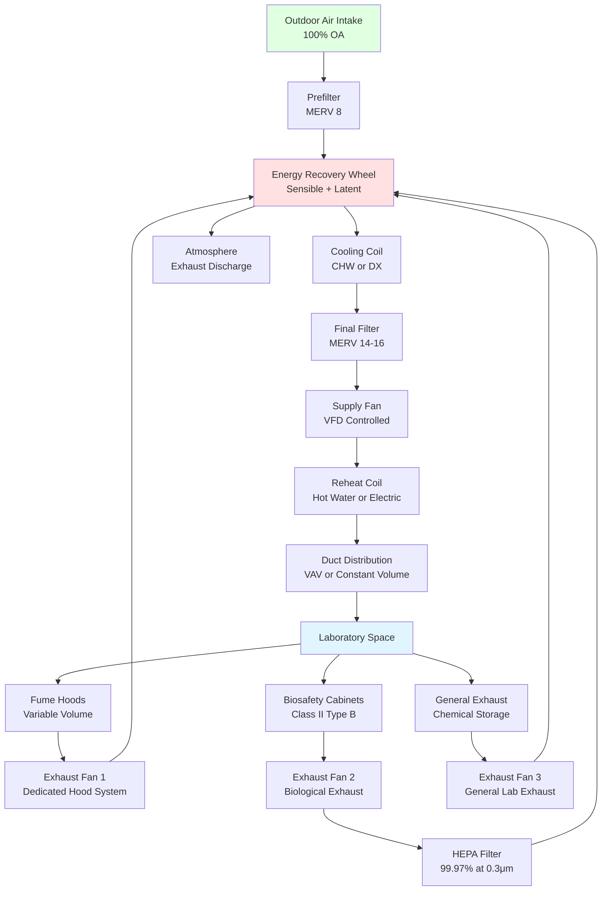

Laboratory facilities present unique makeup air challenges due to their requirement for 100% outdoor air, high exhaust rates from fume hoods and biological safety cabinets, and stringent pressure control requirements. Unlike typical commercial buildings that recirculate 70-90% of supply air, laboratories discharge all exhaust air to prevent cross-contamination, creating substantial makeup air demands that directly impact energy consumption and system design.

## Physical Principles of Laboratory Makeup Air

Laboratory makeup air systems operate on the fundamental principle of mass conservation. Every kilogram of air exhausted must be replaced by an equal mass of outdoor air to maintain space pressure control. The relationship is expressed as:

$$\dot{m}_{supply} = \dot{m}_{exhaust} + \dot{m}_{exfiltration}$$

For pressurized laboratories (positive pressure relative to adjacent spaces):

$$Q_{supply} = Q_{exhaust} + Q_{pressurization}$$

where $Q_{supply}$ is total supply airflow (cfm), $Q_{exhaust}$ is total exhaust including fume hoods, biosafety cabinets, and general exhaust (cfm), and $Q_{pressurization}$ typically ranges from 100-300 cfm depending on laboratory size and door undercut area.

For negatively pressurized laboratories (containment spaces):

$$Q_{supply} = Q_{exhaust} - Q_{pressurization}$$

The makeup air system must condition outdoor air from ambient conditions to space setpoint, requiring sensible and latent cooling capacity calculated as:

$$\dot{Q}_{sensible} = 1.08 \times Q \times \Delta T$$

$$\dot{Q}_{latent} = 4840 \times Q \times \Delta W$$

where $Q$ is airflow (cfm), $\Delta T$ is temperature difference (°F), and $\Delta W$ is humidity ratio difference (lb water/lb dry air). The factor 1.08 incorporates air density (0.075 lb/ft³) and specific heat (0.24 Btu/lb·°F), while 4840 accounts for the latent heat of vaporization.

## Laboratory Makeup Air System Architecture

## Makeup Air Conditioning Strategies

Laboratory makeup air systems employ various conditioning strategies based on climate, exhaust heat load, and energy efficiency requirements:

| Strategy | Applications | Advantages | Limitations | Typical Energy Recovery |
|----------|-------------|------------|-------------|------------------------|
| **Direct Outdoor Air** | Mild climates, low exhaust rates | Simple controls, low first cost | High energy use, poor humidity control | None (0% recovery) |
| **Sensible Wheel** | All climates, chemical labs | 70-80% sensible recovery, proven reliability | No latent recovery in humid climates | 70-80% sensible only |
| **Enthalpy Wheel** | Humid climates, general labs | 70-80% total recovery, humidity control | Cross-contamination risk, requires purge | 70-80% total energy |
| **Runaround Loop** | Biosafety labs, separated intake/exhaust | Zero cross-contamination, flexible placement | 50-65% sensible recovery, pumping energy | 50-65% sensible only |
| **Heat Pipe** | Chemical labs, passive recovery | No moving parts, no cross-contamination | 45-60% sensible recovery, fixed effectiveness | 45-60% sensible only |
| **Dedicated OA with Chilled Beams** | Low exhaust rate labs, high cooling loads | Decouples ventilation from cooling | Requires low dewpoint supply air | 70-80% with wheel |

## Makeup Air Calculations for Laboratory Design

The design process begins with exhaust airflow determination. For a typical chemistry laboratory with four 6-foot fume hoods operating at 100 fpm face velocity:

$$Q_{hood} = \text{Face Area} \times \text{Face Velocity}$$

$$Q_{hood} = (6 \text{ ft} \times 5 \text{ ft}) \times 100 \text{ fpm} = 3000 \text{ cfm per hood}$$

Total hood exhaust for four hoods:

$$Q_{hood,total} = 4 \times 3000 = 12,000 \text{ cfm}$$

Adding general laboratory exhaust at 0.5 cfm/ft² for a 2,400 ft² lab:

$$Q_{general} = 2400 \text{ ft}^2 \times 0.5 \text{ cfm/ft}^2 = 1200 \text{ cfm}$$

Total exhaust requirement:

$$Q_{exhaust,total} = 12,000 + 1,200 = 13,200 \text{ cfm}$$

For positive pressurization at 0.05 in. w.c., add 200 cfm:

$$Q_{supply} = 13,200 + 200 = 13,400 \text{ cfm}$$

The makeup air cooling load for summer design conditions (95°F DB, 78°F WB outdoor to 75°F DB, 50% RH space condition):

$$\dot{Q}_{sensible} = 1.08 \times 13,400 \times (95 - 75) = 289,440 \text{ Btu/hr} = 24.1 \text{ tons}$$

For latent cooling, outdoor humidity ratio at 95°F/78°F WB is approximately 0.0158 lb/lb, while space condition at 75°F/50% RH is 0.0093 lb/lb:

$$\dot{Q}_{latent} = 4840 \times 13,400 \times (0.0158 - 0.0093) = 421,148 \text{ Btu/hr} = 35.1 \text{ tons}$$

Total cooling load without energy recovery:

$$\dot{Q}_{total} = 289,440 + 421,148 = 710,588 \text{ Btu/hr} = 59.2 \text{ tons}$$

With an 75% effective enthalpy wheel, the cooling load reduces to:

$$\dot{Q}_{total,ERV} = 710,588 \times (1 - 0.75) = 177,647 \text{ Btu/hr} = 14.8 \text{ tons}$$

## Design Considerations per ASHRAE Standards

ASHRAE 62.1 requires laboratory ventilation rates based on occupancy and process emissions, typically resulting in 100% outdoor air systems. Key design parameters include:

- **Minimum ventilation rate:** 0.18 cfm/ft² plus 5 cfm per occupant (ASHRAE 62.1)
- **Fume hood face velocity:** 80-120 fpm per ANSI/AIHA Z9.5
- **Air change rate:** 6-12 ACH minimum for general chemistry labs
- **Pressure differential:** ±0.01 to ±0.05 in. w.c. relative to corridors
- **Supply air temperature:** 55-58°F for humidity control in humid climates
- **Diversity factor:** 0.6-0.8 for hood exhaust (not all hoods at full flow simultaneously)

The makeup air system must respond dynamically to variable exhaust demands. Modern laboratories use VAV fume hoods that modulate exhaust flow based on sash position, reducing face velocity from 100 fpm to 60-80 fpm when sashes close. The makeup air system tracks exhaust flow using direct airflow measurement or differential pressure control, maintaining space pressurization within ±0.01 in. w.c. under all operating conditions.

Energy recovery effectiveness depends on exhaust temperature. Labs with high internal heat gains from equipment maintain elevated exhaust temperatures year-round, improving winter heat recovery. Summer recovery effectiveness decreases when outdoor air temperatures approach exhaust temperatures, particularly during unoccupied periods when internal gains decrease.

## System Components and Selection

**Makeup air handling units** for laboratories require corrosion-resistant construction (stainless steel or epoxy-coated) due to chemical exposure. Fan selection must account for high external static pressure from ductwork, filters, and energy recovery devices, typically 4-6 in. w.c. total.

**Energy recovery wheels** should include purge sections (10-15% of wheel face) to minimize cross-contamination. Molecular sieve or silica gel desiccant coatings provide latent recovery in humid climates. Wheel speeds of 10-20 rpm balance pressure drop with effectiveness.

**Filtration** follows a two-stage approach: MERV 8 prefilters protect coils and energy recovery, while MERV 14-16 final filters provide air cleanliness required for sensitive research operations.

**Humidification** may be required in cold climates where outdoor air moisture content falls below laboratory setpoints. Steam humidifiers avoid the contamination risk associated with evaporative systems in research environments.

The integration of makeup air with exhaust tracking, pressure control, and energy recovery forms the foundation of safe, energy-efficient laboratory operation.