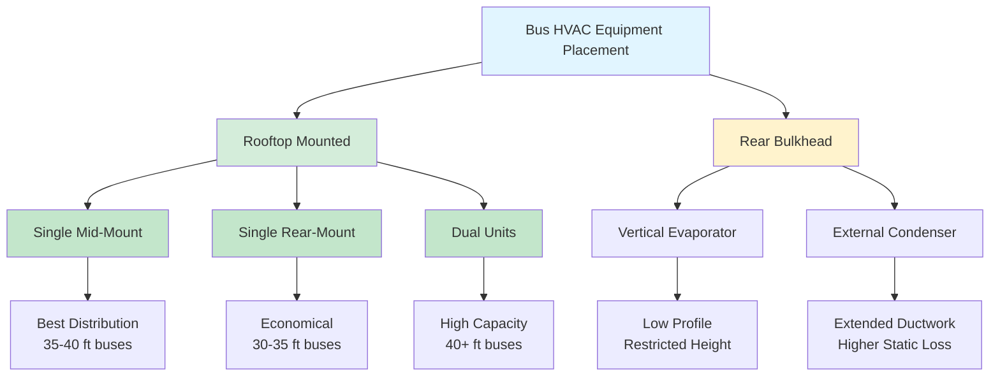
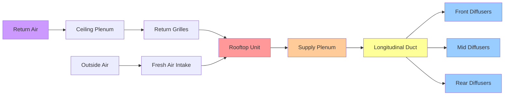

Equipment placement fundamentally determines bus HVAC system performance, maintenance accessibility, vehicle aerodynamics, and operational efficiency. The configuration must balance thermal distribution requirements, structural loading constraints, power source integration, and vehicle design parameters while maintaining compliance with transit specifications.

## Equipment Configuration Options

Bus HVAC systems employ three primary equipment placement strategies, each with distinct thermal, mechanical, and operational characteristics.

### Rooftop-Mounted Units

Rooftop placement dominates modern bus HVAC installations due to optimal space utilization and thermal performance advantages.

**Single Rear-Mounted Configuration:**
- Typical for 30-35 foot buses
- Unit capacity: 40,000-50,000 BTU/hr
- Rear placement creates uneven air distribution with 10-15°F temperature gradient front-to-rear
- Advantage: Simplified installation, single refrigerant circuit
- Disadvantage: Poor thermal uniformity, extended ductwork runs

**Single Mid-Mounted Configuration:**
- Standard for 35-40 foot transit buses
- Unit capacity: 50,000-65,000 BTU/hr
- Central placement provides balanced air distribution
- Temperature uniformity: ±3°F across passenger compartment
- Optimal for single-unit systems with symmetrical loading

**Dual Rooftop Configuration:**
- Required for 40+ foot buses and motor coaches
- Front unit: 35,000-45,000 BTU/hr
- Rear unit: 35,000-45,000 BTU/hr
- Independent zone control capability
- Redundancy allows partial cooling during single-unit failure
- Total capacity: 70,000-90,000 BTU/hr

**Rooftop Unit Physical Specifications:**

| Parameter | Transit Bus | Motor Coach | School Bus |
|-----------|-------------|-------------|------------|
| Unit Weight | 500-700 lbs | 600-800 lbs | 400-600 lbs |
| Height Above Roof | 12-18 inches | 14-20 inches | 10-16 inches |
| Footprint | 60×36 inches | 72×40 inches | 48×32 inches |
| Condenser Airflow | 3000-4500 CFM | 4000-5500 CFM | 2500-3500 CFM |
| Evaporator Airflow | 1800-2400 CFM | 2200-3000 CFM | 1400-2000 CFM |

### Rear Bulkhead-Mounted Systems

Rear bulkhead mounting integrates HVAC components into the rear wall structure, reducing roof profile and aerodynamic drag.

**Configuration Characteristics:**
- Evaporator and blower mounted vertically in rear bulkhead
- Condenser and compressor positioned externally at rear
- Air distribution through overhead longitudinal ducts
- Common in older transit bus designs and some school buses
- Reduced vehicle height: 8-12 inch advantage over rooftop units

**Performance Considerations:**
- Front-to-rear temperature gradient: 8-12°F typical
- Extended ductwork requires larger fan motors: 2-3 HP vs. 1.5-2 HP for rooftop
- Static pressure requirements: 1.2-1.8 inches W.C. vs. 0.8-1.2 for rooftop
- Maintenance access more restricted than rooftop configuration

### Underseat and Distributed Systems

Select applications employ distributed equipment placement for specialized thermal management.

**Underseat Units:**
- Individual 5,000-8,000 BTU/hr units per seat row
- Electric-powered for zero-emission buses
- Direct passenger-level cooling: Improved comfort perception
- Total system capacity: 30,000-60,000 BTU/hr for 40-foot bus
- High initial cost: 2-3× rooftop system pricing
- Complex refrigerant plumbing with multiple circuits

**Sidewall-Mounted Evaporators:**
- Evaporator modules integrated into sidewall panels
- Central rooftop compressor/condenser unit
- Refrigerant distribution to multiple evaporators
- Improved air distribution uniformity
- Increased complexity and potential leak points

## Rooftop vs. Rear-Mounted System Comparison

### Detailed Performance Comparison

| Factor | Rooftop Single-Mid | Rooftop Dual | Rear Bulkhead |
|--------|-------------------|--------------|---------------|
| **Temperature Uniformity** | ±3°F | ±2°F | ±6°F |
| **Installation Complexity** | Low | Medium | Medium-High |
| **Maintenance Access** | Excellent | Excellent | Fair |
| **Vehicle Height Impact** | +14-18 inches | +14-18 inches | +4-8 inches |
| **Aerodynamic Drag** | 3-5% increase | 4-6% increase | 1-2% increase |
| **Weight Distribution** | Good (center) | Excellent (balanced) | Rear-biased |
| **System Redundancy** | None | 50% backup | None |
| **Initial Cost** | Baseline | +25-35% | +15-25% |
| **Ductwork Complexity** | Low | Low-Medium | High |
| **Static Pressure Loss** | 0.8-1.2 in W.C. | 0.9-1.3 in W.C. | 1.4-2.0 in W.C. |

## Compressor Drive Systems

The compressor power source significantly impacts equipment placement, system efficiency, and operational characteristics.

### Engine-Driven Compressors

Engine-driven compressors directly couple to the propulsion engine via serpentine belt or dedicated power take-off (PTO).

**Belt-Driven Configuration:**
- Compressor displacement: 240-450 cc/revolution
- Drive ratio: 0.8-1.2 (compressor RPM to engine RPM)
- Compressor speed range: 800-2800 RPM
- Electromagnetic clutch engagement: 24 VDC, 3-5 amp draw
- Typical installation: Front of engine accessory drive
- Parasitic engine load: 4-8 HP at full capacity

**Power Calculation:**

The compressor power requirement follows:

$$P_{\text{comp}} = \frac{\dot{m} \cdot (h_2 - h_1)}{\eta_{\text{comp}}}$$

Where:
- $\dot{m}$ = refrigerant mass flow rate (lbm/hr)
- $h_2$ = discharge enthalpy (Btu/lbm)
- $h_1$ = suction enthalpy (Btu/lbm)
- $\eta_{\text{comp}}$ = compressor efficiency (0.65-0.75 typical)

For a 60,000 BTU/hr cooling load with R-134a at typical operating conditions:

$$\dot{m} = \frac{Q_{\text{cooling}}}{h_1 - h_4} = \frac{60,000}{70} \approx 857 \text{ lbm/hr}$$

With discharge pressure 200 psig (130°F condensing) and suction pressure 30 psig (40°F evaporating):

$$P_{\text{comp}} = \frac{857 \times (125 - 108)}{0.70 \times 2545} = \frac{14,569}{1,782} \approx 8.2 \text{ HP}$$

**Advantages:**
- No electrical load on vehicle alternator
- Cooling available whenever engine operates
- Proven reliability in transit applications
- Lower initial cost than electric systems

**Disadvantages:**
- No cooling when engine off (idle-stop conditions)
- Speed varies with engine RPM: Reduced capacity at idle
- Engine fuel consumption impact: 0.3-0.5 mpg reduction
- Vibration transmitted through belt system

### Electric Motor-Driven Compressors

Electric compressors enable independent HVAC operation and integrate with hybrid/electric propulsion systems.

**Scroll Compressor with Variable Frequency Drive:**
- Motor power: 8-15 kW (10-20 HP)
- Voltage: 300-600 VDC (electric buses) or 12/24 VDC with inverter (conventional buses)
- Speed range: 1000-6000 RPM
- Capacity modulation: 20-100% via speed control
- Current draw: 25-40 amps at rated capacity

**Electric System Sizing:**

Electric compressor power relates to cooling capacity and system efficiency:

$$P_{\text{elec}} = \frac{Q_{\text{cooling}}}{\text{COP} \times \eta_{\text{motor}} \times \eta_{\text{inverter}}}$$

For 60,000 BTU/hr cooling capacity:

$$P_{\text{elec}} = \frac{60,000 \text{ Btu/hr}}{3.0 \times 0.90 \times 0.95} = \frac{17,600 \text{ W}}{2.565} \approx 6.9 \text{ kW}$$

With drive and motor losses, specify 10-12 kW compressor motor.

**Battery-Electric Bus Considerations:**
- HVAC energy consumption: 25-35% of total vehicle energy
- Range impact: 15-25% reduction with continuous AC operation
- Battery sizing must account for HVAC load: Additional 15-25 kWh capacity
- Thermal management integration with battery cooling system

**Advantages:**
- Operates during engine-off conditions (idle-stop, plug-in pre-cooling)
- Precise capacity modulation via speed control
- Reduced engine mechanical load
- Essential for hybrid and full-electric buses

**Disadvantages:**
- High electrical load: 80-120 amp alternator draw
- Initial cost premium: $2,500-4,500 over engine-driven
- Additional components: Inverter/VFD, high-voltage wiring
- Battery drain in electric vehicles reduces range

### Hybrid Drive Systems

Some transit applications employ dual-mode systems combining engine-driven and electric compressors.

**Configuration:**
- Primary engine-driven compressor for mobile operation
- Secondary electric compressor for stationary operation
- Control logic switches based on engine status and electrical capacity
- Total system cost increase: 40-60% over single-compressor baseline
- Application: Premium motor coaches, mobile medical units

## Equipment Layout and Air Distribution

Proper equipment positioning coordinates with ductwork design to achieve uniform air distribution throughout the passenger compartment.

### Rooftop Unit Installation Details

**Structural Mounting:**
- Roof beams reinforced at unit location: 800-1200 lbs distributed load
- Mounting frame: 3/16-inch steel channel with vibration isolators
- Fasteners: 3/8-inch grade 5 bolts, 8-12 per unit on 8-10 inch spacing
- Sealant: Butyl rubber tape and polyurethane caulk at roof penetrations
- Clearance: Minimum 12 inches above roofline for condenser airflow

**Ductwork Integration:**

**Air Distribution Parameters:**

Linear slot diffusers provide optimal passenger comfort:

$$V_{\text{diffuser}} = \frac{\text{CFM}}{A_{\text{slot}}} = \frac{2000 \text{ CFM}}{(60 \text{ ft} \times 3 \text{ in} / 12)} = 133 \text{ FPM}$$

Target discharge velocity: 100-150 FPM for 8-10 foot throw to floor level.

Supply air temperature depression:

$$\Delta T_{\text{supply}} = \frac{Q_{\text{sensible}}}{1.08 \times \text{CFM}} = \frac{45,000}{1.08 \times 2000} = 20.8°F$$

For 78°F passenger compartment, supply air temperature: 57-58°F.

### Weight Distribution and Center of Gravity

Equipment placement affects vehicle dynamics and handling characteristics.

**Mass Distribution Analysis:**

Single mid-mounted rooftop unit (650 lbs) on 40-foot bus:
- Total vehicle weight: 30,000-35,000 lbs
- Weight distribution impact: <2% change
- Center of gravity height increase: 0.3-0.5 inches
- Minimal handling impact for typical transit operation

Dual rooftop units (1300 lbs total):
- Front unit weight: 40% of bus length from front axle
- Rear unit weight: 75% of bus length from front axle
- Balanced loading reduces individual axle impact
- Front axle load increase: 200-300 lbs
- Rear axle load increase: 400-500 lbs

**Critical Considerations:**
- Roof structure must support static weight plus 3× dynamic loading (bumps, acceleration)
- Rollover stability: Higher CG increases rollover moment by 1-2%
- Suspension tuning may require adjustment for heavy rooftop loads

## Aerodynamic and Fuel Economy Impact

Rooftop equipment creates drag penalties affecting fuel consumption and vehicle range.

**Drag Force Calculation:**

Aerodynamic drag follows:

$$F_D = \frac{1}{2} \rho V^2 C_D A$$

Where:
- $\rho$ = air density (0.075 lbm/ft³)
- $V$ = vehicle velocity (ft/s)
- $C_D$ = drag coefficient increase (0.02-0.04 for rooftop unit)
- $A$ = frontal area (100-120 ft² for transit bus)

At 55 mph (81 ft/s):

$$F_D = \frac{1}{2} \times 0.075 \times (81)^2 \times 0.03 \times 110 = 121 \text{ lbf}$$

Power required to overcome added drag:

$$P_{\text{drag}} = F_D \times V = 121 \times 81 = 9,801 \text{ ft-lbf/s} = 17.8 \text{ HP}$$

**Fuel Economy Impact:**
- Single rooftop unit: 2-4% fuel economy reduction at highway speeds
- Dual rooftop units: 3-5% fuel economy reduction
- Aerodynamic fairings reduce impact to 1-3%
- Low-profile units (<14 inches) minimize drag penalties

**Electric Bus Range Impact:**
- Aerodynamic drag increases energy consumption by 3-5 kWh per 100 miles
- Range reduction: 4-8 miles on 150-mile range vehicle
- Regenerative braking partially offsets highway drag impact

## Maintenance Accessibility

Equipment placement determines maintenance time, cost, and safety.

**Rooftop Unit Access:**
- Roof hatch and ladder required: OSHA fall protection at >6 feet
- Service time: 1-2 hours for refrigerant service, filter replacement
- Major repairs require lift or mobile service platform
- Advantage: Visual inspection and minor service without special tools
- Best practice: Roof service rails per OSHA 1910.29

**Rear Bulkhead Access:**
- Interior panels removable from passenger compartment
- Evaporator service: 30-60 minutes after panel removal
- Compressor/condenser access from exterior rear
- Confined space considerations for blower motor service
- Advantage: Work performed at ground level

**Underseat System Access:**
- Individual units accessible by seat removal
- Service time per unit: 15-30 minutes
- Multiple units increase total maintenance burden
- Distributed system allows partial operation during service

## Transit Bus HVAC Placement Standards

Equipment installation must comply with transit industry specifications.

**APTA Standards (American Public Transportation Association):**
- APTA BUS-PSC-RP-003: Bus Procurement Guidelines
- Equipment mounting requires engineering analysis for crash loads
- Roof loading limits: 400-600 lbs per support point maximum
- Vibration isolation required: 0.1-0.3 inches deflection minimum

**SAE J1343 (Bus HVAC Performance Standard):**
- System must meet temperature performance regardless of placement
- Test conditions: 95°F ambient, full solar load, maximum occupancy
- Temperature requirement: 74-78°F average, <5°F variation zone-to-zone
- Pull-down time: 95°F to 78°F in 30 minutes maximum

**FTA Requirements (Federal Transit Administration):**
- Buy America compliance for federally funded transit vehicles
- Equipment accessibility for persons with disabilities (ADA)
- Fire safety: Materials meet FMVSS 302 flammability requirements
- Refrigerant leak detection required for systems >50 lbs charge

**Manufacturer-Specific Guidelines:**
- New Flyer: Rooftop units standard, rear bulkhead by request
- Gillig: Mid-mount rooftop standard on low-floor buses
- NABI: Dual rooftop units standard on 40-foot and 60-foot articulated
- Proterra (electric): Integrated rooftop with heat pump standard

Equipment placement represents a critical design decision balancing thermal performance, structural requirements, maintenance access, and operational efficiency. Rooftop configurations dominate due to superior accessibility and distribution characteristics, while specialized applications may justify alternative placements. Modern electric drive systems offer operational flexibility but require careful electrical system integration and thermal management coordination.
