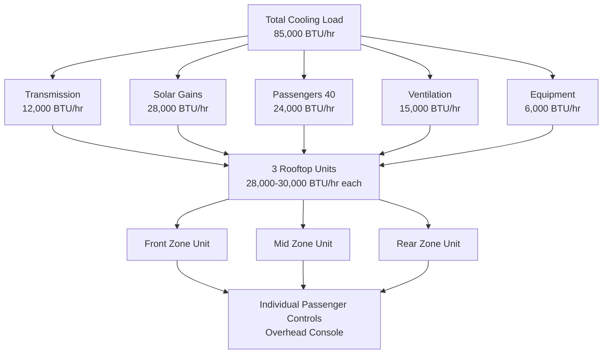
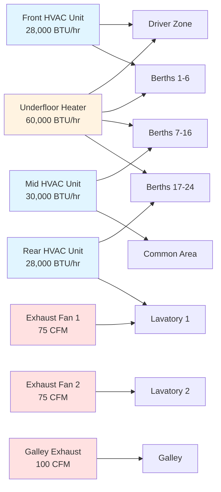

Motor coach HVAC systems deliver sustained passenger comfort during extended travel periods ranging from four hours to multi-day excursions. The design prioritizes individual climate control, quiet operation, efficient recirculation, and specialized ventilation for lavatories and galley areas. Multi-unit configurations provide redundancy and zone control across the 35-45 foot coach length.

## System Architecture and Capacity Requirements

Motor coaches employ multiple rooftop package units positioned to create discrete climate zones. This configuration ensures uniform temperature distribution and provides operational redundancy during long-distance service.

**Typical Multi-Unit Configuration:**

| Coach Length | Number of Units | Unit Capacity | Total Cooling | Total Heating | Climate Zones |
|--------------|-----------------|---------------|---------------|---------------|---------------|
| 35 ft | 2 units | 30,000-35,000 BTU/hr | 60,000-70,000 BTU/hr | 45,000-60,000 BTU/hr | 2 zones |
| 40 ft | 2-3 units | 28,000-35,000 BTU/hr | 70,000-90,000 BTU/hr | 50,000-70,000 BTU/hr | 2-3 zones |
| 45 ft | 3 units | 28,000-32,000 BTU/hr | 84,000-96,000 BTU/hr | 60,000-80,000 BTU/hr | 3 zones |

### Motor Coach Cooling Load Calculation

The total cooling capacity accounts for envelope transmission, solar radiation through extensive glazing, passenger metabolic loads, and equipment heat gains.

$$Q_{total} = Q_{transmission} + Q_{solar} + Q_{passengers} + Q_{infiltration} + Q_{equipment}$$

**Transmission Load:**

$$Q_{transmission} = \sum (U_i \cdot A_i \cdot \Delta T)$$

Where:
- $U_{roof}$ = 0.12-0.18 BTU/hr-ft²-°F (well-insulated coach roof)
- $U_{sidewall}$ = 0.18-0.25 BTU/hr-ft²-°F (composite panels with insulation)
- $U_{floor}$ = 0.20-0.30 BTU/hr-ft²-°F (underfloor insulation)
- $U_{glass}$ = 0.45-0.55 BTU/hr-ft²-°F (dual-pane tinted windows)
- $\Delta T$ = 35-40°F (95°F ambient to 75°F interior design condition)

**Solar Heat Gain:**

$$Q_{solar} = A_{glass} \cdot SHGC \cdot I_{solar} \cdot CLF$$

Motor coaches feature 25-35% glazing area with typical values:
- $A_{glass}$ = 180-240 ft² for 45-foot coach
- $SHGC$ = 0.35-0.50 (tinted dual-pane glazing with films)
- $I_{solar}$ = 200-250 BTU/hr-ft² (peak afternoon west-facing exposure)
- $CLF$ = 0.85-0.95 (cooling load factor for vehicle thermal mass)

**Passenger Load:**

$$Q_{passengers} = N \cdot (q_{sensible} + q_{latent}) \cdot DF$$

Standard motor coach occupancy:
- $N$ = 48-56 passengers (seated capacity)
- $q_{sensible}$ = 230 BTU/hr per passenger (reclined seating, minimal activity)
- $q_{latent}$ = 190 BTU/hr per passenger (moderate latent at 75°F, 50% RH)
- $DF$ = 0.75-0.85 (diversity factor for typical 70-85% loading)

**Ventilation Load:**

$$Q_{ventilation} = 1.08 \cdot CFM_{OA} \cdot \Delta T + 0.68 \cdot CFM_{OA} \cdot \Delta \omega$$

Motor coach ventilation minimizes outside air for energy efficiency:
- $CFM_{OA}$ = 10-15 CFM per passenger (SAE J1343 minimum with enhanced filtration)
- Total outside air = 480-750 CFM for 48-50 passenger coach
- Recirculation rate = 80-90% of total airflow
- $\Delta T$ = 20-25°F (sensible load at 95°F ambient)
- $\Delta \omega$ = 0.012-0.018 lb water/lb dry air (latent load)

**Equipment and Lighting Load:**

$$Q_{equipment} = Q_{lighting} + Q_{electronics} + Q_{galley} + Q_{motors}$$

Typical internal loads:
- LED lighting: 1,200-1,800 BTU/hr (40-60 reading lights plus general illumination)
- Electronics and entertainment: 800-1,500 BTU/hr (PA system, video displays, WiFi routers)
- Galley appliances: 500-1,000 BTU/hr (coffee makers, refrigerator heat rejection)
- Fan motors and pumps: 600-1,200 BTU/hr (3-4 blower assemblies at 400-600 watts each)

### Total Capacity Summary

For a 45-foot motor coach under design conditions (95°F ambient, 50% RH, 75% passenger loading):

## Individual Passenger Climate Control

Modern motor coaches incorporate individual environmental controls at each seating position, enhancing comfort during extended travel.

**Overhead Console Configuration:**

| Control Element | Function | Adjustment Range | Airflow Capacity |
|-----------------|----------|------------------|------------------|
| Adjustable nozzle | Directional airflow | 360° rotation, 0-45° tilt | 15-25 CFM per outlet |
| On/Off valve | Individual shutoff | Binary control | Full shutoff capability |
| Reading light | Task illumination | On/Off or dimming | 3-5 watts LED |
| Call button | Attendant signal | Momentary contact | N/A |

**Air Distribution Strategy:**

Individual outlets receive conditioned air from a continuous longitudinal ceiling duct running the coach length. Each passenger position features:

- Supply air temperature: 55-62°F (dewpoint controlled to prevent condensation)
- Discharge velocity: 200-400 FPM at nozzle (adjustable by passenger)
- Sound level: <35 dBA at passenger ear level with nozzle open
- Flow balance: ±10% variation between forward and rear positions

**Zone Temperature Control:**

While individual passengers control local airflow, zone thermostats maintain setpoint:

- Front zone (rows 1-8): Driver-adjustable setpoint 72-78°F
- Mid zone (rows 9-16): Attendant or automatic control 74-76°F
- Rear zone (rows 17-24): Attendant or automatic control 74-76°F
- Temperature variation: ≤3°F between zones under steady-state conditions

## Lavatory and Galley Exhaust Systems

Dedicated exhaust systems maintain negative pressure in lavatory and galley spaces, preventing odor migration to passenger areas.

### Lavatory Ventilation Requirements

Motor coach lavatories require continuous mechanical exhaust independent of HVAC operation.

**Design Criteria:**

| Parameter | Specification | Basis |
|-----------|---------------|-------|
| Exhaust rate | 50-75 CFM per lavatory | ASHRAE 62.1 Table 6-4, transit applications |
| Air changes | 15-20 ACH minimum | Odor control and moisture removal |
| Pressure differential | -0.02 to -0.05 in. w.c. | Negative relative to passenger cabin |
| Makeup air | 10-15 CFM transfer grille | From adjacent corridor or cabin |
| Exhaust location | Roof-mounted or side-wall | Away from air intake locations |

**Exhaust System Configuration:**

$$CFM_{lavatory} = \frac{Volume_{lavatory} \cdot ACH}{60}$$

For typical 35 ft³ lavatory:
$$CFM_{lavatory} = \frac{35 \text{ ft}^3 \cdot 18 \text{ ACH}}{60 \text{ min/hr}} = 10.5 \text{ CFM minimum}$$

Actual design uses 50-75 CFM to ensure rapid odor removal and positive exhaust during door openings.

**Fan Selection:**
- Centrifugal blowers: 50-100 CFM capacity, 0.1-0.3 in. w.c. external static
- Noise level: <45 dBA at 3 feet (isolated from passenger areas)
- Motor type: Permanent split capacitor or brushless DC (12V or 24V)
- Mounting: Vibration-isolated to prevent resonance through coach structure

### Galley Exhaust Design

Coaches equipped with galley areas require additional exhaust for coffee makers and warming appliances.

**Galley Ventilation:**
- Exhaust rate: 75-150 CFM (dependent on appliance load)
- Hood capture velocity: 100-150 FPM at equipment surface
- Makeup air: Conditioned transfer air from passenger cabin or dedicated supply
- Filtration: Mesh grease filters for appliances generating vapor

## Sleeper Coach HVAC Systems

Sleeper coaches accommodate overnight passengers with individual berths requiring enhanced climate control and noise reduction.

### Berth-Level Climate Control

Sleeper configurations provide individual temperature and airflow control at each sleeping position.

**Individual Berth Controls:**

| Feature | Specification | Location |
|---------|---------------|----------|
| Temperature adjustment | ±4°F from zone setpoint | Bedside control panel |
| Airflow control | 3-position: Off/Low/High | Bedside control panel |
| Supply air volume | 15-30 CFM per berth | Adjustable ceiling diffuser |
| Reading light | Dimmable LED 2-8 watts | Integrated in headboard |
| USB charging | 5V 2.4A per berth | Bedside panel |

**Berth Supply Air Design:**

$$Q_{berth} = q_{metabolic} + q_{lights} + q_{transmission}$$

For sleeping passenger:
- $q_{metabolic}$ = 320 BTU/hr (sleeping adult sensible plus latent)
- $q_{lights}$ = 5-15 BTU/hr (reading light when in use)
- $q_{transmission}$ = 200-400 BTU/hr (berth partition and exterior wall area)
- Total: 525-735 BTU/hr per berth position

Supply air temperature: 58-65°F (passenger-adjustable via mixing damper)

### Noise Control Requirements

Sleeper coaches demand acoustic performance exceeding standard motor coach specifications.

**Sound Level Limits:**

| Location | Maximum dBA | Measurement Condition |
|----------|-------------|----------------------|
| Berth - HVAC off | 45 dBA | Engine at highway cruise, windows closed |
| Berth - HVAC low speed | 38 dBA | HVAC minimum speed operation |
| Berth - HVAC high speed | 48 dBA | HVAC maximum speed operation |
| Corridor | 50 dBA | HVAC normal operation |

**Acoustic Design Features:**
- Dual-stage vibration isolation for rooftop units (spring + elastomeric isolators)
- Acoustically-lined supply ducts: 1-2 inch fiberglass duct liner, 6-12 ft effective length
- Low-velocity diffusers: 150-250 FPM maximum discharge velocity
- Acoustic barriers: Between mechanical equipment and passenger berths
- Variable-speed blowers: Reduced speed during sleep hours (10 PM - 6 AM)

### Sleeper Coach System Configuration

## Heating System Design

Motor coach heating combines forced-air distribution with supplemental radiant and underfloor systems for rapid warm-up and sustained comfort.

**Heating Capacity Requirements:**

$$Q_{heating} = UA_{envelope} \cdot \Delta T + 1.08 \cdot CFM_{OA} \cdot \Delta T$$

Design heating load calculation (0°F to 20°F ambient depending on climate zone):
- Envelope transmission: 35,000-50,000 BTU/hr
- Ventilation load: 12,000-18,000 BTU/hr
- Warm-up load: Additional 20-30% for recovery from cold soak
- Total design heating: 60,000-85,000 BTU/hr

**Heat Sources:**

| System Type | Capacity | Application | Control Method |
|-------------|----------|-------------|----------------|
| Diesel-fired heater | 40,000-60,000 BTU/hr | Primary heat source | Thermostat modulating burner |
| Engine coolant heat exchanger | 30,000-50,000 BTU/hr | Supplemental when engine running | Coolant flow valve |
| Electric resistance | 15,000-30,000 BTU/hr | Shore power or idle operation | Stage control 2-3 elements |
| Underfloor radiant | 10,000-20,000 BTU/hr | Floor warming comfort | Dedicated circuit with limiter |

**Forced Air Distribution:**
- Supply air temperature: 95-120°F (modulated based on heating demand)
- Discharge locations: Overhead diffusers plus floor-level outlets
- Floor outlets: 30-40% of total airflow prevents cold feet sensation
- Defrost airflow: 150-250 CFM to windshield area at 110-130°F

## Standards and Performance Requirements

Motor coach HVAC systems comply with SAE and industry standards for safety, performance, and passenger comfort.

### SAE J1343 Performance Criteria

**Temperature Maintenance:**
- Interior setpoint: 72-76°F maintained under design conditions
- Pull-down performance: 130°F to 78°F interior in 30 minutes maximum
- Warm-up performance: 20°F to 65°F interior in 20 minutes maximum
- Temperature uniformity: ≤5°F variation measured at passenger head height

**Ventilation Standards:**
- Minimum outside air: 12-15 CFM per passenger (may be reduced with enhanced filtration)
- CO₂ levels: <1,000 ppm during normal occupancy
- Air filtration: MERV 8 minimum for recirculated air
- Fresh air distribution: ≥85% of passenger positions receive outdoor air component

### Comfort Criteria for Long-Distance Travel

Extended exposure requires tighter environmental control than short-duration transit.

**Thermal Comfort Parameters:**

| Parameter | Target Range | Maximum Deviation | Measurement Period |
|-----------|--------------|-------------------|-------------------|
| Dry-bulb temperature | 72-76°F | ±2°F from setpoint | 95% of travel time |
| Relative humidity | 40-55% | 30-60% acceptable | When ambient permits control |
| Air velocity at passenger | 30-60 FPM average | <100 FPM maximum | Individual nozzle closed |
| Radiant temperature asymmetry | <5°F | <8°F acceptable | Window to aisle gradient |
| Vertical temperature gradient | <3°F floor to head | <5°F maximum | Seated passenger position |

**Air Quality Targets:**
- CO₂: 800-1,000 ppm (excellent), <1,200 ppm (acceptable)
- Particulate matter (PM2.5): <12 μg/m³ with MERV 11-13 filtration
- Volatile organic compounds: <400 μg/m³ total VOCs
- Odor control: Positive ventilation preventing lavatory odors in cabin

### System Reliability and Redundancy

Long-distance service demands high reliability and graceful degradation.

**Redundancy Features:**
- Multiple independent HVAC units: Partial cooling maintained if one unit fails
- Dual heating systems: Diesel heater plus engine coolant heat
- Backup exhaust fans: Continuous lavatory ventilation even during HVAC service
- Accessible service panels: Maintenance performed at rest stops without passenger evacuation

**Preventive Maintenance Intervals:**
- Air filter replacement: Every 3,000-5,000 miles or monthly
- Refrigerant system check: Every 15,000-20,000 miles or quarterly
- Blower motor lubrication: Every 25,000 miles or semi-annually
- Combustion heater service: Annually or 50,000 miles
- Full system performance test: Annually including pull-down and warm-up verification

Motor coach HVAC systems represent sophisticated climate control engineering balancing passenger comfort, energy efficiency, reliability, and operational flexibility. Individual controls, specialized exhaust systems, and multi-zone configurations ensure consistent environmental quality throughout journeys lasting hours to days across varied climatic conditions.
